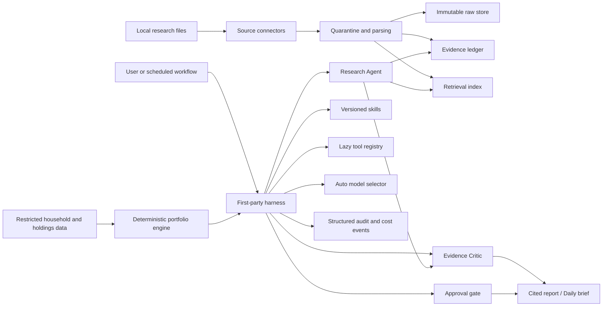

# Argus

Argus is an auditable personal investment research and portfolio
decision-support agent. The project codename is **Argus**; the Python package is
`investment_agent`.

Argus V1 ingests local research files, preserves evidence lineage, performs
time-correct retrieval, generates skill-driven research, and uses an
independent critic to challenge unsupported conclusions. It never places
trades.

The current V1 scope is defined in [V1 Scope](docs/V1_SCOPE.md). The working
implementation checklist lives in [Development Tasks](docs/DEV_TASKS.md). The
post-V1 cloud, Redis, Kafka, Kubernetes, and observability plan lives in
[V2 Roadmap](docs/V2_ROADMAP.md).

**V1 status:** complete and locally verified as of 2026-07-12. V1.1 now includes
explicit local/Gemini/DeepSeek/Kimi model selection, provider/tool resilience,
goal-driven cash planning, an optional sourced AI market-context panel, and a
cost-bounded Adaptive Hybrid Retrieval/Method Pack baseline.
The AWS V2 foundation completed a bounded live acceptance and was destroyed
after verification; Argus is not currently hosted.

## Quick Start

### Prerequisites

Install [Git](https://git-scm.com/) and Docker Desktop, or another Docker
environment with Docker Compose v2.

### 1. Clone and create local configuration

```bash
git clone https://github.com/yichen057/argus.git
cd argus
cp .env.example .env
```

The copied `.env` is ignored by Git. Never commit it or paste its contents into
an issue, screenshot, frontend `VITE_*` variable, or chat message.

### 2. Choose a model mode

Argus starts without an external LLM. Leave this setting unchanged for the
local deterministic demo:

```dotenv
ARGUS_ENABLE_CLOUD_SERVICES=false
```

To bring your own supported LLM account, change it to `true` and add at least
one provider key:

```dotenv
ARGUS_ENABLE_CLOUD_SERVICES=true

# Configure one or more providers.
ARGUS_GEMINI_API_KEY=
ARGUS_DEEPSEEK_API_KEY=
ARGUS_KIMI_API_KEY=
```

Gemini, DeepSeek, and Kimi are selectable in the main Research and Portfolio
flows. `ARGUS_OPENAI_API_KEY` currently supports the model-stage benchmark;
it does not add OpenAI to the main model picker. Ollama, vLLM, OpenRouter, and
other custom OpenAI-compatible endpoints require a provider adapter and are
not plug-and-play yet.

Optional public-web research also requires `ARGUS_EXA_API_KEY`. Local file
research and deterministic portfolio calculations do not.

### 3. Start Argus

```bash
docker compose up --build
```

Open <http://localhost:5173/>. The API is available at
<http://localhost:8000/>. Confirm the model configuration with:

```bash
curl http://localhost:8000/chat/models
```

On the Research page, upload the sample files from `examples/research/`, ask a
question, and explicitly select an external provider only when you want the
retrieved context sent to that provider.

### 4. Stop Argus

```bash
docker compose down
```

If `.env` changes while Argus is already running, recreate the backend:

```bash
docker compose up -d --force-recreate backend
```

For the complete demo flow, non-Docker setup, troubleshooting, and operational
details, continue to [Development](#development) and the
[Local Operations Runbook](docs/LOCAL_RUNBOOK.md).

## Why Argus Is Different

- Every material claim links to an evidence-ledger entry.
- Historical research enforces an explicit `as_of_date`.
- Retrieval searches for supporting and opposing evidence separately.
- External model use is explicit, sensitivity-gated, and cost-traced.
- Portfolio arithmetic, drift trades, and recurring-investment amounts run in
  deterministic Python with explicit price dates and constraints.
- Retirement planning uses explicit FINRA-style inputs and shows the tax, inflation,
  return, accumulation, withdrawal, and monthly-deposit equations with the user's
  numbers; it assumes a modeled zero ending balance rather than promising perpetual income.
- The first-party harness owns state, budgets, tools, approvals, and traces.
- Local development does not connect to Gmail, Robinhood, or cloud services.
- Evaluation reports quality, latency, and cost with measured numbers.
- Document ingestion is stream-bounded and parsed in an RSS/time-monitored child
  process so one malformed source can be stopped without killing the API.
- Material answer sentences receive stable run-local Claim IDs and are checked
  against their cited evidence before report eligibility.

## One-Month Target

With two hours per day, the first release delivers:

```text
Local Markdown, text, simple text PDF, or research CSV files
-> quarantine and normalized source records
-> immutable evidence ledger
-> as-of-date lexical/vector retrieval
-> Research Agent
-> Evidence Critic
-> cited daily brief or skill-driven report
-> auto model selection, cost, quality, and trace artifacts
```

The first month intentionally does not promise a production brokerage
integration, autonomous trading, a full microservice platform, or four equally
mature agents.

After the local V1 demo is complete, V2 can extend Argus with Redis-backed
background jobs, Kafka event streams, cloud deployment, Kubernetes operations,
OpenTelemetry/Grafana observability, and optional self-hosted model serving.
Those are tracked separately in [V2 Roadmap](docs/V2_ROADMAP.md).

## Architecture



The MVP is a modular monolith. Portfolio and market data now sit behind provider-
neutral protocols. File upload is the offline default; an optional local Robinhood OAuth
Sidecar exposes only typed read-position and read-quote methods after a live capability
fingerprint passes. Browser sync is manual, source snapshots are isolated, and a malformed
partial response cannot replace the last complete snapshot. The underlying Robinhood
authorization may advertise broader tools, so the correct claim is **Argus-enforced strict
read-only behavior**, not a proven server-issued read-only OAuth scope. Model-provider
switching does not use MCP.

## Routing Decision

Argus uses a two-stage policy rather than a hand-maintained Cartesian matrix:

1. **Sensitivity gate:** determine which deployments may receive the context.
2. **Capability selection:** among allowed models, require tool calling,
   structured output, reasoning, context length, or other capabilities.
3. **Optimization:** select by evaluated quality, cost, and latency.

Sensitivity is a hard constraint. The Research UI intentionally has one local
choice rather than duplicate Auto and Local labels. Local is selected by
default; Gemini, DeepSeek V4 Flash, or Kimi K2.6 must be chosen explicitly.
Backend admission still enforces availability and sensitivity policy, so a
manual choice cannot bypass the privacy gate.
See [Routing](docs/ROUTING.md).

## Optional Connectors

Gmail, Robinhood, broker APIs, cloud deployment, and payment-card processing are
out of scope for V1. The local development stack keeps those integrations
disabled.

Argus should not ingest, store, or process payment card data in V1. If a future
hosted version needs payments, use a hosted payment provider so Argus does not
handle raw cardholder data directly. PCI compliance certification and production
payment security operations are outside the V1 project scope.

The repository still contains early Gmail connector notes for later work:

- users bring their own Google Cloud OAuth desktop credentials;
- Argus requests read-only access;
- credentials, tokens, messages, and attachments stay outside Git;
- sender allowlists and Gmail queries are local configuration;
- the V1 demo works from local files without Gmail access.

This matters because Gmail body access uses a restricted OAuth scope. Argus
does not ship a shared public OAuth client. See
[Gmail Connector](docs/GMAIL_CONNECTOR.md).

## Logical Roles

| Role | Responsibility | Month-one status |
|---|---|---|
| Ingestion | Parse, deduplicate, classify, and quarantine sources | Workflow-first |
| Research | Plan retrieval and create structured claims | Implemented first |
| Evidence Critic | Verify citations and surface counter-evidence | Implemented first |
| Portfolio | Explain deterministic calculations and trade references | Implemented in-process |

The daily brief is a scheduled workflow, not a fifth agent.

## Repository Layout

```text
argus/
├── README.md
├── compose.yaml
├── Dockerfile
├── pyproject.toml
├── frontend/
│   ├── Dockerfile
│   ├── package.json
│   └── src/
├── configs/
│   ├── agents.yaml
│   └── gmail.example.yaml
├── policies/
│   ├── approval.yaml
│   └── routing.yaml
├── docs/
│   ├── 30_DAY_PLAN.md
│   ├── ARCHITECTURE.md
│   ├── DESIGN.zh.md
│   ├── EVALUATION.md
│   ├── GMAIL_CONNECTOR.md
│   ├── MULTI_AGENT.md
│   ├── ROUTING.md
│   └── THREAT_MODEL.md
├── evals/golden_questions.yaml
├── report_templates/
├── skills/
└── src/investment_agent/
    ├── app.py
    ├── connectors/
    ├── harness/
    ├── providers/
    ├── routing/
    └── schemas/
```

## Development

Run the local V1 skeleton with Docker Compose:

```bash
cp .env.example .env
docker compose up --build
```

The default `.env.example` keeps cloud models disabled. To enable external
research, set `ARGUS_ENABLE_CLOUD_SERVICES=true` and add one or more of
`ARGUS_GEMINI_API_KEY`, `ARGUS_DEEPSEEK_API_KEY`, and `ARGUS_KIMI_API_KEY` only
in the ignored local `.env` file. Keys are never entered in the browser. The
Research page requires an explicit external model choice before any retrieved
excerpt is sent to that provider.

`.env` is a hidden file in the project root, beside `compose.yaml`. Docker
Compose reads `.env`; `.env.example` is only a safe, committed template and is
not loaded automatically. If `.env` already exists, do not run `cp` again
because that would risk replacing local settings. The leading dot is a Unix
convention that keeps configuration files out of normal directory listings; it
is not encryption. In Finder press `Command + Shift + .` to show hidden files,
or show and edit it from Terminal with:

```bash
cd /path/to/argus
ls -la .env
nano .env
```

For the exact rules on when a browser refresh is sufficient, when a container must be
recreated, how to switch or roll back the ETF selection engine, and how to verify the
effective setting, follow the bilingual
[Local Operations Runbook](docs/LOCAL_RUNBOOK.md).

Shared model request behavior is configured once. Each provider then has its
own model name and API key. Keep the supplied model names unless the provider
documents a replacement:

```dotenv
ARGUS_ENABLE_CLOUD_SERVICES=true
ARGUS_MODEL_TIMEOUT_MS=20000
ARGUS_MODEL_MAX_ATTEMPTS=3
ARGUS_MARKET_ANALYSIS_TIMEOUT_MS=60000
ARGUS_MARKET_ANALYSIS_MAX_ATTEMPTS=1
ARGUS_MARKET_ANALYSIS_TRACE_RETENTION_COUNT=50
ARGUS_MARKET_ANALYSIS_TRACE_RETENTION_DAYS=30
ARGUS_ETF_SELECTION_ENGINE=deterministic
ARGUS_MODEL_RETRY_BACKOFF_MS=100

ARGUS_GEMINI_MODEL=gemini-3.1-flash-lite
ARGUS_GEMINI_API_KEY=replace_with_your_gemini_key

ARGUS_DEEPSEEK_MODEL=deepseek-v4-flash
ARGUS_DEEPSEEK_API_KEY=replace_with_your_deepseek_key

ARGUS_KIMI_MODEL=kimi-k2.6
ARGUS_KIMI_API_KEY=replace_with_your_kimi_key
```

After changing `.env`, recreate the backend container so Docker copies the new
environment into it, then verify which models are available. The base
`compose.yaml` has no separate `worker` service, so do not append `worker` to
this command:

```bash
docker compose up -d --force-recreate backend
curl http://localhost:8000/chat/models
```

Never paste a real key into chat, a screenshot, Git, or a frontend `VITE_*`
variable. Gemini offers model-dependent Free Tier usage. DeepSeek and Kimi APIs
are balance-priced services; an account may have temporary granted/promotional
credit, but Argus must not assume a free API entitlement. Confirm balance before
testing. Current list prices and balance behavior are documented by
[Gemini](https://ai.google.dev/gemini-api/docs/pricing),
[DeepSeek](https://api-docs.deepseek.com/quick_start/pricing/), and
[Kimi K2.6](https://platform.kimi.ai/docs/pricing/chat-k26).

When Gemini is selected for a public indexed question, retrieval uses
`gemini-embedding-001` with 768-dimensional vectors and
`RETRIEVAL_DOCUMENT`/`RETRIEVAL_QUERY` task types. Chunk embeddings are cached
in PostgreSQL and searched through pgvector/HNSW; they are not regenerated for
every question. Every indexed run now uses exact/alias matching and PostgreSQL
full-text search backed by a GIN index. Eligible semantic rankings are fused
with exact and full-text ranks through weighted Reciprocal Rank Fusion, followed
by deduplication and neighboring-chunk context. Local, DeepSeek, and Kimi
research use exact + full-text retrieval, so selecting those providers does not
silently consume Gemini embedding quota; the 16-dimensional local hash adapter
is retained for integration tests and is not treated as real semantic search.

A deterministic complexity policy labels Fast, Standard, or Deep as visible
eligibility/budget levels; it no longer decides that evidence is sufficient.
Each run starts with one cheap Hybrid Retrieval. A single deterministic Evidence
Gate then either accepts direct complete support, names one material gap, or
refuses. Standard/Deep may execute at most one query targeted to that named gap,
so every indexed run has a hard ceiling of one or two searches. The same accepted
evidence IDs control model input, citations, answer metadata, and report
eligibility. The response/run trace shows the score, Gate decision, gap, actual
queries, limits, and stop reason. Migration `20260716_0012` stores a
normalized query-to-evidence Ledger and compact tool traces rather than copying
passage bodies into every run.

Provider quota exhaustion returns a controlled 429 and never enables paid
billing automatically. Gemini request-per-day quota resets at midnight Pacific
Time; short-window request/token limits commonly clear within minutes. Argus
shows provider-specific token cost estimates only for cloud calls. Local calls
have no provider token bill, so the Research answer does not present their
internal text-unit counters as paid API tokens.

Research exposes three explicit evidence scopes. `indexed` uses only uploaded
documents and retains excerpt-level critic validation. `web` works without an
upload; independent Exa retrieval supplies direct-URL evidence to the explicitly
selected Gemini, DeepSeek, or Kimi answer model. `hybrid` combines both while
displaying indexed excerpts and public URLs as different assurance classes.
The Research UI has no default answer model and never silently switches providers.
Selecting an external model in `indexed` mode still does not bypass local retrieval:
insufficient evidence returns `cloud_skipped_no_evidence` and does not call the
provider.

Choosing a Research evidence file or expert method add-on now starts its upload
immediately. A filename beside the control is only transient selection/progress;
the right-side **Uploaded research items** library is authoritative. Evidence and
method add-ons share this list but keep distinct type badges and selection state.
An inactive item is ignored by the relevant part of the next Ask but remains in
the local database; its trash button requires confirmation before permanent
deletion. Confirmed deletion also removes historical Runs, Reports, Claims,
Evidence Ledger rows, and model/tool-call traces that used that item. PDFs must contain an
extractable text layer. Scanned/image-only PDFs return an OCR-required message
and the failed managed upload is removed. Web-only mode ignores files in that
right-side list; select `indexed` or `hybrid` when uploaded evidence must be used.

Research uses an explicit AND composition: one base Investment Method Pack plus an
optional expert method add-on. Built-in strategic-index, value, quality-growth,
income-quality, and macro/risk-balanced base frameworks are available, and Profile
stores the starting default. The expert add-on accepts Markdown, TXT, Word DOC/DOCX,
text-based PDF, or research CSV from either Research or Profile. Argus compiles at
most twelve safe checklist items, filters
code/prompt-control lines, stores no raw method text in the evidence index, and may
derive up to four optional retrieval hints without raising the one/two-search budget.
Profile stores the base style AND optional expert document. The base style controls
bounded allocation policy; the expert document shapes research lenses and explanation
order but cannot change trade math or become evidence. The data-only JSON/fenced-
Markdown API remains available for developers creating new base styles. See
[Research Evidence Scope and Method Pack Architecture](docs/RESEARCH_AND_STYLE_PACK_ARCHITECTURE.md),
[Research Report Quality Gates](docs/REPORT_QUALITY_GATES.md),
the [JSON example](examples/style-packs/value-aware-example.json), and the
[supply-chain Method Pack example](examples/style-packs/supply-chain-method-pack.md).

The Research search scope and answer model are visible above the question.
`web` can be selected with zero uploaded documents; choosing it makes the next
Ask an explicit Exa search followed by the selected answer model only after the
Evidence Gate passes. `indexed` never performs internet search. `hybrid` combines
indexed retrieval with Exa evidence. The optional historical cutoff is named and
visible beside Ask; the former generic Advanced drawer has been removed.

Argus does not depend on Gemini or Kimi built-in search. Exa retrieves bounded
direct-URL excerpts, the Evidence Gate decides whether they are sufficient, and
the explicitly selected Gemini, DeepSeek, or Kimi model only synthesizes accepted
evidence. Failed external calls retain their reported token and estimated-cost
audit data; an error response is not evidence that the provider charged `$0`.

Answer quality and report quality are intentionally different. A short cited
extract may remain visible as an Answer, while HTML generation additionally
requires a complete, substantive answer, accepted citations, and a passing
critic check. Structured CSV evidence is allowed through the same gate because
its report carries deterministic chart data; it is not the only report-capable
format. Markdown, TXT, and text-based PDF can also generate a report when they
contain complete passages that directly answer the question. The UI ships both
`gold_macro_indicators.csv` and `gold_real_yields.md` known-good walkthroughs.
Provider-grounded web answers use
consistent headings and bullets so the page is readable without trusting model
HTML. Existing one-paragraph answers are safely split into paragraphs.

The current report builder does not call the model again. It deterministically
maps the saved Ask answer and citations into HTML. Report metrics therefore
separate the original `Source Ask` token/cost estimate from report-generation
usage (`0` provider tokens and `$0` additional model cost). An AI-expanded
report would be a future, separately authorized provider call.
Dangling chunk endings such as
`and.` are repaired from bounded neighbor context when possible and otherwise
rejected. Technical search, trace, and cost fields remain available in a
collapsed audit panel and the Runs page instead of dominating the result.

V1.1 tool execution is bounded by `ARGUS_TOOL_TIMEOUT_MS`,
`ARGUS_TOOL_MAX_ATTEMPTS`, and `ARGUS_TOOL_RETRY_BACKOFF_MS`. Only retryable
failures and timeouts are retried; the final attempt count and error code are
stored in the tool-call trace.

Model-provider requests use the shared `ARGUS_MODEL_TIMEOUT_MS`,
`ARGUS_MODEL_MAX_ATTEMPTS`, and `ARGUS_MODEL_RETRY_BACKOFF_MS` policy. Kimi has
one documented provider-specific exception, `ARGUS_KIMI_TIMEOUT_MS` (default
60 seconds), because grounded multi-source synthesis can exceed the shared
20-second window. A timed-out model request is not automatically retried because
the provider may already have processed and billed it. API keys, model identifiers,
base URLs, and token-price metadata remain provider-specific.
Grounded market search is the deliberate exception: it uses
`ARGUS_MARKET_ANALYSIS_TIMEOUT_MS` because search takes longer than ordinary
Research, and defaults to one attempt so a timed-out paid search is not replayed
automatically.

Portfolio market analysis writes a bounded structured decision trace for both
successful and failed attempts. Runs shows the evidence-snapshot ID, proposed ETF
symbols and modes, deterministic component scores and penalties,
validation/rejection codes, final candidates, token/cost data,
and provider/tool status. The Runs API and page are paginated. By default these
Portfolio traces keep the latest 50 entries for no longer than 30 days. Argus does
not retain raw prompts, raw model responses, full web pages, account names, holding
dollar values, or API keys in this trace; PostgreSQL/SQLite remains the audit source
of truth and Redis is not required.

Services:

- frontend: <http://localhost:5173>
- backend API: <http://localhost:8000>
- backend health check: <http://localhost:8000/health>
- PostgreSQL/pgvector: `localhost:5432`

`localhost:5173` and `127.0.0.1:5173` both address this Mac. The command above
starts the containers; it does not require a different URL. If the Compose or
manual Vite services are already running, open either loopback address directly.
These loopback URLs are not shareable links: if another person opens them, their
browser looks for Argus on their own computer. To test independently, that person
must clone and run Argus locally with their own configuration. Do not expose the
current local build through a public tunnel; it has no production authentication,
multi-user data isolation, or public TLS boundary.

Validate the Compose file without starting containers:

```bash
docker compose config
```

Run the V2 local infrastructure overlay (Redis, Kafka, worker, and the bounded
audit/metrics consumer):

```bash
docker compose -f compose.yaml -f compose.v2.yaml up -d --build \
  postgres redis kafka backend worker event-consumer frontend
```

Kafka currently has one intentionally narrow Research Run lifecycle path with two
explicit terminal event contracts:

```text
agent.run.completed.v1 -> ANSWER GENERATED or NO ANSWER · SAFE STOP
agent.run.failed.v1    -> provider timeout/authentication/quota/provider error
                       -> Kafka -> Audit/Metrics Consumer -> sanitized projection -> Runs
```

The consumer commits an offset only after processing or DLQ isolation, deduplicates
stable event IDs, retries bounded transient failures, and never stores raw prompts,
documents, holdings, web pages, provider error text, or API keys. PostgreSQL Runs
remains the source of truth. Validate both event types on the real local broker
without calling a paid model:

```bash
docker compose -f compose.yaml -f compose.v2.yaml exec -T backend \
  python /app/scripts/kafka_local_acceptance.py \
  --bootstrap kafka:9092 --api-base http://localhost:8000
```

Then open **Runs Management → Event pipeline**. The panel is a lightweight
operational view of consumer health, processed events, duplicates, DLQ records,
and a bounded recent event set. It shows 10 rows per page with the same Previous/Next range
control as Recent Runs and can sort the loaded rows by event type or processing time; it is not a
general Kafka admin UI.

Run backend tests locally:

```bash
python3 -m venv .venv
source .venv/bin/activate
pip install -e ".[dev]"
pytest
```

Run the local V1 eval suite:

```bash
ARGUS_DATABASE_URL=sqlite:////path/to/argus/local_argus.db \
  argus-eval
```

The eval suite reads `evals/golden_questions.yaml` and writes JSON/Markdown
artifacts under `eval-results/`.

Install backend storage dependencies when working on database, migrations, RAG,
or repository code:

```bash
pip install -e ".[dev,storage]"
```

The Compose environment sets these integration flags to `false`:

```bash
ARGUS_ENABLE_CLOUD_SERVICES=false
ARGUS_ENABLE_GMAIL=false
ARGUS_ENABLE_EXTERNAL_MARKET_DATA=false
ARGUS_ENABLE_ROBINHOOD=false
ARGUS_MARKET_DATA_PROVIDER=01
```

## Local Demo Without Docker

For the current local slice, you can run FastAPI with SQLite and Vite:

```bash
source .venv/bin/activate
ARGUS_DATABASE_URL=sqlite:////path/to/argus/local_argus.db \
  python -c "from investment_agent.config import get_settings; from investment_agent.storage import Base, make_engine; Base.metadata.create_all(make_engine(get_settings()))"
ARGUS_DATABASE_URL=sqlite:////path/to/argus/local_argus.db \
  uvicorn investment_agent.app:app --host 127.0.0.1 --port 8000
```

In another terminal:

```bash
npm install --prefix frontend
npm run dev --prefix frontend -- --host 127.0.0.1 --port 5173
```

Open <http://127.0.0.1:5173/>. Demo research files are available at
`examples/research/gold_real_yields.md` and
`examples/research/gold_macro_indicators.csv`; the CSV includes annual numeric
indicators so generated HTML reports can render trend lines and time-series bar
charts.

### Demo Flow

Use this path for a clean V1 walkthrough:

1. Open the Research page.
2. Add or upload both demo research files:
   - `examples/research/gold_real_yields.md`
   - `examples/research/gold_macro_indicators.csv`
3. Ask:

   ```text
   How did gold return real yield ETF flows and central bank demand trend?
   ```

4. Click **Generate report** and open the HTML report. The report should include
   a `Data Analysis` section with source-backed trend and bar charts.
5. Open **Invest Suggestions**, use the portfolio file picker, and import:

   ```text
   examples/portfolio/holdings_sample.csv
   ```

   Browser upload accepts CSV, XLSX, and legacy XLS files up to 10 MB. For
   Excel workbooks, the first worksheet must use the documented holdings
   columns. Choose the portfolio as-of date in the page; an optional
   `as_of_date` spreadsheet column must contain the same date on every row.
   Do not paste a Mac filesystem path into the page; the browser sends the
   selected file contents to the API.

6. Open the Profile page, save a risk profile, target allocation, drift
   threshold, monthly contribution, and whole/fractional-share preference.
   `Investment horizon` means the future time until the money is expected to
   be used, not the number of years already invested. `Investing experience`
   records the years already invested and is used to simplify implementation
   guidance; it does not automatically increase risk capacity. The saved policy
   remains visible in a right-hand summary while the form is edited. **Clear & restore
   defaults** deactivates the saved personal policy and restores the unsaved
   example form; the right panel immediately shows that no saved policy is active.
   Review and save the defaults before treating them as active. Retirement uses
   a conservative planning-through age of 100, not a cash-buffer-month target.
   Return to **Invest Suggestions** to see target trade amounts, estimated shares,
   missing exposure candidates, and a contribution-first DCA plan. Open
   **Money Planning** for the detailed short-term cash and retirement schedules;
   Invest Suggestions keeps only their compact decision constraint summary.
7. Open **Runs Management** to inspect three deliberately separate cost scopes:
   **Retained Run usage** for the Runs still available for debugging,
   **Historical API usage** from the deletion-independent usage ledger, and
   **Provider actual billing** imported from an official dashboard/export.
   A separate **Provider balances** section shows current remaining funds and API
   availability independently from spend. Its on-demand refresh uses the configured
   official DeepSeek/Kimi balance APIs; it does not replace official historical billing,
   usage exports, or a full subscription-tier record.
   Per-model input/output token totals and call-time price snapshots use:

   ```text
   estimated cost = input tokens * input price / 1M
                  + output tokens * output price / 1M
   ```

A committed sample report artifact is available at
`examples/reports/gold_macro_dataset_report.html`.

### Demo Previews


## Learning Plan

The [30-day plan](docs/30_DAY_PLAN.md) maps the 19 chapters of
[Learn Claude Code](https://learn.shareai.run/en/) to concrete Argus work.
Each day uses approximately:

- 25-35 minutes learning;
- 70-80 minutes implementation;
- 10-15 minutes tests and an interview decision log.

## Acceptance Demo

1. Choose and upload one local research file, then repeat for additional files.
   The right-hand source panel lists the persistent local index, can search all
   sources or one source, and can delete an indexed source plus its managed raw
   upload without deleting an explicitly indexed user-owned local file.
2. Detect an embedded prompt-injection instruction.
3. Ask a historical question and prove no future evidence leaked in.
4. Generate a cited report with source-backed data-analysis charts when numeric
   evidence exists.
5. Have the Evidence Critic downgrade a weak conclusion.
6. Show deterministic concentration/drift calculations.
7. Show auto model selection, quality, cost, and run-trace artifacts.

## Portfolio Recommendation Contract

Argus treats target allocation as the policy and the dated holdings file as the
calculation snapshot:

```text
target value = total portfolio value * target weight
drift amount = current asset-class value - target value
estimated shares = executable dollar amount / dated reference price
```

When no Profile target exists, the UI may show a 20% concentration review
line. That line is explicitly labeled as an **example review level, not the
user's personal target**. It cannot silently become a trade instruction. The
policy signal, asset role, checks-before-acting, dollar math, and share
estimates come from deterministic Python rules rather than Gemini, so the same
holdings and Profile settings produce the same result. The optional AI market
panel provides cited time-sensitive context but cannot modify these numbers.

The **Invest Suggestions** workspace compares three concrete scenarios side by side:

1. maintain the uploaded allocation with no trade;
2. dilute concentration with new contributions;
3. partially sell an overweight holding and reallocate the proceeds.

Each scenario returns its rebalancing amount, projected total, post-action
asset-class weights, trade amounts, estimated shares when a dated quote exists,
and known limitations. Investment targets cover U.S. equity, international
equity, bond, commodity/gold, and alternatives. Cash is deliberately excluded
from this 100% investment mix. Symbol-aware normalization keeps
GLD and VXUS from being misclassified by a generic spreadsheet label.

The Profile **Allocation guide** provides an unsaved, editable starting mix.
Its deterministic policy uses risk tolerance, future investment horizon, life
stage, investing experience, income stability, liquidity needs, investment
style, recurring net income, and planned monthly contribution. Experience is
used for implementation simplicity and education prompts, while horizon remains
the future time until the money is needed. It never asks Gemini to invent
percentages. The guide keeps Alternatives at 0% unless the user opts in and all
percentage inputs support one decimal place. Its risk-based example policy uses
5%, 7.5%, or 10% Commodity / Gold and clearly distinguishes those Argus values
from the World Gold Council's tested hypothetical allocations.

The institutional references shown in the guide support the decision factors
and asset definitions, not the exact percentages. The numerical 40%/60%/80%
stock starting points and subsequent adjustments are an explicit Argus example
policy. Savings deposits, CDs, Treasury bills, money-market cash equivalents,
and brokerage cash may be entered as current cash savings for goal planning.
The separate short-term cash plan allocates current savings in priority order to
emergency, education, and selected dated expense goals, then calculates each gap and
whole-dollar minimum monthly saving. Its Alternatives field can cover investment real
estate/REITs, private investments, complex strategies, or crypto, while a
personal-use primary home is normally excluded from the investable portfolio.

Portfolio quotes use a provider-neutral contract. External quote access is off by
default, so uploaded prices are labeled **Not live** and daily change, volume,
dollar volume, and volume Z-score remain unavailable. `ARGUS_MARKET_DATA_PROVIDER`
accepts `01` Robinhood, `02` Twelve Data, `03` Alpha Vantage, or `04` Massive, but
only an explicitly connected adapter is called; Argus never silently spends through
another external provider. The phase-one Robinhood boundary allowlists only positions and
quotes. Historical prices remain disabled until their live MCP Schema is reviewed and pinned.
The three independent REST transports remain implementation work.

A Robinhood-only file cannot reveal bank balances; users seeking a total-investable-
asset view must add the bank cash/CD positions to the holdings file. Risk flags
use transparent built-in concentration screens: 25% for one position and 70%
for one asset class, calculated against invested holdings with cash excluded.
The API and UI expose the current weight, threshold, and percentage-point excess.
These screens are separate from the saved Profile rebalance-drift threshold;
they are not regulatory limits, personal targets, or automatic sale instructions.

The engine supports the three common rebalance paths described by
[Investor.gov](https://www.investor.gov/additional-resources/general-resources/publications-research/info-sheets/beginners-guide-asset):
sell overweight assets, add money to underweight assets, or direct recurring
contributions toward underweight assets. Its DCA label follows the
[Investor.gov definition](https://www.investor.gov/introduction-investing/investing-basics/glossary/dollar-cost-averaging):
equal-dollar investing at regular intervals rather than a promise of better
returns. The UI also labels this as `定期定额投资 / 定投计划` for clarity.

ETF candidates are role-based examples, not auto-approved trades. Their links
go to first-party issuer product pages so the user can verify the
fund objective and concentration. Broad core candidates are ranked ahead of
satellite exposures; QQQ is labeled as a growth satellite. Individual-stock
candidates require separate, cited Argus research and position sizing.
Portfolio also exposes State Street and Vanguard peers for all eleven GICS sectors,
State Street industry funds, and iShares SOXX in a 41-fund controlled research library.
Direct-stock holdings are marked as related sector/industry exposure without being
misrepresented as ETF ownership. These are narrow satellite candidates and are excluded
from automatic core gap filling. The cited AI market
analysis may place at most three on a research watchlist with a bull case, counter-
evidence, invalidation signal, overlap warning, and typed DCA-suitability result; it
never places a trade. A sector/industry DCA amount exists only when the user has saved
a capped satellite budget inside the total monthly investment, and deterministic code
allocates that budget among validated DCA-suitable candidates.

By default, ETF selection uses the versioned deterministic pipeline
`hard eligibility -> Profile/holdings fit -> timestamped market signal -> evidence
quality -> overlap/concentration/expense/liquidity penalties -> fixed ranking`.
The selected answer model explains that closed list and cannot add, remove, replace,
or reorder symbols. A separately versioned code Auditor verifies the structured
invariants before synthesis. `ARGUS_ETF_SELECTION_ENGINE=model` is an explicit legacy
rollback/A-B mode; it removes the score threshold but still enforces the controlled
universe, citation, maximum-count, holdings-mode, and DCA safety validators. Argus never
switches between these engines silently inside a request.

The market-context slice uses the same independent-search boundary as Research:
Exa retrieves source-linked, time-stamped evidence; the Evidence Gate validates
it; and the manually selected Gemini, DeepSeek, or Kimi model organizes the
separately labeled `AI market analysis`. Argus sends only up to 12 symbols, asset
classes, weights, and the holdings date—not account names or dollar values.
Portfolio runs two bounded Exa facets—current drivers, then sector leadership and
independent counter-evidence plus bounded same-exposure ETF peer comparison. The second
request uses Exa `excludeDomains` to avoid
domains returned by the first request when possible. Two accepted domains are preferred,
not a hard availability gate: if only one domain passes, Argus calls the explicitly
selected model with a visible limited-source warning and prohibits a claim of
comprehensiveness. The UI shows source/domain counts and Exa search cost separately
from model-token cost. If the first synthesis draft fails citation-ID validation,
Argus permits exactly one repair call to the same selected model, exposes an answer-call
count and combined model cost, and still rejects a second invalid draft. Market synthesis
is capped at 1,600 output tokens and instructed to finish within 900 words. The analysis
cannot change deterministic targets, amounts, shares, or projected weights. A
time-versioned ETF catalog, licensed quote adapters, richer numeric market snapshots,
and numeric-output validation remain the next-stage design documented in
[ETF Candidate and Market Data Architecture](docs/ETF_MARKET_DATA_ARCHITECTURE.md).

Cash-planning fields display real-time thousands separators such as `125,000` while
the user types. Monthly spending is normalized as recurring spending plus predictable
annual bills divided by 12. Emergency and education goals can be disabled.
Short-term one-time goals are selected from medical/dental, home/appliance,
vehicle, travel, tuition, insurance/tax, family support, and major-purchase
presets. Each selection can record an estimate, months-until-needed, and priority;
an unestimated selection remains a warning and is not silently assigned a number.
These goals reduce current investable capacity and remain separate from retirement
planning. Profile records a default planning-through age of 100, desired monthly
retirement spending in today's dollars, and expected reliable Social Security/pension
income. Traditional, Roth, taxable, or mixed Traditional + Roth tax treatment can be
selected; mixed plans record the estimated pre-tax withdrawal share. Portfolio calculates
the real-dollar present value of the retirement spending gap, projects current uploaded
non-cash investments to retirement, and back-solves the equal monthly investment needed
from now using the entered nominal return and inflation assumptions. Blank relevant tax
rates produce a prominent tax-excluded baseline. The result warns that taxes, fees, health-care shocks,
and sequence risk require a deeper plan; it never treats lifetime retirement spending
as idle cash. Portfolio also compares the current cash goals' minimum monthly
saving with `net income - normalized spending - planned investing` and reports a
shortfall plus a deterministic adjustment order. Current employer or salary
recommendations require a separate, cited labor-market research flow with the
user's skills, location, and constraints; the portfolio model does not guess them.

ChatGPT-connected app data is not automatically an Argus data source. A connection
authorized inside ChatGPT is scoped to the app, account permissions, and supported
ChatGPT surface; it does not give this local service a reusable bank token or API.
Argus currently accepts user-selected portfolio files. A future banking workflow
must use either an explicit transaction export (CSV/OFX) or a separately authorized,
read-only bank-data provider integration with consent, revocation, least-privilege
scopes, encrypted secrets, and an audit trail.

Portfolio presents cash goals, DCA, and concentration flags as compact metrics
and tables. Longer methodology, warnings, and next steps are available through
expandable details so the primary decision numbers remain scannable.

Kimi is a metered API, not an automatically funded free tier. A valid API key can
list models while generation still returns HTTP 429 when cash/voucher balance is
zero, a project budget is exhausted, or RPM/TPM/concurrency limits are reached.
Argus distinguishes those Kimi errors from Gemini quota resets and never claims a
cost for a rejected request.

## Current Limitations

- V1 is a local-first demo. File upload remains the complete default workflow.
  Robinhood now has an optional local OAuth Sidecar, read-only tool allowlist, sync endpoint,
  source-aware snapshots, and manual refresh UI. Live acceptance still requires the user to
  authorize the Argus Sidecar and approve the captured Schema manifest. Gmail remains
  unconnected.
- ChatGPT account/app connections, including any finance or banking connection,
  are not inherited by Argus. No bank transaction connector is available to this
  local application or the current Codex session.
- The default model provider remains deterministic and local. Public research
  questions can explicitly opt into Gemini 3.1 Flash-Lite, DeepSeek V4 Flash,
  or Kimi K2.6. Local evidence guards stop unsupported questions before an
  external generation call.
- DeepSeek and Kimi use their OpenAI-compatible HTTPS APIs; Gemini uses the
  Google SDK. Model switching does not use MCP. No executable MCP server or
  client has been implemented yet.
- Public-web Research uses an independent Exa Search adapter rather than the
  selected model's built-in web search. Exa returns direct URLs and bounded
  highlights/text; the shared Evidence Gate accepts, requests at most one
  targeted follow-up, or refuses before generation. Gemini, DeepSeek, or Kimi
  then acts only as the explicitly selected answer model. The UI and Run trace
  separate Exa search calls/cost from answer-model tokens/cost, and reports
  require valid Argus citation IDs. API Token summaries exclude local
  deterministic word-count estimates; Exa is metered by search usage/cost, not
  model-style input/output Tokens.
- Docker V1 stores and searches vectors in PostgreSQL/pgvector with an HNSW
  cosine index. Public-mode research can use 768-dimensional Gemini semantic
  embeddings. Exact and PostgreSQL full-text channels remain available without
  Gemini; internal mode and SQLite tests retain deterministic JSON vectors only
  as storage/plumbing infrastructure, not as a semantic-quality claim.
- Adaptive Agent Search currently means one deterministic, Evidence-Gate-named
  local or Exa web follow-up under a universal one/two-query ceiling. It does not include a
  selected-provider LLM planner, reranker, provider-independent multilingual
  embedding model, automated ledger-retention job, or multi-round paid web
  search orchestration.
- Cloud model generation calls are dual-written to a deletable Run trace and an
  independent append-only `api_usage_ledger`. The latter stores input/output
  tokens, request status, and the call-time input/output price snapshot without
  prompts, holdings, or API keys. Deleting Evidence or a Run may reduce
  **Retained Run usage**, but must not reduce **Historical API usage**. Migration
  `20260720_0019` backfills Model Calls that still exist; usage deleted before
  that migration cannot be reconstructed without a provider export. Migration
  `20260720_0020` adds exact-precision provider imports and keeps account balance/
  Free Tier snapshots separate from charges.
- Independent Exa search cost remains stored in the Run trace; a unified durable
  external-tool usage ledger is still future work. Provider billing snapshots
  are stored separately from Argus estimates because actual bills can use other
  currencies and include credits, caching, retries, taxes, or rounding. These
  values do not yet include a separate embedding-cost event ledger. The official
  DeepSeek ZIP importer records exact period totals and per-model breakdowns while
  discarding user and API-key identity columns. Kimi's tokenizer endpoint is a
  preflight estimate, and its balance endpoint reports remaining funds; neither is
  treated as historical actual usage. Gemini Free Tier is recorded as account
  status rather than a fabricated `$0` paid invoice.
  For example, `gemini-3.1-flash-lite` uses:

  ```text
  estimated USD
    = input tokens / 1,000,000 * $0.25
    + (output + thinking tokens) / 1,000,000 * $1.50
  ```

  These defaults track the
  [official Gemini Developer API pricing](https://ai.google.dev/gemini-api/docs/pricing).
  Free Tier can still produce an actual bill of $0, and Argus does not infer
  billing from this estimate. DeepSeek and Kimi defaults likewise track their
  [official DeepSeek pricing](https://api-docs.deepseek.com/quick_start/pricing/)
  and [official Kimi K2.6 pricing](https://platform.kimi.ai/docs/pricing/chat-k26).
- Browser uploads are saved under `data/uploads/`, which is ignored by Git.
- Invest Suggestions can optionally render a fixed-size sector/industry HeatmapMatrix. Set
  `ARGUS_ENABLE_MARKET_HEATMAP=true` to enable it; false retains the compact market-data card.
  Red/green encodes the latest regular-session price versus the prior completed close (`1D`, not
  weekly/yearly), neutral badges encode holdings/research roles, and an optional robust log-MAD
  Volume activity metric uses completed daily historicals when
  `ARGUS_ROBINHOOD_ENABLE_HISTORICALS=true`. The metric is a participation indicator, not a
  BUY/SELL signal. Volume states use separately colored text labels, and clicking a tile opens a
  modal with the prior-close date and Z-score calculation. Both switches require a backend restart;
  the historicals switch also requires restarting the local Sidecar.
- Set `ARGUS_ENABLE_UNIFIED_ETF_UNIVERSE=true` to replace the duplicate full Heatmap and ETF
  candidate directory with one `ETF Universe` and explicit `Market view` / `Research view` tabs.
  Both views consume the same merged view model, but the source boundary remains explicit:
  configured market data supplies Market view, while the controlled library, holdings mappings,
  and accepted evidence supply Research view. Provider status and refresh therefore appear only in
  Market view; the evidence-backed shortlist remains above both. Unheld core Rebalance/DCA
  candidates such as BND are also included in the bounded quote request so deterministic Python can
  calculate shares without model-generated numbers. Set the flag to false and restart the backend
  to restore the prior separate-directory UI without changing stored data or recommendation math.
- Research upload is capped at 25 MiB, 500 PDF pages, about 2 million extracted
  characters, and 90 seconds. Parsing runs in a monitored child process with a
  cgroup-aware RSS ceiling and a structured user-facing stop reason. The HTTP
  request still waits for parsing; an asynchronous ingestion queue, global
  concurrency semaphore, and exported Grafana memory alerts remain V2 work.
- PDF support covers simple extractable text. Complex table extraction,
  scanned PDFs, and OCR are out of scope for V1.
- Report charts are generated only from source-backed local evidence or
  structured research CSVs.
- Portfolio recommendations currently use the uploaded holdings price and
  `as_of_date`, which are shown beside the calculations. Product candidates
  link to official issuer pages, but Argus does not yet fetch licensed live
  quotes or current macro data. It therefore leaves candidate share counts
  blank when the candidate is not already in the dated holdings snapshot.
- Portfolio analysis is deterministic decision support. It can calculate
  target buy/sell amounts, estimated shares, contribution-first DCA amounts,
  and diversification review candidates, but it does not provide tax-lot
  optimization, trade execution, autonomous rebalancing, or a guarantee that a
  candidate is suitable for the user.
- DCA monthly budgets are apportioned in whole dollars and contain investments
  only. Cash saving appears in the separate deadline-based cash plan. Any
  investment class with a positive saved target can appear; set Alternatives or
  another unwanted class to 0% to exclude it. A positive target without an
  approved product is marked `UNASSIGNED` / `No
  instrument assigned`, not presented as an executable purchase.
- Kubernetes, Redis, Kafka, cloud object storage, OpenTelemetry/Grafana, and
  self-hosted GPU model serving are tracked in the V2 roadmap. The AWS/EKS
  foundation completed one bounded live acceptance on 2026-07-12: the public
  Gemini/pgvector product flow and Redis worker passed, then all 71 Terraform
  resources were destroyed. No hosted Argus environment remains online.

Argus also includes an explicit, cost-capped model-stage benchmark. It evaluates
evidence extraction and answer synthesis separately using atomic Claim IDs and
per-claim citation checks. Its recommendations never change the production
provider automatically. See [Evaluation](docs/EVALUATION.md) and
[Interview Q&A](docs/INTERVIEW_QA.md).

Cloud design and operations are documented in
[V2 Cloud Architecture](docs/V2_ARCHITECTURE.md) and the
[AWS Cloud Runbook](docs/CLOUD_RUNBOOK.md). Start the next short-lived
AWS/Kafka learning deployment with the
[Cloud Deployment Handoff](docs/CLOUD_DEPLOYMENT_HANDOFF.md), which records
the current readiness gates, cost stop conditions, acceptance scope, and
destroy checklist.

## Resume Notes

Final resume-safe wording is maintained in
[Resume Bullets](docs/RESUME_BULLETS.md). Do not claim V2 infrastructure or
production brokerage/cloud integrations as completed V1 work.

## Security

Never commit `.env`, API keys, OAuth credentials, brokerage tokens, Terraform
state, or real portfolio data. Use `.env.example` and synthetic fixtures only.
Please report vulnerabilities through GitHub private vulnerability reporting
rather than a public issue. See [Security Policy](SECURITY.md).

## License

Argus is released under the [MIT License](LICENSE).

## References

- [Learn Claude Code](https://learn.shareai.run/en/)
- [PCI Security Standards Council Document Library](https://www.pcisecuritystandards.org/document_library/)
- [Serenity Investment Research Skill](https://github.com/dantewoo/serenity-investment-research-skill)
- [Hermes Agent](https://github.com/NousResearch/hermes-agent)
