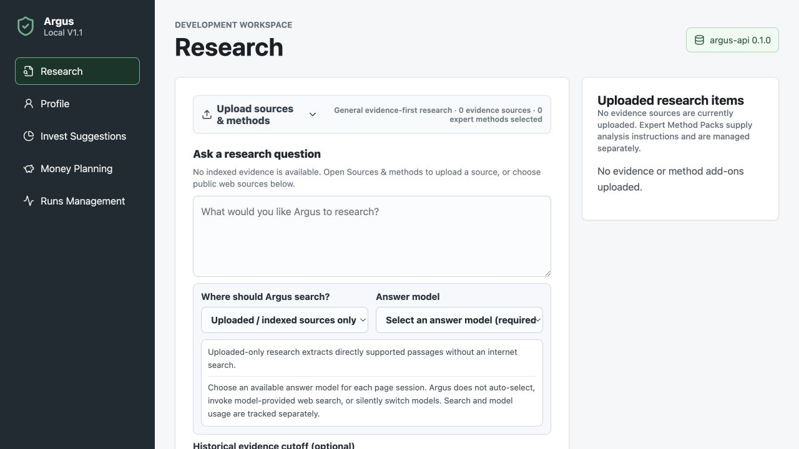
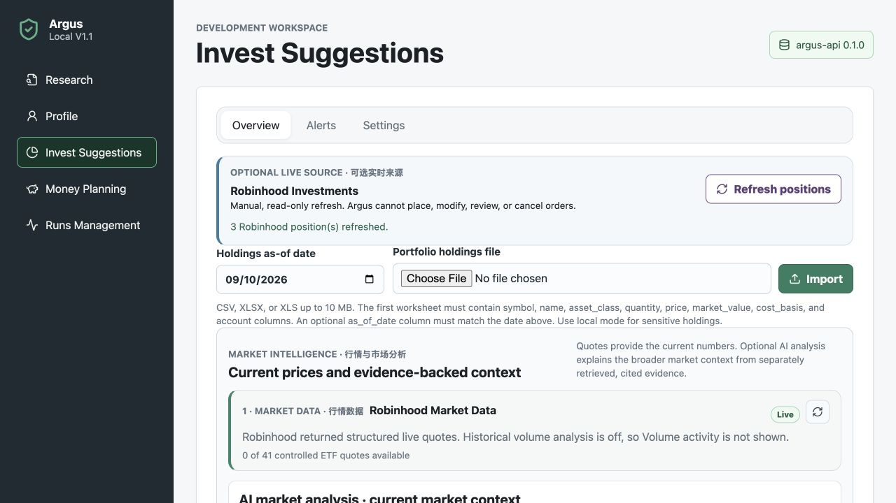
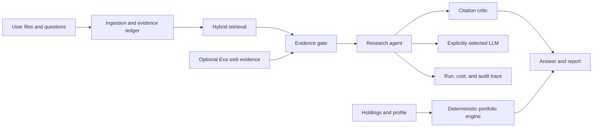

# Argus — Agentic Investment Research & Portfolio Intelligence

[](https://github.com/yichen057/argus-investment-intelligence/actions/workflows/ci.yml)
[](LICENSE)

Argus is a local-first, LLM-assisted system for evidence-grounded investment
research, deterministic portfolio analysis, and auditable decision support.
It links material claims to evidence, keeps model use explicit, and never
places trades.

> **Status:** V1 is complete and locally verified. Argus is an educational
> and research project, not a hosted service, broker, fiduciary, or source of
> individualized financial advice.

## Why Argus

- **Evidence before answers:** indexed and web research pass through an
  evidence gate, citation validation, and an independent critic.
- **Deterministic money math:** allocation, drift, DCA, cash-goal, and
  retirement calculations run in Python rather than being invented by an LLM.
- **Explicit model boundaries:** local mode is the default; external models
  are selected deliberately and receive only the approved context.
- **Auditable execution:** runs record model/tool calls, evidence IDs, stop
  reasons, latency, and estimated cost without storing API keys.
- **Local ownership:** research files, portfolio snapshots, and application data
  stay in the user's local environment unless an external provider is chosen.

## Demo Previews

### Research workspace



### Portfolio dashboard



_Current local UI. The portfolio preview uses synthetic holdings and no real
brokerage account data._

## Quick Start

### Prerequisites

Install [Git](https://git-scm.com/) and Docker Desktop, or another Docker
environment with Docker Compose v2.

### 1. Clone and configure

```bash
git clone https://github.com/yichen057/argus-investment-intelligence.git
cd argus-investment-intelligence
cp .env.example .env
```

The copied `.env` is ignored by Git. Do not commit it or place its contents in
issues, screenshots, frontend `VITE_*` variables, or chat messages.

Argus starts in local deterministic mode without an external LLM:

```dotenv
ARGUS_ENABLE_CLOUD_SERVICES=false
```

To use a supported LLM account, edit `.env`, enable cloud services, and add
one or more keys:

```dotenv
ARGUS_ENABLE_CLOUD_SERVICES=true

ARGUS_GEMINI_API_KEY=
ARGUS_DEEPSEEK_API_KEY=
ARGUS_KIMI_API_KEY=
```

### 2. Start

```bash
docker compose up --build
```

Open the UI at <http://localhost:5173/>. The API is available at
<http://localhost:8000/>. Check model availability with:

```bash
curl http://localhost:8000/chat/models
```

### 3. Try the included demo

1. Open **Research**.
2. Upload `examples/research/gold_real_yields.md` and
   `examples/research/gold_macro_indicators.csv`.
3. Ask: `How did gold return, real yield, ETF flows, and central-bank demand trend?`
4. Generate the cited HTML report.
5. Open **Invest Suggestions**. If the optional read-only Robinhood Sidecar is
   configured, click **Refresh positions** to sync holdings directly. Otherwise,
   import `examples/portfolio/holdings_sample.csv` as an offline demo.

Choose an external provider only when you intend to send the accepted
research context to that provider.

### 4. Stop

```bash
docker compose down
```

After changing `.env` while Argus is running, recreate the backend:

```bash
docker compose up -d --force-recreate backend
```

For troubleshooting and non-Docker setup, see the
[Local Operations Runbook](docs/LOCAL_RUNBOOK.md).

## Models and Data Sources

| Component | Role | Configuration | Main UI |
| --- | --- | --- | --- |
| Local deterministic mode | Offline workflow and test provider | No key | Yes |
| Gemini | Answer model and optional semantic embeddings | `ARGUS_GEMINI_API_KEY` | Yes |
| DeepSeek | Answer model | `ARGUS_DEEPSEEK_API_KEY` | Yes |
| Kimi | Answer model | `ARGUS_KIMI_API_KEY` | Yes |
| Exa | Independent public-web evidence search | `ARGUS_EXA_API_KEY` | Search tool |
| OpenAI | Cost-capped model-stage benchmark | `ARGUS_OPENAI_API_KEY` | No |
| Robinhood Sidecar | Optional read-only holdings and current quotes | Local OAuth + Sidecar settings | Invest Suggestions |

Ollama, vLLM, OpenRouter, and other custom OpenAI-compatible endpoints are
not plug-and-play yet; they require a provider adapter and model registration.
Model IDs, timeouts, cost metadata, and optional integrations are documented
in [.env.example](.env.example).

Research supports three evidence scopes:

- `indexed`: uploaded local evidence only;
- `web`: Exa evidence followed by the explicitly selected answer model;
- `hybrid`: local and web evidence, labeled as different assurance classes.

## Core Workflows

### Research

Ingest Markdown, text, extractable PDFs, and research CSVs; retrieve evidence
with an optional historical cutoff; validate claim/citation coverage; and
generate an auditable answer or HTML report.

### Portfolio intelligence

Sync a read-only Robinhood holdings snapshot directly, or import a dated CSV or
Excel file for offline and non-Robinhood assets. Compare maintain,
contribution-first, and partial-rebalance scenarios. Targets, dollar amounts,
estimated shares, concentration screens, and DCA allocations are deterministic.

### Money planning

Model emergency and dated cash goals, contribution capacity, and retirement
funding assumptions without mixing these calculations into LLM output.

### Runs and cost

Inspect persisted run status, evidence references, model/tool calls, provider
errors, token estimates, and bounded audit events.

The full behavioral contract is in the
[Portfolio Decision Contract](docs/PORTFOLIO_DECISION_CONTRACT.md).

## Architecture



The default deployment is a modular monolith with React/TypeScript, FastAPI,
PostgreSQL/pgvector, and Docker Compose. Redis, Kafka, Kubernetes, Terraform,
and OpenTelemetry assets are available as documented V2 infrastructure.

Key trust boundaries:

- external model and market-data access are disabled by default;
- the browser never receives model-provider API keys;
- uploaded prices are labeled as dated inputs, not live quotes;
- Robinhood is optional, locally authorized, and restricted by an Argus
  read-only tool allowlist;
- report generation cannot silently place trades or change deterministic math.

See [Architecture](docs/ARCHITECTURE.md),
[Model Routing](docs/ROUTING.md), and the
[Threat Model](docs/THREAT_MODEL.md).

## Repository Layout

```text
argus/
├── frontend/                 React and TypeScript UI
├── src/investment_agent/    FastAPI application and domain logic
├── tests/                   Backend test suite
├── migrations/              Alembic database migrations
├── configs/                 Safe configuration templates
├── policies/                Routing and approval policies
├── skills/                  Versioned research method packs
├── examples/                Synthetic demo inputs and reports
├── infra/                   Docker, Kubernetes, Terraform, observability
└── docs/                    Design, operations, and project records
```

Browse the complete [Documentation Index](docs/README.md).

## Development

Run the backend checks:

```bash
python3 -m venv .venv
source .venv/bin/activate
python -m pip install -e ".[dev,storage,models,robinhood,gmail,observability,cloud]"
ruff check .
pytest -q
```

Run the frontend checks:

```bash
npm ci --prefix frontend
npm run build --prefix frontend
```

Validate Compose without starting services:

```bash
docker compose --env-file .env.example config -q
```

Detailed provider behavior, service commands, Kafka acceptance, evaluation,
and local demo notes live in
[Development and Operations](docs/DEVELOPMENT_AND_OPERATIONS.md).

## Current Scope and Limitations

- Argus is local-first and single-user; it has no production authentication,
  public TLS boundary, or multi-tenant isolation.
- It provides research and deterministic decision support, not financial
  advice, tax-lot optimization, trade execution, or guaranteed outcomes.
- External model calls use the user's own credentials and may incur provider
  charges. Argus does not enable paid billing automatically.
- Uploaded prices are not live. External market data is disabled by default,
  and only explicitly connected adapters are used.
- PDFs need an extractable text layer; scanned documents require OCR before
  upload.
- Gmail remains unconnected. Robinhood support is optional, local, manually
  authorized, and read-only at the Argus boundary.
- Custom LLM endpoints require code changes rather than configuration alone.
- The V2 cloud stack is reference infrastructure, not a continuously hosted
  production service.

See the [complete limitations and future-work record](docs/CURRENT_LIMITATIONS.md).

## Documentation

- [Documentation Index](docs/README.md)
- [Local Operations Runbook](docs/LOCAL_RUNBOOK.md)
- [Architecture](docs/ARCHITECTURE.md)
- [Portfolio Decision Contract](docs/PORTFOLIO_DECISION_CONTRACT.md)
- [Evaluation](docs/EVALUATION.md)
- [V1 Scope](docs/V1_SCOPE.md)
- [V2 Roadmap](docs/V2_ROADMAP.md)

Learning notes, development history, interview material, cloud experiments,
and detailed design records remain available through the documentation index.

## Security

Never commit `.env`, API keys, OAuth credentials, brokerage tokens, Terraform
state, or real portfolio data. Use `.env.example` and synthetic fixtures only.
Report vulnerabilities through GitHub private vulnerability reporting rather
than a public issue. See [Security Policy](SECURITY.md).

## License

Argus is released under the [MIT License](LICENSE).
