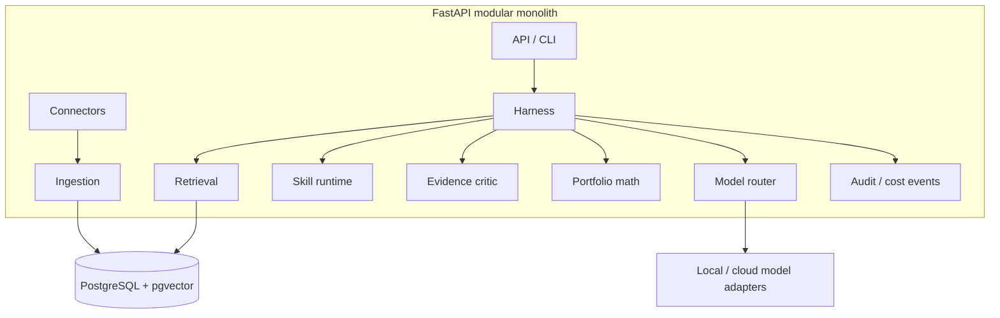
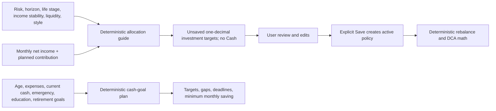
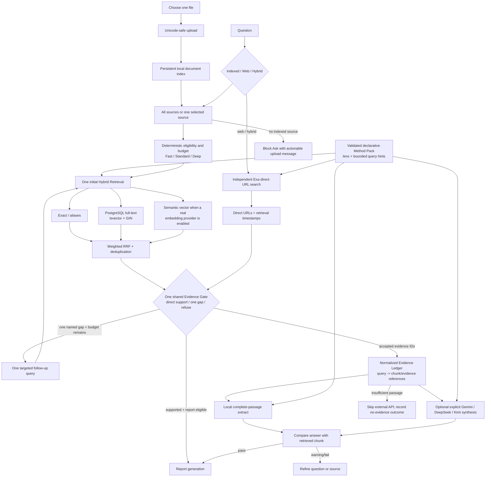
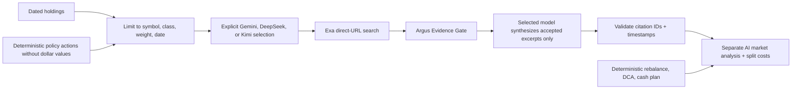
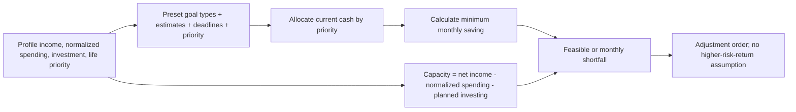
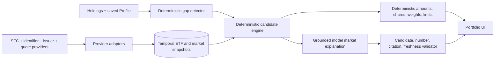
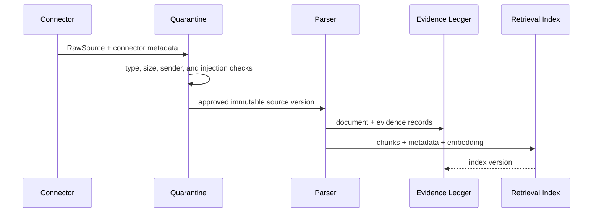
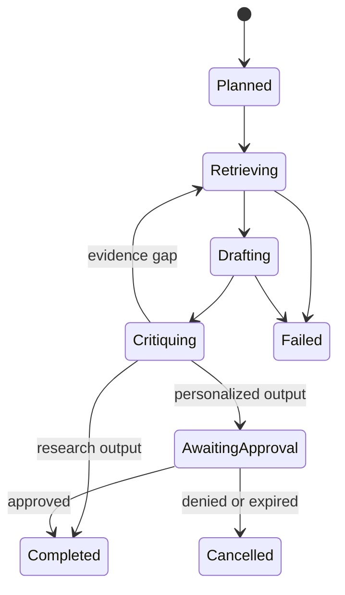

# Architecture

## Design Goals

1. Trace every material claim to immutable evidence.
2. Prevent post-date information from leaking into historical research.
3. Keep restricted household and holdings data local.
4. Make the harness independently valuable from any model provider.
5. Keep the MVP deployable by one developer within one month.
6. Produce measured quality, latency, and cost results for interviews.
7. Prefer automatic model selection that balances privacy, task capability,
   quality, latency, and spend.

## Modular Monolith



Module boundaries are Python interfaces first. Extract an MCP/REST service only
when another runtime needs the capability or a measured security/scaling reason
exists.

## Current Profile Guidance Flow



The guide is intentionally separate from Gemini. It produces an educational,
auditable investment mix and contribution-affordability warnings, while
preserving the user as the policy owner. Cash is a parallel goal-planning flow:
it allocates entered current savings to emergency, education, then retirement
cash targets and calculates the remaining whole-dollar monthly saving. It does
not estimate tuition or retirement need automatically, model debts/taxes, or
count investment positions as liquid cash.

Investor.gov, FINRA, and World Gold Council references establish relevant
factors, category definitions, and tested hypothetical gold allocations; they
do not prescribe the exact output percentages. The 40/60/80 stock bases,
5/7.5/10 gold values, and adjustments are versioned Argus example-policy rules. Monthly
net income and planned contribution are entered before guidance; zero recurring
income changes the risk-capacity buffer, while positive income supports a
contribution-rate warning rather than pretending that income alone determines
suitability.

## Current Research Source and Evidence Flow



The implemented local search stack is **Adaptive Hybrid Retrieval**. Every
question starts with one inexpensive retrieval. Exact matching protects
tickers, dates, numbers, phrases, and normalized aliases; PostgreSQL uses a
`simple`-dictionary `tsvector` expression with a GIN index for lexical ranking;
and a non-local embedding provider may add pgvector/HNSW semantic results.
Rank positions are fused with Reciprocal Rank Fusion (RRF), so Argus does not
compare incompatible lexical and cosine raw scores. It then removes normalized
duplicate passages and expands adjacent chunks as context.

The deterministic router assigns Fast, Standard, or Deep from visible question
signals, but these labels now govern eligibility and budget rather than evidence
sufficiency. Fast allows one query. Standard and Deep both allow one initial query
plus at most one Evidence-Gate-directed follow-up. Method Pack evidence slots are
treated as methodology/query hints and never create calls by themselves. The
current Agent Search is therefore a minimal `gather -> act -> verify` loop:
retrieve once, inspect one named evidence gap, run one bounded action if allowed,
then apply the same Gate and stop. It is not an always-on multi-agent debate or an
LLM planner.

The Evidence Gate is authoritative. Retrieval scores only rank candidates; a
keyword such as `because` or `risk` does not prove support. The Gate checks direct
question overlap, complete passages, requested-year coverage, and structured CSV
compatibility. Its accepted evidence IDs are the only IDs passed to the answer
model, exposed as citations, marked accepted in the Ledger, and considered by the
report endpoint. This removes the former search/answer/report sufficiency mismatch.

The normalized Evidence Ledger stores executed queries and query-to-chunk/
evidence links. Stored tool traces omit retrieved passage bodies; reports
rehydrate them from the canonical document tables. The final local answer marks
only the evidence it actually accepted, avoiding the earlier repeated-citation
behavior and limiting run-storage growth.

Important boundary: local, DeepSeek, and Kimi indexed runs currently use exact
plus lexical retrieval unless a genuine semantic embedding provider is enabled.
The deterministic 16-dimensional hash provider remains a test/plumbing adapter
and is deliberately excluded from the production semantic channel. Argus does
not silently call Gemini embeddings after the user selects another external
provider. A provider-independent local multilingual embedding model remains a
measured follow-up, not a completed claim.

Selecting a new model affects the next Ask run and does not erase the current
trace. Deleting a browser-uploaded source removes its managed raw upload and
artifact copy together with its document, evidence, chunks, and embeddings from
the active index. A source indexed from an explicit local path is removed from
the index without deleting the user's original file. Confirmed source or Method
add-on deletion also removes the historical Runs, Reports, Claims, Evidence
Ledger rows, and model/tool-call traces that used it; unrelated history remains.

The selected model and the model actually executed are distinct trace facts. A
user may select a cloud provider, but the local evidence-sufficiency guard can
stop the run before any provider request. The API reports this as
`cloud_skipped_no_evidence`; the UI must not describe that state as if the user
had selected Local. With zero indexed documents the API returns 422 before
creating a meaningless indexed or hybrid trace. Web-only research can run
without an upload. Provider-grounded URLs are not presented as if they passed
the exact local-excerpt critic; the response labels that distinction explicitly.

Investment Method Packs are declarative, schema-validated JSON or Markdown
containers—not executable skills or prompt files. The existing `/styles` API
name is retained for backward compatibility. Packs control analysis lenses,
report order, product preferences, bounded allocation adjustments, and optional
`required_evidence_slots`. At runtime those slots are bounded lens/query hints;
they cannot override the Evidence Gate, search budgets, source
admissibility, cash-goal math, concentration controls, or deterministic trade
calculations.
The full boundary and API contract are documented in
`docs/RESEARCH_AND_STYLE_PACK_ARCHITECTURE.md`.

### Provider adapters versus MCP

Gemini, DeepSeek, and Kimi are model-provider adapters behind the same internal
`ModelProvider` interface. They are ordinary HTTPS/SDK integrations, not MCP
servers. Indexed research retrieves and checks local evidence before an external
generation call. Web and hybrid modes use independent Exa retrieval before the
explicitly selected answer model and label the validation level. The repository
currently contains no executable MCP server or client; MCP remains a future
interoperability boundary for publishing tools and resources to other agent
runtimes, not a requirement for adding another model.

## Current AI Market-Context Flow



The market panel cannot alter rule output. Exa is the only search adapter in this
flow; Gemini, DeepSeek, and Kimi are interchangeable synthesis adapters chosen by
the user. Argus never asks one model to search while a different selected model
answers, and it never silently falls back. Account names and dollar values are
omitted from both the search query and external model prompt.

Profile stores `investment_horizon` and `investing_experience` as separate
concepts. Horizon is the future time until the money is needed and may affect
risk capacity. Experience is the time already spent investing and affects the
complexity of explanations and implementation prompts; it must not be used as
evidence that a person can tolerate more loss.

Runs aggregates every recorded model call by provider, model, and deployment.
For each group it returns input tokens, output tokens, call count, and estimated
cost using the single formula `input_tokens * input_rate / 1M + output_tokens *
output_rate / 1M`. Local calls carry a zero API rate. Provider bills and credits
remain authoritative because Argus records estimates rather than billing data.

The optional market prompt now includes action, symbol, asset class, and current
versus saved-policy weights—but no trade dollars. The model is asked for current
evidence supporting caution and counter-evidence against acting now. It cannot
replace the saved policy as the trade reason or change a deterministic number.

## Current Cash-Goal and Feasibility Flow



Emergency planning is optional. Short-term one-time needs use preset types with
optional amount, deadline, and priority fields. An incomplete selection remains a
visible warning but is excluded from numeric calculations. Education fields are
ignored when education context is `none`. Retirement is deliberately not emitted
as a short-term cash goal. Profile stores a conservative `retirement_planning_age`
of 100 by default and derives the number of years after planned retirement. This is
a horizon assumption, not a lifespan forecast or an instruction to hold lifetime
spending in cash.

Short-term goal selections are JSON records on each immutable profile snapshot.
That is the smallest design for at most eight preset types. Revisit a normalized
one-to-many goal table if Argus adds arbitrary recurring goals, per-goal bank
transaction matching, shared household ownership, or goal history.

Short-term goals affect current liquidity and investment capacity. A proper future
retirement projection remains separate because it must combine the planning horizon
with inflation, portfolio returns, Social Security/pensions, taxes, health care,
long-term care, and withdrawal sequencing. Omitting those variables is safer than
presenting `monthly expenses × months` as a complete retirement target.

## Connected Financial Data Boundary

ChatGPT app authorization is not an Argus credential. The local service cannot
reuse a ChatGPT session, connector token, memory, or private app index. Importing
bank transactions therefore requires a separate user-authorized boundary:

1. local CSV/OFX upload with explicit account/date scope, or
2. a read-only provider OAuth flow owned by Argus, with encrypted tokens,
   revocation, least-privilege scopes, retention controls, and access audit logs.

No transaction data should be sent to an external model by default. Deterministic
categorization and cash-flow aggregation should run locally; only redacted,
aggregated facts may enter an explicitly selected external analysis.

## Planned Full Market-Aware Candidate Flow

The current Portfolio engine uses the uploaded dated holdings snapshot and
deterministic Python. The approved next-stage design adds market data without
making the model the numerical source of truth:



“Real time” applies only to fields whose feed supports it. Fund identity,
expense, AUM, holdings, daily bars, and derived metrics retain their own
effective and observed timestamps. Failure falls back to the current snapshot
mode; Gemini memory is never substituted for missing market facts.

See [ETF Candidate and Market Data Architecture](ETF_MARKET_DATA_ARCHITECTURE.md)
for provider boundaries, schemas, scoring, refresh schedules, reliability,
cost, and implementation exit criteria.

### Implemented provider boundary (2026-07-21)

```text
PortfolioSource
├── FileUploadSource          default / offline / privacy-first
└── RobinhoodMcpSource        optional / typed Sidecar / manual refresh

MarketDataSource
├── RobinhoodMarketData       provider code 01
├── TwelveDataAdapter         provider code 02 / transport pending
├── AlphaVantageAdapter       provider code 03 / transport pending
└── MassiveAdapter            provider code 04 / transport pending
```

The API exposes a provider-neutral `/portfolio/market-map` contract with latest
price, prior completed close and date, one-session percent change, volume, dollar volume, volume Z-score,
observation timestamp, quote status, Heatmap group, exact holding status, and
related-stock exposure. Missing fields stay null; they are never synthesized.
When external access is off or the selected adapter is unavailable, the contract
falls back only to uploaded prices and labels the result `Not live`. This is not a
silent fallback to another external vendor.

The Robinhood transport is a localhost Sidecar rather than a generic MCP client inside
business code. It stores OAuth material in macOS Keychain, captures `list_tools` metadata,
requires an exact reviewed manifest fingerprint, and exposes only typed positions/quotes HTTP
routes. File and Robinhood holdings are stored as separate source snapshots. The merged decision
view prefers Robinhood for an overlapping ticker but retains unrelated uploaded assets. A partial
response is rejected before the current source snapshot is replaced.

## Data Zones

| Zone | Examples | Rule |
|---|---|---|
| Public | SEC filings, FRED, public news | Local or approved cloud |
| Internal | Paid research, selected email content | Local; cloud only after redaction |
| Restricted | Exact holdings values, accounts, income, liabilities | Local only |
| Derived portfolio context | Symbols, asset classes, weights, holdings date | Cloud only after explicit market-analysis consent |
| Payment card | PAN, CVV, raw cardholder data | Out of scope; do not ingest |
| Audit | IDs, hashes, costs, decisions | No raw restricted text in spans |

## Evidence Flow



Idempotency key:

```text
connector_id + external_id + source_version + raw_content_hash
```

## Harness State



Every run owns:

- task and `as_of_date`;
- sensitivity and required capabilities;
- tool, token, dollar, iteration, and deadline budgets;
- structured plan and current state;
- evidence IDs and claim IDs;
- provider route and cost;
- model-selection mode and reason;
- retry and approval history.

## Retrieval

V1 should start with metadata filtering plus vector retrieval. Lexical
retrieval, hybrid merge, and reranking are post-V1 enhancements unless time
allows.

1. Apply access-scope and temporal filters.
2. Run the available retrieval path, vector-first for V1.
3. Run separate support and opposition branches where practical.
4. Merge and deduplicate results; rerank only when implemented.
5. Enforce source diversity and evidence-grade rules.
6. Return a compact context package with evidence IDs.

Historical filtering:

```text
publication_date <= as_of_date
AND data_as_of_date <= as_of_date
```

Later evidence is allowed only in an explicitly labeled hindsight section.

## What Changes After Month One

Revisit:

- richer table extraction and filing XBRL support;
- market-data reliability and licensing;
- MCP exposure for retrieval or portfolio tools;
- durable background workers;
- encrypted restricted-data storage;
- broader skills and portfolio constraints;
- hosted OAuth only if the project becomes a real multi-user product;
- Kubernetes/cloud deployment only after the local V1 demo is stable;
- hosted payment provider integration only if Argus becomes a paid product;
- PCI scope review only if any future feature could touch cardholder data.
