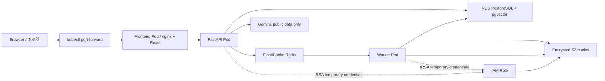
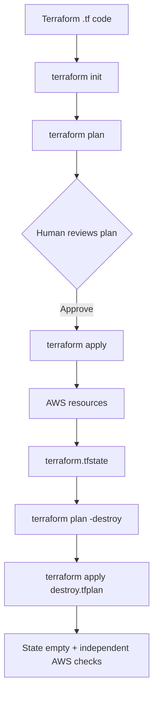

# Argus AWS Cloud Runbook / AWS 上云学习与操作手册

> **下一次部署入口：** 2026-07-22 之后的新一轮短时部署（包含 Kafka/MSK）
> 请先阅读 [AWS Deployment Handoff](CLOUD_DEPLOYMENT_HANDOFF.md)。交接单记录当前
> readiness、apply 前阻断项、验收范围、成本停止线和新窗口提示词；本 Runbook
> 继续作为完整操作与学习手册。

本文同时是：

- 初学者学习指南：解释云计算、AWS、Terraform、容器和 Kubernetes 术语；
- Argus 部署 Runbook：说明从登录、规划、部署、验收到销毁的完整流程；
- 故障复盘：记录 2026-07-12 真实 AWS 验收遇到的问题和解决方法；
- 面试手册：提供诚实边界、90 秒陈述、追问答案和自测标准。

如果只想执行操作，从[完整操作流程](#end-to-end-procedure)开始；如果第一次接触云，
先读[架构与数据流](#architecture-and-data-flow)和[中英术语表](#cloud-glossary)。准备重新
部署前，必须先完成[机器选型](#machine-selection-framework)、[部署前成本估算](#pre-deployment-cost-estimate)
和[成本护栏](#cost-guardrail-layers)，不能只凭 credits 余额决定是否 apply。

> **当前状态：没有保留运行中的 Argus AWS 环境。** 2026-07-12 的验收结束后，
> Terraform 已销毁 71 个托管资源，独立残留检查为空。再次执行
> `terraform apply` 会重新创建收费资源。

> **范围边界：这是成本受控的开发验收，不是生产部署。** 实际验收关闭了
> MSK、ALB 和 HPA，使用单节点、单副本、单 AZ 数据服务，并通过本地
> `port-forward` 访问。

> **2026-07-22 当前轮次：** 上述“关闭 MSK”描述的是 2026-07-12 历史验收。
> 当前轮次按交接单显式启用一个 MSK Serverless cluster，并新增单副本
> `event-consumer` 与一次性 topic bootstrap Job；ALB、HPA、eval CronJob 和
> production HA 仍关闭。只有本地回归、saved plan、成本和账号准入全部通过，
> 且用户确认 credits、预算和绝对销毁时间后，才允许 apply。

## 一页结论 / Executive summary

Argus 上云分成两层：

1. **AWS 基础设施层**：Terraform 创建 VPC、EKS、ECR、RDS、Redis、S3、
   Secrets Manager、IAM/IRSA 和 Budget。
2. **Kubernetes 应用层**：Docker 构建 API/worker 和 frontend 镜像，推送到
   ECR；Kustomize 生成 Kubernetes manifests；`kubectl` 将 API、worker、
   frontend 部署到 EKS。

一次请求的主要路径是：

```text
浏览器
  -> 本地 port-forward（正式环境应为 DNS/TLS/ALB）
  -> frontend/nginx
  -> FastAPI API Pod
  -> RDS PostgreSQL/pgvector（业务数据、证据、向量、runs）
  -> ElastiCache Redis（队列和任务状态）
  -> S3（原始文档归档）
  -> Gemini（仅明确标记为 public 的内容）
```

真实验收证明了：

- migrations 0001–0003 能在全新 RDS PostgreSQL 上完成；
- API、frontend、worker 三个 Deployment 都能 Ready；
- Pod 能通过 IRSA 写入 S3，而不需要静态 AWS access key；
- Redis `healthcheck.v1` 任务能从 `queued` 到 `complete/ok`；
- 公开材料能调用 `gemini-3.1-flash-lite`，并用
  `gemini-embedding-001` 写入 768 维 pgvector；
- HNSW 索引存在并参与向量检索；
- Terraform 能销毁全部 71 个资源，AWS 独立查询没有发现残留。

<a id="architecture-and-data-flow"></a>

## 架构与数据流 / Architecture and data flow

### 实际 smoke 架构



### Terraform 控制流



`plan` 只预览；`apply` 才修改 AWS。Terraform 依靠 state 记录“代码中的资源”
与“云上真实资源”的对应关系。即使 Terraform 显示 destroy 成功，也必须再次用
AWS CLI 查询残留资源。

### Argus 组件职责

| 组件 | 主要职责 | 数据是否持久化 |
|---|---|---|
| frontend / nginx | 提供 React 页面，并把 `/api/` 反向代理给 FastAPI | 容器本身不持久化 |
| API | 上传、检索、研究问答、报告、runs、jobs API | 业务数据写入 RDS，原始文件归档 S3 |
| worker | 从 Redis 读取后台任务并更新任务状态 | 状态在 Redis，业务结果写入 RDS/S3 |
| RDS PostgreSQL | system of record；保存文档、chunks、证据、向量、runs、报告 | 持久化 |
| ElastiCache Redis | 缓存、任务队列、短期任务状态 | smoke 环境为临时数据 |
| S3 | 保存原始上传和 artifacts | 持久化到 bucket 被销毁为止 |
| Gemini | 对明确声明为 public 的材料生成答案和语义 embedding | 调用元数据保存在 RDS；密钥不入库 |

<a id="cloud-glossary"></a>

## 中英术语与云基础 / Glossary and cloud fundamentals

以下每个词都给出英文全称、直白解释以及它在 Argus 中的用途。

### 云、账号、权限与成本

| Term / 术语 | 中文解释 | Argus 中的实际用途 |
|---|---|---|
| Cloud Computing / 云计算 | 按需租用计算、网络、数据库和存储，不自己购买和维护服务器。通常按时间、容量和流量计费。 | Argus 临时租用 AWS 托管资源完成真实部署验收。 |
| AWS / Amazon Web Services | 亚马逊云服务平台，提供计算、网络、数据库、存储、安全和监控服务。 | V2 的目标云平台。 |
| AWS Account / AWS 账号 | AWS 资源、账单、配额和权限的最高隔离边界。 | 学生账号中创建一次临时验收环境。 |
| Root User / 根用户 | 账号所有者身份，权限最大，不能被 IAM policy 完全限制。 | 验收仅使用浏览器确认的短期 CLI session；没有创建 root access key。生产应使用 deployment role。 |
| Access Key / 访问密钥 | 由 access key ID 和 secret access key 组成的长期程序凭证；泄露后可被远程调用。 | 本次没有创建 root access key；优先使用浏览器确认的临时 session。 |
| IAM / Identity and Access Management / 身份与访问管理 | 控制“谁可以对哪些 AWS 资源做什么”。 | Terraform 创建 workload role 和最小权限 policy。 |
| IAM Role / IAM 角色 | 可以被可信主体临时扮演的一组权限，不需要分发长期密码。 | Kubernetes `argus` ServiceAccount 通过 IRSA 扮演 role。 |
| IAM Policy / IAM 策略 | JSON 权限规则，包含 Effect、Action、Resource 等。 | S3、secret、MSK cluster、六个 topics 和一个 consumer group 都绑定具体 ARN，不使用 Kafka `Resource="*"`。 |
| Least Privilege / 最小权限 | 只授予完成任务所需的最少权限。 | Producer、Consumer 和 bootstrap 分别获得连接、读写、group 与 topic 创建/检查所需权限；生产仍应拆分 ServiceAccount/role，避免所有 Pods 共用同一权限集合。 |
| Temporary Credentials / 临时凭证 | 会自动过期的短期访问凭证，比长期 access key 风险低。 | 本地 Terraform/AWS CLI 使用临时登录；Pod 通过 STS/IRSA 获得临时凭证。 |
| STS / Security Token Service | AWS 签发临时安全凭证的服务。 | AWS SDK 用 Pod 的 OIDC token 调用 `AssumeRoleWithWebIdentity`。 |
| ARN / Amazon Resource Name | AWS 资源的全局标准标识字符串。 | Secret ARN 和 IRSA role ARN 由 Terraform output 提供。 |
| Region / 区域 | AWS 的地理部署区域，例如 `us-west-2`。不同区域的价格、版本和服务可用性可能不同。 | 实际部署在 Oregon `us-west-2`。 |
| Availability Zone (AZ) / 可用区 | Region 内相互隔离的数据中心组。 | VPC 跨两个 AZ 建 subnet；smoke 数据库仍是 single-AZ。 |
| EC2 / Elastic Compute Cloud | AWS 虚拟机服务；instance type 决定 CPU、内存、网络能力和价格。 | EKS managed node group 实际运行在一个 `m7i-flex.large` EC2 instance 上。 |
| Instance Type / 实例规格 | 一种预定义虚拟机硬件组合，例如 `m7i-flex.large`。 | 学生账号只允许 API 返回的 Free Tier eligible types。 |
| vCPU / Virtual CPU / 虚拟处理器 | 云实例对外提供的逻辑 CPU 单位，不一定等同于一颗物理 CPU。 | 机器选型同时检查 vCPU、memory 和实测负载，不能只数 CPU。 |
| On-Demand / 按需实例 | 不做长期承诺，按实际运行时间付费。单价通常高于长期折扣，但随时可销毁。 | 短时 smoke 使用 On-Demand，避免为 18 天 credits 窗口购买承诺。 |
| Spot Instance / 竞价实例 | 使用 AWS 闲置容量，价格较低但可被提前回收。 | 单节点 smoke 不使用；未来可把可重试 worker 放到独立 Spot node pool。 |
| Savings Plans / Reserved Instances / 长期折扣承诺 | 以一年或三年使用承诺换取较低单价；承诺本身也有成本和约束。 | 当前短期学生账号不购买，长期稳定负载才重新评估。 |
| Burstable Instance / 突发型实例 | 平时有 CPU baseline，空闲可积累 credits 后短时突发；长期超 baseline 可能受限或产生额外费用。 | `t3`/`t4g` 候选不能只比较小时价，还要检查持续 CPU 和 surplus credits。 |
| Benchmark / 基准测试 | 在固定输入和条件下比较性能、稳定性和成本。 | `c7i` 与 `m7i` 必须用同一 Git SHA、数据集、并发和时长测试。 |
| Headroom / 容量余量 | 正常峰值之外保留的资源空间，用于波动、系统开销和短时突发。 | 选型要求 steady-state CPU 和 memory 不超过 70%，即保留至少 30%。 |
| Free Tier / 免费套餐 | AWS 对符合条件账号提供的试用额度或免费使用量。不是所有服务都永久免费。 | 学生账号要求 EC2 使用 eligible instance type，并使用 credits 承担费用。 |
| Credit / 抵扣额度 | 可以抵扣符合条件 AWS 使用费的美元额度，不等于现金。 | 2026-07-13 快照为 71.34 USD remaining。 |
| AWS Budget / AWS 预算 | 根据实际或预测成本触发通知的工具。 | Terraform 创建 31 USD 月预算，在 50%、80% actual 和 100% forecasted 时发邮件。 |
| Cost Explorer / 成本分析器 | 按日期、服务、标签查看估算和最终成本。数据可能延迟。 | teardown 后查询成本；当时结果仍为 `Estimated=true`。 |
| Cost Anomaly Detection / 成本异常检测 | 用历史模式发现异常支出并通知；需要历史数据且可能延迟。 | 小额账号建议对 `$1` 以上 impact 告警，但不能代替短时 destroy。 |
| Cost Allocation Tag / 成本分摊标签 | 激活后的资源 tag，可在账单工具中按项目或环境分组。 | Terraform 添加 `Project=argus`、`Environment=dev|prod`，Billing 中还需激活。 |
| Usage Type / 用量类型 | AWS 账单里比 service 更细的收费维度，例如 instance hour、NAT byte。 | 月末按 `SERVICE + USAGE_TYPE` 解释每项增量。 |
| Gross / Net Cost / 毛费用与净费用 | Gross 是 credits 前的资源费用；Net 是 credits、折扣等应用后的费用。 | 先按 gross 做容量预算，再用 `NetUnblendedCost` 与 credits activity 对账。 |
| Managed Service / 托管服务 | 云厂商负责部分底层运维、升级和可用性的服务。 | EKS control plane、RDS、ElastiCache、S3 等由 AWS 管理底层服务。 |
| KMS / Key Management Service | AWS 托管加密密钥服务，可控制 key policy、审计和轮换。 | production 条件会创建 KMS key 加密 Kubernetes secrets；smoke 没有额外 cluster KMS key。 |

### 网络基础

| Term / 术语 | 中文解释 | Argus 中的实际用途 |
|---|---|---|
| VPC / Virtual Private Cloud / 虚拟私有云 | 在 AWS 中划出的逻辑隔离网络。 | `10.42.0.0/16` 是 Argus 网络边界。 |
| CIDR / Classless Inter-Domain Routing | 表示 IP 地址范围的方法；`/16` 表示前 16 位固定。 | Terraform 从 VPC CIDR 划分 public、private 和 database subnets。 |
| Subnet / 子网 | VPC 中位于单个 AZ 的一段 IP 地址范围。 | EKS nodes 位于 private subnets；RDS 位于 database subnets。 |
| Public Subnet / 公有子网 | route table 有到 Internet Gateway 的路由；其中资源还需公网 IP 才能直接通信。 | 承载 NAT Gateway；smoke 没有把 RDS/Redis 放在这里。 |
| Private Subnet / 私有子网 | 没有直接到 Internet Gateway 的入站路径；需要 NAT 才能主动访问公网。 | EKS worker nodes 位于 private subnets。 |
| Database Subnet / 数据库子网 | 专门为数据库划分的 private subnet 组。 | RDS 放在两个 database subnets 形成的 DB subnet group 中。 |
| Route Table / 路由表 | 决定某个目标 IP 流量下一跳去哪里。 | private subnet 的公网流量走 NAT；public subnet 的公网流量走 Internet Gateway。 |
| Internet Gateway (IGW) / 互联网网关 | 让 VPC public subnet 与互联网通信的 AWS 网关。 | 由 VPC module 创建，供 public network path 使用。 |
| NAT / Network Address Translation / 网络地址转换 | 让 private subnet 资源主动访问公网，同时不接受公网主动入站。 | EKS nodes 拉取镜像、调用 Gemini 和 AWS public endpoints。 |
| NAT Gateway / NAT 网关 | AWS 托管 NAT 服务，按小时和流量收费，即使业务空闲也可能收费。 | dev 使用一个 NAT 降低成本；生产通常每 AZ 一个以避免单 AZ 故障。 |
| DNS / Domain Name System / 域名系统 | 把域名转换成 IP 地址。 | VPC 启用 DNS hostnames；正式外网入口尚未配置域名。 |
| Security Group / 安全组 | 有状态的虚拟防火墙，按来源、协议和端口控制流量。 | 只允许 EKS node security group 访问 RDS 5432 和 Redis 6379。 |
| Port / 端口 | 同一 IP 上区分应用协议的数字。 | PostgreSQL 5432、Redis 6379、FastAPI 8000、frontend 8080。 |
| TLS / Transport Layer Security | 对网络传输进行加密并验证服务身份。 | Redis 使用 `rediss://` 和 transit encryption；正式 HTTPS 入口尚未部署。 |
| ALB / Application Load Balancer | AWS 七层 HTTP/HTTPS 负载均衡器。 | base manifest 有 ALB Ingress；smoke overlay 删除它以节省成本。 |
| LCU / Load Balancer Capacity Unit | ALB 按连接数、流量和规则评估的容量计费单位，取多个维度中的最大值。 | 公网环境除了 ALB 小时费，还要估算 LCU-hours。 |
| ACM / AWS Certificate Manager | 管理 TLS 证书。 | 正式 DNS/HTTPS 部署需要；smoke 没有创建。 |
| Port Forward / 端口转发 | 把本机端口临时转发到集群内 Pod/Service。 | `localhost:18080` 临时访问 frontend，不创建公网 ALB。 |

### 容器与 Kubernetes

| Term / 术语 | 中文解释 | Argus 中的实际用途 |
|---|---|---|
| Docker Image / Docker 镜像 | 包含应用、依赖和启动配置的只读制品。 | 一个 backend image 同时运行 API/migrations/worker；另一个 image 运行 frontend。 |
| Container / 容器 | 镜像启动后的隔离进程。 | Pod 内运行 FastAPI、worker 或 nginx。 |
| Registry / 镜像仓库服务 | 存储并分发 container images。 | AWS ECR 是远程 registry。 |
| ECR / Elastic Container Registry | AWS 托管的 Docker/OCI 镜像仓库。 | 分别保存 backend 和 frontend images，并在 push 时扫描。 |
| Image Tag / 镜像标签 | 镜像的可读版本标记。标签可被移动，所以生产最好配合 digest。 | 使用 Git SHA，而不是 `latest`。 |
| Image Digest / 镜像摘要 | 由内容计算出的不可变哈希标识。 | 更严格生产部署可固定 digest，确保不会拉到被替换的 tag。 |
| `linux/amd64` | Linux x86-64 CPU 架构目标。 | Mac Apple Silicon 是 arm64；显式构建 amd64 以匹配 EKS node。 |
| EKS / Elastic Kubernetes Service | AWS 托管 Kubernetes control plane 的服务。 | 运行 Argus Kubernetes workloads。 |
| ECS / Elastic Container Service | AWS 自有的容器编排服务，不要求使用 Kubernetes API。 | 当前没有使用；如果岗位不要求 Kubernetes，它可能比 EKS 更简单。 |
| Fargate | AWS serverless container compute，用户不直接管理 EC2 nodes。 | 当前没有使用；可以承载 ECS tasks 或 EKS Pods，但成本/限制需单独评估。 |
| App Runner | 从 source/image 快速运行 Web service 的托管平台，隐藏较多网络和编排细节。 | 当前没有使用；对简单 Web demo 可能比 EKS 省运维。 |
| Kubernetes (K8s) / 容器编排系统 | 负责部署、调度、服务发现、健康检查、扩缩容和滚动更新。 | 管理 API、frontend、worker 和 eval CronJob。 |
| Cluster / 集群 | 一组 Kubernetes control plane 与计算 nodes。 | 实际集群名 `argus-dev`，版本 1.35。 |
| Control Plane / 控制平面 | 保存集群期望状态并调度 workloads 的 Kubernetes 管理层。 | 由 EKS 托管并按小时计费。 |
| Node / 节点 | 实际运行 Pods 的机器，EKS 中通常是 EC2。 | smoke 使用一个 eligible `m7i-flex.large` node。 |
| Managed Node Group / 托管节点组 | EKS 管理的一组 EC2 worker nodes。 | `general` node group，desired/min 为 1。 |
| Pod | Kubernetes 最小调度单元，可包含一个或多个 containers。 | API Pod 包含 migrations initContainer 和 API container。 |
| Deployment | 声明一类长期运行 Pod 的副本数和滚动更新策略。 | `argus-api`、`argus-frontend`、`argus-worker`。 |
| Replica / 副本 | 同一 workload 同时运行的 Pod 数量。 | smoke 把三类 workload 都设为 1，控制成本。 |
| Service / Kubernetes 服务 | 为一组 Pods 提供稳定的集群内地址和负载均衡。 | frontend Service 暴露 8080；API Service 暴露 8000。 |
| Namespace / 命名空间 | Kubernetes 内的逻辑隔离与命名边界。 | 所有应用资源放在 `argus` namespace。 |
| ServiceAccount / 服务账号 | Pod 在 Kubernetes 内的身份。 | `argus` ServiceAccount 通过 annotation 绑定 IRSA role。 |
| IRSA / IAM Roles for Service Accounts | 把 IAM role 绑定到 Kubernetes ServiceAccount；Pod 用 OIDC token 换取短期 AWS 凭证。 | API/worker 无需静态 AWS key 即可访问 S3 和指定 secret；production trust policy 还应明确校验 `aud=sts.amazonaws.com`。 |
| OIDC / OpenID Connect | 基于 token 的身份协议。 | EKS OIDC issuer 让 AWS IAM 验证 Pod ServiceAccount token。 |
| Manifest / 清单 | 描述 Kubernetes 资源期望状态的 YAML。 | `infra/k8s/base/*.yaml` 定义 Deployments、Services 等。 |
| kubectl | Kubernetes 官方命令行客户端。 | apply manifests、看 Pods/logs、rollout、port-forward、删除 namespace。 |
| kubeconfig | 保存 cluster endpoint、certificate 和登录方式的本地配置。 | `aws eks update-kubeconfig` 写入临时 EKS context。 |
| Context / 上下文 | kubeconfig 中 cluster、user、namespace 的组合。 | 操作前必须确认 context 指向 `argus-dev`，防止误操作其他集群。 |
| Kustomize | 在不复制整套 YAML 的情况下，对 base 应用 overlays/patches。 | `aws-smoke` 将 replicas 改为 1，并删除 Ingress/HPA。 |
| Base / 基础清单 | 多环境共享的 Kubernetes manifests。 | 包含 API、frontend、worker、Ingress、HPA、CronJob。 |
| Overlay / 环境覆盖层 | 对 base 做环境特定修改的 Kustomize 配置。 | `aws-smoke` 替换 image/IRSA，并关闭昂贵或非必要功能。 |
| ConfigMap | 保存非敏感配置的 Kubernetes 对象。 | 保存 environment、端口、timeout、region 等。 |
| Secret / Kubernetes Secret | 保存敏感运行值的 Kubernetes 对象；默认只是编码，不等于自动静态加密。 | `argus-secrets` 由安全同步脚本生成，不进入 Git。 |
| Init Container / 初始化容器 | 主容器启动前必须成功完成的容器。 | API Pod 启动前执行 `alembic upgrade head`。 |
| Liveness Probe / 存活探针 | 判断进程是否卡死；失败后 Kubernetes 可重启 container。 | `/health/live` 只检查 API 进程存活。 |
| Readiness Probe / 就绪探针 | 判断 Pod 是否可以接收流量；失败不会进入 Service endpoints。 | `/health/ready` 检查 PostgreSQL 和 Redis。 |
| Rollout / 滚动发布 | 逐步用新 Pods 替换旧 Pods 的过程。 | `kubectl rollout status/undo` 用于确认或回滚。 |
| Ingress | 定义集群外 HTTP/HTTPS 进入 Services 的规则。 | base 计划使用 ALB；smoke 删除。 |
| HPA / Horizontal Pod Autoscaler | 根据 CPU/内存或自定义指标自动调整 Pod 副本数。 | base 为 worker 配置 1–6；smoke 删除。 |
| CronJob | 按 cron 时间表创建一次性 Kubernetes Jobs。 | base 每天计划运行 `argus-eval`；不是本次验收重点。 |
| Smoke Test / 冒烟测试 | 用少量关键路径快速确认系统基本可用。 | 单副本、无公网入口的短时 AWS 验收。 |

### 数据、检索与 AI

| Term / 术语 | 中文解释 | Argus 中的实际用途 |
|---|---|---|
| RDS / Relational Database Service | AWS 托管关系型数据库服务。 | 运行 PostgreSQL 16.14；AWS 管理底层实例和备份。 |
| PostgreSQL | 开源关系型数据库。 | Argus 的 system of record。 |
| System of Record / 权威数据源 | 被视为业务事实最终版本的持久系统。 | 文档、证据、runs、报告以 PostgreSQL 为准，不以 Redis 为准。 |
| pgvector | PostgreSQL 的向量类型与相似度检索扩展。 | `vector(768)` 保存 Gemini embeddings。 |
| Embedding / 向量嵌入 | 将文本映射为浮点数向量，使语义相近文本在向量空间中更接近。 | `gemini-embedding-001` 为 public 文档和 query 生成 768 维向量。 |
| Dimension / 维度 | 向量中的数字个数。模型、数据库列和 query 必须一致。 | Argus 固定为 768；不匹配会导致写入或检索失败。 |
| HNSW / Hierarchical Navigable Small World | 用图结构近似最近邻搜索的向量索引，通常以少量召回误差换取更快查询。 | `ix_chunk_embeddings_vector_hnsw` 使用 cosine operator。 |
| Cosine Distance / 余弦距离 | 比较向量方向的距离指标，常用于文本 embedding。 | pgvector 查询按 cosine distance 排序。 |
| Migration / 数据库迁移 | 有版本地修改数据库 schema。 | 当前完整链为 `20260709_0001` 到 `20260722_0022`；0022 创建 Kafka 审计投影和 Consumer heartbeat 表。 |
| Alembic | SQLAlchemy 生态中的数据库 migration 工具。 | API initContainer 执行 `alembic upgrade head`。 |
| Multi-AZ / 多可用区 | 跨 AZ 维护冗余数据库实例以提高可用性。 | production 条件启用；smoke 为 single-AZ。 |
| Snapshot / 快照 | 数据库在某时点的备份。 | 生产数据恢复手段，不是普通应用版本回滚方法。 |
| ElastiCache | AWS 托管内存数据库服务。 | 运行一个 Redis 7 `cache.t4g.micro`。 |
| Redis | 内存 key-value 数据库，可用于 cache、queue、counter 和短期状态。 | 保存任务队列与 `queued/running/complete/failed` 状态。 |
| BRPOP / Blocking Right Pop | Redis 阻塞式取队列元素；无元素时等待到 timeout。 | worker 每次最多等待 5 秒；timeout 应表示“暂无任务”，不是崩溃。 |
| Cache / 缓存 | 保存可重新计算的数据以降低重复计算和延迟。 | V2 有 Redis cache contract；RDS 仍是持久真相。 |
| Queue / 队列 | 生产者提交工作、消费者异步取走处理的结构。 | API enqueue，worker dequeue。 |
| S3 / Simple Storage Service | AWS 对象存储；数据以 bucket/object 组织。 | 保存原始上传和 artifacts。 |
| Bucket / 存储桶 | S3 对象的顶层容器，名称全局唯一。 | Terraform 创建带随机后缀的 Argus artifacts bucket。 |
| Object / 对象 | S3 中由 key 标识的数据及 metadata。 | 每个归档文件成为 object。 |
| Versioning / 版本控制 | 同一个 object key 的历史版本保留机制。 | artifacts bucket 已启用。 |
| Encryption at Rest / 静态加密 | 数据落盘时加密。 | RDS、Redis、S3 都配置静态加密。 |
| Encryption in Transit / 传输加密 | 数据在网络传输时加密。 | Redis 启用 TLS；Gemini 和 AWS APIs 走 HTTPS。 |
| Secrets Manager | AWS 托管敏感配置服务，可按 IAM 控制读取并支持版本/轮换。 | 保存 DB URL、Redis URL、bucket、Kafka 配置和授权同步的 Gemini 设置。 |
| Gemini Generation / Gemini 生成 | Gemini 根据问题和证据生成自然语言答案。 | 仅 `sensitivity=public` 时允许云端生成。 |
| Gemini Embedding / Gemini 嵌入 | Gemini 将文本转换为语义向量。 | public 数据使用 `gemini-embedding-001`；internal 数据保持本地。 |
| Sensitivity Gate / 敏感度门控 | 在调用模型前按数据敏感级别限制数据去向。 | `internal` 默认不调用 Gemini；只有明确 `public` 才允许。 |

### Terraform 与运维

| Term / 术语 | 中文解释 | Argus 中的实际用途 |
|---|---|---|
| IaC / Infrastructure as Code / 基础设施即代码 | 用可审查、可版本控制的代码定义基础设施，而不是手工点控制台。 | `infra/terraform/aws` 定义 AWS 资源。 |
| Terraform | HashiCorp 的 IaC 工具，通过 provider 调用云 API。 | 创建、更新和销毁 Argus AWS stack。 |
| Provider | Terraform 与某个平台 API 交互的插件。 | AWS provider 创建云资源；random provider 生成 DB password。 |
| Module | 可复用的一组 Terraform resources。 | 使用社区 VPC 和 EKS modules。 |
| Resource | Terraform 管理的一个真实对象。 | RDS instance、S3 bucket、Budget 等。 |
| Data Source | Terraform 只读查询的外部信息。 | 查询 caller identity、available AZs、可选 MSK brokers。 |
| Variable | Terraform 的可配置输入。 | region、environment、budget email、Kafka switch 等。 |
| Output | Apply 后暴露给后续步骤使用的值。 | ECR URLs、bucket、secret ARN、IRSA role ARN、kubeconfig command。 |
| `terraform init` | 下载 provider/modules 并初始化 backend。 | 每个新 checkout 或 provider/backend 变化后执行。 |
| `terraform validate` | 检查 Terraform 语法和内部引用。 | 只能做静态检查，不能证明 AWS 账号允许创建资源。 |
| `terraform plan` | 比较 config、state 和远程资源，生成拟执行变更。 | 人工审查成本和范围，不会创建资源。 |
| Plan File / 计划文件 | 保存的不可读二进制执行计划。可能包含敏感数据。 | `argus.tfplan` 和 `destroy.tfplan` 被 `.gitignore` 排除。 |
| `terraform apply` | 执行已审核 plan，实际修改云资源。 | 创建 stack 或执行 destroy plan。 |
| `terraform destroy` / Destroy Plan | 删除 state 管理的资源。 | 验收后立即释放收费资源。 |
| Terraform State / 状态文件 | 记录 Terraform resource address 与云资源 ID/属性的映射。可能包含 secret。 | 本次 demo 使用本地 state；绝不能提交 Git。生产需要 encrypted remote backend。 |
| Remote Backend / 远程后端 | 把 state 放在共享远程存储，而不是个人电脑。 | production 尚未配置；需要 encryption、access control 和 locking。 |
| State Locking / 状态锁 | 防止两个人同时修改同一 state。 | production 必需，避免并发 apply 损坏 state。 |
| Drift / 配置漂移 | 云资源被控制台或其他工具修改，和 Terraform config/state 不一致。 | 每次 plan 会发现大部分 drift；不要随意手工改资源。 |
| Taint / 污点标记 | Terraform state 标记某资源应在下次 apply 重建。 | 验收时 credential error 导致 EKS 被标记；先核实 cluster ACTIVE，再安全移除错误 taint，避免昂贵重建。 |
| Idempotency / 幂等性 | 重复执行同一操作仍得到相同目标状态，不重复制造副作用。 | Terraform、Kubernetes apply 和 embedding upsert 都追求幂等。 |
| Rollback / 回滚 | 将应用或配置恢复到先前可用版本。 | Kubernetes 用 `rollout undo`；数据库 schema 需要向后兼容。 |
| Acceptance Test / 验收测试 | 从用户目标出发证明整个系统满足要求。 | 不只检查 Pod，还验证 RDS、Redis、S3、Gemini、pgvector 和 teardown。 |
| Residual Check / 残留检查 | 销毁后独立查询是否仍有资源。 | 避免 NAT、EKS、RDS 等因 state 问题继续计费。 |
| Observability / 可观测性 | 通过 logs、metrics、traces 理解系统内部状态。 | logs/probes 已验收；OTel collector manifest 存在，但 hosted Grafana/Prometheus 未部署。 |
| OpenTelemetry (OTel) | 标准化生成和传输 traces/metrics/logs 的框架。 | FastAPI/SQLAlchemy instrumentation 已有；smoke 清空 exporter endpoint。 |
| CloudWatch | AWS 原生 logs、metrics、alarms 和 dashboards 服务。 | AWS 基础服务有默认指标，但本次没有完成 Argus hosted alarms/dashboard。 |
| Prometheus | 以 time-series metrics 和 PromQL 为核心的开源监控系统。 | OTel collector 可暴露兼容 metrics；本次没有部署长期 Prometheus backend。 |
| Grafana | 查询并可视化多种 metrics/logs 数据源的 dashboard 工具。 | V2 目标之一；本次没有部署 hosted Grafana。 |
| MSK / Managed Streaming for Apache Kafka | AWS 托管 Kafka。 | 2026-07-12 历史 smoke 关闭；2026-07-22 当前轮次只为 producer-consumer 学习验收短时启用 Serverless，验收后立即销毁。 |

### 通用软件与可靠性术语

| Term / 术语 | 中文解释 | Argus 中的实际用途 |
|---|---|---|
| CLI / Command-Line Interface | 在终端中输入命令操作软件。 | AWS CLI、Terraform CLI、Docker CLI 和 kubectl 组成部署控制面。 |
| API / Application Programming Interface | 软件之间按约定 request/response 交互的接口。 | FastAPI 提供 Argus HTTP API；Terraform/AWS CLI 调 AWS APIs。 |
| SDK / Software Development Kit | 程序语言访问某平台 API 的客户端库。 | Python AWS SDK 使用 IRSA credential chain；Google SDK 调 Gemini。 |
| Endpoint / 端点 | 一个可访问服务的网络地址。 | EKS API endpoint、RDS endpoint、Redis endpoint 和 HTTP health endpoint。 |
| HTTP/HTTPS | Web request/response 协议；HTTPS 在 HTTP 外增加 TLS。 | frontend 反向代理 `/api/`；smoke 本地 HTTP，外部 Gemini/AWS APIs 使用 HTTPS。 |
| Frontend / 前端 | 在浏览器展示和交互的应用部分。 | React build 由 nginx container 提供。 |
| Backend / 后端 | 处理业务逻辑、数据和 API 的服务。 | Python/FastAPI image 同时支持 API、migrations 和 worker。 |
| Worker / 后台工作进程 | 不直接响应页面请求、异步处理队列任务的进程。 | 从 Redis 获取 jobs，写回状态和业务结果。 |
| Reverse Proxy / 反向代理 | 对用户接收请求，再转发到内部服务。 | nginx 提供 frontend，并把 `/api/` 转给 FastAPI Service。 |
| Git SHA / Git 提交哈希 | 唯一标识一份代码提交的内容摘要。 | 作为 ECR image tag，让部署版本可追溯。 |
| YAML / JSON | 常见结构化文本格式；YAML 更适合人读配置，JSON 常用于 API 数据。 | Kubernetes manifests 使用 YAML；IAM policies 和 Secrets Manager value 使用 JSON。 |
| Log / 日志 | 离散事件记录，适合看错误和执行上下文。 | `kubectl logs` 定位 migrations、API 和 worker failures。 |
| Metric / 指标 | 随时间变化的数值，例如 latency、error rate、CPU。 | probes/资源指标有基础配置，完整 hosted metrics 未完成。 |
| Trace / 链路追踪 | 把一次请求跨组件的 spans 串起来，定位延迟与错误。 | FastAPI/SQLAlchemy OTel instrumentation 已实现，smoke 未保留 collector backend。 |
| Failover / 故障切换 | 主实例失败时切换到备用实例。 | production Redis 条件开启；smoke 单节点没有 failover。 |
| Load Test / 负载测试 | 用并发/持续请求测吞吐、延迟、错误率和容量。 | 尚未完成，因此不能声称 production capacity。 |
| SLO / Service Level Objective | 团队设定的可用性、延迟或错误率目标。 | 尚未定义和长期测量。 |
| Eventual Consistency / 最终一致性 | 分布式系统的更新不会立刻在所有查询中可见，但稍后会收敛。 | AWS delete 后某些 list API 可能短时间仍显示旧状态，需要重试确认。 |
| CrashLoopBackOff | Kubernetes container 反复崩溃后逐步延长重启等待的状态。 | Redis timeout bug 曾让 worker 进入这一类失败循环。 |
| ImagePullBackOff | Kubernetes 多次拉取 image 失败后的退避状态。 | 排查 ECR tag、权限、网络和 CPU architecture。 |
| Regression Test / 回归测试 | 固定复现已修复 bug，防止以后再次出现。 | Redis blocking timeout 修复后新增自动化测试。 |

## 已部署、已配置但关闭、尚未完成

| 状态 | 功能 |
|---|---|
| 真实部署并验收 | VPC、两个 AZ subnet 布局、单 NAT、EKS 1.35、一个 EC2 node、ECR、RDS PostgreSQL 16.14/pgvector、ElastiCache Redis、S3、Secrets Manager、IAM/IRSA、Budget、API/frontend/worker、migrations、probes、Redis job、S3 archive、Gemini public flow、HNSW retrieval |
| 当前轮次 plan 前已配置、尚未云上验收 | MSK Serverless、event-consumer、topic bootstrap、最小 Kafka IAM、migration 0022 head check |
| smoke 中继续关闭 | ALB Ingress、worker HPA、eval CronJob、OTel exporter |
| production 仍需完成 | 非 root deployment role、remote Terraform backend/locking、限制或私有化 EKS API endpoint、细化 EKS access entries、IRSA `aud` condition、按开关收窄 Kafka IAM、DNS/TLS/ACM、ALB controller、metrics-server、Multi-AZ RDS/Redis failover、完整 backup/restore drill、hosted metrics/dashboards/alerts、load test、rollback drill、长期运行验证 |

### dev 与 production Terraform 开关

| 能力 | `environment = "dev"` | `environment = "prod"` |
|---|---|---|
| NAT | 一个 NAT，降低成本但形成单 AZ 依赖 | VPC module 按 AZ 创建 NAT，提高可用性和成本 |
| EKS secret encryption | 不额外创建 cluster KMS key | 为 Kubernetes secrets 配置 KMS encryption |
| RDS | single-AZ、1 天 backup、无 deletion protection、销毁时不保留 final snapshot | Multi-AZ、7 天 backup、deletion protection、final snapshot |
| Redis | 一个 cache node、无 automatic failover | 两个 cache nodes、automatic failover |
| S3 | `force_destroy=true`，便于临时验收彻底销毁 | 不强制删除非空 bucket |
| ECR | `force_delete=true`，repository 有 images 也可销毁 | 不强制删除 repository |
| Secrets Manager | 删除恢复窗口为 0 天 | 30 天 recovery window |

这些条件分支只代表代码中的初步 production defaults，不等于完成了 production
readiness；网络入口、state backend、监控、恢复演练和容量证据仍然缺失。

<a id="machine-selection-framework"></a>

## Machine Selection Framework / 机器选型框架

“性价比最高”不是 AWS 某个固定机型的属性，而是：**在同一 workload、同一 SLO、
同一安全与架构约束下，选择通过全部容量门槛和 benchmark 的最低总成本候选。**
只比较 EC2 小时单价会漏掉 EBS、CPU credits、跨 AZ 流量以及 EKS/NAT 等固定成本。

### 历史事实与下一次决策

- `m7i-flex.large` 是 2026-07-12 唯一完成真实端到端验收的 node type；它是当前
  **tested baseline**，不是经过多机型 benchmark 证明的全球最优解。
- `c7i-flex.large` 在 2026-07-13 Oregon On-Demand 快照中更便宜，是当前
  **cost challenger**；只有完成相同负载 benchmark 并保留 30% headroom 后，才能替换 baseline。
- 当前镜像以 `linux/amd64` 构建。`t4g` 是 arm64，不能因为单价最低就直接替换；必须先构建、扫描、
  测试 multi-architecture images。
- EKS control plane 和 NAT 的固定费用大于这两个 x86 instance 之间的差价。若目标只是最低费用
  Web demo，应先比较 ECS/Fargate 或 App Runner；若目标包含 Kubernetes 学习与面试证据，EKS
  才是明确的架构约束。

### Step 1：测量需求 / Measure demand

先冻结 benchmark 的输入，不先看价格选机器。记录：

| 输入 | 必须记录的值 | Argus 当前基线 |
|---|---|---|
| Workloads | Pod、replica、CronJob 是否同时运行 | API 1、worker 1、frontend 1；eval 可能临时运行 |
| Kubernetes requests | 调度时保证的 CPU/内存 | 常驻合计 `550m CPU / 1088Mi`；eval 另加 `250m / 512Mi` |
| Observed peak | 相同负载下 node/pod 的 CPU、memory p95/max | 尚未做跨机型持续负载测量 |
| System reserve | kubelet、CNI、DNS、OS、DaemonSets 的实测占用 | 必须在真实 node 上测量，不能假设为 0 |
| Traffic | 并发数、请求率、payload、文档大小 | benchmark 必须固定同一 dataset 和 request mix |
| Queue | jobs/min、单 job 时间、积压恢复时间 | 至少覆盖 `healthcheck.v1` 和一个真实 research job |
| Storage/network | 临时磁盘、镜像大小、NAT/跨 AZ GB | 从 EBS、ECR、VPC/Cost Explorer 记录 |
| SLO | latency、error rate、job completion、availability | 下表给出 smoke 候选门槛；不是历史生产 SLO |

30% headroom 表示 steady-state peak 最多使用可分配容量的 70%。机器的静态容量下限为：

```text
required_vCPU = (peak_workload_vCPU + measured_system_reserve_vCPU) / 0.70
required_memory = (peak_workload_memory + measured_system_reserve_memory) / 0.70
```

同时检查 Kubernetes `requests` 和实测 peak，取较大值。仅按当前 manifests，eval 运行时 workload
requests 已到 `800m CPU / 1600Mi`，还未加 system reserve；因此 1 GiB micro 明显不合适，2 GiB
small 也很可能没有 30% memory headroom。4 GiB 只能列为待实测候选，8 GiB 是较保守基线。

### Step 2：产生候选机型 / Build the candidate set

先从账号实际允许的类型中筛选，再按 CPU architecture、vCPU、内存和购买方式过滤：

```bash
AWS_PROFILE=YOUR_TEMPORARY_PROFILE
AWS_REGION=us-west-2

aws ec2 describe-instance-types \
  --profile "$AWS_PROFILE" \
  --region "$AWS_REGION" \
  --filters Name=free-tier-eligible,Values=true \
  --query 'InstanceTypes[].{type:InstanceType,vCPU:VCpuInfo.DefaultVCpus,memoryMiB:MemoryInfo.SizeInMiB,arch:ProcessorInfo.SupportedArchitectures}' \
  --output table
```

2026-07-13 账号/API 快照如下；价格是 Linux、Shared tenancy、On-Demand、Oregon 公布价，
`730 h/month` 只用于可比估算：

| Candidate | vCPU / memory | Arch | USD/hour | 730h compute | 初筛结论 |
|---|---:|---|---:|---:|---|
| `t4g.micro` | 2 / 1 GiB | arm64 | 0.00840 | 6.13 | memory 不足，且当前 image architecture 不兼容 |
| `t3.micro` | 2 / 1 GiB | amd64 | 0.01040 | 7.59 | memory 不足 |
| `t4g.small` | 2 / 2 GiB | arm64 | 0.01680 | 12.26 | memory/headroom 很紧，且需 multi-arch |
| `t3.small` | 2 / 2 GiB | amd64 | 0.02080 | 15.18 | memory/headroom 很紧；持续 CPU 还要检查 burst credits |
| `c7i-flex.large` | 2 / 4 GiB | amd64 | 0.08479 | 61.90 | 最低成本的可行 x86 challenger，必须 benchmark |
| `m7i-flex.large` | 2 / 8 GiB | amd64 | 0.09576 | 69.90 | 已完成验收的 tested baseline |

这是时间点快照，不应永久复制到预算。每次部署前用 Price List API 刷新候选价；Pricing endpoint
使用 `us-east-1`，而 `location` 决定被查询的 Oregon 价格：

```bash
INSTANCE_TYPE=c7i-flex.large

aws pricing get-products \
  --profile "$AWS_PROFILE" \
  --region us-east-1 \
  --service-code AmazonEC2 \
  --filters \
    Type=TERM_MATCH,Field=location,Value='US West (Oregon)' \
    Type=TERM_MATCH,Field=instanceType,Value="$INSTANCE_TYPE" \
    Type=TERM_MATCH,Field=operatingSystem,Value=Linux \
    Type=TERM_MATCH,Field=tenancy,Value=Shared \
    Type=TERM_MATCH,Field=preInstalledSw,Value=NA \
    Type=TERM_MATCH,Field=capacitystatus,Value=Used \
  --output json \
| jq -r '.PriceList[] | fromjson
  | .terms.OnDemand[] | .priceDimensions[]
  | select(.unit == "Hrs")
  | [.description, .pricePerUnit.USD] | @tsv'
```

短期 smoke 使用 On-Demand：没有长期承诺，也方便立即销毁。单节点不能用 Spot 作为唯一 node，
否则回收会让整套应用中断；将来有多节点、可重试 worker 后，才评估把非关键 worker 放到 Spot。
18 天 credits 窗口也不适合为节省少量费用购买 Savings Plan/Reserved commitment。

### Step 3：做同条件 benchmark / Benchmark like for like

一次只改变 node type，其余保持完全一致：同一 Git SHA、镜像 digest、replica、RDS/Redis、数据集、
请求序列和测试时长。每个候选至少预热 15 分钟、稳定压测 30 分钟，重复三轮；Gemini 网络延迟应与
本地 API/queue benchmark 分开记录，避免上游随机性掩盖机器差异。

若 metrics API 可用，先保存基础指标：

```bash
kubectl top node
kubectl top pod -n argus --containers
kubectl get pod -n argus -o wide
kubectl get events -n argus --sort-by=.lastTimestamp
```

如果 `kubectl top` 提示 metrics API 不存在，应先为 benchmark 安装 metrics-server，或启用明确计价的
监控方案；不能把“没有指标”当成“没有资源压力”。每轮填写：

| Candidate | p50/p95/p99 | 5xx/error | jobs/min | max node CPU | max node memory | restart/OOM/eviction | EC2+EBS+credits cost | Pass? |
|---|---:|---:|---:|---:|---:|---|---:|---|
| `c7i-flex.large` | TBD | TBD | TBD | TBD | TBD | TBD | 价格快照后重算 | TBD |
| `m7i-flex.large` | TBD | TBD | TBD | TBD | TBD | TBD | 价格快照后重算 | baseline functional only |

当前建议的 **smoke benchmark gates** 是：

- 所有 Pods Ready，无 OOM、eviction、unexpected restart；
- 受控本地 API 请求 5xx/error rate `< 1%`，p95 `< 2 s`；Gemini endpoint 单列，不混入本地 SLO；
- `healthcheck.v1` 和固定 research jobs 全部完成，无持续 queue backlog；
- 压测 steady-state peak 的 node CPU 和 memory 都 `<= 70%`；
- 三轮结果无明显退化，且 EBS、CPU surplus credits、NAT/跨 AZ 等成本已计入。

这些是下一次选型的验收门槛，不是已经取得的长期生产数据。production SLO 必须由真实业务目标定义，
并通过更长时间和故障场景验证。

### Step 4：选择并记录 / Decide and document

对每个通过候选计算：

```text
normalized_monthly_node_cost
  = EC2_hours
  + root_EBS_GB_month
  + burst_CPU_surplus_credits
  + candidate_specific_network_cost
```

决策规则：

1. 任何 architecture、capacity、SLO 或 30% headroom 不通过的候选立即淘汰；
2. 在通过者中选 `normalized_monthly_node_cost` 最低者；
3. 若总成本差小于 10%，优先选择无 burst 风险、已验收、操作复杂度更低者；
4. 在 ADR/Runbook 记录价格日期、benchmark Git SHA、输入负载、结果和批准人；
5. 修改 Terraform 前再次执行 plan，不能只改 Console node group。

基于当前证据，结论只能是：`m7i-flex.large` 是可复现基线，`c7i-flex.large` 是下一次应优先
benchmark 的降本候选。不能在 benchmark 前宣称已经选出绝对最优机器。

<a id="pre-deployment-cost-estimate"></a>

## Pre-deployment Cost Estimate / 部署前成本估算

每次 `terraform apply` 前都要生成一张带日期的成本表。以下价格为 **2026-07-13、
`us-west-2`、On-Demand 公布价快照**，不包含税；实际发票、Free Tier eligibility、credits、
阶梯价和价格变更以 AWS Billing/Price List 为准。

### 估算变量与公式

```text
H                 = 本月实际保留小时数；常驻比较用 730，短时 smoke 用计划小时数
N_node            = EKS EC2 node 数
G_node_ebs        = node root EBS GiB
G_rds             = RDS allocated storage GiB
G_nat             = NAT processed GB
G_s3              = S3 average stored GB-month
G_ecr             = ECR average stored GB-month
G_logs_ingested   = CloudWatch logs ingested GB
G_logs_stored     = CloudWatch logs average retained GB-month
G_out             = internet/cross-region/cross-AZ billable GB
LCU_H             = ALB LCU-hours

monthly_estimate = fixed_hourly * H
                 + capacity_GB_month
                 + request_charges
                 + data_processing_and_transfer
                 + 20% uncertainty reserve
```

不要先减 credits。先算 **gross on-demand cost**，再在月末对账时单独记录 credit application；否则
credits 过期、服务不符合抵扣条件或账单延迟时，预算会失真。

### Argus 逐项价格与计算方法

| 项目 | 2026-07-13 rate | 估算式 | smoke 状态/注意事项 |
|---|---:|---|---|
| EKS standard support | `$0.10/cluster-hour` | `0.10 * H` | 固定费用；extended support 是 `$0.60/h`，应避免版本过期 |
| EC2 node | `m7i $0.09576/h`; `c7i $0.08479/h` | `rate * H * N_node` | 当前 Terraform 是一个 `m7i-flex.large` |
| Node EBS gp3 | `$0.08/GB-month` | `0.08 * G_node_ebs * H/730` | 代码未显式 pin disk size；apply 前必须从 plan/launch template 确认 |
| NAT Gateway | `$0.045/gateway-hour` | `0.045 * H * N_nat` | dev 一个；即使无流量也收费 |
| NAT processing | `$0.045/GB` | `0.045 * G_nat` | 另有正常 data transfer；不要只算 NAT 小时费 |
| Public IPv4 | `$0.005/address-hour` | `0.005 * H * N_ipv4` | NAT 通常需要一个 public IPv4 |
| RDS PostgreSQL | `db.t4g.micro $0.016/h` | `0.016 * H * N_db` | single-AZ smoke；T class 持续超 baseline 可能有 CPU credit 费用 |
| RDS general-purpose storage | `$0.115/GB-month` | `0.115 * G_rds * H/730` | 当前 20 GiB，即常驻约 `$2.30/month`；代码应进一步 pin storage type |
| Redis | `cache.t4g.micro $0.016/h` | `0.016 * H * N_cache` | smoke 一个 Redis 7 node；避开过期 engine extended support |
| ALB | `$0.0225/ALB-hour` | `0.0225 * H * N_alb` | smoke overlay 删除 Ingress，因此为 0 |
| ALB capacity | `$0.008/LCU-hour` | `0.008 * LCU_H` | 公网环境还要加 controller、IPv4、TLS/DNS 等相关项 |
| S3 Standard storage | first 50 TB `$0.023/GB-month` | `0.023 * G_s3` | PUT/LIST `$0.005/1k`，GET `$0.0004/1k`；版本化会保留旧版本 |
| ECR private storage | `$0.10/GB-month` | `0.10 * G_ecr` | Git SHA images 不应无限保留；配置 lifecycle policy |
| Secrets Manager | `$0.40/secret-month` | `0.40 * N_secret * H/730` | API calls `$0.05/10k`；Argus 当前一个 runtime secret |
| CloudWatch Logs ingest | `$0.50/GB` | `0.50 * G_logs_ingested` | 当前未保留完整 hosted logging；启用前设 retention/filter |
| CloudWatch Logs storage | `$0.03/GB-month` | `0.03 * G_logs_stored` | retention 不是无限期 |
| Internet/inter-AZ traffic | route/tier dependent | `G_out * refreshed_rate` | 必须按真实 source/destination 查 Pricing Calculator/Cost Explorer |
| MSK Serverless | disabled | 启用前单独估算 capacity/storage/data | 31 USD smoke 下禁止意外启用 |

S3、CloudWatch、流量和 request 价格有 tier/方向差异；上表只覆盖 Argus 最常见路径。正式批准
前在 [AWS Pricing Calculator](https://calculator.aws/) 保存 estimate，并把 estimate URL/PDF、日期和
假设随 plan 一起审查。

### 常驻环境示例：为什么 31 USD 不够

以下是一个明确写出假设的 illustrative estimate：一个 `m7i-flex.large`、一个 EKS cluster、
一个 NAT/public IPv4、20 GiB RDS、假设 20 GiB gp3 node disk、一个 Redis 和一个 secret。

| 固定项 | 730h 月成本 USD |
|---|---:|
| EKS control plane | 73.00 |
| EC2 `m7i-flex.large` | 69.90 |
| 假设 20 GiB node gp3 | 1.60 |
| NAT Gateway hourly | 32.85 |
| NAT public IPv4 | 3.65 |
| RDS compute | 11.68 |
| RDS 20 GiB storage | 2.30 |
| Redis | 11.68 |
| Secrets Manager | 0.40 |
| **固定项小计** | **207.06** |

这还没有加入 NAT GB、ECR、S3、logs、ALB、data transfer、requests 和 20% buffer。即使
`c7i-flex.large` benchmark 通过，固定小计约降到 `$199.06/month`，只节省约 `$8.01/month`；
EC2 自身约省 11.5%，但整套固定栈只省约 3.9%。因此 `$31` 是短时验收预算，不可能支持这套
EKS 架构常驻一个月。

按 `$207.06/730h` 的固定项粗算，31 USD 理论上只覆盖约 109 小时；保留 20% 安全金后，
可用 24.80 USD，只覆盖约 87 小时。实际 smoke 应远短于这个上限，并为日志、网络、删除延迟和
其他账号费用留出余量。

### 四小时 smoke 示例

同一 fixed stack 保留四小时的粗算约为：

```text
EKS 0.400 + EC2 0.383 + node EBS 0.009 + NAT 0.180 + IPv4 0.020
+ RDS compute 0.064 + RDS storage 0.013 + Redis 0.064 + secret 0.002
= approximately 1.13 USD fixed/capacity cost
```

若另外假设 1 GB NAT processing、1 GB CloudWatch ingestion 和 2 GB 短期 ECR storage，
总额约为 `$1.68`，再加 20% reserve 后约 `$2.02`。这只是 plan estimate，不是 2026-07-12
的最终 invoice；历史账号 credits delta 仍应单独按后文记录为约 `$0.11`。

### Apply 前成本表与批准门槛

每次复制并填完下表，不能留 `TBD` 后继续 apply：

| Input | Planned value | Evidence |
|---|---:|---|
| 保留时长 `H` 与自动/人工 destroy deadline | TBD | calendar + operator |
| EKS clusters/support type | TBD | Terraform plan |
| node type/count/root disk | TBD | Terraform plan + Price List |
| NAT count 与预计 GB | TBD | plan + 上次 Cost Explorer |
| RDS class/AZ/storage | TBD | plan + Price List |
| Redis class/count | TBD | plan + Price List |
| ALB/LCU | TBD | Kustomize output + calculator |
| S3/ECR/logs/traffic assumptions | TBD | image sizes + prior usage |
| Gross estimate | TBD | worksheet/calculator |
| 20% reserve | TBD | `gross * 0.20` |
| Available budget excluding expiring credits after deadline | TBD | Billing console snapshot |

批准条件同时满足：`estimate_with_reserve <= available_budget`，到期时有人负责 destroy，plan 未
超出成本 allow-list。任何一个条件不满足，就缩短时长、改架构或不部署；Budget email 不能代替批准。

<a id="monthly-cost-operations"></a>

## Monthly Cost Operations / 每月成本操作

目标是把成本管理变成固定节奏，而不是月底只看一个 credits 数字。Cost Explorer 和 Anomaly
Detection 都可能延迟；daily 操作是早发现，不是实时熔断。

### 一次性准备：标签、Budget 与异常监控

Terraform provider 已默认添加 `Project=argus` 和 `Environment=dev|prod`。标签需要在 Billing
中激活，之后产生的数据才可用于 Cost Explorer 分组；激活可能需要时间生效。

先只读检查，再执行一次激活：

```bash
AWS_PROFILE=YOUR_TEMPORARY_PROFILE

aws ce list-cost-allocation-tags \
  --profile "$AWS_PROFILE" \
  --region us-east-1 \
  --tag-keys Project Environment \
  --output table

aws ce update-cost-allocation-tags-status \
  --profile "$AWS_PROFILE" \
  --region us-east-1 \
  --cost-allocation-tags-status \
    TagKey=Project,Status=Active \
    TagKey=Environment,Status=Active
```

Console 路径：**Billing and Cost Management → Cost Allocation Tags → User-defined tags**。
确认 Terraform Budget 存在并由 `owner@example.com` 收到 50% actual、80% actual 和
100% forecasted 通知。再到 **Cost Anomaly Detection → Cost monitors** 创建 AWS services monitor，
subscription 发送到同一邮箱；小额学生账号可把告警阈值设为 `$1`，避免 `$100` 默认思维让告警失效。

异常监控可能需要约 24 小时开始评估，新服务通常需要历史数据才能建立正常基线，因此它不能保护
第一次几小时的短期部署；短时 smoke 仍由 deadline + destroy 控制。

### 每日：异常与剩余额度，5 分钟

1. Console **Billing → Free Tier/Credits**：截图 remaining credits、expiration 和当天新 rewards。
2. Console **Cost Explorer → Daily → Group by Service**：看昨天是否出现新服务或突增。
3. Console **Cost Anomaly Detection**：查看 open anomaly 和 estimated impact。
4. 如果环境应已销毁，运行 residual checks；任何 NAT/EKS/RDS/Redis 残留立即处理。

CLI 版本使用明确日期；`End` 是 exclusive，下面的 `2026-07-14` 表示查到 7 月 13 日结束：

```bash
aws freetier get-account-plan-state \
  --profile "$AWS_PROFILE" \
  --region us-east-1 \
  --output json

aws ce get-cost-and-usage \
  --profile "$AWS_PROFILE" \
  --region us-east-1 \
  --time-period Start=2026-07-01,End=2026-07-14 \
  --granularity DAILY \
  --metrics UnblendedCost NetUnblendedCost \
  --group-by Type=DIMENSION,Key=SERVICE \
  --output table

aws ce get-anomalies \
  --profile "$AWS_PROFILE" \
  --region us-east-1 \
  --date-interval StartDate=2026-07-01,EndDate=2026-07-14 \
  --total-impact NumericOperator=GREATER_THAN_OR_EQUAL,StartValue=1 \
  --output table
```

Cost Explorer API 按 paginated request 计费时，不要用高频轮询代替 Console/通知。每天一次足够；
若只想确认账号 plan，Free Tier API 和 credits Console 与成本数据是不同来源。

**每日升级条件**：出现未批准服务、单日 gross cost > 当月预算 5%、anomaly >= `$1`、credits
异常下降、或已经 destroy 仍继续产生固定费。先停止新 apply，再定位 `SERVICE` 和 `USAGE_TYPE`。

### 每周：趋势、forecast 与 rightsizing，15–30 分钟

1. Cost Explorer 选择 month-to-date，分别按 `Service`、`Usage type`、`Project` tag 分组；
2. 对比最近完整 7 天与前 7 天，解释每个增量，而不是只看总数；
3. 检查 NAT processed bytes、EKS hours、EC2 instance hours、RDS/Redis hours 是否与实际保留时长一致；
4. 看 month-end forecast 是否超过 50%/80%/100% 线；
5. 只有积累了代表性持续指标后，才使用 rightsizing recommendation；短时 smoke 数据不够稳定。

```bash
aws ce get-cost-and-usage \
  --profile "$AWS_PROFILE" \
  --region us-east-1 \
  --time-period Start=2026-07-01,End=2026-07-14 \
  --granularity MONTHLY \
  --metrics UnblendedCost NetUnblendedCost \
  --group-by Type=DIMENSION,Key=SERVICE Type=TAG,Key=Project \
  --output json

aws ce get-cost-forecast \
  --profile "$AWS_PROFILE" \
  --region us-east-1 \
  --time-period Start=2026-07-13,End=2026-08-01 \
  --metric NET_UNBLENDED_COST \
  --granularity MONTHLY \
  --prediction-interval-level 80 \
  --output table
```

forecast 需要足够历史数据；无结果不代表未来成本为 0。每周记录：gross MTD、net MTD、forecast、
credits remaining、最大 service delta、原因、owner 和 action。

### 月末：账单与 credits 对账，30 分钟

Cost Explorer 适合分析，**Bills** 页面才是逐服务账单对账入口。月结步骤：

1. **Billing → Bills → 当前月份 → Charges by service**：导出/记录最终 service、region、usage type、
   gross charge、tax/refund；确认不再标为 estimated 后再称“最终账单”。
2. **Billing → Credits**：记录期初余额、新 rewards、每笔 credit application、expiration、期末余额。
3. Cost Explorer 同期导出 `UnblendedCost` 与 `NetUnblendedCost`；gross 用前者，credits 后净成本用后者。
4. 用资源事件/CloudTrail/Terraform记录解释收费小时，尤其是 NAT、EKS、RDS 和 Redis。
5. 将 saved estimate 与 actual 比较；偏差 >10% 时更新下月 assumptions，而不是覆盖历史数字。

对账公式：

```text
amount_due = gross_service_charges + tax - refunds - applied_credits
ending_credits = opening_credits + new_rewards - applied_credits - expired_credits
```

credits 余额突然上升时，先检查新 learning rewards；余额下降只是账号级净变化，不能直接当作逐服务
invoice。Argus 2026-07-13 的 `31.45 + 20 + 20 - 71.34 = 0.11 USD` 就是 credits
snapshot reconciliation，不是 final service invoice。

### 操作节奏与留存证据

| Cadence | Evidence to retain | Owner action |
|---|---|---|
| Daily | credits screenshot、daily service table、anomaly status | 异常当天定位/停止新部署 |
| Weekly | MTD gross/net、forecast、service/usage/tag trend | 调整时长、日志、NAT 或机型 |
| Month-end | Bills export、credits activity、estimate-vs-actual | 完成对账并更新下月 assumptions |
| After every destroy | Terraform state empty、独立资源查询、次日 Cost Explorer | 确认无继续增长的固定费用 |

<a id="cost-guardrail-layers"></a>

## Cost Guardrail Layers / 成本护栏分层

AWS 没有一个能保证在 `$31.00` 瞬间切断所有服务的通用 hard cap。可靠做法是把 prevention、
detection、reaction 和 verification 叠加；任何单层失效时，下一层仍能降低损失。

### Layer 1：架构控制 / Prevent expensive shapes

- smoke 只允许一个 EKS cluster、一个 On-Demand node、一个 NAT、single-AZ micro RDS、一个 micro Redis；
- 常规低成本 smoke 保持 `enable_kafka=false`；只有 2026-07-22 交接单批准的 Kafka 学习轮次
  允许恰好一个 MSK Serverless cluster，且必须单独估价、限时并立即销毁；
- Kustomize smoke overlay 不包含 ALB Ingress、HPA 或 eval CronJob；使用 `port-forward`；
- 不为短期验收购买 commitment，不使用唯一 Spot node；
- S3/ECR 配 retention/lifecycle，CloudWatch logs 配有限 retention；
- 能走免费的 S3 Gateway Endpoint 的流量可与 NAT 方案比较，但 interface endpoints 自身可能按小时/GB
  收费，不能把“private endpoint”自动理解成“免费”；
- 先判断是否必须 EKS。若目标是最低月费而非 Kubernetes 证明，重新比较 ECS/Fargate/App Runner。

### Layer 2：Terraform plan 与 manifest 控制 / Review before create

保存 machine-readable plan，并列出将创建的资源类型：

```bash
cd /path/to/argus/infra/terraform/aws

terraform plan -out=argus.tfplan
terraform show -json argus.tfplan > argus.tfplan.json

jq -r '[.resource_changes[]
  | select(.change.actions | index("create"))
  | .type]
  | sort | group_by(.)
  | map({type: .[0], count: length})' argus.tfplan.json
```

常规无 Kafka smoke 的 forbidden Terraform resource gate：

```bash
jq -e '[.resource_changes[]
  | select(.change.actions | index("create"))
  | .type
  | select(. == "aws_msk_serverless_cluster" or . == "aws_lb")]
  | length == 0' argus.tfplan.json
```

当前 Kafka 学习轮次改为要求：恰好一个 `aws_msk_serverless_cluster`，仍然没有
`aws_lb`。不能直接复用上面的“MSK 为 0”判断：

```bash
jq -e '([.resource_changes[]
  | select(.change.actions | index("create"))
  | .type
  | select(. == "aws_msk_serverless_cluster")] | length == 1)
  and
  ([.resource_changes[]
  | select(.change.actions | index("create"))
  | .type
  | select(. == "aws_lb")] | length == 0)' argus.tfplan.json
```

Terraform 不管理由 Kubernetes Ingress controller 动态创建的 ALB，所以还要检查 rendered manifests；
下面命令在 smoke 中应没有输出：

```bash
kubectl kustomize /path/to/argus/infra/k8s/overlays/aws-smoke \
| rg '^kind: (Ingress|HorizontalPodAutoscaler)$'
```

人工 plan allow-list 还要确认：node `desired_size=1`、一个 NAT、RDS `multi_az=false`、Redis one node、
EKS standard support。当前 node disk size 和 RDS storage type 未完全显式化，应在下一次 IaC 改进中 pin；
在此之前每次 plan/apply 必须额外确认实际值。

### Layer 3：Budget 与 Anomaly Detection / Detect delayed spend

当前 Terraform Budget 为 `$31/month`：50% actual、80% actual、100% forecasted 发邮件。推荐的
操作响应不是“收到 100% 后再看”，而是：

| Signal | Required response |
|---|---|
| 50% actual | 冻结非必要 apply，核对保留时长和 forecast |
| 80% actual | 除非是批准的生产负载，否则立即执行 destroy 流程 |
| 100% forecasted | 不创建新资源；重新做成本表和授权 |
| Anomaly >= `$1` | 当天按 service/usage type 定位；未知服务先停再查 |

Budget 和 Anomaly Detection 使用非实时账单数据，告警可能晚于资源创建。它们是 detection layer，
不是授权层或 hard cap。可以在 production 账号研究 Budgets Actions/IAM/SCP，但 root、已有资源、
数据服务和延迟场景不能靠一个 action 完整解决。

### Layer 4：到期关停与自动销毁 / React on a deadline

短时环境在 apply 前必须写明绝对时间 deadline、owner 和验证人。当前 Terraform state 在本机，
因此最安全的现状是：operator 在线，到时执行保存过的 destroy plan，并完成 Phase 13 独立检查。

以下动作**不等于完整关停**：

- `kubectl scale --replicas=0`：EKS、node、NAT、RDS、Redis 仍计费；
- 停止 EC2 node：EKS control plane、EBS、NAT 和数据服务仍计费，managed node group 还可能补回 node；
- 只停止 RDS：其他固定服务继续计费，且 RDS stop 有时间限制；
- 只删除 namespace：AWS infrastructure 全部还在。

要实现可信自动 destroy，先完成这些 production prerequisites：

1. Terraform state 迁移到加密、versioned、locked remote backend；
2. CI 使用受限 deployment role，不使用 root 或长期 access key；
3. apply 给 deployment 写入 `ExpiresAt` tag，但明确 tag 本身不会自动删除资源；
4. EventBridge/CI scheduler 在 deadline 触发 `terraform plan -destroy`、审批策略和 apply；
5. 失败时向预算邮箱通知，并由人工接管；
6. 自动执行 Phase 13 residual queries，只有 state empty + independent checks empty 才完成。

在 remote state/locking 完成前，不应让无人值守任务对本地 state 猜测性执行 destroy。当前最安全的
“自动化”是日历/任务提醒 + 明确值守人 + 已演练的销毁命令。

### Layer 5：销毁验证与次日账单 / Verify the stop

Phase 13 已给出 Terraform state 和 EKS、RDS、Redis、VPC/NAT、ECR、S3、Secrets Manager、Budget
的独立查询。通过条件是：

1. `terraform state list` 无 managed resources；
2. 账号/region 独立查询没有 Argus 残留；
3. ECR images、versioned S3 objects 和 secret recovery 状态都符合预期；
4. 次日 Cost Explorer 中固定小时数不再继续增长；
5. 如果仍增长，按 `SERVICE` + `USAGE_TYPE` 找到资源，并重新运行对应 residual query。

成本控制矩阵：

| Layer | Prevent | Detect | React/verify |
|---|---|---|---|
| Architecture | 单 node/NAT、micro data；ALB 禁用；MSK 仅限当前批准轮次 | plan shape | 改架构或缩短时长 |
| IaC | reviewed plan + allow-list | JSON/resource diff | reject apply |
| Billing | 31 USD Budget + `$1` anomaly | daily/weekly Cost Explorer | 50/80% escalation |
| Runtime | deadline + owner | resource/credits check | destroy, not scale-to-zero |
| Teardown | state-aware destroy | independent AWS queries | next-day cost confirmation |

最终原则：**Budget 是报警器，deadline + destroy 是刹车，独立残留检查和次日账单才是刹车成功的证据。**

## 前置条件与安全护栏 / Prerequisites and guardrails

### 必需工具

- AWS CLI v2，使用临时 session；
- Terraform 1.7+；
- Docker Desktop 与 `docker buildx`；
- `kubectl`；
- `kustomize`，或支持 `kubectl kustomize` 的 kubectl；
- Python 3，用于安全 secret 同步 helper；
- Git，用 SHA 作为 immutable image tag。

检查版本：

```bash
aws --version
terraform version
docker version
docker buildx version
kubectl version --client
kustomize version
python3 --version
git --version
```

### 不得违反的安全规则

1. 不创建 root access key，不把 AWS key 写入 `.env`、Terraform 或 Git。
2. demo 可使用浏览器确认的临时 root session；production 必须改用受限 deployment role。
3. `terraform.tfstate`、`*.tfplan`、`terraform.tfvars` 和 `.env` 都可能含敏感值，
   已被 `.gitignore` 排除。
4. Gemini/DeepSeek/Kimi API key 只能通过 Secrets Manager 的受控同步流程写入；
   不要在终端 `echo`、聊天、截图或 Git diff 中暴露。现有 helper 首先支持
   Gemini；再次上云前应扩展并验收 DeepSeek/Kimi 字段，而不是手工写入 manifest。
5. 只把明确公开的测试材料标记为 `public`；默认 `internal` 保持本地模型和 embedding。
6. AWS Budget 是延迟通知，不是硬性停止器。短时保留和及时 destroy 才是主要成本控制。
7. apply 前读 plan；destroy 后同时检查 state 和 AWS API。
8. 不把 production 数据用于临时 smoke。

### 成本停止条件

出现任一情况就暂停，不继续 apply：

- plan 意外启用 `enable_kafka = true`；
- plan 创建 ALB、多个 NAT、多个 node 或 Multi-AZ 数据库，而目标只是 smoke；
- AWS 身份、账号或 region 与预期不一致；
- 账号 credits/预算不足；
- plan 含无法解释的 replace/destroy；
- 临时凭证过期且无法安全续期；
- RDS version 或 EC2 instance type 在账号/region 中不可用。

<a id="end-to-end-procedure"></a>

## 完整操作流程 / End-to-end procedure

下面每个阶段都包含目的、命令、成功标志和停止条件。命令中的
`YOUR_TEMPORARY_PROFILE`、`ACCOUNT`、repository URL、image tag 和 role ARN 都是
占位符，必须替换；不要把 secret 写进命令历史。

### Phase 0：确认范围、Git 与费用

**目的**：确保使用已审核代码，工作区没有混入未提交修改，并明确本次保留时长。

```bash
cd /path/to/argus
git status --short
git rev-parse --short=12 HEAD
```

**成功标志**：知道将部署哪个 commit；工作区修改可解释。

**停止条件**：存在不明修改，或没有约定最大预算和销毁时间。

### Phase 1：临时登录并确认 AWS 身份

**目的**：使用会过期的 session，不创建长期 access key，并防止部署到错误账号/region。

```bash
aws login --profile YOUR_TEMPORARY_PROFILE --region us-west-2
aws sts get-caller-identity \
  --profile YOUR_TEMPORARY_PROFILE \
  --region us-west-2
aws configure get region --profile YOUR_TEMPORARY_PROFILE
```

**检查**：

- `Account` 是预期账号；
- `Arn` 是预期临时身份；
- region 是 `us-west-2`。

Terraform 可以通过环境变量使用同一 profile：

```bash
export AWS_PROFILE=YOUR_TEMPORARY_PROFILE
export AWS_REGION=us-west-2
```

**真实经验**：临时 credential process 如果没有 region，会在 apply 中途刷新失败。
必须同时确认登录 session 和 profile region。

### Phase 2：账号能力预检

**目的**：静态 Terraform validation 无法证明当前账号允许某种 EC2 或 RDS 组合，
所以在产生费用前直接询问 AWS API。

查询账号当前允许的 Free Tier eligible EC2 types：

```bash
aws ec2 describe-instance-types \
  --profile YOUR_TEMPORARY_PROFILE \
  --region us-west-2 \
  --filters Name=free-tier-eligible,Values=true \
  --query 'InstanceTypes[].InstanceType' \
  --output table
```

验证 RDS PostgreSQL 16.14 与 `db.t4g.micro` 是否可订购：

```bash
aws rds describe-orderable-db-instance-options \
  --profile YOUR_TEMPORARY_PROFILE \
  --region us-west-2 \
  --engine postgres \
  --engine-version 16.14 \
  --db-instance-class db.t4g.micro \
  --query 'length(OrderableDBInstanceOptions)'
```

**成功标志**：EC2 列表包含 Terraform 配置的 `m7i-flex.large`；RDS 查询结果大于 0。

**停止条件**：结果为空。先修改配置并重新 review，不能反复盲目 apply。

### Phase 3：准备 Terraform variables

```bash
cd infra/terraform/aws
cp terraform.tfvars.example terraform.tfvars
```

`terraform.tfvars` 至少确认：

```hcl
aws_region               = "us-west-2"
environment              = "dev"
cluster_name             = "argus-dev"
enable_kafka             = true
kubernetes_version       = "1.35"
monthly_budget_usd       = 31
budget_notification_email = "OWNER_EMAIL"
```

说明：

- `environment = "dev"`：RDS/Redis 使用单 AZ，资源允许快速销毁；
- `enable_kafka = true`：仅用于交接单批准的当前 Kafka/MSK 学习验收；
- 仓库 example/default 仍保持 `false`，避免普通部署误开昂贵服务；
- Budget notification email 不属于 secret，但 `terraform.tfvars` 仍不进 Git；
- RDS password 由 `random_password` 生成，不手工输入。

### Phase 4：初始化、静态验证与 plan

```bash
terraform init
terraform fmt -check
terraform validate
terraform plan -out argus.tfplan
terraform show argus.tfplan
```

每个命令的含义：

- `init`：下载锁定版本的 providers/modules；
- `fmt -check`：检查 `.tf` 格式；
- `validate`：检查语法和引用；
- `plan`：生成变更预览，不创建资源；
- `show`：让人阅读实际将执行的 plan。

**plan review checklist**：

- region、cluster name 和 environment 正确；
- 一个 EKS managed node；
- 一个 NAT Gateway；
- 一个 single-AZ RDS instance；
- 一个 Redis cache node；
- 两个 ECR repositories；
- 一个 S3 bucket；
- 一个 runtime secret；
- 一个 workload IAM role；
- `enable_kafka=true`，恰好一个 MSK Serverless cluster；
- Kafka IAM 只引用本次 cluster、六个 topics 和
  `argus-audit-metrics-v1` consumer group，没有管理员权限或 `Resource="*"`；
- 没有意外 production deletion protection 导致稍后无法 destroy。

Plan file 可能包含敏感属性。不要提交、上传或分享。

#### 可选：先创建 Budget guardrail

如果账号中还没有 Budget，可先只创建它，再重新生成完整 plan：

```bash
terraform plan \
  -target=aws_budgets_budget.argus \
  -out budget.tfplan
terraform apply budget.tfplan
terraform plan -out argus.tfplan
```

`-target` 不是日常部署方式；这里只用于一次性的成本 guardrail bootstrap。执行
targeted apply 后必须重新 plan，不能使用旧 plan。

### Phase 5：创建 AWS 基础设施

```bash
terraform apply argus.tfplan
```

Terraform 会根据依赖图排序，主要创建：

1. VPC、subnets、route tables、Internet/NAT Gateway；
2. security groups、EKS control plane、node group、OIDC；
3. RDS、Redis、S3、ECR、Secrets Manager；
4. IRSA role/policy、Budget 和 outputs。

执行结束后读取 outputs：

```bash
terraform output
terraform output -raw backend_repository_url
terraform output -raw frontend_repository_url
terraform output -raw runtime_secret_arn
terraform output -raw argus_irsa_role_arn
terraform output -raw artifact_bucket
terraform output -raw configure_kubectl
```

**成功标志**：apply 完成，outputs 都有值，EKS cluster 为 `ACTIVE`，RDS 为
`available`，Redis 为 `available`。

**停止条件**：credential error、resource replacement、版本/配额错误。不要在未知
状态下反复 apply；先检查 AWS 真实状态和 Terraform state。

### Phase 6：构建并推送 ECR images

**目的**：EKS nodes 不能直接使用本机镜像；必须把镜像推到可访问的 registry。

从 Terraform outputs 复制两个 repository URLs，并用当前 Git SHA 作为 tag：

```bash
git rev-parse --short=12 HEAD
```

登录 ECR：

```bash
aws ecr get-login-password \
  --profile YOUR_TEMPORARY_PROFILE \
  --region us-west-2 | \
  docker login \
    --username AWS \
    --password-stdin ACCOUNT.dkr.ecr.us-west-2.amazonaws.com
```

在 Apple Silicon Mac 上显式构建 `linux/amd64`：

```bash
cd /path/to/argus
docker buildx build \
  --platform linux/amd64 \
  -t BACKEND_REPOSITORY:GIT_SHA \
  --push .

docker buildx build \
  --platform linux/amd64 \
  -f frontend/Dockerfile.prod \
  -t FRONTEND_REPOSITORY:GIT_SHA \
  --push frontend
```

验证 tag 存在：

```bash
aws ecr describe-images \
  --profile YOUR_TEMPORARY_PROFILE \
  --region us-west-2 \
  --repository-name argus-dev/backend

aws ecr describe-images \
  --profile YOUR_TEMPORARY_PROFILE \
  --region us-west-2 \
  --repository-name argus-dev/frontend
```

**成功标志**：两个 repositories 都出现目标 Git SHA tag。

**真实经验**：Docker Desktop 通过 proxy 上传大 layers 时偶发失败。先确认 registry
登录和网络，再只重试失败的 push/build；不要重新创建 AWS stack。worker hotfix 与
API 共用 backend image，只需推送新的小 overlay layer 和新 tag。

### Phase 7：配置 kubeconfig

运行 Terraform 的 `configure_kubectl` output，等价于：

```bash
aws eks update-kubeconfig \
  --profile YOUR_TEMPORARY_PROFILE \
  --region us-west-2 \
  --name argus-dev
kubectl config current-context
kubectl cluster-info
kubectl get nodes
```

**成功标志**：context 指向预期 `argus-dev`，一个 node 为 `Ready`。

**停止条件**：context 指向其他 cluster。任何 `kubectl apply/delete` 前都重新确认。

### Phase 8：安全同步 runtime secrets

Terraform 初始 secret 包含：

- `ARGUS_DATABASE_URL`；
- `ARGUS_REDIS_URL`，使用 `rediss://`；
- `ARGUS_S3_BUCKET`；
- optional Kafka settings。

本地 `.env` 中只有本轮授权的 Gemini API key 和 Exa API key 会被合并：

```bash
cd /path/to/argus
python3 scripts/aws_sync_runtime_secret.py \
  --profile YOUR_TEMPORARY_PROFILE \
  --region us-west-2
```

helper 的安全行为：

1. 从 Terraform output 获取 secret ARN；
2. 读取当前 Secrets Manager JSON；
3. 只合并 `ARGUS_GEMINI_API_KEY` 和 `ARGUS_EXA_API_KEY`，并丢弃旧的其他
   provider/Robinhood credential 字段；
4. 在权限 `0600` 的临时文件中处理值；
5. 更新 Secrets Manager；
6. 用 client-side dry run 生成 Kubernetes Secret manifest 并 apply；
7. 自动删除临时目录；
8. 只打印变量数量，不打印 secret values。

验证对象存在，但不要解码或打印内容：

```bash
kubectl -n argus get secret argus-secrets
aws secretsmanager describe-secret \
  --profile YOUR_TEMPORARY_PROFILE \
  --region us-west-2 \
  --secret-id ARGUS_RUNTIME_SECRET_ARN
```

注意：Secrets Manager 不会自动同步到 Kubernetes Secret；当前由部署 helper 执行同步。
长期 production 可考虑 External Secrets Operator 或 Secrets Store CSI Driver。

### Phase 9：准备 aws-smoke overlay

不要把 repository URL、tag 或 role ARN 直接提交到共享 base。创建临时 Kustomize
工作副本，保留 `base` 与 `overlays` 的相对目录结构：

```bash
cd /path/to/argus
K8S_WORKDIR="$(mktemp -d)"
cp -R infra/k8s "$K8S_WORKDIR/k8s"
```

在临时副本
`$K8S_WORKDIR/k8s/overlays/aws-smoke/kustomization.yaml` 中替换：

- `REPLACE_WITH_BACKEND_REPOSITORY`；
- `REPLACE_WITH_FRONTEND_REPOSITORY`；
- `REPLACE_WITH_IMAGE_TAG`。

在临时副本 `serviceaccount.yaml` 中替换：

- `REPLACE_WITH_ARGUS_IRSA_ROLE_ARN`。

overlay 的作用：

- API、frontend、worker 各一个 replica；
- event-consumer 一个 replica，并使用与 API/worker 相同的 backend image tag；
- 一次性 topic bootstrap Job 明确创建 completed、failed、retry 和 DLQ topics；
- 删除 Ingress，因此不创建 ALB；
- 删除 HPA，因此不依赖 metrics-server；
- 删除 eval CronJob，避免短时 smoke 运行范围外任务；
- 清空 OTEL exporter endpoint；
- 使用 `aws-smoke` S3 prefix；
- 将 `argus` ServiceAccount 绑定 IRSA role。

先 render，再检查是否仍有 placeholder：

```bash
kubectl kustomize "$K8S_WORKDIR/k8s/overlays/aws-smoke"
kubectl kustomize "$K8S_WORKDIR/k8s/overlays/aws-smoke" | \
  grep 'REPLACE_WITH'
```

**成功标志**：第二条命令没有输出；rendered YAML 中没有 Ingress/HPA，replicas 为 1。

### Phase 10：server-side dry run 与正式 apply

```bash
kubectl apply \
  --dry-run=server \
  -k "$K8S_WORKDIR/k8s/overlays/aws-smoke"

kubectl apply \
  -k "$K8S_WORKDIR/k8s/overlays/aws-smoke"

kubectl -n argus wait \
  --for=condition=complete \
  job/argus-kafka-topic-bootstrap \
  --timeout=5m
kubectl -n argus logs job/argus-kafka-topic-bootstrap
kubectl -n argus rollout status deployment/argus-api
kubectl -n argus rollout status deployment/argus-frontend
kubectl -n argus rollout status deployment/argus-worker
kubectl -n argus rollout status deployment/argus-event-consumer
kubectl -n argus get pods -o wide
```

部署顺序中的关键点：

- API Pod 的 migrations initContainer 先执行 `alembic upgrade head`，再运行
  `argus-verify-migration`，当前必须输出 `20260722_0022`；
- migrations 成功后 API container 才启动；
- readiness 必须同时连通 RDS 和 Redis；
- frontend 和 worker 使用同一 namespace 内的 ConfigMap/Secret；
- EKS 从 ECR 拉取 Git SHA images。

**成功标志**：topic Job `Complete`；四个 Deployments successfully rolled out；
所有 Pods `Ready/Running`，restart count 为 0。

排障入口：

```bash
kubectl -n argus get events --sort-by=.metadata.creationTimestamp
kubectl -n argus describe pod POD_NAME
kubectl -n argus logs deployment/argus-api --all-containers --tail=200
kubectl -n argus logs deployment/argus-worker --tail=200
kubectl -n argus logs deployment/argus-event-consumer --tail=200
kubectl -n argus logs deployment/argus-frontend --tail=200
```

### Phase 11：端到端验收

#### 11.1 网络和健康检查

终端 A 保持运行：

```bash
kubectl -n argus port-forward service/argus-frontend 18080:8080
```

终端 B：

```bash
curl -fsS http://127.0.0.1:18080/api/health/live
curl -fsS http://127.0.0.1:18080/api/health/ready
```

预期两者都返回 `ok/ready`。`live` 成功而 `ready` 失败，通常表示 API 进程活着，
但 PostgreSQL 或 Redis 不可用。

#### 11.2 数据库 migrations、pgvector 和 HNSW

```bash
kubectl -n argus logs deployment/argus-api -c migrations --tail=200
```

日志必须包含从 `20260709_0001` 到 `20260722_0022` 的升级链，以及：

```text
Verified migration head: 20260722_0022
```

然后在 UI 上传一份不敏感 fixture，先运行一次 internal question，再用明确公开的
fixture 运行一次 `sensitivity=public` Gemini question。

从 API Pod 内执行只读验证，不打印 DB URL：

```bash
kubectl -n argus exec deployment/argus-api -c api -- \
  python -c 'import os; from sqlalchemy import create_engine,text; e=create_engine(os.environ["ARGUS_DATABASE_URL"]); c=e.connect(); print(c.execute(text("SELECT provider, model, dimensions, vector_dims(embedding_vector), embedding_vector IS NOT NULL FROM chunk_embeddings ORDER BY id DESC LIMIT 3")).all())'
```

预期 public 行包含：

```text
google | gemini-embedding-001 | 768 | 768 | true
```

验证 extension 与 index：

```bash
kubectl -n argus exec deployment/argus-api -c api -- \
  python -c 'import os; from sqlalchemy import create_engine,text; e=create_engine(os.environ["ARGUS_DATABASE_URL"]); c=e.connect(); print(c.execute(text("SELECT extname FROM pg_extension WHERE extname = '\''vector'\''")).all()); print(c.execute(text("SELECT indexname FROM pg_indexes WHERE indexname = '\''ix_chunk_embeddings_vector_hnsw'\''")).all())'
```

**成功标志**：vector extension 和 HNSW index 都存在，embedding 非 null 且 768 维。

#### 11.3 隐私路由和 Gemini

必须测试两条路径：

1. `internal`：generation 和 embedding 都保持本地；
2. `public`：允许 Gemini generation 和 `gemini-embedding-001`。

验收记录中的 public call 使用 `gemini-3.1-flash-lite`，共 328 tokens，记录的
paid-tier-equivalent estimate 为 `0.00011175 USD`。这是模型价格估算，不是 AWS
账单，也不代表 Gemini Free Tier 实际扣款。

失败条件：internal 内容出现在 Gemini call trace；这属于隐私边界故障，必须停止。

当前本地 V1.1 也支持 DeepSeek V4 Flash 与 Kimi K2.6 research；它们是直接模型
API adapter，不是 MCP。当前 AWS smoke 只同步 Gemini 和 Exa，故意不上传
DeepSeek/Kimi/OpenAI/Robinhood credential。当前可选 AI market analysis 先用 Exa 搜索，
再让用户明确选择的 Gemini 仅整理通过 Evidence Gate 的片段。
它只发送 symbol、asset class、weight 与 holdings date；精确金额、账号、收入和
现金目标不得进入外部 prompt。分别核对 Exa 请求费和模型 token 费。仓库目前没有
可部署的 MCP server/client。

#### 11.4 S3 与 IRSA

上传 fixture 后确认 application 完成 S3 archive，再查询 bucket objects：

```bash
aws s3api list-objects-v2 \
  --profile YOUR_TEMPORARY_PROFILE \
  --region us-west-2 \
  --bucket ARGUS_ARTIFACT_BUCKET \
  --max-keys 10
```

证明 IRSA 的证据链：

- Pod 使用 `argus` ServiceAccount；
- ServiceAccount annotation 指向 workload role；
- Pod/Secret 中没有静态 AWS access key；
- S3 actions 只允许目标 bucket objects，secret action 绑定指定 secret；
- application 在 Pod 内成功写入 S3。

当前 IAM policy 不再包含 Kafka `Resource="*"`，但 API、worker、Consumer 和 bootstrap
仍共用一个 ServiceAccount/role。短时 smoke 可接受；production 应继续按 workload
拆 role，避免非 Kafka Pod 获得 Kafka 权限。

#### 11.5 Redis worker job

提交 health job：

```bash
curl -fsS \
  -X POST \
  -H 'Content-Type: application/json' \
  -d '{"job_type":"healthcheck.v1","payload":{}}' \
  http://127.0.0.1:18080/api/jobs
```

从响应复制 `job_id`，然后查询：

```bash
curl -fsS \
  http://127.0.0.1:18080/api/jobs/JOB_ID
```

预期最终结果：

```json
{"job_id":"...","status":"complete","detail":"ok"}
```

再确认 worker 没有重启：

```bash
kubectl -n argus get pods
kubectl -n argus logs deployment/argus-worker --tail=200
```

这个检查比单纯 `Deployment Ready` 更强，因为它覆盖 Redis TLS、BRPOP、任务状态
转换和 worker process。

#### 11.6 Kafka/MSK producer-consumer

先确认 bootstrap Job 已创建并核对六个 topics：

```bash
kubectl -n argus logs job/argus-kafka-topic-bootstrap
```

预期包含 completed、failed、各自 retry 与 DLQ topic，并以
`Verified 6 Kafka topics.` 结束。然后从 API Pod 发送不调用模型/搜索的合成事件；
bootstrap 地址通过环境变量传入，不打印其值：

```bash
kubectl -n argus exec deployment/argus-api -c api -- \
  sh -c 'python /app/scripts/kafka_local_acceptance.py \
    --bootstrap "$ARGUS_KAFKA_BOOTSTRAP_SERVERS" \
    --api-base http://localhost:8000'
```

通过条件：`processed_delta=2`、`duplicate_delta=1`、`dlq_delta=1`、
`consumer_status=running`，并记录 completed/failed 的 partition 与 offset。

再重启 Consumer 并重复同一验收：

```bash
kubectl -n argus rollout restart deployment/argus-event-consumer
kubectl -n argus rollout status deployment/argus-event-consumer
```

第二次仍应通过，新的 offset 应大于第一次，Consumer restart count 保持可解释。
如果 topic Job、IAM、heartbeat、offset 或 DLQ 任一失败，停止应用验收；不要给 Pod
管理员权限，也不要为了制造事件重复调用付费模型。

### Phase 12：应用回滚

只有新 image/config 导致应用问题、基础设施仍健康时使用：

```bash
kubectl -n argus rollout history deployment/argus-api
kubectl -n argus rollout undo deployment/argus-api
kubectl -n argus rollout undo deployment/argus-frontend
kubectl -n argus rollout undo deployment/argus-worker
kubectl -n argus rollout undo deployment/argus-event-consumer
kubectl -n argus rollout status deployment/argus-api
kubectl -n argus rollout status deployment/argus-frontend
kubectl -n argus rollout status deployment/argus-worker
kubectl -n argus rollout status deployment/argus-event-consumer
```

数据库注意事项：

- migrations 必须至少对前一个应用版本向后兼容；
- 增加 API replicas 后，不应让每个 Pod 同时竞争 migration；production 应改成独立
  migration Job；
- RDS snapshot 用于数据恢复，不用于日常 code rollback；
- destructive migration 必须先备份并单独设计回退。

### Phase 13：停止与彻底销毁

把 Pods scale 到 0 只能减少部分 compute；EKS control plane、NAT、RDS、Redis 和
MSK 仍会计费。临时验收结束应 destroy。

先删除 Kubernetes workloads：

```bash
kubectl delete namespace argus --wait=true
```

再生成并审核 destroy plan：

```bash
cd /path/to/argus/infra/terraform/aws
terraform plan -destroy -out destroy.tfplan
terraform show destroy.tfplan
terraform apply destroy.tfplan
terraform state list
```

**成功标志**：`terraform state list` 没有输出。

#### 独立残留检查

下面查询都应返回空数组/空结果。不要只相信 Terraform 最后一行。

```bash
aws eks list-clusters \
  --profile YOUR_TEMPORARY_PROFILE \
  --region us-west-2 \
  --query "clusters[?contains(@, 'argus')]"

aws kafka list-clusters-v2 \
  --profile YOUR_TEMPORARY_PROFILE \
  --region us-west-2 \
  --query "ClusterInfoList[?contains(ClusterName, 'argus')].ClusterName"

aws rds describe-db-instances \
  --profile YOUR_TEMPORARY_PROFILE \
  --region us-west-2 \
  --query "DBInstances[?contains(DBInstanceIdentifier, 'argus')].DBInstanceIdentifier"

aws elasticache describe-replication-groups \
  --profile YOUR_TEMPORARY_PROFILE \
  --region us-west-2 \
  --query "ReplicationGroups[?contains(ReplicationGroupId, 'argus')].ReplicationGroupId"

aws ec2 describe-vpcs \
  --profile YOUR_TEMPORARY_PROFILE \
  --region us-west-2 \
  --filters Name=tag:Project,Values=argus \
  --query 'Vpcs[].VpcId'

aws ec2 describe-nat-gateways \
  --profile YOUR_TEMPORARY_PROFILE \
  --region us-west-2 \
  --filter Name=tag:Project,Values=argus \
  --query 'NatGateways[].NatGatewayId'

aws ecr describe-repositories \
  --profile YOUR_TEMPORARY_PROFILE \
  --region us-west-2 \
  --query "repositories[?contains(repositoryName, 'argus')].repositoryName"

aws s3api list-buckets \
  --profile YOUR_TEMPORARY_PROFILE \
  --query "Buckets[?contains(Name, 'argus')].Name"

aws secretsmanager list-secrets \
  --profile YOUR_TEMPORARY_PROFILE \
  --region us-west-2 \
  --query "SecretList[?contains(Name, 'argus')].Name"
```

Budget 查询需要 account ID：

```bash
aws budgets describe-budgets \
  --profile YOUR_TEMPORARY_PROFILE \
  --account-id ACCOUNT_ID \
  --query "Budgets[?contains(BudgetName, 'argus')].BudgetName"
```

完成后退出临时 session，并删除本地 EKS context：

```bash
aws logout --profile YOUR_TEMPORARY_PROFILE
kubectl config delete-context ARGUS_EKS_CONTEXT
kubectl config delete-cluster ARGUS_EKS_CLUSTER_ENTRY
kubectl config delete-user ARGUS_EKS_USER_ENTRY
```

删除前先通过 `kubectl config view` 获取准确 entry 名称，不要猜测或删除其他集群配置。

## 真实困难、原因与解决方法 / Incident and troubleshooting record

以下是 2026-07-12 验收真实遇到或明确防住的问题。面试时最重要的不是背错误
文本，而是讲清楚“现象 → 原因 → 证据 → 修复 → 如何防止复发”。

| 问题 | 现象 | 根因 | 解决与验证 | 面试价值 |
|---|---|---|---|---|
| Duplicate RDS subnet group / 重复数据库子网组 | Terraform 创建 RDS 网络资源时发生 name conflict | VPC module 已创建 database subnet group，又定义了同名独立资源 | 删除重复定义，RDS 直接复用 `module.vpc.database_subnet_group_name`；重新 plan | 使用 module 前必须理解它已经管理哪些子资源，避免双重 ownership |
| Unavailable PostgreSQL minor version / 小版本不可用 | 配置的 PostgreSQL 16.4 无法在当前 region/class 创建 | RDS 可订购版本随 region、时间和 instance class 变化 | 用 `describe-orderable-db-instance-options` 查询，切换到 16.14 | 静态 IaC validation 不能替代 live cloud capability check |
| Student-account EC2 restriction / 学生账号实例限制 | 原 node instance type 被账号拒绝 | 账号只允许当前 Free Tier eligible types | 查询 `free-tier-eligible=true`，选用 API 返回的 `m7i-flex.large` | 账号 policy/quota 是环境输入，不能假设所有账号相同 |
| Temporary credential refresh / 临时凭证刷新 | 长时间 apply 中 credential process 报缺少 region 或 session 失效 | 临时登录和 profile region 配置不完整 | 给 profile 明确设置 region，重新官方登录；不创建长期 key | 自动化部署需要设计短期凭证刷新和安全失败方式 |
| Incorrect Terraform taint / 错误污点 | credential failure 后 EKS resource 被标记为下次重建 | Terraform 无法确认创建完成状态，并非 cluster 真的坏了 | 先用 AWS API 确认 cluster `ACTIVE`，再核对 state 后移除错误 taint；没有盲目重建 | State 是控制记录，不等于云上真相；修 state 前必须独立验证真实资源 |
| Cross-architecture image risk / 镜像架构风险 | Apple Silicon 默认可能生成 arm64 image，x86 node 无法启动 | build host 与 runtime CPU architecture 不同 | 强制 `docker buildx --platform linux/amd64`，Pod 正常启动 | 容器可移植不代表 CPU 指令集自动兼容 |
| Docker proxy upload instability / 镜像上传不稳定 | 大 layer push 偶发断开或重试 | Docker Desktop/proxy/network path 不稳定 | 保留已上传 layers，只重试失败 image；hotfix 形成小 overlay layer | 把应用制品问题和基础设施问题分开，不因 push 失败重建 cluster |
| Redis TLS blocking timeout / Redis 阻塞读取超时 | worker 在空队列时 CrashLoop；`BRPOP` timeout 抛出 `redis.exceptions.TimeoutError` | TLS-backed client 把“等待结束”表现为 exception，代码误当 fatal error | 把 Redis timeout 映射为“没有 job，继续轮询”，增加 regression test；health job `complete/ok`，worker 0 restarts | readiness 不能覆盖所有后台循环；必须提交真实任务并观察状态机 |
| Secrets sync boundary / 密钥同步边界 | Terraform secret 没有自动出现在 Kubernetes；手工复制容易泄露 | Secrets Manager 与 Kubernetes Secret 是两个独立系统 | helper 使用 0600 temp files，更新两边且不打印值，结束自动删除 | “存入 Secrets Manager”不等于 workload 已安全拿到 secret |
| Privacy route verification / 隐私路由验证 | 云上运行容易被误解为所有数据都会发给 Gemini | 云基础设施位置与模型数据策略是两件事 | internal flow 保持本地；只有 explicit public 才用 Gemini；检查 run trace | 上云不应破坏应用原有数据治理边界 |
| Cost reporting delay / 成本延迟 | destroy 后 Cost Explorer 仍显示 0 且 estimated | AWS 账单数据不是实时流 | 同时看 credits delta、Cost Explorer、resource lifetime，并等待最终结算 | Budget/Cost Explorer 是观测工具，不是实时强制熔断器 |
| Destruction confidence / 销毁可信度 | Terraform 显示成功仍可能担心残留计费 | state drift、手工资源或 API eventual consistency 可能留下资源 | state 必须为空，并独立查询 EKS/RDS/Redis/VPC/NAT/ECR/S3/Secrets/Budget | teardown 也是交付的一部分，尤其是短期云环境 |

### 常见 Kubernetes 症状定位

| 症状 | 先检查 | 常见原因 |
|---|---|---|
| `ImagePullBackOff` | Pod events、ECR tag、node/ECR 权限 | tag 不存在、repository URL 错、image architecture 不匹配 |
| `Init:CrashLoopBackOff` | migrations initContainer logs | DB URL/SG 错、migration 失败、pgvector extension 问题 |
| API Running but not Ready | `/health/ready`、API logs、RDS/Redis status | 5432/6379 SG、TLS URL、数据库/Redis 未 ready |
| worker CrashLoopBackOff | worker logs、Redis TLS、job loop | BRPOP timeout 未处理、secret/config 错误 |
| `AccessDenied` 写 S3 | ServiceAccount annotation、role trust/policy、bucket ARN | IRSA role ARN 错、OIDC subject 不匹配、policy resource 太窄 |
| `kubectl` unauthorized | current context、AWS session、EKS access | 临时 session 过期或 kubeconfig 指向错误身份 |
| apply 要重建 EKS | plan、taint、AWS cluster status、state | credential interruption 或真实 drift；不要直接批准 |

## 成本与 credits 记录 / Cost and credits

### 成本控制设计

- 一个 EKS node；
- dev 环境一个 NAT Gateway；
- `db.t4g.micro` single-AZ RDS；
- 一个 `cache.t4g.micro` Redis node；
- 每个 workload 一个 replica；
- MSK disabled；
- ALB disabled，使用 local port-forward；
- HPA disabled；
- 验收结束立即 destroy；
- 31 USD monthly Budget，但明确它不是 hard cap。

### 2026-07-13 账号快照

用户在部署前提供的 remaining credits 为 `31.45 USD`。部署过程中新完成：

- AWS Budget learning activity：`+20 USD`；
- RDS learning activity：`+20 USD`。

EC2 的 `+20 USD` activity 在 2026-04-18 已完成，已经包含在原 31.45 USD 中。

部署后查询的 remaining credits 为 `71.34 USD`：

```text
31.45 + 20 + 20 - 71.34 = 0.11 USD
```

因此两次余额快照之间的账号级 credits 消耗约为 `0.11 USD`。这包括该时间段内的
部署、验收和相关计费 API 活动，不应伪装成已经完成的逐服务最终 invoice。
Cost Explorer 当时仍显示 `0 USD` 且 `Estimated=true`；AWS 数据可能晚于 24 小时
更新。后续每次 Cost Explorer API paginated request 本身也可能产生约 `0.01 USD`
费用。

### 成本认知要点

- 余额增加不是退款，而是新学习活动 credits 入账；
- scale Pods to zero 不会停止 EKS control plane、NAT、RDS、Redis 固定费用；
- Budget notification 可能晚于实际使用；
- 真实成本必须按日期、服务和 usage type 再核对；
- Gemini paid-tier-equivalent estimate 与 AWS credits 是两套不同账务；
- “当前 Cost Explorer 为 0”不能说成“部署最终成本为 0”。

## 2026-07-12 Bounded acceptance record

验收环境：

- Region：`us-west-2`；
- EKS：1.35；
- node：一个账号允许的 `m7i-flex.large`；
- RDS：PostgreSQL 16.14，single-AZ；
- Redis：ElastiCache Redis 7，单节点，TLS；
- storage：encrypted/versioned/private S3；
- images：ECR backend/frontend，`linux/amd64`，Git SHA tags；
- identity：Secrets Manager + Kubernetes Secret sync + IRSA；
- disabled：MSK、ALB、HPA、hosted observability backend。

通过项：

- Terraform plan/apply；
- migrations 0001–0003；
- API/frontend/worker Ready；
- liveness/readiness；
- internal local-model path；
- public Gemini generation；
- 768-dimensional Gemini embedding；
- pgvector/HNSW storage and retrieval；
- S3 archival through IRSA；
- Redis `healthcheck.v1` `complete/ok`；
- worker zero restarts after timeout fix；
- Terraform destroy 71 resources；
- independent residual checks empty。

这证明的是 reproducible deployment、runtime integration 和 teardown，不是长期
production readiness。

## 面试时怎么讲 / Interview guide

### 诚实边界

不要说：

> 我手动敲了所有上云命令，独立完成了生产部署。

建议说：

> 我设计并实现了 Argus 的 AWS 基础设施和部署流程，并在我的授权下使用 AI
> coding agent 执行了受控的 CLI 部署。我审查了 Terraform plan、部署结果、
> 端到端验收和资源销毁结果，也理解每个组件的职责和遇到的问题，能够根据
> Runbook 重新操作。

如果面试官直接问 AI 使用情况，可以补充：

> AI agent 帮我执行重复 CLI 操作和整理证据，但账号授权、成本边界、架构选择、
> 安全边界以及是否接受修复由我负责。我不会把 agent 执行过的命令说成全部由我
> 手工输入。

### 30 秒版本

> 我用 Terraform 为 Argus 建立了一个成本受控的 AWS/EKS 验收环境，包括 VPC、
> EKS、ECR、RDS PostgreSQL/pgvector、Redis、S3、Secrets Manager 和 IRSA。
> 应用以 Git SHA 镜像部署为 API、frontend 和 worker，真实验证了 migrations、
> Redis job、S3 archive、Gemini 和 768 维向量检索。验收发现并修复了账号实例限制、
> RDS 版本、Terraform state 和 Redis timeout 等真实问题，最后销毁 71 个资源并
> 独立确认无残留。它是可复现的 smoke acceptance，不是 production claim。

### 90 秒版本

> 我用 Terraform 在 us-west-2 部署了一个成本受控的 EKS 验收环境。基础设施包括
> VPC、EKS、ECR、RDS PostgreSQL/pgvector、ElastiCache Redis、S3、Secrets
> Manager、IRSA 和 AWS Budget。
>
> 后端、worker 和前端镜像以 linux/amd64 构建并推送到 ECR，然后通过 Kustomize
> smoke overlay 部署到 EKS。为控制成本，我只使用一个节点和单副本，关闭了 MSK、
> ALB 和 HPA，通过 port-forward 验收。
>
> 验收不仅检查 Pod Ready，还验证了数据库 migrations、Redis worker、S3 IRSA
> 上传、Gemini generation，以及 768 维 pgvector/HNSW 检索。实际部署发现了本地
> 验证无法发现的问题，包括 RDS 版本不可用、学生账号 EC2 类型限制、重复 subnet
> group，以及 Redis TLS blocking read timeout。
>
> 验收结束后 Terraform 销毁了 71 个资源，并独立查询 EKS、RDS、Redis、VPC、
> NAT、ECR、S3、Secrets Manager 和 Budget，确认没有残留。这个结果证明了
> 可部署性和集成正确性，但我不会称它为生产环境，因为还缺少多 AZ、ALB/TLS、
> 远程 Terraform state、完整监控和持续负载测试。

### 五条主线

1. **Terraform 做什么 / Infrastructure**：把 AWS 基础设施和 IAM 关系定义成代码，
   通过 plan/apply/destroy 可审查地管理生命周期。
2. **ECR/EKS 做什么 / Compute**：ECR 存不可变应用镜像；EKS 运行 API、worker 和
   frontend，并负责调度、健康检查和 rollout。
3. **数据放在哪里 / Data**：RDS 是持久 system of record，Redis 是短期 queue/cache，
   S3 保存原始对象。
4. **安全怎么做 / Security**：Secrets Manager 管 runtime values，IRSA 让 Pods 用
   短期最小权限，不放静态 AWS key；sensitivity gate 保护 internal 数据。
5. **如何证明成功 / Validation**：不只看 Pod Running，而是验证 migrations、probes、
   Redis job、S3、Gemini、pgvector/HNSW，再验证彻底销毁。

### 高频追问与回答

#### Q1：为什么选 EKS，而不是 ECS/Fargate 或 App Runner？

答：EKS 的主要价值是展示 Kubernetes manifests、Kustomize、probes、rollout、
ServiceAccount/IRSA 和 workload portability。对当前小流量产品，ECS/Fargate 或
App Runner 可能更便宜、更简单；如果 Kubernetes 不是学习和岗位目标，我不会为了
技术炫耀强行选 EKS。

#### Q2：为什么 RDS 和 Redis 放 private subnets？

答：它们不需要接受互联网直接连接。Security Group 只允许 EKS node group 访问
5432/6379，缩小攻击面。需要公网访问的主动流量通过 NAT 出去。

#### Q3：IRSA 到底如何工作？

答：EKS 为 cluster 提供 OIDC issuer。Pod 使用带 OIDC token 的 Kubernetes
ServiceAccount；AWS SDK 通过 STS `AssumeRoleWithWebIdentity` 换取短期 credentials。
IAM trust policy 把 subject 限制为 `system:serviceaccount:argus:argus`，所以不需要把
长期 access key 放进 container。当前 smoke trust policy 已限制 `sub`；production
还应显式限制 `aud=sts.amazonaws.com`，并限制 EKS API endpoint/access entries。

#### Q4：Secrets Manager 和 Kubernetes Secret 是什么关系？

答：它们是不同存储。本项目 Terraform 先把 DB/Redis/S3 runtime values 放进
Secrets Manager；授权 helper 再合并本地 Gemini settings，并创建 Kubernetes
`argus-secrets`。helper 用 0600 temporary files、不打印 values、结束自动删除。

#### Q5：为什么 Redis timeout 会让 worker 崩溃？

答：worker 使用 BRPOP 等待任务。TLS Redis client 在空队列等待结束时抛出
`TimeoutError`，旧代码把它当 fatal exception，进程退出并被 Kubernetes 重启。
修复后把 timeout 解释为“这轮没有任务”，继续循环，并加 regression test 和真实
health job 验收。

#### Q6：为什么 `terraform validate` 通过，live apply 仍失败？

答：validate 只能检查 syntax/reference。它不知道当前 region 的 RDS minor version
是否可订购、学生账号允许哪些 EC2 types、真实 IAM/OIDC 行为、Docker architecture、
Pod networking 或资源 deletion behavior。live acceptance 正是为了覆盖这些差距。

#### Q7：为什么不用 Kafka？

答：当前只有一个简单 worker 和小规模异步任务，Redis queue 足够。MSK Serverless
会增加固定成本和运维复杂度。只有在多个独立 consumers、replay、durable event
history 或高吞吐成为真实需求时，Kafka 的收益才超过成本。

#### Q8：为什么 smoke 不用 ALB/HPA？

答：目标是验证内部集成，不是公开承载流量。port-forward 避免 ALB、DNS、TLS 和
controller 的额外成本；一个 replica 足够验证功能。生产必须补 ALB/TLS、
metrics-server、HPA 和容量测试。

#### Q9：怎么处理数据库 migration？

答：smoke 用 API Pod initContainer 执行 `alembic upgrade head`，确保 schema ready
后才启动 API。它适合单副本验收；多副本 production 应改成一次性的 migration Job，
并要求 schema 至少向后兼容一个 release。

#### Q10：为什么 destroy 后还要独立查询？

答：Terraform 只知道它的 state。手工创建的资源、state drift、失败的 delete 或
eventual consistency 都可能造成残留。NAT、EKS、RDS、Redis 即使没有流量也可能
继续收费，所以 teardown 必须有双重证据。

#### Q11：花了多少钱？

答：部署前 credits 31.45 USD，过程中 Budget 和 RDS activities 各奖励 20 USD，
部署后余额 71.34 USD，所以两次快照之间账号级消耗约 0.11 USD。当时 Cost Explorer
仍是 estimated 0，不能伪装成最终逐服务 invoice。我会明确区分暂定 credits delta、
最终 AWS billing 和 Gemini 模型成本估算。

#### Q12：为什么不能叫 production？

答：环境短时存在，使用单 node、single-AZ RDS/Redis、一个 NAT、port-forward，
没有 retained ALB/TLS、remote state、hosted dashboards、restore drill、load test 和
长期 SLO 证据。它证明 deployability 和 integration，不证明 production readiness。

#### Q13：你怎么选择性价比最高的 EC2 机器？

答：我不把最低小时价直接当成最高性价比。先根据 Pod requests、实测 peak 和 Kubernetes
system reserve 算容量下限，再保留 30% CPU/memory headroom；候选还要满足账号限制、amd64
image architecture 和可用性。然后用相同 Git SHA、数据集、并发和时长 benchmark，比较 p95、
错误率、worker throughput、OOM/restart 和包含 EBS/CPU credits 的总成本，在通过 SLO 的候选中
选最低成本者。当前 `m7i-flex.large` 是已验收 baseline，`c7i-flex.large` 是价格更低但仍待
benchmark 的 challenger，所以我不会提前宣称它已经是最优解。

#### Q14：你怎么规划并控制 AWS 月度成本？

答：我先按 gross on-demand price 逐项估算 EKS、EC2/EBS、NAT、RDS、Redis、ALB、S3、logs 和
流量，再加 20% reserve；credits 只在账单对账时处理。当前常驻 fixed stack 约 207 USD/月，
所以 31 USD 只能批准短时 smoke。控制分四类：架构上禁用 MSK/ALB/HPA并使用单 node；apply 前
检查 Terraform plan 和 Kustomize output；运行中用 Budget、`$1` anomaly、daily/weekly Cost
Explorer 发现偏差；deadline 到达后 destroy，并以 state empty、独立 AWS 查询和次日费用不再增长
作为完成证据。

### 不要说错的事实

- 不要说“我手工输入了所有命令”；应说明 AI-assisted execution 和自己的 ownership。
- 不要说“生产部署完成”；这是 bounded smoke acceptance。
- 不要说“Budget 会在 31 USD 自动停止资源”；它只通知。
- 不要说“Cost Explorer 已证明最终成本为 0”；当时数据仍 estimated。
- 不要说“Secrets Manager 自动变成 Kubernetes Secret”；当前由 helper 同步。
- 不要说“所有数据都能发给 Gemini”；只有 explicit public。
- 不要说“MSK、ALB、HPA、Grafana 已部署”；它们被关闭或仍待完成。
- 不要说“Redis 是数据库真相”；PostgreSQL 才是 system of record。

### 面试自测评分

用 1–4 分自评，不到 3 分的主题继续练习：

| 能力 | 1 分 | 2 分 | 3 分 | 4 分 |
|---|---|---|---|---|
| 架构 | 只能列服务名 | 能说部分连接 | 能完整画出请求/数据流并说明边界 | 能比较 EKS 与更简单方案并解释 trade-off |
| Terraform | 只会背 init/plan/apply | 知道 plan 不改资源 | 能解释 state、destroy、drift、remote backend | 能处理 partial failure/taint 并说明验证原则 |
| Kubernetes | 只知道 Pod | 能区分 Deployment/Service | 能解释 probes、Kustomize、rollout、initContainer | 能设计 production migration、autoscaling 和 rollback |
| Security | 只会说 secret | 知道 IAM role | 能解释 IRSA/OIDC/STS、SG 和 sensitivity gate | 能发现当前 trust/policy/secret-sync 的改进点 |
| Reliability | 只看 Running | 会看 logs | 能证明 RDS/Redis/S3/Gemini end to end | 能从真实 Redis timeout 推导 regression test 和 monitoring |
| Cost | 只看 credits | 知道 Budget | 能解释固定费用、延迟和 destroy | 能做服务级估算并提出 cheaper architecture |

达到“能在白板上画架构、能解释一次故障、能说出 production gap、能诚实说明 AI
协作边界”，才算真正掌握，而不是背稿。

## 官方延伸阅读 / Official references

- [Terraform plan](https://developer.hashicorp.com/terraform/cli/commands/plan)
- [Terraform state storage and locking](https://developer.hashicorp.com/terraform/language/state/backends)
- [Amazon EKS IRSA](https://docs.aws.amazon.com/eks/latest/userguide/iam-roles-for-service-accounts.html)
- [Amazon EKS pricing](https://aws.amazon.com/eks/pricing/)
- [AWS Price List Query API](https://docs.aws.amazon.com/awsaccountbilling/latest/aboutv2/using-price-list-query-api.html)
- [AWS Pricing Calculator](https://calculator.aws/)
- [AWS VPC Internet Gateway and public/private subnets](https://docs.aws.amazon.com/vpc/latest/userguide/VPC_Internet_Gateway.html)
- [AWS private subnets with NAT](https://docs.aws.amazon.com/vpc/latest/userguide/vpc-example-private-subnets-nat.html)
- [NAT Gateway pricing](https://docs.aws.amazon.com/vpc/latest/userguide/nat-gateway-pricing.html)
- [Public IPv4 pricing](https://aws.amazon.com/vpc/pricing/)
- [Elastic Load Balancing pricing](https://aws.amazon.com/elasticloadbalancing/pricing/)
- [RDS for PostgreSQL pricing](https://aws.amazon.com/rds/postgresql/pricing/)
- [ElastiCache pricing](https://aws.amazon.com/elasticache/pricing/)
- [S3 pricing](https://aws.amazon.com/s3/pricing/)
- [ECR pricing](https://aws.amazon.com/ecr/pricing/)
- [Secrets Manager pricing](https://aws.amazon.com/secrets-manager/pricing/)
- [CloudWatch billing and cost](https://docs.aws.amazon.com/AmazonCloudWatch/latest/monitoring/cloudwatch_billing.html)
- [AWS Budgets best practices](https://docs.aws.amazon.com/cost-management/latest/userguide/budgets-best-practices.html)
- [AWS Cost Anomaly Detection](https://docs.aws.amazon.com/cost-management/latest/userguide/manage-ad.html)
- [AWS cost allocation tag strategy](https://docs.aws.amazon.com/whitepapers/latest/tagging-best-practices/building-a-cost-allocation-strategy.html)
- [AWS credits](https://docs.aws.amazon.com/awsaccountbilling/latest/aboutv2/useconsolidatedbilling-credits.html)
- [AWS Cost Explorer refresh behavior](https://docs.aws.amazon.com/cost-management/latest/userguide/ce-what-is.html)
- [Kubernetes port-forward](https://kubernetes.io/docs/reference/kubectl/generated/kubectl_port-forward/)
- [Argus V2 architecture](V2_ARCHITECTURE.md)
- [Argus interview Q&A](INTERVIEW_QA.md)
