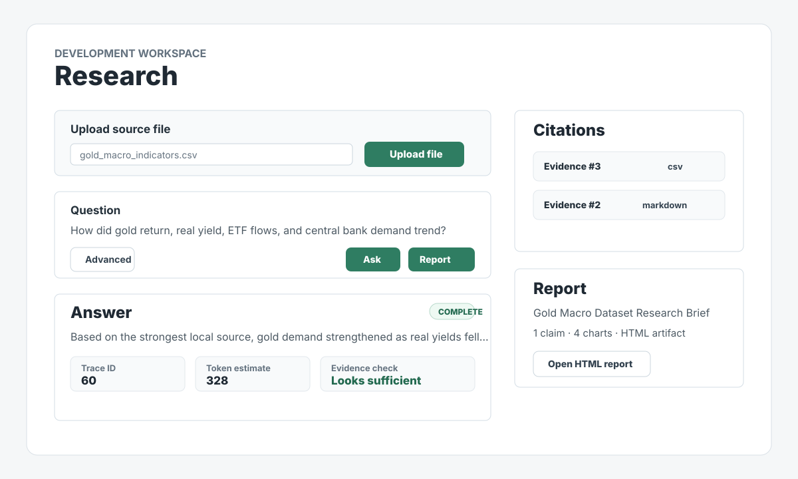
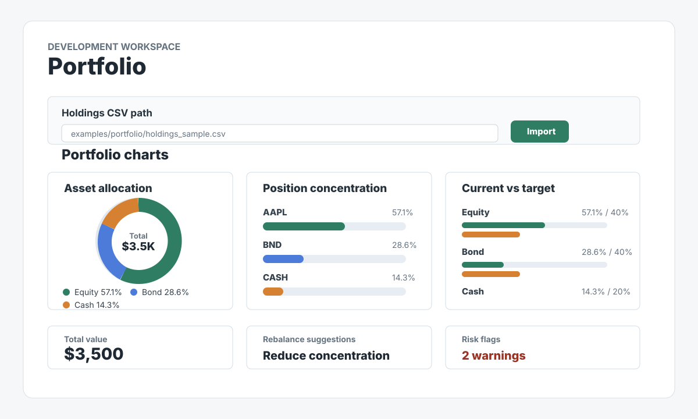

# Development and Operations

This document preserves the detailed provider, retrieval, report, service,
local-development, and demo guidance that was moved out of the public README.
For the shortest installation path, start with the
[Quick Start](../README.md#quick-start).

## V1 release target

With two hours per day, the first release was scoped to deliver:

```text
Local Markdown, text, simple text PDF, or research CSV files
-> quarantine and normalized source records
-> immutable evidence ledger
-> as-of-date lexical/vector retrieval
-> Research Agent
-> Evidence Critic
-> cited daily brief or skill-driven report
-> auto model selection, cost, quality, and trace artifacts
```

The first month intentionally did not promise a production brokerage
integration, autonomous trading, a full microservice platform, or four equally
mature agents.

After the local V1 demo, V2 can add Redis-backed background jobs, Kafka event
streams, cloud deployment, Kubernetes operations, OpenTelemetry/Grafana
observability, and optional self-hosted model serving. These are tracked in the
[V2 Roadmap](V2_ROADMAP.md).


Run the local V1 skeleton with Docker Compose:

```bash
cp .env.example .env
docker compose up --build
```

The default `.env.example` keeps cloud models disabled. To enable external
research, set `ARGUS_ENABLE_CLOUD_SERVICES=true` and add one or more of
`ARGUS_GEMINI_API_KEY`, `ARGUS_DEEPSEEK_API_KEY`, and `ARGUS_KIMI_API_KEY` only
in the ignored local `.env` file. Keys are never entered in the browser. The
Research page requires an explicit external model choice before any retrieved
excerpt is sent to that provider.

`.env` is a hidden file in the project root, beside `compose.yaml`. Docker
Compose reads `.env`; `.env.example` is only a safe, committed template and is
not loaded automatically. If `.env` already exists, do not run `cp` again
because that would risk replacing local settings. The leading dot is a Unix
convention that keeps configuration files out of normal directory listings; it
is not encryption. In Finder press `Command + Shift + .` to show hidden files,
or show and edit it from Terminal with:

```bash
cd /path/to/argus
ls -la .env
nano .env
```

For the exact rules on when a browser refresh is sufficient, when a container must be
recreated, how to switch or roll back the ETF selection engine, and how to verify the
effective setting, follow the bilingual
[Local Operations Runbook](LOCAL_RUNBOOK.md).

Shared model request behavior is configured once. Each provider then has its
own model name and API key. Keep the supplied model names unless the provider
documents a replacement:

```dotenv
ARGUS_ENABLE_CLOUD_SERVICES=true
ARGUS_MODEL_TIMEOUT_MS=20000
ARGUS_MODEL_MAX_ATTEMPTS=3
ARGUS_MARKET_ANALYSIS_TIMEOUT_MS=60000
ARGUS_MARKET_ANALYSIS_MAX_ATTEMPTS=1
ARGUS_MARKET_ANALYSIS_TRACE_RETENTION_COUNT=50
ARGUS_MARKET_ANALYSIS_TRACE_RETENTION_DAYS=30
ARGUS_ETF_SELECTION_ENGINE=deterministic
ARGUS_MODEL_RETRY_BACKOFF_MS=100

ARGUS_GEMINI_MODEL=gemini-3.1-flash-lite
ARGUS_GEMINI_API_KEY=replace_with_your_gemini_key

ARGUS_DEEPSEEK_MODEL=deepseek-v4-flash
ARGUS_DEEPSEEK_API_KEY=replace_with_your_deepseek_key

ARGUS_KIMI_MODEL=kimi-k2.6
ARGUS_KIMI_API_KEY=replace_with_your_kimi_key
```

After changing `.env`, recreate the backend container so Docker copies the new
environment into it, then verify which models are available. The base
`compose.yaml` has no separate `worker` service, so do not append `worker` to
this command:

```bash
docker compose up -d --force-recreate backend
curl http://localhost:8000/chat/models
```

Never paste a real key into chat, a screenshot, Git, or a frontend `VITE_*`
variable. Gemini offers model-dependent Free Tier usage. DeepSeek and Kimi APIs
are balance-priced services; an account may have temporary granted/promotional
credit, but Argus must not assume a free API entitlement. Confirm balance before
testing. Current list prices and balance behavior are documented by
[Gemini](https://ai.google.dev/gemini-api/docs/pricing),
[DeepSeek](https://api-docs.deepseek.com/quick_start/pricing/), and
[Kimi K2.6](https://platform.kimi.ai/docs/pricing/chat-k26).

When Gemini is selected for a public indexed question, retrieval uses
`gemini-embedding-001` with 768-dimensional vectors and
`RETRIEVAL_DOCUMENT`/`RETRIEVAL_QUERY` task types. Chunk embeddings are cached
in PostgreSQL and searched through pgvector/HNSW; they are not regenerated for
every question. Every indexed run now uses exact/alias matching and PostgreSQL
full-text search backed by a GIN index. Eligible semantic rankings are fused
with exact and full-text ranks through weighted Reciprocal Rank Fusion, followed
by deduplication and neighboring-chunk context. Local, DeepSeek, and Kimi
research use exact + full-text retrieval, so selecting those providers does not
silently consume Gemini embedding quota; the 16-dimensional local hash adapter
is retained for integration tests and is not treated as real semantic search.

A deterministic complexity policy labels Fast, Standard, or Deep as visible
eligibility/budget levels; it no longer decides that evidence is sufficient.
Each run starts with one cheap Hybrid Retrieval. A single deterministic Evidence
Gate then either accepts direct complete support, names one material gap, or
refuses. Standard/Deep may execute at most one query targeted to that named gap,
so every indexed run has a hard ceiling of one or two searches. The same accepted
evidence IDs control model input, citations, answer metadata, and report
eligibility. The response/run trace shows the score, Gate decision, gap, actual
queries, limits, and stop reason. Migration `20260716_0012` stores a
normalized query-to-evidence Ledger and compact tool traces rather than copying
passage bodies into every run.

Provider quota exhaustion returns a controlled 429 and never enables paid
billing automatically. Gemini request-per-day quota resets at midnight Pacific
Time; short-window request/token limits commonly clear within minutes. Argus
shows provider-specific token cost estimates only for cloud calls. Local calls
have no provider token bill, so the Research answer does not present their
internal text-unit counters as paid API tokens.

Research exposes three explicit evidence scopes. `indexed` uses only uploaded
documents and retains excerpt-level critic validation. `web` works without an
upload; independent Exa retrieval supplies direct-URL evidence to the explicitly
selected Gemini, DeepSeek, or Kimi answer model. `hybrid` combines both while
displaying indexed excerpts and public URLs as different assurance classes.
The Research UI has no default answer model and never silently switches providers.
Selecting an external model in `indexed` mode still does not bypass local retrieval:
insufficient evidence returns `cloud_skipped_no_evidence` and does not call the
provider.

Choosing a Research evidence file or expert method add-on now starts its upload
immediately. A filename beside the control is only transient selection/progress;
the right-side **Uploaded research items** library is authoritative. Evidence and
method add-ons share this list but keep distinct type badges and selection state.
An inactive item is ignored by the relevant part of the next Ask but remains in
the local database; its trash button requires confirmation before permanent
deletion. Confirmed deletion also removes historical Runs, Reports, Claims,
Evidence Ledger rows, and model/tool-call traces that used that item. PDFs must contain an
extractable text layer. Scanned/image-only PDFs return an OCR-required message
and the failed managed upload is removed. Web-only mode ignores files in that
right-side list; select `indexed` or `hybrid` when uploaded evidence must be used.

Research uses an explicit AND composition: one base Investment Method Pack plus an
optional expert method add-on. Built-in strategic-index, value, quality-growth,
income-quality, and macro/risk-balanced base frameworks are available, and Profile
stores the starting default. The expert add-on accepts Markdown, TXT, Word DOC/DOCX,
text-based PDF, or research CSV from either Research or Profile. Argus compiles at
most twelve safe checklist items, filters
code/prompt-control lines, stores no raw method text in the evidence index, and may
derive up to four optional retrieval hints without raising the one/two-search budget.
Profile stores the base style AND optional expert document. The base style controls
bounded allocation policy; the expert document shapes research lenses and explanation
order but cannot change trade math or become evidence. The data-only JSON/fenced-
Markdown API remains available for developers creating new base styles. See
[Research Evidence Scope and Method Pack Architecture](RESEARCH_AND_STYLE_PACK_ARCHITECTURE.md),
[Research Report Quality Gates](REPORT_QUALITY_GATES.md),
the [JSON example](../examples/style-packs/value-aware-example.json), and the
[supply-chain Method Pack example](../examples/style-packs/supply-chain-method-pack.md).

The Research search scope and answer model are visible above the question.
`web` can be selected with zero uploaded documents; choosing it makes the next
Ask an explicit Exa search followed by the selected answer model only after the
Evidence Gate passes. `indexed` never performs internet search. `hybrid` combines
indexed retrieval with Exa evidence. The optional historical cutoff is named and
visible beside Ask; the former generic Advanced drawer has been removed.

Argus does not depend on Gemini or Kimi built-in search. Exa retrieves bounded
direct-URL excerpts, the Evidence Gate decides whether they are sufficient, and
the explicitly selected Gemini, DeepSeek, or Kimi model only synthesizes accepted
evidence. Failed external calls retain their reported token and estimated-cost
audit data; an error response is not evidence that the provider charged `$0`.

Answer quality and report quality are intentionally different. A short cited
extract may remain visible as an Answer, while HTML generation additionally
requires a complete, substantive answer, accepted citations, and a passing
critic check. Structured CSV evidence is allowed through the same gate because
its report carries deterministic chart data; it is not the only report-capable
format. Markdown, TXT, and text-based PDF can also generate a report when they
contain complete passages that directly answer the question. The UI ships both
`gold_macro_indicators.csv` and `gold_real_yields.md` known-good walkthroughs.
Provider-grounded web answers use
consistent headings and bullets so the page is readable without trusting model
HTML. Existing one-paragraph answers are safely split into paragraphs.

The current report builder does not call the model again. It deterministically
maps the saved Ask answer and citations into HTML. Report metrics therefore
separate the original `Source Ask` token/cost estimate from report-generation
usage (`0` provider tokens and `$0` additional model cost). An AI-expanded
report would be a future, separately authorized provider call.
Dangling chunk endings such as
`and.` are repaired from bounded neighbor context when possible and otherwise
rejected. Technical search, trace, and cost fields remain available in a
collapsed audit panel and the Runs page instead of dominating the result.

V1.1 tool execution is bounded by `ARGUS_TOOL_TIMEOUT_MS`,
`ARGUS_TOOL_MAX_ATTEMPTS`, and `ARGUS_TOOL_RETRY_BACKOFF_MS`. Only retryable
failures and timeouts are retried; the final attempt count and error code are
stored in the tool-call trace.

Model-provider requests use the shared `ARGUS_MODEL_TIMEOUT_MS`,
`ARGUS_MODEL_MAX_ATTEMPTS`, and `ARGUS_MODEL_RETRY_BACKOFF_MS` policy. Kimi has
one documented provider-specific exception, `ARGUS_KIMI_TIMEOUT_MS` (default
60 seconds), because grounded multi-source synthesis can exceed the shared
20-second window. A timed-out model request is not automatically retried because
the provider may already have processed and billed it. API keys, model identifiers,
base URLs, and token-price metadata remain provider-specific.
Grounded market search is the deliberate exception: it uses
`ARGUS_MARKET_ANALYSIS_TIMEOUT_MS` because search takes longer than ordinary
Research, and defaults to one attempt so a timed-out paid search is not replayed
automatically.

Portfolio market analysis writes a bounded structured decision trace for both
successful and failed attempts. Runs shows the evidence-snapshot ID, proposed ETF
symbols and modes, deterministic component scores and penalties,
validation/rejection codes, final candidates, token/cost data,
and provider/tool status. The Runs API and page are paginated. By default these
Portfolio traces keep the latest 50 entries for no longer than 30 days. Argus does
not retain raw prompts, raw model responses, full web pages, account names, holding
dollar values, or API keys in this trace; PostgreSQL/SQLite remains the audit source
of truth and Redis is not required.

Services:

- frontend: <http://localhost:5173>
- backend API: <http://localhost:8000>
- backend health check: <http://localhost:8000/health>
- PostgreSQL/pgvector: `localhost:5432`

`localhost:5173` and `127.0.0.1:5173` both address this Mac. The command above
starts the containers; it does not require a different URL. If the Compose or
manual Vite services are already running, open either loopback address directly.
These loopback URLs are not shareable links: if another person opens them, their
browser looks for Argus on their own computer. To test independently, that person
must clone and run Argus locally with their own configuration. Do not expose the
current local build through a public tunnel; it has no production authentication,
multi-user data isolation, or public TLS boundary.

Validate the Compose file without starting containers:

```bash
docker compose config
```

Run the V2 local infrastructure overlay (Redis, Kafka, worker, and the bounded
audit/metrics consumer):

```bash
docker compose -f compose.yaml -f compose.v2.yaml up -d --build \
  postgres redis kafka backend worker event-consumer frontend
```

Kafka currently has one intentionally narrow Research Run lifecycle path with two
explicit terminal event contracts:

```text
agent.run.completed.v1 -> ANSWER GENERATED or NO ANSWER · SAFE STOP
agent.run.failed.v1    -> provider timeout/authentication/quota/provider error
                       -> Kafka -> Audit/Metrics Consumer -> sanitized projection -> Runs
```

The consumer commits an offset only after processing or DLQ isolation, deduplicates
stable event IDs, retries bounded transient failures, and never stores raw prompts,
documents, holdings, web pages, provider error text, or API keys. PostgreSQL Runs
remains the source of truth. Validate both event types on the real local broker
without calling a paid model:

```bash
docker compose -f compose.yaml -f compose.v2.yaml exec -T backend \
  python /app/scripts/kafka_local_acceptance.py \
  --bootstrap kafka:9092 --api-base http://localhost:8000
```

Then open **Runs Management → Event pipeline**. The panel is a lightweight
operational view of consumer health, processed events, duplicates, DLQ records,
and a bounded recent event set. It shows 10 rows per page with the same Previous/Next range
control as Recent Runs and can sort the loaded rows by event type or processing time; it is not a
general Kafka admin UI.

Run backend tests locally:

```bash
python3 -m venv .venv
source .venv/bin/activate
pip install -e ".[dev]"
pytest
```

Run the local V1 eval suite:

```bash
ARGUS_DATABASE_URL=sqlite:////path/to/argus/local_argus.db \
  argus-eval
```

The eval suite reads `evals/golden_questions.yaml` and writes JSON/Markdown
artifacts under `eval-results/`.

Install backend storage dependencies when working on database, migrations, RAG,
or repository code:

```bash
pip install -e ".[dev,storage]"
```

The Compose environment sets these integration flags to `false`:

```bash
ARGUS_ENABLE_CLOUD_SERVICES=false
ARGUS_ENABLE_GMAIL=false
ARGUS_ENABLE_EXTERNAL_MARKET_DATA=false
ARGUS_ENABLE_ROBINHOOD=false
ARGUS_MARKET_DATA_PROVIDER=01
```

## Local Demo Without Docker

For the current local slice, you can run FastAPI with SQLite and Vite:

```bash
source .venv/bin/activate
ARGUS_DATABASE_URL=sqlite:////path/to/argus/local_argus.db \
  python -c "from investment_agent.config import get_settings; from investment_agent.storage import Base, make_engine; Base.metadata.create_all(make_engine(get_settings()))"
ARGUS_DATABASE_URL=sqlite:////path/to/argus/local_argus.db \
  uvicorn investment_agent.app:app --host 127.0.0.1 --port 8000
```

In another terminal:

```bash
npm install --prefix frontend
npm run dev --prefix frontend -- --host 127.0.0.1 --port 5173
```

Open <http://127.0.0.1:5173/>. Demo research files are available at
`examples/research/gold_real_yields.md` and
`examples/research/gold_macro_indicators.csv`; the CSV includes annual numeric
indicators so generated HTML reports can render trend lines and time-series bar
charts.

### Demo Flow

Use this path for a clean V1 walkthrough:

1. Open the Research page.
2. Add or upload both demo research files:
   - `examples/research/gold_real_yields.md`
   - `examples/research/gold_macro_indicators.csv`
3. Ask:

   ```text
   How did gold return real yield ETF flows and central bank demand trend?
   ```

4. Click **Generate report** and open the HTML report. The report should include
   a `Data Analysis` section with source-backed trend and bar charts.
5. Open **Invest Suggestions**, use the portfolio file picker, and import:

   ```text
   examples/portfolio/holdings_sample.csv
   ```

   Browser upload accepts CSV, XLSX, and legacy XLS files up to 10 MB. For
   Excel workbooks, the first worksheet must use the documented holdings
   columns. Choose the portfolio as-of date in the page; an optional
   `as_of_date` spreadsheet column must contain the same date on every row.
   Do not paste a Mac filesystem path into the page; the browser sends the
   selected file contents to the API.

6. Open the Profile page, save a risk profile, target allocation, drift
   threshold, monthly contribution, and whole/fractional-share preference.
   `Investment horizon` means the future time until the money is expected to
   be used, not the number of years already invested. `Investing experience`
   records the years already invested and is used to simplify implementation
   guidance; it does not automatically increase risk capacity. The saved policy
   remains visible in a right-hand summary while the form is edited. **Clear & restore
   defaults** deactivates the saved personal policy and restores the unsaved
   example form; the right panel immediately shows that no saved policy is active.
   Review and save the defaults before treating them as active. Retirement uses
   a conservative planning-through age of 100, not a cash-buffer-month target.
   Return to **Invest Suggestions** to see target trade amounts, estimated shares,
   missing exposure candidates, and a contribution-first DCA plan. Open
   **Money Planning** for the detailed short-term cash and retirement schedules;
   Invest Suggestions keeps only their compact decision constraint summary.
7. Open **Runs Management** to inspect three deliberately separate cost scopes:
   **Retained Run usage** for the Runs still available for debugging,
   **Historical API usage** from the deletion-independent usage ledger, and
   **Provider actual billing** imported from an official dashboard/export.
   A separate **Provider balances** section shows current remaining funds and API
   availability independently from spend. Its on-demand refresh uses the configured
   official DeepSeek/Kimi balance APIs; it does not replace official historical billing,
   usage exports, or a full subscription-tier record.
   Per-model input/output token totals and call-time price snapshots use:

   ```text
   estimated cost = input tokens * input price / 1M
                  + output tokens * output price / 1M
   ```

A committed sample report artifact is available at
`examples/reports/gold_macro_dataset_report.html`.

### Demo Previews





## Acceptance demo

1. Choose and upload one local research file, then repeat for additional files.
   The right-hand source panel lists the persistent local index, can search all
   sources or one source, and can delete an indexed source plus its managed raw
   upload without deleting an explicitly indexed user-owned local file.
2. Detect an embedded prompt-injection instruction.
3. Ask a historical question and prove no future evidence leaked in.
4. Generate a cited report with source-backed data-analysis charts when numeric
   evidence exists.
5. Have the Evidence Critic downgrade a weak conclusion.
6. Show deterministic concentration and drift calculations.
7. Show auto model selection, quality, cost, and run-trace artifacts.

## References

- [Learn Claude Code](https://learn.shareai.run/en/)
- [PCI Security Standards Council Document Library](https://www.pcisecuritystandards.org/document_library/)
- [Serenity Investment Research Skill](https://github.com/dantewoo/serenity-investment-research-skill)
- [Hermes Agent](https://github.com/NousResearch/hermes-agent)
