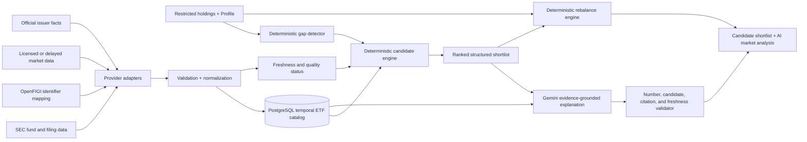

# ETF Candidate and Market Data Architecture

Status: Phase A deterministic evidence-backed ranking and audit are implemented.
The provider-neutral PortfolioSource, MarketDataSource, Heatmap contracts,
source-aware snapshots, and uploaded-snapshot fallback are implemented. Robinhood now has a
local OAuth MCP Sidecar, live capability-fingerprint gate, typed positions/quotes boundary, and
manual refresh UI. OHLCV remains disabled pending live Schema approval. Independent
Twelve Data, Alpha Vantage, and Massive transports, the temporal catalog, and licensed
fund metadata remain planned.

## First Adapter Contract

External configuration uses stable numeric codes only at the environment boundary:

| Code | Semantic key | Phase-one behavior |
|---|---|---|
| `01` | `robinhood` | Read-only MCP adapter when an authenticated client is injected |
| `02` | `twelve_data` | Reserved independent REST adapter |
| `03` | `alpha_vantage` | Reserved low-cost/end-of-day REST adapter |
| `04` | `massive` | Reserved future professional adapter |

Internally Argus uses semantic keys and a common `MarketDataBatch`; business logic does
not branch on vendor-specific payload shapes. `ARGUS_ENABLE_EXTERNAL_MARKET_DATA=false`
is the master privacy/cost switch. `ARGUS_ENABLE_ROBINHOOD=false` separately blocks the
broker integration. A provider mismatch, missing connection, or request error returns an
explicit status and uploaded-snapshot fallback; it never calls another paid provider.

The first Heatmap protocol carries `symbol`, `group`, `latest_price`, `previous_close`,
`previous_close_date`, `percent_change`, `volume`, `dollar_volume`, `volume_z_score`, `observed_at`, freshness
status, exact-ETF holding status, and related-stock holdings. This makes rectangle color,
area, border intensity, and labels a presentation concern after data quality is proven.

This document defines how Argus should detect a missing portfolio exposure,
build an ETF candidate shortlist, add time-stamped market context, use Gemini
for explanation, and preserve deterministic trade calculations. It must not be
described as an implemented live-market feature until its exit criteria pass.

## Executive Decision

Argus should not build or buy a database where every ETF field is described as
real time. Different facts have different publication schedules:

- quotes, trades, and spreads may be real time or delayed;
- daily bars and average volume update after the market closes;
- expense ratios, AUM, benchmarks, and fund classifications change less often;
- fund holdings follow issuer and regulatory disclosure schedules;
- derived volatility, drawdown, correlation, and overlap metrics update when
  their underlying snapshots update.

The target design is therefore a **temporal ETF catalog plus snapshot store**:

```text
instrument identity
+ versioned fund metadata
+ dated holdings disclosures
+ dated quote and bar snapshots
+ derived portfolio-fit metrics
+ source URL, source timestamp, and ingestion timestamp for every fact
```

For the current personal-project scope, a curated U.S.-listed ETF universe with
on-demand quotes is more useful and much cheaper than continuous full-market
streaming.

## Product Boundary

The workflow separates four decisions:

1. **Exposure gap:** Does the saved Profile target exceed the current
   asset-class weight?
2. **Candidate eligibility:** Which instruments actually represent that
   exposure and pass minimum data-quality, liquidity, cost, and diversification
   rules?
3. **Candidate explanation:** What do the latest sourced facts imply, including
   risks and counter-evidence?
4. **Trade calculation:** Given the user-controlled target, what dollar amount,
   share estimate, projected weight, and limitation should be displayed?

Only step 3 requires the explicitly selected Gemini, DeepSeek, or Kimi model. Steps 1,
2, and 4 remain deterministic.

Without a saved target, Argus may flag an exposure for review but must not
invent a personal target or a trade amount.

## High-Level Data Flow



The Gemini response may explain or compare only the candidate IDs and facts in
the structured shortlist. It cannot add a ticker, change a target, or replace a
calculated dollar/share amount.

## Data Sources and Their Jobs

No single free source covers identity, regulatory holdings, issuer facts, and
complete real-time prices. Use adapters so a provider can be replaced without
changing portfolio logic.

| Need | Preferred source type | Argus use | Important limit |
|---|---|---|---|
| Registered-fund universe and SEC identifiers | SEC Investment Company Series and Class data | Seed and reconcile active registered funds | Regulatory identity is not a quote feed |
| Reported fund holdings | SEC Form N-PORT datasets | Dated holdings, concentration, asset-type and issuer analysis | Disclosure is not equivalent to a current intraday portfolio |
| Filing history | `data.sec.gov` submissions | Track source filings and revisions | Company APIs do not replace ETF quote or issuer metadata feeds |
| Cross-provider identifier mapping | OpenFIGI v3 | Map ticker/exchange/CUSIP-like inputs to a stable FIGI where available | Mapping is not market or fund-fundamental data |
| Quote, trade, spread, volume, and bars | A licensed or explicitly delayed U.S. equity/ETF market-data API | Snapshot price, share estimate, liquidity and volatility inputs | Feed coverage, delay, redistribution rights, and rate limits depend on plan |
| Expense ratio, benchmark, AUM, distributions, and official description | Licensed fund metadata or curated official issuer source | Cost and role screening with provenance | Do not rely on fragile, unlicensed bulk scraping |
| Macro context | Versioned public or licensed macro sources | Optional market-regime evidence for Gemini | Must not silently rewrite the Profile policy target |

Official references evaluated for this design:

- [SEC Data Library](https://www.sec.gov/data-research/sec-markets-data)
  includes Investment Company Series/Class information and Form N-PORT data.
- [SEC EDGAR APIs](https://www.sec.gov/search-filings/edgar-application-programming-interfaces)
  require no API key for public submissions/XBRL data and publish a nightly bulk
  archive, but they are filing APIs rather than an ETF quote service.
- [OpenFIGI v3](https://www.openfigi.com/api/documentation) provides identifier
  mapping with explicit request and rate limits.
- [Alpaca snapshot API](https://docs.alpaca.markets/us/reference/stocksnapshotsingle)
  is one possible quote-adapter implementation and returns latest trade, quote,
  minute/day bars, and the prior daily bar for a symbol.
- [Alpaca market-data coverage](https://docs.alpaca.markets/us/docs/about-market-data-api)
  illustrates the licensing trade-off: at the design date, its free individual
  tier covers U.S. stocks/ETFs with limited IEX real-time coverage, while full
  U.S.-exchange SIP coverage is a paid tier. Pricing and rights must be checked
  again before implementation or purchase.

Argus is not committed to Alpaca. The provider is an example behind an
interface, not a hard-coded dependency.

## Freshness Contract

Every stored fact carries:

```text
source_name
source_url or source_record_id
effective_at       # when the fact applies in the market/fund world
published_at       # when the source published it, when available
observed_at        # when Argus retrieved it
expires_at         # when Argus considers it stale for this use
provider_payload_hash
quality_status
```

Recommended default refresh policy for the first implementation:

| Data class | Refresh | UI behavior when stale |
|---|---|---|
| Candidate quote | On demand when Portfolio opens; short cache | Do not calculate new-candidate shares after the configured quote TTL |
| Daily OHLCV | Nightly after market close | Show last completed session and date |
| Average volume, volatility, drawdown, correlation | Nightly from dated bars | Keep calculation window and last bar date |
| Fund metadata | Daily or weekly, depending on source | Display last verified date; exclude missing critical fields from automatic ranking |
| Fund holdings | When a new issuer/regulatory disclosure is observed | Label the holdings date; never call it intraday/current holdings |
| Instrument identity and active status | Daily reconciliation | Quarantine ticker collisions, delistings, and identifier changes |
| Macro series | Source-specific daily/monthly schedule | Label observation date and publication date |

The UI should use `live`, `delayed`, `end_of_day`, `regulatory_snapshot`, and
`stale` labels instead of a single misleading “real-time database” label.

## Minimal Data Model

### `instruments`

Stable identity and current listing state:

```text
id, symbol, exchange, figi, sec_series_id, sec_class_id,
name, instrument_type, currency, issuer, active,
first_seen_at, last_seen_at
```

Do not use ticker alone as the permanent primary key because symbols can change
or collide across listings.

### `fund_metadata_snapshots`

```text
instrument_id, effective_at, observed_at,
asset_class, sub_asset_class, benchmark, strategy,
expense_ratio, aum_usd, inception_date,
distribution_policy, source_id, quality_status
```

### `quote_snapshots`

```text
instrument_id, effective_at, observed_at, feed,
last_trade, bid, ask, midpoint, spread_bps,
day_volume, currency, source_id, quality_status
```

### `daily_bars`

```text
instrument_id, trading_date, adjusted_open, adjusted_high,
adjusted_low, adjusted_close, adjusted_volume,
corporate_action_version, source_id
```

### `fund_holding_snapshots`

```text
fund_instrument_id, holding_date, component_identifier,
component_name, asset_type, country, sector,
weight, market_value, source_id
```

### `derived_metric_snapshots`

```text
instrument_id, as_of_date, window,
average_dollar_volume, median_spread_bps,
volatility, max_drawdown, tracking_difference,
top_10_weight, holdings_count, data_completeness,
method_version
```

### `candidate_runs` and `candidate_results`

Persist why an instrument was included or excluded:

```text
candidate_run:
  id, portfolio_snapshot_id, profile_id, gap_asset_class,
  market_data_cutoff, policy_version, created_at

candidate_result:
  run_id, instrument_id, eligible, rank, score,
  component_scores_json, exclusion_reasons_json,
  source_snapshot_ids_json
```

This audit trail is necessary to reproduce an old recommendation after prices,
fund metadata, or the candidate policy changes.

## ETF Candidate Selection Framework

### 1. Determine the exposure, not the ticker

Candidate selection starts from a normalized portfolio role such as:

- broad U.S. equity core;
- international developed/emerging equity;
- investment-grade bond core;
- short-duration Treasury/cash-equivalent review;
- commodity/gold sleeve;
- a separately defined alternative sleeve.

The role comes from the Profile gap and portfolio design. A recent price move
must not create a new personal policy target.

### 2. Build the eligible universe

Apply hard rules before scoring:

- active, supported U.S. listing and supported currency;
- instrument is an ETF/fund type accepted by the provider mapping;
- normalized exposure matches the requested portfolio role;
- required identity and source lineage are present;
- quote/bar/fund facts meet freshness requirements;
- no leveraged, inverse, single-stock, or other special structure unless the
  user explicitly enables that category;
- enough history exists for the metrics being claimed, or the candidate is
  placed in a clearly labeled new-fund review bucket.

Liquidity, AUM, spread, expense-ratio, and history thresholds should be
versioned configuration by asset class. They are engineering defaults to
benchmark, not universal investment rules.

### 3. Score eligible candidates deterministically

An initial transparent score can be:

```text
candidate score =
    30% portfolio-role fit
  + 20% diversification improvement
  + 20% liquidity quality
  + 15% cost quality
  + 10% tracking/history quality
  +  5% data completeness
  - explicit structure and concentration penalties
```

The current Phase A implementation uses a versioned additive score rather than these
future catalog weights: Profile/holdings fit, timestamped market signal, and evidence
quality are positive components; overlap, concentration, fee, and liquidity are explicit
penalties. Candidates below the minimum score are excluded, peers sharing an exposure
require ticker/name-specific comparable evidence, and ties use ticker order. Fee and
liquidity facts come only from the current accepted evidence; missing values receive a
visible penalty. The percentage policy above remains the target once typed temporal
fund and market snapshots exist.

Example components:

- **portfolio-role fit:** exposure classification matches the target sleeve;
- **diversification improvement:** overlap and correlation with current
  holdings are lower, subject to the intended role;
- **liquidity quality:** dollar volume and spread are better within the peer
  group;
- **cost quality:** expense ratio is competitive among comparable strategies;
- **tracking/history quality:** sufficient history and reasonable tracking
  difference where available;
- **data completeness:** critical inputs are sourced, dated, and not stale.

Do not compare fundamentally different strategies only because their asset
class labels match.

### 4. Deduplicate near-identical funds

Group funds by benchmark, strategy, and holdings overlap. Return a small
shortlist rather than five near-identical S&P 500 ETFs. Within a peer group,
show the trade-offs that actually differ: cost, liquidity, tax structure,
tracking, issuer, and concentration.

### 5. Keep individual stocks separate

A single stock is generally not a substitute for a missing broad asset-class
sleeve. Argus should rank broad ETFs as core candidates first. A stock may be a
satellite research candidate only after separate fundamental research,
valuation, correlation, position-size limits, and cited counter-evidence.

## Gemini Contract

Gemini receives a closed structured package:

```json
{
  "portfolio_gap": {
    "asset_class": "International Equity",
    "current_weight": 0.04,
    "saved_target_weight": 0.15,
    "gap_amount": 5000.0
  },
  "market_data_cutoff": "ISO-8601 timestamp",
  "allowed_candidates": [
    {
      "candidate_id": "internal immutable id",
      "symbol": "example only",
      "facts": {},
      "source_ids": []
    }
  ],
  "deterministic_scenarios": [],
  "required_sections": [
    "market context",
    "why each candidate may fit",
    "risks",
    "counter-evidence",
    "what would change the conclusion"
  ]
}
```

Gemini may:

- explain the supplied facts;
- compare allowed candidates;
- describe risks, counter-evidence, and uncertainty;
- explain how market conditions could affect implementation timing.

Gemini may not:

- add an instrument outside `allowed_candidates`;
- change the saved target, calculated amount, shares, or projected weight;
- present a stale or delayed quote as live;
- invent a number or citation;
- turn an example review line into a personal target.

The post-generation validator rejects the explanation if:

- a ticker is not in the shortlist;
- a material number cannot be matched to the input facts;
- a current-market statement lacks a source and timestamp;
- the response contradicts deterministic actions or limitations;
- required risk/counter-evidence sections are missing.

The UI should keep two visibly separate blocks:

```text
Rule-based reason / limits
AI market analysis — Exa evidence + selected model, sourced and time-stamped
```

## Provider Interfaces

Keep adapters narrow and testable:

```python
class InstrumentReferenceProvider:
    def list_active_funds(self, *, as_of_date): ...

class QuoteProvider:
    def get_snapshots(self, symbols, *, requested_at): ...

class FundMetadataProvider:
    def get_metadata(self, identifiers, *, as_of_date): ...

class FundHoldingsProvider:
    def get_latest_disclosures(self, identifiers, *, cutoff): ...

class MarketHistoryProvider:
    def get_daily_bars(self, symbols, *, start, end): ...
```

Each return type includes source, effective time, observed time, feed/delay,
payload hash, and quality status.

## Ingestion and Serving

### Batch path

1. Discover active instruments and identifier changes.
2. Normalize identifiers and quarantine ambiguous mappings.
3. Import new regulatory/issuer snapshots idempotently.
4. Import completed daily bars.
5. Recompute only metrics affected by changed source snapshots.
6. Publish freshness, coverage, and failure metrics.

### Request path

1. Load the saved Profile and portfolio snapshot.
2. Detect target gaps deterministically.
3. Query only the candidate universe for those gaps.
4. Refresh quotes on demand when the cache is stale.
5. Rank candidates and persist the candidate run.
6. Calculate amounts/shares from the selected dated quote snapshot.
7. Optionally call Gemini with the closed evidence package.
8. Validate and display rule output and AI analysis separately.

Redis can cache short-lived quotes and provider rate-limit state, but PostgreSQL
remains the source of reproducible snapshots. Kafka is unnecessary for the
first local implementation; a scheduled worker and idempotent jobs are enough.

## Reliability and Safety

Required controls:

- exponential backoff and bounded retries for `429`/transient provider errors;
- per-provider timeout and circuit breaker;
- idempotency by provider, source record, effective time, and payload hash;
- partial-batch quarantine instead of replacing good data with incomplete data;
- ticker-change and corporate-action handling;
- point-in-time snapshots to avoid survivorship bias in evaluation;
- stale-data rejection for share calculations;
- data-quality dashboard for coverage, age, conflicts, and provider failures;
- license review before caching or displaying vendor data to other users;
- no broker execution in this feature.

When market data is unavailable, Argus degrades to the current uploaded
snapshot mode and says why. It must never silently substitute Gemini memory for
missing market facts.

## Cost-Controlled Delivery Plan

### Phase A: curated proof of architecture

- Keep core allocation candidates separate from research-only satellites. The current
  catalog contains broad core examples, State Street and Vanguard peers for all eleven
  GICS sectors, all eighteen ETFs in State Street's current industry lineup, and SOXX as
  a second semiconductor comparison. This is a 41-fund controlled research universe,
  not a claim of every ETF or every one of the 74 GICS industries.
- Sector candidates are not eligible for automatic gap filling or DCA. A sector must
  first pass cited current research, counter-evidence review, and a bounded satellite
  position-size policy.
- Add stable identifiers and source lineage.
- Implement one delayed/free quote adapter behind `QuoteProvider`.
- Refresh only current holdings and shortlist candidates on demand.
- Add daily bars and deterministic liquidity/volatility metrics.
- The implemented first derived metric is completed-session Volume activity. Robinhood daily
  historicals use the live audited contract (`symbols`, `start_time`, optional `end_time`,
  `interval`, `bounds`, and `adjustment_type`). Argus excludes the incomplete current session and
  interpolated bars, then compares one completed observation with up to 60 earlier sessions using
  a robust log-MAD score. At least 20 reference sessions are required.
- Render an optional equal-size industry HeatmapMatrix behind
  `ARGUS_ENABLE_MARKET_HEATMAP`. Price movement uses muted red/green, volume activity uses border
  strength, and neutral badges carry exact-holding, related-stock, new-exposure, replacement, and
  existing-holding-review roles. Disabling the flag preserves the prior compact status UI without
  changing the API contract or decision calculations.
- Store snapshots in the existing PostgreSQL database.
- Run Portfolio market analysis through two bounded Exa facets. The second call excludes
  first-round domains when possible. Prefer two accepted domains; if only one survives,
  continue with a visible limited-source warning rather than claiming comprehensiveness
  or blocking all answer models. This improves breadth without turning the workflow into
  an open-ended multi-agent crawl.
- Run hard eligibility, Profile/holdings fit, timestamped market signal, evidence
  quality, and explicit overlap/concentration/fee/liquidity penalties before the model.
  Select at most three with a stable score/ticker sort. The selected model explains the
  closed list; malformed or mismatched model candidate JSON cannot change its symbols.
- For multi-issuer peers sharing the same exposure, the second bounded Exa query requests
  comparable-window total return, as-of date, expense ratio, assets/liquidity, and benchmark
  breadth. Deterministic peer eligibility requires ticker/name-specific evidence before
  choosing among funds with the same exposure; missing comparable evidence means neither
  an arbitrary peer choice nor a peer-performance claim.
- Mark exact ETF holdings separately from direct-stock sector exposure. A deterministic
  stock-to-exposure map may display expandable related stocks for overlap review, but it never
  rewrites those stocks as ownership of the corresponding ETF and never infers broad-index
  look-through without dated constituent data.
- Treat that holdings state as an admission rule, not only a warning. With no existing mapped
  exposure, the model may emit `new_exposure`. With related direct stocks, it may emit only
  `diversifying_replacement`, which must describe reducing/replacing the stocks and cannot be
  auto-DCA. With the exact ETF already held, it may emit only `existing_holding_review`, which
  means keep/reduce/resize rather than buy anew. The deterministic parser rejects mismatches.
- Maintain issuer URLs as controlled metadata with link kind, fallback guidance, and a last
  checked date. Follow redirects during catalog maintenance: a 200 response that ends at a
  generic home page is not a valid product profile. Use the verified issuer ETF directory and
  ticker-search guidance when a specific product page cannot be confirmed; do not invent slugs.
- Report Exa's unique returned results/domains separately from the sources/domains that
  survive Argus Evidence Gate validation. A one-domain warning describes accepted
  evidence quality; it is not an Exa one-site limit.

This phase does not require an always-on AWS environment or a paid full-market
stream.

### Phase B: broader U.S. ETF universe

- Seed and reconcile registered funds from SEC data.
- Add OpenFIGI v3 mapping and ambiguity handling.
- Add N-PORT/issuer holdings snapshots.
- Add configurable peer groups, eligibility rules, scoring, and deduplication.
- Add freshness and data-quality monitoring.
- Evaluate a licensed fund-metadata provider rather than bulk-scraping issuers.

### Phase C: production-grade market coverage

- Purchase appropriate consolidated real-time data only if product latency and
  user demand justify it.
- Confirm display, derived-data, storage, and redistribution rights.
- Add provider failover and sustained-load testing.
- Add multi-user entitlements, audit retention, and cost allocation.

Given the current project budget, Phase A is the recommended next step. Paying
for consolidated real-time coverage before the candidate engine and data
quality controls exist would add cost without proving better decisions.

## Suggested APIs

```text
GET  /market-data/status
GET  /instruments/{symbol}
POST /portfolio/candidate-runs
GET  /portfolio/candidate-runs/{id}
POST /portfolio/candidate-runs/{id}/ai-analysis
```

The candidate-run response should include:

- market-data cutoff and freshness labels;
- gap source: saved target or review-only;
- included and excluded candidates with reasons;
- deterministic component scores;
- source IDs and timestamps;
- AI analysis status and validation status;
- no trade amount when no personal policy target exists.

## Test Strategy

Unit tests:

- identifier normalization and ticker collisions;
- freshness and stale-quote rules;
- hard-filter exclusion reasons;
- score reproducibility and tie-breaking;
- holdings overlap and peer-group deduplication;
- no target means no trade amount;
- Gemini cannot add candidates or change numbers.

Integration tests:

- recorded provider fixtures for success, timeout, `429`, partial batch, and
  conflicting identifiers;
- point-in-time candidate run reproducibility;
- fallback to uploaded snapshot mode;
- candidate quote date carried into share calculation and UI.

Evaluation:

- compare shortlist stability across small data changes;
- inspect whether top candidates actually match the intended exposure;
- run sensitivity analysis on scoring weights and thresholds;
- measure stale-data rejection, coverage, latency, and provider cost;
- maintain a hand-reviewed golden set for common portfolio roles.

## Exit Criteria

The feature is implemented only when:

- at least one reference provider and one quote provider work through adapters;
- every candidate fact has source and temporal metadata;
- candidate selection is deterministic and reproducible;
- stale or partial data cannot produce an unlabeled trade estimate;
- the selected Gemini, DeepSeek, or Kimi explanation is constrained to allowed candidates and verified
  facts;
- rule output remains available if Gemini or market data is unavailable;
- tests cover provider failure, identifier ambiguity, selection, numeric
  integrity, and degraded mode;
- the UI clearly separates rule-based results from AI market analysis;
- licensing and expected monthly provider cost are documented.

## Unified ETF Universe projection

The first Heatmap release and the controlled candidate directory both rendered the same bounded
ETF universe, which duplicated 41 tiles and forced the user to reconcile status in two places. The
replacement does not merge market signals with recommendation semantics. It merges the data model
and exposes two explicit projections:

```text
controlled InvestmentCandidate
        + MarketMapTile
        + current validated watchlist role
        + active holdings relationship
                        |
                  EtfUniverseItem
                    /         \
        Market view             Research view
  price, 1D, volume       issuer, source, overlap, role
```

The source boundary is explicit: the configured `MarketDataSource` supplies only the Market-view
quote/volume projection. Research view is composed from Argus's controlled fund library, active
holdings mappings, and the current accepted evidence-backed watchlist. The provider label and
refresh control therefore render only in Market view.

The evidence-backed shortlist stays above the universe. Both full-universe views open the same
detail dialog, which keeps observable market data, holdings relationship, recommendation identity,
and official fund metadata in separate labeled sections. This avoids treating a green tile as a
BUY signal while eliminating duplicate navigation. `ARGUS_ENABLE_UNIFIED_ETF_UNIVERSE` controls
the rollout; false restores the prior independent Heatmap and candidate directory with no data
migration.

### Core-candidate quote overlay

The sector/industry universe is not the complete set of instruments used by policy rebalancing.
For example, an underweight Bond target can select BND even though BND is not a sector Heatmap tile.
Argus therefore forms one bounded quote request from:

```text
sector / industry ETF universe
        + unpriced approved Rebalance candidates
        + unpriced approved DCA candidates
```

The Heatmap still renders only the sector/industry universe. Separately, valid provider quotes are
converted into typed `CandidateQuote` values and supplied to `summarize_portfolio()`. Deterministic
Python then calculates shares, quote date, scenarios, and warnings. Existing position prices are
never overwritten by this overlay, invalid/missing quotes are ignored, and no generative model can
alter the calculation.
