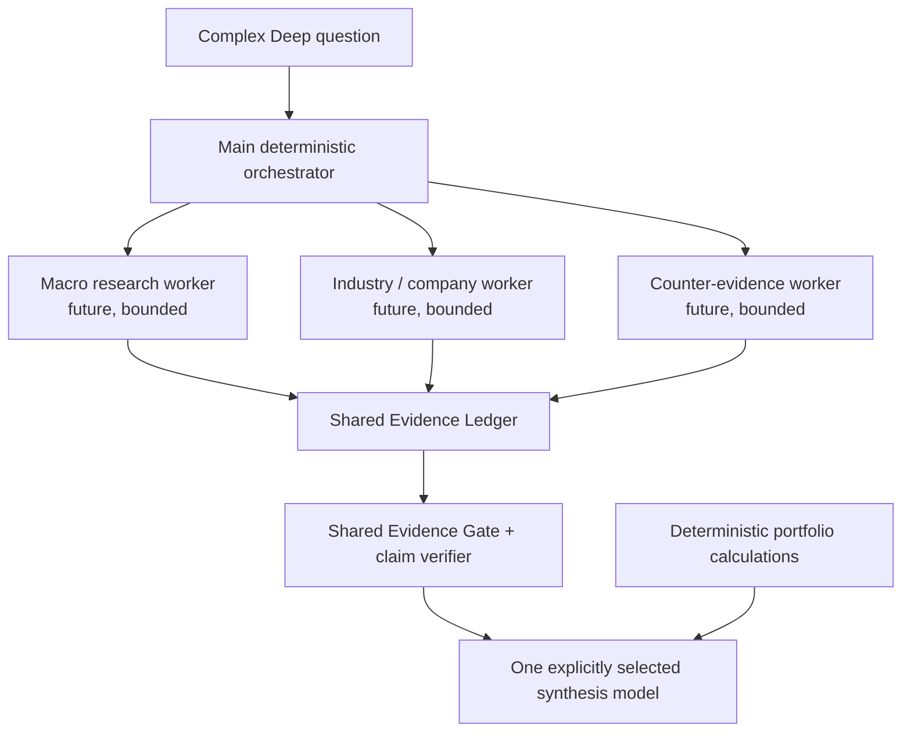
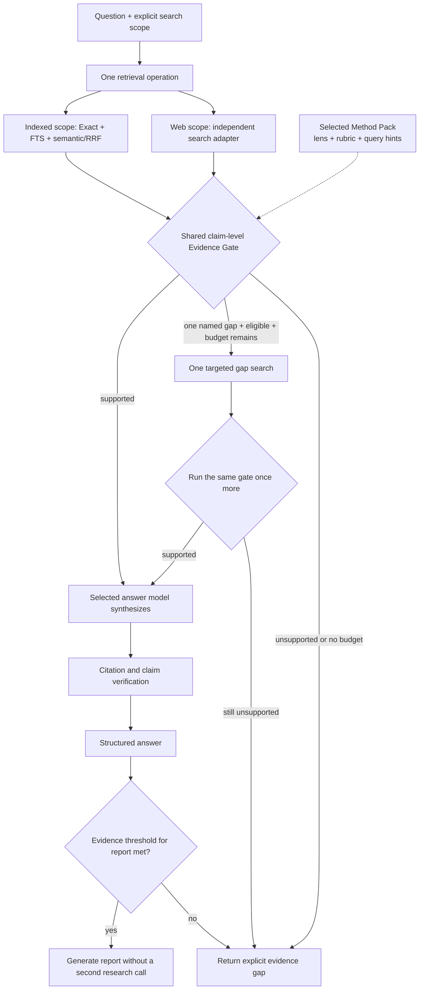
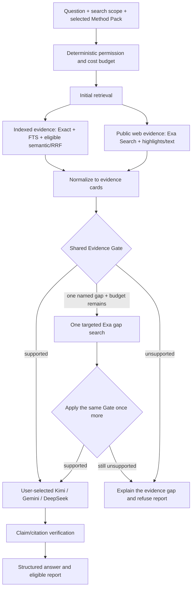
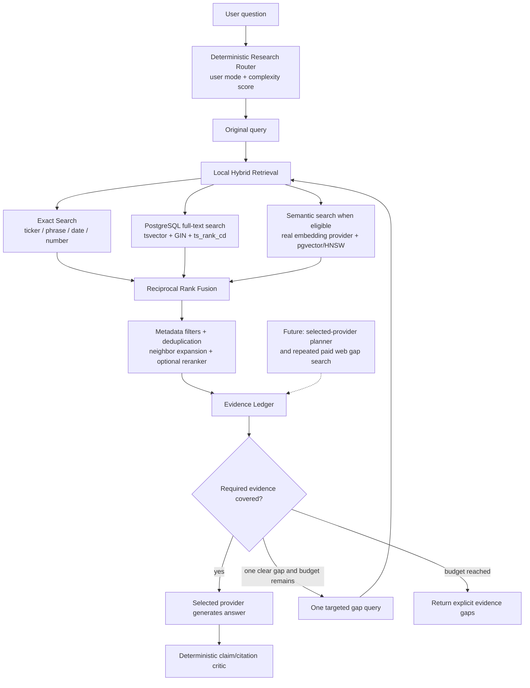
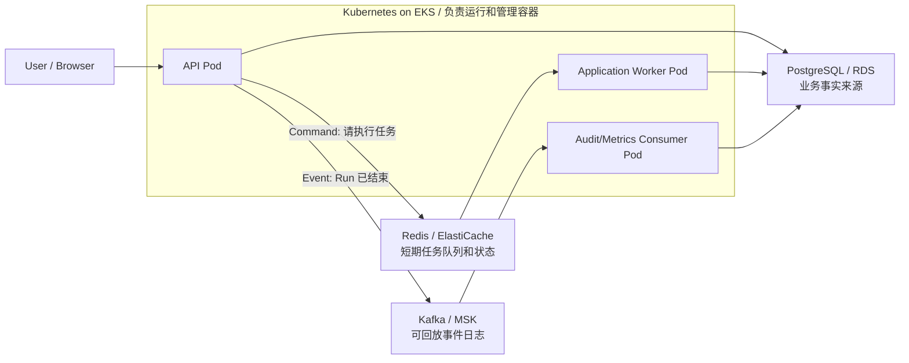

# Argus Interview Q&A

This file records interview questions and strong answers by date and feature.
Keep answers tied to implemented functionality. Do not claim future features as
complete.

本文档同时承担两个目的：

1. 英文内容用于面试时组织专业回答；
2. 中文讲解用于真正理解设计，而不是死记英文术语。

## How to read this bilingual guide / 如何阅读双语文档

- `Answer` 是可以在英文面试中直接使用或缩短的答案。
- `中文讲解` 解释这段回答到底是什么意思，以及为什么这样设计。
- `Implemented / 已实现` 表示代码、测试和运行结果已经存在。
- `Approved design / 已批准方案` 表示方向已经确定，但不能在面试中说成已经完成。
- `Future option / 未来选项` 表示只有评测证明值得，才会加入默认架构。
- 遇到术语时先查下面的双语表；后续章节不再重复粘贴同一段定义。

## Keyword memory map / 背诵关键词地图

背面试答案时，不需要逐字背。先记住下面这些 **关键词**，再用它们串成回答：
**业务目标是什么 → 系统怎么做 → 为什么这样设计 → 如何验证和控制风险**。

| Area | Keywords to remember / 建议背诵关键词 |
| --- | --- |
| Product / 产品 | **personalized investment support**、**research module**、**investment suggestions**、**cash goals**、**retirement planning** |
| Architecture / 架构 | **React/TypeScript**、**FastAPI**、**REST APIs**、**PostgreSQL/pgvector**、**Redis Worker**、**Kafka events** |
| AI & Evidence / AI 与证据 | **RAG**、**Embedding**、**Exa web search**、**Evidence Gate**、**claim/citation validation**、**explicit model selection** |
| Portfolio / 投资组合 | **deterministic portfolio logic**、**DCA**、**ETF candidates**、**Robinhood read-only MCP**、**market data**、**Heatmap** |
| Reliability / 可靠性 | **background jobs**、**event pipeline**、**Consumer heartbeat**、**deduplication**、**DLQ**、**migration checks** |
| Cloud & Cost / 云与成本 | **Docker**、**local Kubernetes**、**AWS EC2/ECR/IAM/SSM**、**Terraform**、**API Usage Ledger**、**provider billing** |

后续新增重要 Q&A 应优先采用以下格式：

```text
Question
Answer: concise interview-ready English
中文讲解：概念、原因、取舍和实现状态
Key terms / 关键词：链接到本术语表中的概念
```

## 2026-07-21: Separating investment suggestions from money planning / 将投资建议与现金养老规划分区

Status: **Phase 1 implemented in the frontend; Profile goal-input migration remains a later phase. / 前端第一阶段已实现；目标输入迁移仍属于后续阶段。**

### Q1: Why did you move cash-goal and retirement results out of the investment workspace?

Answer:

The original Portfolio page mixed two different jobs to be done. Holdings, rebalancing, DCA, ETF
selection, and market context answer, "What should I review or change in my investments?" Cash
goals and retirement funding answer, "What future liabilities must my income and assets fund?"
They use different time horizons, assumptions, and review cadences. Keeping every detailed output
on one long page weakened visual hierarchy and made the investment workflow harder to scan. I
therefore created a dedicated Money Planning workspace while retaining a compact planning summary
inside Investment Suggestions so the constraint is visible where investment decisions are made.

中文讲解：

原 Portfolio 页面混合了两个不同任务。持仓、调仓、定投、ETF 和市场分析解决“投资组合该
怎么调整”；短期现金目标和退休倒推解决“未来需要准备多少钱”。两类任务的时间跨度、假设和
查看频率都不同，全部堆在一个长页面会削弱重点。因此把详细规划移到 Money Planning，同时在
Investment Suggestions 保留简洁摘要，让用户做投资决定时仍能看到现金和退休约束。

Key terms / 关键词：`Jobs to be done（用户要完成的任务）`、`Information architecture（信息架构）`、
`Progressive disclosure（渐进披露，先摘要、需要时再看详情）`。

### Q2: Why use one Money Planning workspace instead of separate Cash and Retirement apps?

Answer:

Short-term cash and retirement are separate calculations, but they share the same household cash
flow, current savings, priorities, and contribution capacity. Two top-level modules would increase
navigation and duplicate context without improving the first release. Money Planning therefore has
two explicit sections: Short-term Cash Goals for emergencies and dated expenses, and Retirement
Funding for long-horizon accumulation and withdrawals. Their formulas and warnings remain separate;
only the workspace and shared inputs are unified.

中文讲解：

短期现金和退休不是同一个公式，但都会使用家庭收入、支出、现有储蓄和每月可投入能力。
如果拆成两个一级菜单，会增加导航和重复信息。一个 Money Planning 页面下保留两个明确模块，
既能统一家庭资金上下文，也不会把短期应急金与几十年的退休模型混算。

### Q3: How did you migrate the UI without duplicating financial calculations?

Answer:

Phase 1 changes presentation, not the financial engine. Both workspaces read the same
`PortfolioSummaryResponse`, so there is one source of truth for cash-plan and retirement numbers.
Investment Suggestions hides the detailed schedules and renders three compact planning metrics plus
a direct navigation action. Money Planning renders the existing detailed sections and links back to
Profile because Profile still owns the inputs. No formula, database schema, or API contract was
copied. A later phase can move goal-specific inputs from Profile after the new workspace is stable.

中文讲解：

第一阶段只改变页面归属，不复制计算逻辑。两个页面读取同一个 `PortfolioSummaryResponse`：
投资建议页显示摘要，Money Planning 显示原有详细计划，所有数字仍来自同一后端结果。Profile
输入暂时不动，并从 Money Planning 提供直接跳转。这样迁移风险小，也避免两个页面各算一遍
后出现数字不一致。

### Q4: Why is the primary navigation ordered this way?

Answer:

The navigation is now Research → Profile → Invest Suggestions → Money Planning → Runs Management.
It follows the product's common workflow: gather evidence, define the user context, review investment
actions, inspect the deeper household funding plan, and finally audit execution and cost. Navigation
order does not change data dependencies: Money Planning constraints still feed the investment
summary and DCA context. Runs Management remains last because it is an operational and audit tool,
not the primary user outcome.

中文讲解：

一级菜单依次是 Research、Profile、Invest Suggestions、Money Planning、Runs Management，
对应“找证据 → 定义个人情况 → 查看投资建议 → 深入检查现金与退休计划 → 审计运行和成本”。
菜单顺序只是用户路径，不代表计算顺序；规划约束仍会反馈到投资摘要和定投上下文。Runs 放在
最后，因为它服务于调试、审计和成本管理，而不是普通用户首先要完成的任务。

## 2026-07-20: Cost-audit incident — separating traces from durable usage / 成本审计事故：把可删除轨迹与永久用量分开

Status: **Implemented with migrations `20260720_0019` and `20260720_0020`. / 已通过数据库迁移 `20260720_0019` 与 `20260720_0020` 实现。**

### Q1: What serious cost-accounting defect did you find?

Answer:

I reconciled Argus with the provider dashboard and found that Argus showed only one retained
DeepSeek call with 8,113 tokens, while the provider showed 32 requests and 91,528 tokens for the
same API-key history. The original dashboard aggregated `model_calls`, but those rows belonged to
deletable Runs through a cascading foreign key. Clearing Evidence, expiring a Run, or enforcing the
portfolio retention limit could therefore erase the local cost history even though the provider had
already processed and billed the requests. This was a data-lifecycle modeling defect, not a token
formula error.

中文讲解：

这次问题是通过“本地页面与供应商后台对账”发现的：Argus 只剩 1 次 DeepSeek 调用和
8,113 Token，而供应商后台显示同一 API Key 历史已有 32 次请求、91,528 Token。旧设计把
调试轨迹 `model_calls` 同时当成累计用量账本；但它通过外键属于 Run，删除 Evidence、
清理 Run 或触发保留上限时会被级联删除。供应商已经发生的消费不会因此消失，所以本地
统计会越来越少。这不是公式乘错，而是把“生命周期不同的两类数据”放进了同一张表。

Key terms / 关键词：`Reconciliation（对账）`、`ON DELETE CASCADE（级联删除）`、
`Data lifecycle（数据生命周期）`。

### Q2: What is the corrected architecture?

Answer:

The corrected design has three deliberately different layers:

1. `Run / Model Call Trace` is execution-scoped debugging and audit data. It may be removed with
   its Run or by retention policy.
2. `API Usage Ledger` is an append-only local usage history with no foreign key to a Run. Each row
   stores provider, model, timestamp, input/output tokens, request count, call-time price snapshot,
   estimated cost, latency, status, and only snapshot IDs for correlation. Run deletion cannot
   cascade into it. Only external answer-model requests belong here. Local deterministic word-count
   approximations remain in the deletable debugging trace and are excluded from API Token totals.
3. `Provider Billing Snapshot` stores normalized totals imported from provider dashboards or
   exports. Provider billing remains the source of truth; Argus estimates are operational telemetry.

The Runs page exposes the same boundary as `Retained Run usage`, `Historical API usage`, and
`Provider actual billing`. It never adds different currencies together or presents an estimate as
an invoice. A fourth UI section, `Provider account status`, is deliberately outside the cost
totals: remaining cash, promotional credit, and Free Tier status describe capacity, not spend.

中文讲解：

正确设计按用途和保留周期拆成三层：

1. **Run / Model Call Trace（运行/模型调用轨迹）**：回答“这次为什么失败、用了哪个模型”，
   可以随 Run 删除；
2. **API Usage Ledger（API 用量账本）**：回答“Argus 历史上一共记录到多少外部模型请求、
   Token 和估算费用”，不设置到 Run 的外键，只保留用于关联的 ID 快照，删除 Run 不能级联
   删除；本地确定性算法的单词数估算只留在可删除的调试轨迹中，不进入 API Token 合计；
3. **Provider Billing Snapshot（供应商账单快照）**：保存从官方后台/导出文件录入的实际
   请求量、Token、币种和扣费。官方账单是最终准确来源。

页面还单独展示 **Provider Account Status（供应商账户状态）**，例如剩余现金、赠送额度和
Free Tier。它不是第四层“成本”：余额表示还能用多少，不表示已经花了多少，因此绝不能与
前三层费用相加。

一次模型调用在同一数据库事务中写入 Trace 和 Usage Ledger，避免出现“Run 成功但账本没写”
的半完成状态；二者使用不同外键和保留规则，所以以后删除 Trace 不会删除 Ledger。

```text
Provider call
    ├── Model Call Trace ── belongs to Run ── may be deleted
    └── API Usage Ledger ── no Run foreign key ── retained

Provider dashboard/export
    └── Provider Billing Snapshot ── actual bill / source of truth

Provider account/balance endpoint
    └── Provider Account Snapshot ── capacity/status, never spend
```

### Q2.1: Why does each provider need a different reconciliation adapter?

Answer:

Provider APIs expose different accounting facts, so a single generic "usage API" would create
false precision. DeepSeek provides an official Usage ZIP with request, token, model, currency, and
cost rows; Argus imports it with exact decimal precision, hashes it for idempotency, and discards
identity/API-key columns. Kimi exposes a tokenizer endpoint for preflight estimation and a balance
endpoint for available cash and vouchers, but those endpoints do not reconstruct historical actual
usage, so the account statement remains the billing source. Exa returns per-request `costDollars`
and separately documents a Team Management API for authoritative API-key usage/cost. That endpoint
requires a more privileged service API key and target key UUID and does not report remaining account
balance, so Argus does not mix it into the balance button. A durable external-tool call ledger and
the separately reviewed Exa admin adapter remain future work. Gemini Free Tier exposes telemetry but no
paid invoice, so Argus records the tier as account status instead of inventing a zero-dollar bill.

中文讲解：

四家供应商开放的数据含义不同，不能为了接口统一就把它们都叫“实际账单”。DeepSeek 官方
ZIP 同时包含请求、Token、模型、币种和扣费，适合直接导入；Argus 用文件哈希防止重复导入，
保留精确小数，并丢弃用户和 API Key 标识。Kimi 的 Tokenizer 只能在调用前估算 Token，
Balance API 只能说明还剩多少现金和赠送额度，都不能还原历史实际消费，因此实际扣费仍从
Account/Statement 读取。Exa 可从 Usage Dashboard 对账搜索次数和美元消费，单次响应里的
`costDollars` 可用于运行遥测，但跨 Run 永久保存工具成本仍是后续工作。Gemini Free Tier 有
请求/Token 遥测却没有付费发票，所以记录为账户状态，而不是伪造一张 `$0` 账单。

Exa Search 不返回模型式的 input/output Token，因此不能加进模型 Token 合计。它按搜索、内容
提取等价格项目返回数量和美元费用。官方 Team Management Usage API 可以查询指定 API Key
最近最多 180 天的历史用量与费用，但需要权限更高的 service key 和目标 API Key UUID。普通
Search API Key 无法调用该接口，所以接入前必须单独做凭据范围和密钥保管评审。

Key terms / 关键词：`Preflight estimate（调用前估算）`、`Idempotency（幂等，重复导入不重复记账）`、
`Balance（余额/剩余容量）`、`Actual billing（实际账单）`。

### Q2.2: Can provider tokens and bills be updated automatically in real time?

Answer:

Only the facts returned by an Argus-initiated API call can be captured near real time. Argus already
writes the response token counts, model, timestamp, status, and call-time price snapshot into the
deletion-independent API Usage Ledger. Provider billing is different: not every vendor exposes a
historical billing API, and a balance endpoint reports remaining capacity rather than incurred cost.
I therefore chose a hybrid reconciliation model instead of pretending every provider supports live
billing. DeepSeek actual usage is imported from its official ZIP; Kimi actual spend is reconciled
from its statement; Exa dashboard totals are reconciled separately from per-call search telemetry;
and Gemini Free Tier is recorded as account status until paid billing exists.

The implemented bounded automation uses official interfaces only: Runs Management can refresh the
configured DeepSeek and Kimi balances on demand. The adapter stores remaining cash/credit and
derives whether the account is currently available for API calls. It deliberately does not label
that response as historical billing or a full subscription status. Exa `costDollars` in a durable
Tool Usage Ledger, generic statement upload, and Google Cloud Billing Export for a future paid
Gemini project remain later work. Browser scraping of logged-in dashboards is intentionally
excluded because sessions, CAPTCHA, page structure, and account security make it fragile and unsafe.

中文讲解：

只有 Argus 自己发起并收到响应的调用，才能做到准实时记录。现在每次模型调用返回的 Token、
模型、时间、状态和当时单价都会自动写进不随 Run 删除的 API Usage Ledger，这部分用户不需要
手工操作。但“供应商实际账单”取决于供应商开放什么数据：余额接口只说明还剩多少钱，不能
说明已经花了多少；Token 预估接口也不能还原历史消费。因此采用混合对账：能自动记录的调用
立即记录，官方只提供导出或 Statement 的部分按周期导入，不用虚假的统一接口制造精确感。

当前**已经实现**：模型 Token 自动账本、DeepSeek ZIP 导入、实际账单快照、账户状态快照，以及
DeepSeek/Kimi 官方余额 API 的手动刷新按钮。该按钮能判断“当前余额是否足以继续 API 调用”，
但不能查询完整套餐等级或还原历史账单。当前**尚未实现**：后台定时余额轮询、Exa 永久 Tool
Usage Ledger、通用网页账单上传、Gemini 付费 Billing Export。运维步骤见
`docs/LOCAL_RUNBOOK.md` 第 8 节。

Key terms / 关键词：`Near real time（准实时）`、`Hybrid reconciliation（混合对账）`、
`Official interface（官方接口）`、`Dashboard scraping（后台网页抓取）`。

### Q2.3: Why not calculate actual spend from the change in account balance?

Answer:

`Previous balance - current balance` is not a reliable bill. Top-ups, promotional grants, refunds,
credit expiration, currency conversion, and delayed settlement can all change a balance without
matching model usage. Argus therefore stores balance snapshots outside all cost totals. Estimated
usage is calculated from response tokens and call-time prices, while actual spend comes only from
an official statement, export, dashboard total, or supported billing API. When the two disagree,
the provider amount remains authoritative and the discrepancy is investigated rather than silently
rewriting the append-only ledger.

中文讲解：

不能简单用“上次余额减本次余额”当账单，因为充值、赠送、退款、额度到期、汇率和延迟结算
都会改变余额。Argus 把余额快照放在费用统计之外：Token × 调用时单价是本地估算，官方
Statement/Export 才是实际消费。发生差异时保留两边记录并调查原因，不删除或篡改历史账本。

### Q3: Why save the price at call time instead of recalculating every old call with today's price?

Answer:

Provider prices and model names change. Repricing historical tokens with the current catalog would
silently rewrite history. Argus therefore snapshots the input and output price per million tokens
on each usage record and calculates:

```text
estimated cost
  = input tokens × recorded input price / 1,000,000
  + output tokens × recorded output price / 1,000,000
```

If an older backfilled trace has no price snapshot, the UI labels the displayed catalog rate as a
current reference rather than pretending it was the historical rate. The provider invoice may also
include cache discounts, free credits, retries, taxes, or rounding, so it remains authoritative.

中文讲解：模型价格会变化。如果每次打开页面都用今天的价格重算旧调用，历史数字会被悄悄
改写。现在每条新用量同时保存当时的输入价、输出价和估算成本；迁移时无法知道的旧单价保持
未知，不伪造。供应商还可能有缓存折扣、赠送额度、失败重试、税费和自己的取整规则，因此
Argus 的 Token 估算与官方扣费必须并列展示，不能混为一谈。

### Q4: Can the deleted historical usage be recovered automatically?

Answer:

No. Once the old cascading deletion removed a `model_calls` row, the local database no longer had
enough information to reconstruct its exact timestamp, model, input/output split, status, or price.
Migration `0019` backfills every Model Call that still exists, but it does not invent deleted rows.
Earlier history must be reconciled from DeepSeek, Kimi, or other provider exports and stored as
provider billing snapshots. If a provider export has request-level usage, a future importer may add
ledger rows with stable import keys; aggregate screenshots should remain aggregate billing
snapshots rather than being expanded into fictional calls.

中文讲解：已经被数据库删除的精确调用明细无法凭总数倒推回来。迁移只会把当时仍存在的
Model Call 补进新账本，不会编造时间、模型和输入/输出 Token。DeepSeek/Kimi 后台导出的
汇总数据可以补录为供应商账单快照；只有供应商提供逐请求明细时，才适合补成逐条 Ledger。
“不知道”比伪造审计数据更专业。

### Q5: What trade-offs and privacy controls did you make?

Answer:

The durable ledger stores small numeric metadata, not prompts, answers, full web pages, account
names, holdings values, or API keys. Storage growth is therefore small and predictable, and cost
queries use indexes on timestamp and provider/model. Pagination keeps the UI from loading the
whole history. The trade-off is that a usage row cannot reproduce answer content by itself; that is
intentional because reproducibility belongs to the shorter-lived Run trace and Evidence Ledger.
No separate audit agent is required for this invariant: database constraints, deterministic
aggregation, reconciliation, and deletion tests are more reliable and cheaper than asking a model
to judge whether accounting rows survived.

中文讲解：永久账本不能为了审计就永久保存 Prompt、网页全文、账户名称、持仓金额或 API
Key。它只保存小型数值元数据，并通过索引和分页控制查询成本。代价是单独一条用量不能还原
答案内容，但这是有意的：答案复现属于短期 Trace/Evidence；累计消费属于长期 Ledger。
这里也不需要额外“审计 Agent”，因为外键约束、确定性聚合、供应商对账和删除测试比模型判断
更稳定、更便宜。

### Q6: How did you prove the fix?

Answer:

The regression test creates a Run and a model call, deletes the Evidence and dependent Run, and
then checks two opposite but intentional outcomes: retained Run usage falls to zero, while
historical API usage still contains the original request and tokens. A second retention test creates
four portfolio Runs, prunes two, and verifies that retained usage reports two calls while the
historical ledger still reports four. API tests also keep provider actual billing separate from the
estimated ledger and reject an invalid reversed billing period. Migration 0020 tests additionally
import a real-format DeepSeek ZIP, verify exact-decimal totals and per-model breakdowns, prove the
same file is idempotent, confirm sensitive identity columns are not stored, and prove an account
balance never increases spend.

中文讲解：关键不是只测“新表能插入”，而是直接重现旧事故：先创建 Run 和模型调用，再删除
Evidence/Run。测试必须同时看到：`Retained Run usage = 0`，但
`Historical API usage = 原来的调用`。另一个测试让 4 个 Portfolio Run 只保留 2 个，确认
Trace 只剩 2 次、Ledger 仍是 4 次。0020 的新增测试还会导入真实格式的 DeepSeek ZIP，检查
精确费用和模型明细、重复导入不重复记账、用户/API Key 字段不落库，并验证余额绝不会增加
消费总额。这样验证的是数据生命周期不变量，而不是页面文案。

### 90-second interview answer / 90 秒面试回答

> I found a cost-accounting defect by reconciling Argus with the provider dashboard. Argus showed
> one retained DeepSeek call and 8,113 tokens, while the provider showed 32 requests and 91,528
> tokens. The token formula was not the problem. I had reused a Run-owned `model_calls` trace as the
> historical cost ledger, so cascading Run deletion erased local usage that the provider had already
> billed. I fixed it by separating three lifecycles: deletable Run traces, an append-only API Usage
> Ledger with no Run foreign key, and imported provider billing snapshots as the source of truth.
> New calls dual-write trace and usage in one transaction, and the usage row stores input/output
> tokens plus the call-time price snapshot without prompts, holdings, or keys. Migration 0019
> backfills surviving calls but explicitly does not invent already-deleted history. Regression tests
> delete Runs and prove retained usage falls while historical usage remains. This incident taught me
> that observability data and financial metering may describe the same request but require different
> retention and integrity rules.

中文面试版：

> 我通过把 Argus 和供应商后台对账，发现了一个成本审计缺陷：本地只显示 1 次调用和 8,113
> Token，供应商却显示 32 次和 91,528 Token。问题不在公式，而在数据建模——我把属于 Run、
> 可以级联删除的 Model Call 调试轨迹，同时当成了历史费用账本。修复后分为三层：可删除的
> Run Trace、没有 Run 外键且只增不减的 API Usage Ledger、以及作为最终准确信息的供应商
> 账单快照。新调用在一个事务里双写 Trace 和 Ledger，Ledger 保存 Token、调用时单价、费用
> 和状态，但不保存 Prompt、持仓或 Key。迁移只补回仍存在的数据，不伪造已经丢失的历史；
> 删除和保留策略测试证明 Trace 会减少而历史用量不变。这次问题让我认识到，同一次请求的
> 可观测性轨迹和财务计量虽然相关，却必须有不同的数据生命周期和完整性规则。

## 2026-07-20: Multi-issuer ETF Peers, Stock Exposure, and Mixed Retirement Accounts / 多发行商 ETF 对照、股票行业暴露与混合退休账户

### Q1: Why does Argus not simply recommend the ETF with the highest recent return?

Answer:

“Best performing” is undefined without a common measurement window and as-of date, and
selecting only the recent winner creates performance-chasing and look-ahead risks. Argus
therefore treats ETF selection as a two-stage decision. Deterministic code first defines a
controlled peer group for the same exposure. Exa then retrieves time-stamped evidence, and
the explicitly selected model may compare only accepted evidence for the same return window,
expense ratio, liquidity/assets, benchmark breadth, and portfolio overlap. The output may call
one fund the best supported fit within the controlled peers, but never the market-wide best.

The implemented broad-sector baseline contains both State Street and Vanguard peers for all
eleven GICS sectors; semiconductor comparison also includes State Street XSD and iShares SOXX.
Verified product URLs open the first-party profile. When an issuer shortcut resolves only to a
generic home page, Argus instead opens the verified first-party ETF directory and tells the user
which ticker to search. A licensed temporal fund-master/performance adapter remains future work.

中文讲解：

“业绩最好”必须先回答“哪个时间段、截至哪一天、看价格涨幅还是含分红总回报”。如果只
选最近涨得最多的基金，会造成追涨和回测中的未来数据泄漏。因此当前流程是：

1. 程序先按同一行业建立可比较的受控 peer group；
2. Exa 查带时间戳和直接 URL 的基金/市场证据；
3. Evidence Gate 过滤残句和不相关证据；
4. 用户明确选择的同一个模型比较同周期业绩、费率、规模/流动性、指数覆盖和持仓重叠；
5. 只能说“受控同类中的证据最佳匹配”，不能冒充全市场冠军。

这是“可审计的多因素选择”和“最近涨幅排名”之间的取舍。完整全市场排名仍需要授权的
历史总回报、基金主数据和 point-in-time 快照，不能依靠模型记忆或临时网页片段伪造。

### Q2: What does “1 recommended · max 3” mean?

Answer:

It means exactly one candidate passed the current evidence, holdings-fit, counter-evidence,
invalidation, overlap, and citation checks. Three is a presentation and risk-control ceiling,
not a target. The two unused slots are not search failures; Argus deliberately refuses to fill
them when another defensible candidate did not pass.

中文讲解：`1/3` 不是“Exa 只搜到一只”，而是“本次只有 1 只通过，最多展示 3 只”。空出的
两个名额不会硬凑，因为强行凑数会把基金池误导成买入清单。

### Q3: How does Argus represent direct-stock sector exposure without falsely saying the ETF is held?

Answer:

Argus distinguishes exact ETF ownership from mapped direct-stock exposure, then constrains the
meaning of an evidence-backed ETF candidate with one of three typed modes. `new_exposure` is
allowed only when neither the ETF nor mapped related stocks are held. `diversifying_replacement`
means the ETF may be researched as a basket replacing or reducing related single stocks; it is
not an additive purchase and automatic DCA is disabled. `existing_holding_review` means the
exact ETF is already held, so the output is a keep/reduce/resize review rather than a new buy.
The parser rejects a model response whose mode conflicts with deterministic holdings state.

中文讲解：持有 AMZN 说明已经有可选消费行业风险暴露，但不等于真的持有 XLY/VCR。
因此页面分开标记“ETF 代码直接持仓”和“相关股票涉及”，并可以展开看到 AMZN、TSLA 等
具体股票。“相关股票 + ETF 候选”推荐的是 ETF，而不是推荐那些股票；并且它只能表示
“考虑用一篮子 ETF 替代/降低单一个股”，不能表示在个股仓位上再叠加买入 ETF。模型若
把这种情况写成新增配置，程序会拒绝该候选。这比仅用颜色提示 overlap 更严格。

### Q4: Why can a stock-sector match still lead to an ETF candidate?

Answer:

A direct stock and a sector ETF are not equivalent instruments. A stock creates company-specific
risk, while an ETF spreads exposure across a basket. Argus therefore does not ban the ETF merely
because a related stock exists; it changes the decision from additive allocation to a possible
diversification replacement. The candidate is valid only when the model states that replacement
intent, discloses overlap and counter-evidence, cites accepted current evidence, and disables
automatic DCA. If the intended action is simply to add the ETF on top, the candidate fails closed.

中文讲解：

持有 NVDA 不等于持有半导体 ETF。前者承担英伟达自己的公司风险，后者是一篮子公司，
理论上可以用来降低单一个股风险。但“降低风险”的前提是替换或降低原个股，而不是在
NVDA 上再加 XSD。Argus 因此保留“分散替代”这条路径，同时禁止把它显示成自动加仓或
定投建议。若没有清楚表达替代关系，候选直接被校验器丢弃。

### Q5: How does Argus avoid sending users to broken ETF pages?

Answer:

ETF links are issuer-owned metadata, not model-generated URLs. The controlled catalog records a
link type, a user-facing fallback note, and the last verification date. Argus follows redirects
and distinguishes a real product page from an HTTP-200 response that silently lands on the issuer
home page. Verified product pages are used directly. If a specific profile cannot be verified,
Argus links to the issuer's verified ETF directory and instructs the user to search the ticker.
This avoids guessing URL slugs or treating a soft 404 as success.

中文讲解：

不能只看 HTTP 状态码是不是 200，因为 XSD 旧链接虽然返回 200，最终却跳到了官网首页，
这叫 soft 404/错误落地页。本次逐项检查发现：State Street 的 11 个大类行业基金可以使用
明确详情页；18 个细分行业旧快捷链接只回到首页，所以这些条目改为官方 Fund Finder，
并提示搜索代码。Vanguard 11 个详情页和 iShares SOXX 详情页也完成了逐项验证。运行时
不为每次页面渲染重复请求发行商网站，避免延迟、限流和额外故障面；链接元数据由受控
目录维护并带检查日期。

### Q6: How are Traditional 401(k) plus Roth IRA modeled?

Answer:

The user selects `Mixed · Traditional + Roth` and enters the estimated share of retirement
withdrawals expected from pre-tax Traditional accounts. Argus applies the retirement marginal
tax rate only to that share when grossing up withdrawals. For example, a 50% Traditional share
and a 20% retirement tax rate creates an effective 10% withdrawal gross-up. It intentionally
does not estimate one current take-home contribution cost because that would require a separate
contribution split between Traditional and Roth accounts.

If the relevant tax rate is blank, Portfolio displays a prominent `Tax not included · 未计税基线`
banner immediately under the retirement-plan explanation. The projection uses 0% tax and warns
that taxable income and Traditional withdrawals require a higher gross amount.

中文讲解：同时有 401(k) 和 Roth IRA 时不能选成纯 Roth。应选择 Mixed，再估计退休提款中
多少比例来自税前账户。这个比例只用于提款税务 gross-up；当前每月投入的税后成本需要
知道新增资金分别存入 Traditional 和 Roth 的比例，所以系统不会假装能算出一个精确值。
税率留空时，未计税标签会直接出现在 Portfolio 的退休倒推区域顶部，而不是只藏在公式
说明或底部 warning 中。

### Q7: What should a user actually do with a gold `Existing ETF review` state?

Status: **Implemented.**

Answer:

Gold is a review state, not a trade instruction. It means the exact ETF is already held and the
current evidence considers that holding relevant enough to re-examine. The user should check its
portfolio role, target-policy drift, overlap, concentration, current thesis, counter-evidence,
invalidation signal, taxes, and trading constraints. Market commentary alone cannot calculate a
sale or authorize a position change.

The card now distinguishes three outcomes. A deterministic BUY or SELL displays its amount and
share estimate and states that the saved allocation policy—not the market model—calculated it. A
deterministic `REVIEW` displays its exact rationale, such as a whole-share rounding residual or an
example concentration review line, and explicitly says that no executable trade was calculated.
When no Rebalance row exists, the card says `Monitor only · no position change calculated` and tells
the user to monitor the thesis, counter-evidence, invalidation signal, overlap, and future policy
drift. Missing quotes or execution constraints are shown by the Rebalance warnings rather than
being disguised as a generic market review.

中文讲解：

金色不是“建议卖出”，也不是“建议继续买入”，只表示：你已经直接持有该 ETF，当前
市场证据让它成为本轮需要重新检查的对象。复核应分为两层：

1. **是否值得关注**：检查基金在组合中的作用、持仓重叠、行业集中度、支持理由、
   反方证据和什么条件出现时原判断失效。
2. **是否需要交易**：只有确定性调仓层发现实际权重偏离保存目标，并且能考虑价格、
   税务和整股/零股限制时，才能在 Rebalance suggestions 中生成金额和股数。

页面现在会明确区分三种情况：

1. **确定性 BUY/SELL**：显示金额和可用的股数，并说明它来自 Profile 目标偏离；
2. **Rebalance REVIEW**：显示具体原因，例如金额不足一整股、未启用零股，或者只是在
   没有个人目标时使用示例集中度检查线；这不等于还有一笔没算完的卖单；
3. **Monitor only**：没有独立调仓结果，只观察市场 thesis、反方证据、失效信号、重叠
   风险以及以后是否发生 policy drift。

如果缺少当前报价或存在执行限制，Rebalance 行会明确显示 warning；系统不会再让用户
从一个笼统的金色 `review` 猜测到底是缺数据、需要交易，还是只需观察。

Key terms / 关键词：`monitoring signal / 观察信号`、`policy drift / 目标偏离`、
`invalidation signal / 失效信号`、`deterministic trade / 确定性交易计算`。

### Q8: Should Argus persist raw model candidates and rejection reasons, and does that require a cache?

Status: **Implemented as bounded Portfolio market-analysis traces.**

Answer:

Yes, but Argus should persist a bounded structured decision trace rather than unlimited raw prompts
and web pages. The durable record should contain the evidence-snapshot ID, model and prompt version,
candidate ETF symbols and typed modes, accepted citation IDs, validator rejection codes, final
candidate IDs, latency, token usage, and estimated cost. Full retrieved pages and secrets must not
be copied into the trace.

This primarily consumes database storage, not continuously resident memory. Runtime memory remains
bounded when APIs paginate traces and never load every historical raw response. A small structured
insert adds negligible latency compared with Exa and model network calls, but unlimited response
blobs, missing retention, unindexed queries, and accidental storage of private portfolio context
would create storage, performance, and privacy risks.

A cache is not required for the first implementation. The database is the audit source of truth;
Redis is not. A short-lived evidence cache becomes useful for fair A/B tests or rapid retries, because
all models should receive the same frozen Exa snapshot. Its key must include the holdings hash,
Profile version, query facets, ETF-universe version, and evidence as-of time, and the UI must show
that time. Normal current-market runs must not silently reuse stale evidence.

The implementation stores the trace in versioned `AgentRun.metadata_json`, plus the normal bounded
tool-call and model-call accounting rows. The Runs API uses `limit` and `offset`, and the UI provides
Previous/Next navigation. Portfolio market-analysis traces keep at most the latest 50 runs and no
more than 30 days by default; either limit may remove an older trace first. Both values are
environment-configurable. Successful and failed analysis attempts are retained, but raw prompts,
raw model responses, accepted passage text, complete web pages, account names, holding dollar
values, and API keys are not.

中文讲解：

可以增加，但不应保存“无上限的整段 prompt + 整个网页 + 整段模型输出”。推荐保存的
是小型、结构化的决策轨迹：

- 本轮固定证据快照的 ID 和 as-of 时间；
- 模型、prompt 版本、token、延迟和估算成本；
- 模型原始提出了哪些 ETF 代码和哪种 typed mode；
- 每个候选通过或被拒绝的代码化原因，例如 `invalid_citation`、`mode_conflict`、
  `not_in_controlled_universe` 或 `missing_counter_evidence`；
- 最终通过的候选 ID。

它主要增加的是 **数据库磁盘占用**，不是一直占用内存。只要分页读取、限制字段大小、
不在一个请求中加载全部历史，内存风险很低。外部 Exa/模型请求通常是主要延迟，
插入一条小 JSON trace 的时间相对很小。真正的风险是：无限保留原始长文、列表不分页、
没有 retention/clear 机制，以及把账户名、金额、API key 或完整私人持仓误写入调试日志。

首版不需要 Redis。PostgreSQL/SQLite 才是审计记录的 source of truth。为了公平比较
Gemini、DeepSeek 和 Kimi，可以在同一次 A/B 会话中短时复用同一份冻结的 Exa 证据
快照；这是有 as-of 标签的短时缓存，不能让日常“当前市场”分析悄悄使用过期数据。
应配置最近数量/时间上限并支持手动清除，以符合 Argus 不长期保留测试 Run/Report
快照的产品选择。

目前代码已经实现：用带版本号的 `AgentRun.metadata_json` 保存小型结构化 trace，Runs
接口和页面分页读取；默认最多保留最近 50 次 Portfolio 市场分析且最长 30 天，哪个条件
先触发就先删除旧记录。成功和失败请求都可审计。保留数量和天数可通过环境变量修改。
系统不保存原始 prompt、完整模型回答、网页正文、账户名、持仓金额或 API Key，因此
不需要为了这项功能引入 Redis，也不会把历史文本长期留在进程内存中。

Key terms / 关键词：`decision trace / 决策轨迹`、`rejection code / 拒绝原因码`、
`evidence snapshot / 证据快照`、`retention / 保留周期`、`TTL / 自动过期时间`。

### Q9: Why move ETF selection out of the language model and keep the model only for explanation?

Status: **Approved architecture decision; the current implementation remains model-sensitive.**

Answer:

The first working version let the selected language model synthesize accepted evidence and rank up
to three controlled ETFs. That produced a useful prototype, but testing exposed model sensitivity:
Gemini, DeepSeek, and Kimi could accept different candidates from similar inputs, and an empty list
could mean either a genuine abstention or a structured-output/citation failure. The result was hard
to reproduce and hard for a user to interpret as stable decision support.

I considered three options: keep model ranking, use multi-model voting, or move eligibility and
ranking into deterministic code. I rejected model-only ranking because prose-generation skill is not
a stable portfolio policy. I also rejected multi-model voting as the default because it multiplies
cost and latency, preserves correlated model errors, and still does not create a reproducible score.

The approved design freezes one accepted evidence snapshot and applies versioned deterministic
eligibility and scoring. Inputs include portfolio gap, exact and look-through overlap, single-stock
concentration, expense ratio, liquidity/assets, benchmark breadth, evidence quality and freshness,
counter-evidence completeness, and invalidation coverage. With the same holdings, Profile, ETF
universe, scoring version, and evidence snapshot, Argus must produce the same candidates and order.
The explicitly selected model may explain the fixed result, but it cannot add, remove, or reorder
candidates. Model A/B tests then compare explanation quality and citation fidelity rather than
changing the portfolio decision.

Deterministic does not mean static or blind to markets. The stable scoring layer must consume
timestamped, typed market features—such as rates and inflation from FRED, issuer expense/liquidity
data, earnings-revision breadth, valuation, trend, and accepted-evidence quality—alongside Profile
constraints and portfolio overlap. Qualitative Exa passages can be converted into bounded claim
features with citation IDs, but a language model must not directly add or reorder funds. Therefore,
making the model explanation-only is sufficient only after this market-feature and scoring layer is
implemented. Until then, the current model-sensitive watchlist remains explicitly labeled and its
candidate/rejection trace is preserved rather than presented as fully stable policy.

中文讲解：

第一版把“从受控基金池中选出 0–3 只”交给用户所选模型。这能快速验证端到端流程，
但实测发现了 model sensitivity（模型敏感性）：同一份持仓用不同模型，可能得到不同
候选；空结果也无法立刻区分是“真的没有合格基金”，还是“JSON/引用/模式校验失败”。

我们比较了三种路线：

1. **继续让单个模型排名**：实现简单，但不可重现，且模型的文字能力不等于稳定的投资政策。
2. **多模型投票**：看似更客观，但会增加成本和延迟，模型还可能有相关错误，投票也没有给出
   可复现的基金分数。
3. **确定性资格门槛 + 版本化评分**：同一份输入必须得到同一候选和顺序，模型只解释“为什么”。

最终选择第三种。确定性评分使用持仓缺口、直接持有与穿透重叠、个股集中度、费率、
规模/流动性、指数覆盖宽度、证据质量与时效、反方证据和失效条件完整度。候选列表
由程序产生；Gemini、DeepSeek 或 Kimi 只能解释固定结果，不得增删或重排。

这个决策保留了 LLM 在综合表达上的优势，同时把“选什么”收回可测试、可审计、
可控成本的政策层。以后模型 A/B 评测的是解释质量和引用忠实度，而不是让不同模型改变
同一个用户的投资候选。

这里的“确定性”不是“完全不看市场”或“使用一张永远不变的规则表”。未来稳定评分层
仍然要读取带时间戳的市场特征，例如 FRED 利率/通胀、基金官方费率和流动性、盈利预期
扩散度、估值、趋势，以及 Evidence Gate 接受证据的质量和时效；再与 Profile、现有持仓
和重叠风险一起评分。Exa 的定性网页证据可以被抽取成带 citation ID 的有限 claim feature，
但模型不能直接增删或重排基金。

所以“模型只解释”只有在上述 market-feature + deterministic scoring 层完成后才足够。
在此之前，当前候选仍有模型敏感性，页面和 Runs 会如实标明并保存候选/拒绝轨迹，不能
把它包装成已经稳定的投资政策。

Key terms / 关键词：`model sensitivity / 模型敏感性`、`eligibility gate / 资格门槛`、
`versioned scoring / 版本化评分`、`reproducibility / 可重现性`、`explanation-only model / 仅解释模型`。

### Q10: When is A/B testing needed, and when is it wasteful?

Answer:

Argus needs A/B testing when choosing a new model, changing the extraction prompt or structured
schema, modifying the claim/citation verifier, or upgrading the explanation layer. It should be an
offline release gate, not something run for every user's live Portfolio request. Every variant must
receive the same fixed evaluation questions, holdings/Profile fixtures, controlled ETF-universe
version, and frozen evidence snapshot. Otherwise a newer web result can be mistaken for a better
model.

The scorecard should compare structured-output validity, claim-extraction recall and precision,
citation precision and coverage, rejection correctness, unsupported-claim rate, latency, token
cost, and human-rated clarity. Once deterministic ETF scoring is implemented, the selected ETFs and
their order stay fixed during model A/B tests; only extraction or explanation quality is compared.
Running Gemini, DeepSeek, and Kimi on every production request would multiply cost and latency and
is not an A/B test—it is an expensive ensemble whose disagreement still needs a policy resolver.

中文讲解：

A/B testing 适合发生在**上线或更换组件之前**：例如要换模型、改 prompt、改结构化 JSON
schema、改 claim/citation verifier，或者比较哪个模型的解释更清晰。它不应在每个用户点击
Generate analysis 时自动把三个付费模型都调用一遍。

公平对比必须固定：评测问题、测试持仓/Profile、基金池版本和同一份 Exa evidence snapshot。
否则 A 模型看到昨天网页、B 模型看到今天网页，结果差异不能归因于模型。指标包括结构化
输出通过率、claim 抽取准确率/召回率、引用准确率/覆盖率、错误拒绝率、无证据陈述率、延迟、
token 成本和人工可读性。

确定性 ETF 评分完成后，A/B 时基金名单和顺序保持不变，只比较抽取或解释质量。线上每次
同时调用 Gemini、DeepSeek、Kimi 不是严格的 A/B test，而是昂贵的 ensemble（模型集成）；
它会增加成本和延迟，模型意见冲突后仍然需要一个可审计的政策层来裁决。

Key terms / 关键词：`offline release gate / 离线上线门槛`、`frozen evidence snapshot /
冻结证据快照`、`evaluation fixture / 固定评测输入`、`precision and recall / 准确率与召回率`、
`ensemble / 模型集成`。

References / 参考：

- [State Street XLY official profile](https://www.ssga.com/us/en/intermediary/etfs/state-street-consumer-discretionary-select-sector-spdr-etf-xly)
- [State Street ETF Fund Finder](https://www.ssga.com/us/en/intermediary/fund-finder)
- [Vanguard VCR official profile](https://investor.vanguard.com/investment-products/etfs/profile/vcr)
- [iShares IYC official profile](https://www.ishares.com/us/products/239506/ishares-us-consumer-discretionary-etf)

## 2026-07-18: Expert Method Panel, ETF Watchlist, and Cash-Goal Clarity / 专家方法面板、ETF 候选与现金目标

### Q1: Does the ETF library contain every industry, and why can the recommendation show only three?

Answer:

Argus separates the **research universe** from the **recommendation output**. The
controlled universe contains State Street and Vanguard peers for all eleven GICS broad
sectors, all eighteen ETFs in State Street's current industry lineup, and SOXX as a
second semiconductor comparison.
It does not claim to be a real-time database of every ETF or every GICS industry.
GICS itself has 11 sectors, 25 industry groups, 74 industries, and 163
sub-industries, so “all industries” is not the same as eleven sector funds.

The market-analysis output is intentionally capped at three candidates. A candidate
must be present in the controlled universe, supported by accepted current evidence,
fit a Profile/holdings gap, include counter-evidence and an invalidation signal, and
pass a structured-output validator. The cap reduces attention overload and prevents a
large fund catalog from being mistaken for personalized BUY instructions.

中文讲解：

- `Fund pool / 基金池` 是“允许系统研究哪些标的”，数量可以较大。
- `Watchlist / 研究候选` 是“本次证据和持仓条件下值得继续看的标的”，最多 3 个。
- 11 个 GICS sector 只是 11 个大类，不等于所有行业。当前实现是每个大类各有
  State Street 与 Vanguard 对照基金 + State Street 当前 18 个行业 ETF + SOXX；页面仍明确说明它不是全市场
  实时基金数据库，也不代表 74 个 GICS industries 都存在合适 ETF。
- 最多 3 个不是 Exa 的搜索限制，而是 Argus 的产品与风险控制：减少噪声，也避免把
  候选池误读成批量买入清单。

Trade-off / 取舍：完整实时 ETF 数据库需要商业数据源、基金退市/更名同步、费用率与
持仓更新、地域和注册地过滤，维护成本远高于一个可审计的演示候选库。现阶段先保证
来源、用途和限制清楚；未来只有在引入合格的 fund-master 数据源后才宣称更完整覆盖。

### Q2: Was the one-domain warning caused by Exa or by Argus?

Answer:

The warning is generated by Argus, not by an Exa one-site limit. Exa can return
several results and domains. Argus then runs each extracted passage through its
Evidence Gate. A result can be rejected when the passage is incomplete, irrelevant to
the requested portfolio/sector claim, or cannot support a direct citation. Therefore
the UI now reports two separate sets of metrics: unique results/domains returned by
Exa, and sources/domains accepted by Argus. One accepted domain is a visible quality
warning, not a silent block and not evidence that Exa searched only one website.

中文讲解：

流程是 `Exa 搜索结果 → Argus Evidence Gate → 选定模型整理`。截图中的 “Only one
independent source domain passed” 表示“只有一个域名通过了我们自己的证据门”，不是
“Exa 只能返回一个网站”。新版页面同时显示：

1. Exa 返回多少个去重结果、来自多少个域名；
2. Argus 最终接受多少条证据、来自多少个域名；
3. 有多少结果因为不能直接支持当前结论而被过滤。

### Q3: Is the expert panel a multi-agent roundtable?

Answer:

No. It is a bounded **method panel** inside the existing single-orchestrator design.
The user may select up to five uploaded expert-method documents. Argus compiles each
document into a safe checklist and evidence lens, then passes a typed panel context to
the same research workflow. The synthesis must state material agreements and conflicts
and resolve them with accepted evidence and the required base investment style. Method
documents never become factual evidence, never execute embedded instructions, never
increase the search budget, and never change deterministic rebalance arithmetic.

中文讲解：

这不是让三位 AI Agent 自由聊天。它更像把三位专家的方法论分别整理成检查清单，再由
一个中心流程做“共同点—分歧—证据裁决”。这样做的好处是：

- 可以组合多位专家的研究视角；
- 不需要为每位专家额外调用一次模型，成本和延迟更可控；
- 分歧不会通过“投票”被掩盖，而是要回到 Evidence ID 和当前证据；
- 最多 5 个，满足小型专家圆桌，同时避免 Prompt 膨胀和互相矛盾的方法把上下文淹没；
- 选择 5 个方法不代表调用 5 次模型。它们被编译成一个有边界的上下文，仍由同一个
  orchestrator 和用户明确选择的同一个模型完成综合。

如果未来评测证明独立角色能显著提升覆盖率，才考虑真正的 multi-agent debate；当前
实现没有把“多个方法文档”夸大成“多个 Agent”。

### Q4: How are source-backed sector/industry candidates generated safely?

Answer:

Exa retrieves current direct-URL evidence first. The Evidence Gate accepts only
supporting passages. The explicitly selected answer model receives holdings weights,
Profile/method context, deterministic allocation gaps, the controlled ETF universe,
and accepted evidence. It may return up to three candidates in a machine-readable
`argus-sector-watchlist` block. Argus parses that block, rejects unknown symbols,
rejects missing/unknown citation IDs, requires a bull-case rationale,
counter-evidence, invalidation signal, overlap risk, and DCA guidance, and displays the
validated result below deterministic rebalancing. The model may return a typed
`dca_suitable` boolean, but it cannot choose a dollar amount. If the user saved a capped
sector-satellite budget, deterministic code divides only that budget among validated,
DCA-suitable candidates; otherwise the candidate still appears in Rebalance,
Diversification, and the DCA research panel while its dollar amount remains zero.

中文讲解：

模型不是随便写一个 ETF 名字。它只能从受控候选库中选；程序还会检查代码、引用、反方
证据、失效条件、持仓重叠风险和定投说明。通过后才作为“额外研究/配置候选”显示在调仓
区下面。它不会自动变成 BUY、SELL。对于板块定投，模型只能输出经过校验的“是否适合
定投”布尔值和解释；每月金额只能来自用户事先在 Profile 设置的卫星预算，并由程序
确定性分配。是否进入候选名单与是否填写预算无关：没有预算时仍显示推荐逻辑，只是不
虚构金额。核心 DCA 会先扣除已填写的卫星预算，所以不会把同一笔月度投资重复计算两次。

### Q5: Why did the emergency fund input change from “months of expenses” to an amount and deadline?

Answer:

“Essential expenses × reserve months” is a useful heuristic, but the user’s actual
planning question is operational: “How much liquid cash should be ready by when?”
Argus now stores a direct emergency-reserve dollar target and a months-from-now
deadline. Existing profiles using the old heuristic remain readable, but new UI input
uses the direct target. This makes the output a real savings schedule rather than an
implicit formula the user may not understand.

中文讲解：

旧输入 `每月必要支出 × 6 个月` 是行业常见估算，但它没有直接回答“我要存多少钱、多久
存够”。新版直接输入：

- 希望保留多少流动现金；
- 从现在起几个月内存够。

Portfolio 再用 `剩余缺口 ÷ 剩余月数` 算每月最低储蓄。已知的医疗、旅行、学费等支出
仍放在独立的有日期目标中，避免和未知应急储备重复计算。

### Q6: Why can a cash-goal row legitimately show zero dollars per month?

Answer:

Argus assigns the Profile’s entered current cash savings to enabled goals in priority
order. If assigned cash already covers a target, the remaining gap is zero and the
correct additional monthly saving is zero. The old table made this look like missing
or useless data. The new presentation shows a progress bar, `Covered by entered cash`, assigned
cash, remaining gap, and either a monthly saving amount or `$0 · covered by entered cash`.
Monthly cash-flow capacity is shown separately because a zero remaining goal does not
require new income capacity.

中文讲解：

截图里总目标 $48,500、当前现金也正好覆盖 $48,500，所以每项都是 0/月。这不是计算
失效，而是“已经存够”。新版不再用一排难懂的 0，而是显示每个目标的完成状态、进度、
已分配现金、剩余缺口和下一步。只有剩余缺口大于 0 时才需要新的每月储蓄计划。

### Q7: How does Argus back-solve retirement saving without treating retirement as a cash goal?

Answer:

Argus separates short-term liquid cash goals from long-term retirement funding. Its
FINRA-inspired input contract explicitly captures retirement savings already accumulated,
desired after-tax spending, other retirement income and whether it is taxable, current
and retirement ages, withdrawal-through age, inflation, current and retirement tax
rates, expected return after investment expenses, primary account type, and whether
deposits rise with inflation. A blank accumulated-savings field uses the uploaded
non-cash investment portfolio and discloses that fallback.

The calculator converts other income to an after-tax amount, derives the after-tax
spending gap, grosses up withdrawals for a pre-tax 401(k)/IRA, derives real return as
`(1 + nominal return) / (1 + inflation) - 1`, calculates the present value of retirement
withdrawals, inflates that target to retirement-year dollars, projects current savings,
and solves the remaining future value as a starting monthly deposit. If deposit inflation
is enabled, later deposits rise annually. Like FINRA's calculator, the modeled ending
balance is zero; Argus labels the result as a deterministic scenario, not a guarantee.

中文讲解：

短期现金目标和退休资产是两类问题：前者需要保持流动，后者通常需要长期投资。退休倒推
顺序是：

1. 把社保/养老金等其他收入按退休税率转换成税后收入；
2. `希望拥有的税后月支出 − 税后其他收入 = 税后资金缺口`；
3. 如果主要账户是传统 401(k)/IRA，再把缺口换算成需要从税前账户提取的金额；
4. `实际收益率 = (1 + 名义费用后收益率) ÷ (1 + 通胀率) − 1`；
5. 计算从退休到 100 岁各期提款的现值，再换算成退休当年的名义目标金额；
6. 计算当前已存退休金未来可能增长到多少；
7. 用剩余目标倒推出当前第一年每月需要存多少，并与 Planned monthly investment 对比。

页面会把每一步代入实际数字。账户类型只做简化税务处理；多个账户、Social Security
真实应税比例、资本利得成本基础、RMD、医疗冲击和 sequence risk 仍是明确限制。

References / 参考：

- [FINRA Retirement Calculator](https://retirementcalculator.nga.finra.org/) — combines
  accumulation and retirement withdrawals and estimates additional saving.
- [SSA retirement benefit estimate](https://www.ssa.gov/prepare/get-benefits-estimate) —
  source for a user-entered Social Security estimate.

### Q8: Why can QQQ show SELL while TSLA shows ROUNDING when both share 66% → 48%?

Answer:

The 66% → 48% signal is an **Equity asset-class** policy gap, not two independent
security-level opinions. Argus calculates one total Equity reduction, sorts holdings in
that overweight class by market value, and starts with the largest holding to minimize
trade count. With whole-share trading, QQQ absorbs almost the entire required reduction.
The remaining $29.48 is below one whole TSLA share at the uploaded price, so Argus does
not propose a separate TSLA sale. The UI labels that row `ROUNDING`, explains the
residual, and would produce a fractional share only if the Profile explicitly enabled it.

中文讲解：

这不是 AI 认为 QQQ 应该卖、TSLA 只需观察。两行的 66% → 48% 都来自同一个“股票类资产
总占比高于目标”的确定性计算。程序为减少交易笔数，先从股票类中市值最大的 QQQ 开始
卖；QQQ 的整股金额覆盖绝大部分减仓需求，最后只剩 $29.48，而一股 TSLA 约 $400.78。
未启用碎股时无法形成 1 股卖单，所以它是整股取整尾差，不是第二条独立减仓建议。
`REVIEW` 容易误读，因此界面改成了 `ROUNDING / 尾差`。

## Bilingual Core Glossary / 核心术语中英文表

### A. Agent and architecture / Agent 与架构

| English term | 中文 | 中文通俗解释 | Interview-ready English definition |
|---|---|---|---|
| AI Agent | AI 智能体 | 不只是生成一句文字；它能根据目标选择工具、读取结果、决定下一步，并在停止条件满足时结束。 | A model-driven system that observes state, uses tools, and iterates toward a bounded goal. |
| Agentic | 智能体式的 | 表示系统可以根据上一步结果调整下一步，而不是永远执行固定的一条流水线。 | Able to adapt the next action from prior tool results rather than following one fixed call. |
| Compound AI system | 复合 AI 系统 | 由模型、检索、规则、数据库、校验器和工具共同完成任务；整个系统不一定全部由 Agent 控制。 | A system that combines models, deterministic services, retrieval, tools, and validators rather than relying on one model call. |
| Single-agent architecture | 单 Agent 架构 | 只有一个中心 Agent/编排器拥有本次任务的目标和循环；它可以调用很多工具，但工具不会各自独立做决定。 | One central agent or orchestrator owns the objective, state, tool loop, budget, and stopping decision. |
| Agent loop | 智能体循环 | 常见流程是“收集信息→行动→验证→必要时再来一次”。循环必须有次数、时间和费用上限。 | A bounded observe-act-verify cycle with explicit stop conditions. |
| Harness | 智能体运行框架/外壳 | 包在模型外面的工程系统，负责工具、上下文、权限、重试、预算和日志。模型本身不等于 Agent。 | The runtime around a model that provides tools, context, permissions, budgets, and execution. |
| Orchestration | 编排 | 决定先调用什么、后调用什么、是否并行、何时停止；它不等于搜索算法。 | Coordination of tools, steps, state, and stopping policy. |
| Agent Search | 智能体搜索编排 | 根据证据缺口决定还要搜索什么子问题；它调用检索工具，但本身不是第四种搜索算法。 | An orchestration layer that chooses bounded subqueries from evidence gaps. |
| Router | 路由器 | 根据问题、权限和预算决定走哪条处理路径。新版 Argus 中它只控制“是否允许升级”和成本上限。 | A policy component that selects an eligible execution path and budget. |
| Deterministic | 确定性的 | 同样输入和规则会得到同样输出，便于测试和审计；不是让模型自由猜测。 | Rule-based behavior that is reproducible for the same input. |
| Black-box router | 黑盒路由器 | 让模型直接说“这个问题很复杂”，但无法解释评分和成本依据。Argus 不采用它作为默认路由。 | An opaque model decision whose routing rationale cannot be reproduced. |
| Fast / Standard / Deep | 快速/标准/深度模式 | 不是三套搜索引擎，而是三种费用、搜索次数和允许能力的边界。 | Budget and permission levels, not separate search algorithms. |
| Subagent | 子智能体 | 在独立上下文里完成一项搜索或分析，再把压缩结果交回主流程；适合大量材料，不适合所有简单问题。 | An isolated worker with its own context that returns a compact result. |
| Multi-agent | 多智能体 | 多个角色分别研究、质疑或汇总。覆盖面可能更广，但费用、延迟和冲突也更高。 | Multiple specialized agents collaborating or challenging one another. |
| Context engineering | 上下文工程 | 设计每个阶段应该看到哪些信息、以什么结构传递、保留多久；不是把所有历史内容都塞进一个巨大 Prompt。 | The design of scoped, structured, and lifecycle-managed context for each execution stage. |
| Typed handoff | 类型化交接 | 阶段之间用固定字段传递 Evidence ID、Claim、来源和状态，而不是让多个角色用自由文本互相聊天。 | A schema-defined transfer of state and evidence between stages or workers. |
| Planner | 规划器 | 将目标拆成步骤或子问题的组件；如果使用生成模型做 Planner，也会产生 Token 和费用。 | A component that decomposes an objective into actions or subquestions. |
| Worker | 执行 Worker/工作进程 | 接收一项边界清楚的任务并执行，常用于后台队列或隔离的深度研究。 | A process or agent that executes one bounded unit of work. |
| Process | 进程 | 操作系统分配 CPU、内存和文件句柄的执行单位。进程退出后，操作系统可以完整回收它占用的内存。 | An operating-system execution unit with isolated memory and resource ownership. |
| Child process | 子进程 | 由 API 或 Worker 启动、只负责一个有边界任务的独立进程；失控时可以只终止它，不影响整个 API。 | An isolated process created for one bounded task so it can be terminated without killing the API. |
| Thread | 线程 | 同一进程内共享内存的执行单元。Python 中已经开始运行的线程不能靠 `future.cancel()` 安全强杀，因此不适合隔离可能失控的 PDF 解析。 | A shared-memory execution unit that cannot be safely force-killed once Python work is running. |
| Tool | 工具 | Agent 可以调用的外部能力，例如数据库检索、网页搜索或文件读取。 | A callable capability that lets an agent observe or change external state. |
| Tool Search | 工具搜索 | 当工具多到模型难以选择时，先搜索工具目录再加载少数工具。Argus 当前工具少，暂不需要。 | On-demand discovery of tool definitions for large tool catalogs. |
| MCP | 模型上下文协议 | 统一 AI 应用连接外部工具和数据源的协议；它解决接入方式，不自动提高搜索质量。 | A protocol for exposing external tools and context to model applications. |
| Adapter | 适配器 | 把 Exa、Brave、Gemini、Kimi 等不同 API 转成 Argus 统一的数据格式。 | A boundary that translates a vendor API into an Argus-owned interface. |
| Provider | 服务提供商 | 提供模型或搜索 API 的公司/平台，例如 Google、DeepSeek、Moonshot 或 Exa。 | The vendor supplying a model, search, embedding, or data API. |
| Model | 模型 | 实际执行生成或向量计算的模型版本。Provider 是公司，Model 是它提供的具体能力。 | The concrete model version used for generation or embeddings. |
| Provider lock | 供应商锁定 | 用户选择 Kimi 时，系统不能暗中用 Gemini 做生成；任何外部调用都必须披露。 | A run-wide rule that prevents undisclosed fallback to another external provider. |
| Hidden fallback | 隐藏降级/偷偷换模型 | 当前模型失败后不告诉用户就换另一家模型。Argus 明确禁止这种不可控行为。 | An undisclosed switch to another model or provider after failure. |
| Method Pack | 投研方法包 | 专家的分析框架和检查清单，不是事实来源，也不能执行任意脚本或自行提高预算。 | A validated declarative research methodology, not an evidence source or executable plugin. |
| Runtime | 运行时 | 代码真正执行 Agent、工具、状态和限制的环境。架构图上的概念只有进入 Runtime 才算实现。 | The execution layer that enforces the agent workflow and its controls. |

### B. Retrieval and data / 检索与数据

| English term | 中文 | 中文通俗解释 | Interview-ready English definition |
|---|---|---|---|
| Retrieval | 检索 | 在生成答案前，从本地文档、数据库或网页中找到可能相关的材料。 | Finding candidate evidence before answer generation. |
| RAG | 检索增强生成 | 先检索证据，再把证据交给模型组织答案；不是让模型仅凭记忆回答。 | Retrieval-Augmented Generation grounds a model response in retrieved context. |
| Ingestion | 摄取/入库 | 把上传文件解析、清洗、切块、记录元数据并写入可搜索数据库。 | Parsing, cleaning, chunking, and indexing source material. |
| Index | 索引 | 预先建立便于快速查找的数据结构；文件显示在索引中才代表它已进入可搜索范围。 | A data structure that makes stored content searchable efficiently. |
| Source of truth | 权威数据源 | 当界面临时状态和数据库不一致时，规定哪一方才算真实结果；Argus 以数据库为准。 | The authoritative state used to resolve conflicting representations. |
| OCR | 光学字符识别 | 把扫描图片里的文字识别为可搜索文本。没有 OCR 的图片型 PDF 不能可靠检索。 | Converting text in scanned images into machine-searchable characters. |
| Chunk | 文本块 | 为了搜索把长文档切成的小段。过短会丢上下文，过长会增加噪声和 Token。 | A bounded document segment used as the retrieval unit. |
| Chunk boundary | 分块边界 | 文本块从哪里开始和结束。错误边界可能把标题、半句话或跨页内容当答案。 | The point where a document is split; bad boundaries can break meaning. |
| Exact Search | 精确搜索 | 专门找股票代码、日期、数字、引号内短语等必须精确匹配的内容。 | Exact or normalized matching for identifiers, dates, numbers, and phrases. |
| Lexical search | 词法/关键词检索 | 根据实际出现的词进行搜索，适合明确术语，但不擅长意思相同、措辞不同的表达。 | Search based on words or sparse term features. |
| Full-text search | 全文检索 | 数据库建立关键词索引并按相关性排序；Argus 使用 PostgreSQL `tsvector` 和 GIN。 | Database-indexed lexical ranking over document text. |
| Semantic search | 语义检索 | 将文本变成向量，根据含义接近程度搜索，即使问题和原文用词不同也可能匹配。 | Dense-vector retrieval based on semantic similarity. |
| Embedding | 向量嵌入 | 把一段文字转换成一组数字，语义接近的文字通常距离更近。 | A numeric representation of text used for similarity search. |
| Vector | 向量 | Embedding 生成的一串数字，例如 Gemini 的 768 维向量。 | An ordered numeric representation used in similarity calculations. |
| pgvector | PostgreSQL 向量扩展 | 让 PostgreSQL 存储向量并执行相似度查询，避免另建一个向量数据库。 | A PostgreSQL extension for storing and searching vectors. |
| HNSW | 分层可导航小世界索引 | 一种近似最近邻索引，用更少比较快速找到相近向量。 | An approximate-nearest-neighbor index for fast vector retrieval. |
| Hybrid Retrieval | 混合检索 | 同时利用精确、关键词和语义搜索，再合并排名。它是一次检索能力，不是多个 Agent。 | Retrieval that fuses exact, lexical, and semantic signals. |
| RRF | 倒数排名融合 | 按各搜索通道的名次合并结果，避免直接比较不同含义的原始分数。 | Reciprocal Rank Fusion combines ranked lists without calibrating raw scores. |
| Top-k | 前 k 个结果 | 检索最终保留排名最高的 k 个候选，例如 Top-5。k 太小会漏证据，太大会增加噪声。 | The highest-ranked k candidates returned by retrieval. |
| Reranker | 重排器 | 对少量候选做更精细的第二次相关性排序，但会增加延迟或模型成本。 | A second-stage relevance model applied to a small candidate set. |
| Query decomposition | 问题拆解 | 把多跳问题拆成若干可独立搜索的小问题，例如“瓶颈→受益公司→风险”。 | Breaking a complex objective into searchable subquestions. |
| Gap query | 缺口查询/补搜 | Evidence Gate 明确指出缺什么后，只针对这个缺口生成的一次补充搜索。 | A targeted follow-up query for one named evidence gap. |
| Metadata filter | 元数据过滤 | 按文档、日期、敏感级别或来源类型限制候选，通常应在最终排名前应用。 | Filtering candidates by scope, date, type, or access metadata. |
| Neighbor context | 相邻段落上下文 | 命中一个文本块后同时读取前后块，避免只拿到半句或缺失因果链。 | Adjacent chunks added to restore local context around a hit. |
| Deduplication | 去重 | 删除同一段落、重复页或同一网页的重复结果，避免虚假的多来源感。 | Removing duplicate candidates or repeated source content. |
| Web Search Provider | 网页搜索服务商 | 提供网页索引和搜索结果的服务，例如 Exa 或 Brave；它与最终回答模型可以分开。 | A vendor that discovers public web sources independently of generation. |
| Independent search layer | 独立搜索层 | 由专门搜索服务找网页和正文，再交给用户选择的回答模型；不依赖回答模型自带的联网功能。 | A disclosed search service that retrieves web evidence separately from answer generation. |
| Contents extraction | 网页正文提取 | 根据 URL 取得清洗后的正文或关键段落，而不只保留搜索结果标题和一两句摘要。 | Retrieval of cleaned page text or relevant excerpts from discovered URLs. |
| Typed API adapter | 类型化 API 适配器 | 针对一种权威数据定义固定请求和返回字段，例如 FRED 的 series、observation date 和 value；它比自由网页搜索更精确，但覆盖范围更窄。 | A schema-aware adapter for a specific authoritative data service such as FRED. |

### C. Evidence, quality, and cost / 证据、质量与成本

| English term | 中文 | 中文通俗解释 | Interview-ready English definition |
|---|---|---|---|
| Evidence | 证据 | 能直接支持、反驳或提供背景的原文、数据或网页，而不是模型自己生成的句子。 | Source material used to support, contradict, or contextualize a claim. |
| Evidence item | 证据条目 | 数据库里一条可引用的证据记录，指回具体文档、页码或 URL。 | A citation-grade record linked to a concrete source location. |
| Evidence slot | 证据槽位 | 研究框架希望找到的一类证据，例如因果机制、风险或反例；它是检查清单，不等于已经支持结论。 | A named evidence requirement or research rubric category. |
| Evidence coverage | 证据覆盖 | 已满足的证据要求占全部要求的程度。旧版主要按关键词、数量和日期判断。 | The degree to which declared evidence requirements are filled. |
| Evidence Gate | 证据门控 | 统一判断“这些材料是否真的足以支持具体结论”的关口，并决定回答、补搜或拒答。 | A shared claim-level decision that accepts evidence, names a gap, or refuses. |
| Claim | 论点/主张 | 答案里可以被验证真假的具体陈述，不是泛泛的主题。 | A concrete, testable statement in an answer. |
| Claim-level validation | 论点级验证 | 逐条检查每个重要结论是否有相应证据，而不是只看整篇答案是否包含相似词。 | Validation that maps each material claim to supporting evidence. |
| Citation | 引用 | 告诉读者结论来自哪个文档、页码或直接 URL。引用存在不代表引用一定支持结论。 | A traceable pointer from a claim to its source. |
| Citation Gate | 引用门控 | 检查模型输出是否提供可验证引用；未通过时即使模型生成了文字，也不能当作合格答案。 | A validation boundary that rejects output without acceptable citations. |
| Grounding | 基于证据/落地到来源 | 要求模型的回答以提供的证据为依据，而不是凭模型记忆编造。 | Constraining generation to supplied, traceable source material. |
| Critic | 审查器 | 在答案后检查引用、重合度、缺失证据或违规内容；它不是另一个事实来源。 | A post-generation validator for evidence and policy compliance. |
| Evidence Ledger | 证据账本 | 保存“运行了什么查询、接受了哪些证据、支持哪个论点、花了多少钱”的审计关系。 | A normalized audit trail from queries to evidence, claims, and cost. |
| Search Trace | 搜索轨迹 | 一次 Run 中执行了哪些查询、返回哪些候选、为何停止的调试记录。 | A structured record of search queries, results, and stop decisions. |
| Run | 一次运行 | 用户提交一次问题后，从路由、检索、模型到验证的完整执行实例。 | One end-to-end execution of the research workflow. |
| Run / Model Call Trace | 运行/模型调用轨迹 | 保存一次 Run 的模型、工具、Token、错误和状态，用于复现与调试；它可随 Run 保留策略删除，不能充当永久费用账本。 | Deletable execution-scoped debugging and audit data. |
| API Usage Ledger | API 用量账本 | 与 Run 外键解耦的只增用量记录，保存模型、时间、输入/输出 Token、请求数、调用时单价、估算费用和状态；删除 Run 不会删除它。 | A durable append-only metering history independent of Run retention. |
| Provider Billing Snapshot | 供应商账单快照 | 从供应商后台或导出文件补录的实际请求、Token、币种和扣费汇总；是最终对账依据，不与 Argus 估算混为一谈。 | A normalized provider-reported billing total used as the reconciliation source of truth. |
| Provenance | 来源血缘/出处 | 记录证据从哪里来、什么时候发布、何时抓取、经过什么处理。 | Metadata describing a source's origin and transformation history. |
| Freshness | 时效性 | 当前市场结论需要较新的证据；历史定义或原文引用未必需要 45 天以内。 | A recency requirement applied only to time-sensitive claims. |
| Evidence cutoff date | 证据截止日期 | 只允许使用某个日期及以前的材料，用于历史回测或避免未来信息泄漏。 | The latest evidence date permitted for a research run. |
| Counter-evidence | 反证/相反证据 | 可能推翻或削弱主要结论的材料，用于防止只找支持自己观点的信息。 | Evidence that challenges or weakens the leading thesis. |
| Falsification | 证伪条件 | 未来观察到什么情况，就说明当前投资逻辑可能失效。 | An observable condition that would invalidate a thesis. |
| Refusal / no-answer | 拒答/无答案 | 证据不足时明确不下结论。这是质量保护，不一定是系统故障。 | A deliberate no-answer outcome when evidence is insufficient. |
| Evidence card | 证据卡片 | 传给回答模型的精简结构：来源、时间、摘要、页码/URL 和支持关系，而不是整页原文。 | A compact structured evidence payload passed to synthesis. |
| Benchmark | 基准测试集 | 一组预先标注正确证据和期望行为的问题，用来客观比较不同架构。 | A labeled workload used to compare system variants consistently. |
| Regression test | 回归测试 | 把曾经出现的错误固定成测试，防止后续修改让问题再次出现。 | A test that prevents a previously fixed failure from returning. |
| Ablation study | 消融实验 | 每次只增加或移除一个组件，判断质量提升究竟来自 Hybrid、Gate 还是补搜。 | A controlled comparison that isolates the value of one component. |
| Recall@k | 前 k 条召回率 | 正确证据是否出现在前 k 个结果中。高召回意味着不容易漏掉正确材料。 | The fraction of relevant evidence found within the top k results. |
| Precision | 精确率 | 系统选中的证据中，有多少真的相关和可支持结论。 | The share of selected items that are actually relevant or valid. |
| p95 latency | 95 分位延迟 | 95% 请求能在这个时间内完成；比只看平均速度更能反映慢请求。 | The response time under which 95 percent of requests complete. |
| Token | 模型 Token | 模型计费和上下文长度使用的文本单位，不完全等同于单词或汉字。 | The unit used for model context and usage billing. |
| Guardrail | 保护栏/硬限制 | 对工具、隐私、搜索次数、Token、时间和金额设置的不可绕过限制。 | A hard policy boundary that constrains agent behavior. |
| TTL / retention | 生存期/保留期 | 测试候选和调试数据保存多久后删除或压缩，避免数据库无限增长。 | A policy for expiring or compacting temporary records. |
| Compaction | 压缩 | 删除重复大文本，只保留摘要、ID 和必要关系，降低上下文或存储占用。 | Replacing bulky intermediate data with compact retained state. |
| Cost per usable answer | 每个可用答案成本 | 总 API 花费除以真正完整、可引用并通过验证的答案数，比单次调用价格更有意义。 | Total external cost divided by answers that pass quality gates. |

### D. AWS, cloud, and deployment / AWS、云与部署

| English term | 中文 | 中文通俗解释 | Interview-ready English definition |
|---|---|---|---|
| AWS Account | AWS 账户 | AWS 资源、权限、账单和 Credits 所属的隔离边界。Root User 权限最高，不应作为日常部署身份。 | The top-level ownership and billing boundary for AWS resources. |
| Region | 区域 | AWS 的地理部署区域，例如 `us-west-2`；价格、延迟和可用服务可能不同。 | A geographic AWS service boundary containing multiple Availability Zones. |
| Availability Zone | 可用区 | 同一区域内相互隔离的数据中心组；Multi-AZ 用于降低单个机房故障风险。 | An isolated infrastructure location within an AWS Region. |
| IAM | 身份与访问管理 | 控制谁能对哪些 AWS 资源执行什么操作。 | AWS Identity and Access Management for users, roles, and policies. |
| Least privilege | 最小权限原则 | 只授予完成任务所需的权限，避免 Pod 或用户拥有整个账户的管理权限。 | Granting only the permissions required for a task. |
| VPC | 虚拟私有云 | Argus 在 AWS 中的私有网络边界，包含子网、路由和安全规则。 | An isolated virtual network for AWS resources. |
| Subnet | 子网 | VPC 的一部分；公有子网可直接连接互联网，私有子网通常放数据库和内部服务。 | A network segment inside a VPC. |
| Security Group | 安全组 | AWS 资源级虚拟防火墙，规定允许哪些入站和出站连接。 | A stateful virtual firewall attached to AWS resources. |
| NAT Gateway | NAT 网关 | 允许私有子网主动访问互联网，但不允许互联网直接主动连接私有资源；按小时和流量收费。 | Managed outbound internet access for private subnets. |
| EKS | 托管 Kubernetes | AWS 提供的 Kubernetes 控制平面，用于运行 Argus API、Worker 和前端容器。 | Amazon's managed Kubernetes service. |
| Kubernetes | 容器编排平台 | 负责容器部署、重启、网络、配置和扩缩容。 | A platform for deploying and operating containerized workloads. |
| Cluster | 集群 | 一组 Kubernetes 控制平面和计算节点，共同运行应用。 | A Kubernetes control plane and its worker capacity. |
| Node | 节点 | EKS 中真正提供 CPU 和内存的 EC2 机器；机器选择直接影响主要计算费用。 | A worker machine that supplies compute to Kubernetes. |
| Pod | Pod/容器运行单元 | Kubernetes 最小调度单位，通常包含一个 Argus 服务容器。`Running` 不一定等于业务验收通过。 | The smallest deployable Kubernetes workload unit. |
| Resource request | 资源请求值 | Kubernetes 调度时为容器预留的 CPU/内存基准，不是进程绝对不能超过的上限。 | The resource amount used by Kubernetes scheduling as the workload's expected reservation. |
| Resource limit | 资源硬上限 | 容器允许使用的最大资源；内存超限时可能触发 OOM Kill。 | The enforced container ceiling beyond which memory allocation can trigger termination. |
| cgroup | Linux 资源控制组 | Linux 内核用来统计和限制一组进程 CPU、内存等资源的机制，Docker/Kubernetes 的容器限制最终依赖它。 | A Linux kernel mechanism for accounting and enforcing resource usage for a process group. |
| RSS | 常驻内存集 | 进程当前实际驻留在物理内存中的近似大小；Argus 监控文档子进程时使用这个指标，而不是只看原始文件大小。 | Resident Set Size, an approximation of the process memory currently resident in RAM. |
| OOMKilled | 内存超限被终止 | 进程或容器因超过内存限制而被操作系统/Kubernetes 终止。这是最后一道被动保护，不是正常控制流程。 | A process or container termination caused by out-of-memory enforcement. |
| Admission control | 任务准入控制 | 开始新任务前先检查文件大小、当前内存和并发；条件不满足就暂缓或拒绝，而不是先运行再等系统崩溃。 | A pre-execution gate that accepts, delays, or rejects work based on resource policy. |
| Deployment | 部署控制器 | 声明 Pod 镜像、副本数和更新策略，并负责维持期望状态。 | A Kubernetes controller that manages replicated application Pods. |
| Service | Kubernetes 服务 | 为一组 Pod 提供稳定访问地址和负载分发。 | A stable network endpoint for a set of Pods. |
| ECR | 容器镜像仓库 | 保存构建好的 Argus Docker 镜像，EKS 从这里拉取运行。 | Amazon Elastic Container Registry for Docker/OCI images. |
| Docker image | Docker 镜像 | 包含应用代码、运行时和依赖的不可变安装包。 | An immutable package containing an application and its runtime dependencies. |
| RDS | 托管关系数据库 | AWS 托管 PostgreSQL 的服务，负责基础备份、补丁和运行环境。 | Amazon's managed relational database service. |
| ElastiCache Redis | 托管 Redis | Argus 用它做任务队列或短期状态，不作为业务数据的永久真相来源。 | AWS-managed Redis used for queues and transient state. |
| Application Worker | 应用后台工作进程 | 从 Redis 取得 `document.ingest.v1` 或 `healthcheck.v1` 任务，在 Web 请求之外执行，再写回任务状态或业务结果。不要和 Kubernetes worker node 混淆。 | A long-running application process that consumes background jobs; it is not a Kubernetes node. |
| MSK | 托管 Kafka | Amazon Managed Streaming for Apache Kafka。Argus 计划使用 MSK Serverless 托管 Broker，传递 Research Run 完成或失败事件。 | AWS's managed Apache Kafka service, used for durable event transport. |
| Kafka Broker | Kafka 消息服务器 | 接收 Producer 发来的事件，按 Topic/Partition 保存，再让 Consumer 按 Offset 读取。 | A Kafka server that stores partitioned event logs for consumers. |
| S3 | 对象存储 | 保存原始文档、报告或其他文件对象，按存储和请求量收费。 | Durable object storage for files and artifacts. |
| Secrets Manager | 密钥管理服务 | 加密保存 Gemini 等 API Key，应用运行时按权限读取，避免写进 Git 或镜像。 | Managed encrypted storage and rotation support for secrets. |
| IRSA | Pod 的 AWS 身份 | 把 Kubernetes Service Account 映射到 IAM Role，让 Pod 不需要静态 AWS Key。 | IAM Roles for Service Accounts, giving EKS Pods scoped AWS permissions. |
| Terraform | 基础设施即代码工具 | 用代码声明 VPC、EKS、RDS 等资源，使创建和销毁可以审查、重复和版本管理。 | Infrastructure as Code for reproducible cloud resource management. |
| Terraform plan | 变更计划 | 创建资源前预览会新增、修改或销毁什么，不代表已经执行。 | A preview of proposed infrastructure changes. |
| Terraform apply | 执行变更 | 根据 Plan 真正创建或修改 AWS 资源，会产生外部状态和费用。 | Applying the planned infrastructure changes. |
| Terraform destroy | 销毁资源 | 删除 Terraform 管理的云资源；还需独立检查是否存在未纳管残留。 | Removing resources managed by Terraform. |
| Terraform state | Terraform 状态 | 记录代码资源与真实 AWS 资源的映射；团队环境通常应使用加密远程 State 和锁。 | The mapping between Terraform configuration and real infrastructure. |
| Kustomize | Kubernetes 配置叠加工具 | 在不复制整套 YAML 的情况下，为 smoke、dev 或 production 覆盖副本数和配置。 | A Kubernetes manifest customization and overlay system. |
| Port-forward | 本地端口转发 | 临时把本机端口连接到集群内服务，因此必须保持终端命令运行；适合验收，不是正式公网入口。 | A temporary local tunnel to a Kubernetes service or Pod. |
| ALB | 应用负载均衡器 | 为正式公网 HTTP/HTTPS 提供入口、TLS 和负载分发；smoke 环境关闭它以节省费用。 | AWS Application Load Balancer for public HTTP/HTTPS traffic. |
| HPA | 水平自动扩缩容 | 根据指标自动增加或减少 Pod 数；小型 smoke 测试可关闭以控制成本。 | Kubernetes Horizontal Pod Autoscaler. |
| Smoke test | 冒烟测试 | 用少量关键路径快速确认部署基本可用，不等于完整负载或生产验收。 | A small critical-path test that detects major deployment failures. |
| End-to-end test | 端到端测试 | 从用户入口一直验证数据库、队列、对象存储、模型和检索等真实集成。 | A test of the complete workflow across integrated components. |
| Migration | 数据库迁移 | 以版本化脚本改变数据库表和索引；部署时必须保证代码与 Schema 匹配。 | A versioned database schema change. |
| Budget alert | 预算提醒 | 达到预算阈值时发通知，但通常不会自动阻止所有资源继续收费。 | A notification when forecast or actual cloud spend crosses a threshold. |
| Cost Explorer | 成本分析工具 | 按服务、日期、标签等查看 AWS 实际与预测费用。 | AWS tooling for analyzing spend and usage trends. |
| SLO | 服务等级目标 | 例如延迟、成功率或可用性目标；机器选择应满足 SLO 后再选最低成本方案。 | A measurable reliability or performance target for a service. |

### E. Portfolio and investment guidance / 资产组合与投资建议

| English term | 中文 | 中文通俗解释 | Interview-ready English definition |
|---|---|---|---|
| Portfolio | 投资组合 | 纳入本次分析范围的全部持仓和现金；它不一定等于用户的全部家庭净资产。 | The scoped set of holdings analyzed together. |
| Holding | 持仓 | 用户持有的某个证券、基金或资产及其数量和价值。 | A position in a security or asset. |
| Asset class | 资产类别 | 风险和收益特征相似的一组资产，例如美股、国际股票、债券或黄金。 | A group of assets with broadly similar risk and return characteristics. |
| Portfolio weight | 组合权重 | 某项资产价值占纳入分析的组合总价值比例。 | A holding's market value as a percentage of the portfolio. |
| Target allocation | 目标配置比例 | 用户保存的长期政策比例，不应由每日市场波动或 AI 文字自动修改。 | The user's saved policy weight for an asset class. |
| Drift | 偏离 | 当前权重和目标权重之间的差值。 | The difference between current and target weight. |
| Rebalance drift threshold | 再平衡偏离阈值 | 偏离超过多少个百分点才值得显示调整，避免小波动引起频繁交易。 | The minimum allocation deviation that triggers a rebalance review. |
| Rebalancing | 再平衡/调仓 | 通过新增资金、买入或卖出，使组合重新接近目标配置。 | Adjusting positions toward policy targets. |
| Rebalancing amount | 调仓金额 | 为达到某个情景目标需要买入或卖出的美元金额。 | The dollar amount required for a scenario trade. |
| DCA | 定期定额投资 | 按固定周期投入固定金额，并优先补充低于目标的资产类别。 | Dollar-cost averaging through regular fixed contributions. |
| New contributions first | 优先使用新增资金 | 先用未来投入补足低配资产，尽量减少卖出、税费和择时风险。 | Rebalancing underweights with new money before selling holdings. |
| Fractional shares | 碎股/非整数股 | 券商允许购买 0.25 股等小数股数，使小额定投能更接近目标金额。 | Brokerage support for buying less than one whole share. |
| Concentration risk | 集中度风险 | 单一标的或资产类别占比过高，某次价格波动会对整个组合产生更大影响。 | Risk created by excessive exposure to one position or asset class. |
| Risk flag | 风险提示 | 规则触发的复核提醒，不等于自动卖出指令，也不等于 AI 已判断该资产不适合。 | A deterministic review signal, not an automatic trade instruction. |
| Cash reserve | 现金储备 | 为短期支出或紧急情况保留的流动资金，不是长期投资组合目标比例。 | Liquid funds reserved for near-term needs rather than return seeking. |
| Emergency fund | 应急金 | 用于失业、医疗或突发支出的现金缓冲，常用必要月支出的倍数表达。 | A liquid buffer for unexpected essential expenses. |
| Cash goal | 现金目标 | 有金额和时间期限的未来支出，例如学费、购车或应急金。 | A dated savings objective with a target amount. |
| Investment horizon | 未来投资期限 | 这笔钱距离预计使用还有多久，不是已经投资了多少年。 | The future period before invested money is expected to be needed. |
| Investing experience | 投资经验 | 已经投资多久、熟悉哪些产品以及能否理解波动；它和未来期限是两个概念。 | The user's prior market and product experience. |
| Liquidity need | 流动性需求 | 多快需要把资产变成现金，以及这期间能否承受价格下跌。 | The need to access funds without unacceptable delay or loss. |
| Suitability | 适用性 | 某项建议是否适合用户的目标、期限、现金流、风险承受力和限制。 | Whether a strategy fits the user's goals, horizon, cash flow, and constraints. |
| Deterministic calculation | 确定性计算 | 金额、股数和比例由可重复公式计算，AI 只能解释，不能篡改。 | Reproducible arithmetic whose outputs are not controlled by model prose. |
| AI market analysis | AI 市场分析 | 带来源和时间戳的市场背景解释，与确定性的调仓数字分开显示。 | Cited current-market context that cannot change deterministic trade calculations. |
| ETF | 交易所交易基金 | 在交易所买卖的一篮子资产，通常比单只股票更分散，但仍有费用和跟踪风险。 | An exchange-traded pooled investment vehicle. |
| Expense ratio | 费率 | 基金每年从资产中收取的管理费用比例。 | The annual operating cost charged by a fund. |
| AUM | 资产管理规模 | 基金管理的总资产，常用于辅助判断规模和流动性，但不是质量保证。 | Assets under management, a scale indicator rather than a quality guarantee. |

## Document Topic Map / 文档主题导航

这份文档按功能演进日期记录，因此同一主题可能出现在多个日期。阅读时不必从头背到尾，可以按下面的主题查找：

| 想学习的主题 | 建议搜索的章节/关键词 | 先掌握什么 |
|---|---|---|
| 搜索与 Agent 架构 | `Adaptive Agentic Hybrid Research`、`Evidence-Gated Research Loop`、`Independent Web Search`、`Exa-First` | Hybrid Retrieval 是搜索算法组合；Agent Search 是流程编排；Evidence Gate 决定证据是否足够；Exa 是独立网页证据工具，不是回答模型。 |
| Single-Agent 与 Multi-Agent 取舍 | `Single-Agent First`、`Compound AI System`、`Context Engineering` | 当前 Argus 是复合 AI 系统中的受控单 Agent 流程；只有独立上下文、可并行子任务或独立审查带来可测收益时才考虑拆分。 |
| 文档上传、PDF 和 RAG | `Upload State`、`Research Integrity`、`Semantic Retrieval` | 上传成功不等于解析成功；Chunk、OCR、Embedding 和拒答保护分别解决不同问题。 |
| 引用、报告和证据审查 | `Evidence Critic`、`No-Evidence Report Guard`、`Structured Claims` | Citation 只是来源指针；必须进一步验证它是否支持 Claim，证据不足不能生成报告。 |
| 模型、API 和费用 | `Multi-Provider`、`Runs and Cost`、`Gemini Provider` | Provider 与 Model 不同；搜索和生成可以解耦；失败请求也可能消耗 Token。 |
| Profile 与资产配置 | `Profile`、`Allocation Guidance`、`Investment Horizon` | 用户画像提供约束和目标，但比例、金额和股数应由可审计规则计算。 |
| Portfolio、调仓和定投 | `Rebalancing`、`DCA`、`Cash Goal`、`Risk Flags` | AI 可以解释市场背景，不能直接改写 Target Allocation 或确定性交易数字。 |
| AWS 上云与成本控制 | `AWS/EKS Live Acceptance`、`Cloud` | Terraform 创建资源，ECR 存镜像，EKS 运行服务，RDS/Redis/S3 存不同类型的数据。 |
| Agent Runtime 与可观测性 | `Agent Loop`、`Tool Runtime`、`Runs` | Model、Tool、Run、Trace、Budget 和 Stop Condition 共同构成 Agent Harness。 |
| 内存与资源保护 | `Resource-Bounded Document Execution`、`RSS`、`OOMKilled`、`Child process` | Skill 不能强制内存上限；流式上传、准入控制、独立子进程、软阈值和容器硬限制组成分层保护。 |
| 数据库与向量基础 | `pgvector`、`PostgreSQL`、`HNSW`、`Migration` | PostgreSQL 是业务与证据权威数据源；pgvector 在同一数据库内增加语义检索。 |
| 安全、隐私和边界 | `Consent Gate`、`Provider Lock`、`Prompt Injection` | 不把私有数据默认发送到外部模型，不执行不可信 Method Pack 脚本，不隐藏换模型。 |

阅读任何一道面试题时，可以用下面四步理解，而不是逐字翻译：

```text
Problem / 问题：原来哪里失败？
Decision / 决策：最后选择了什么？
Trade-off / 取舍：为什么没有选择看起来更强的另一种方案？
Boundary / 边界：哪些已实现，哪些仍是未来工作？
```

## 2026-07-18: Architecture Decision — Single-Agent First, Multi-Agent Only by Evidence / 架构决策：单 Agent 优先，用评测决定是否拆分

Status: **The single-agent boundary and deterministic components are implemented. The
selective multi-agent branch is a future option, not a completed feature. / 单 Agent 边界和确定性组件已经实现；选择性 Multi-Agent 分支仍是未来选项。**

This section consolidates the decision process that was previously spread across the
Evidence-Gated Research and adaptive-search chapters. The earlier sections remain useful
for implementation details; this section answers the interview-level architecture
question: **Why does Argus not create one agent for every role?**

### Q1: Is Argus currently a single-agent or multi-agent system? / Argus 现在是单 Agent 还是 Multi-Agent？

Answer:

Argus is best described as a compound AI system with a bounded, tool-augmented
single-agent research loop. One orchestrator owns the run objective, retrieval-tool
calls, model budget, stop conditions, and final run state. Gemini, DeepSeek, and Kimi
are interchangeable model adapters; Exa, Hybrid Retrieval, and the Evidence Gate are
tools or deterministic components; Research, Profile, and Portfolio are product modules.
None of those boundaries creates an independent agent by itself.

中文讲解：

最准确的说法不是“整个 Argus 就是一个大模型”，而是“Argus 是一个复合 AI 系统，其中
Research 使用有边界的单 Agent 循环”。目前只有一个中心流程掌握本次问题的目标、工具调用、
预算、停止条件和最终状态。Gemini、DeepSeek、Kimi 是可以替换的模型适配器，不是三个
Agent；Exa 是搜索工具，Evidence Gate 是确定性证据关口；Research、Profile、Portfolio 是
功能模块，也不是三个会互相对话的 Agent。

Implemented boundaries / 已实现边界：

| Boundary | Current owner | Why it is not another agent |
|---|---|---|
| Run objective, model/tool iteration, budget, and stop | `AgentLoop` | One runtime owns the complete loop and final state. |
| Fast/Standard/Deep eligibility | `DeterministicComplexityPolicy` | Visible rules calculate permission and budget; no independent goal exists. |
| Local search and one gap follow-up | `AdaptiveSearchService` | It executes a bounded retrieval policy under the same run. |
| Web discovery | Exa `WebSearchProvider` adapter | It returns URLs and excerpts; it does not decide the final answer. |
| Evidence sufficiency | `EvidenceGate` | It accepts evidence, names one gap, or refuses; it does not autonomously use tools. |
| Answer synthesis | The explicitly selected model adapter | The provider organizes accepted evidence but does not own the entire workflow. |
| Portfolio amounts, weights, and concentration checks | Deterministic portfolio services | Reproducible calculations must not be delegated to free-form model reasoning. |
| Expert style | Declarative Method Pack | It adds research lenses and evidence hints but has no runtime, tool authority, or budget. |

### Q2: What would make a component a real agent? / 什么条件才算一个真正的 Agent？

Answer:

A component becomes an agent when it independently owns a bounded objective, isolated
context, permitted tools, an observe-act-verify loop, a budget and stop policy, and a
typed result contract. A different prompt, model name, page, function, or business label
is not sufficient. This definition prevents architecture diagrams from counting every
API call as another agent.

中文讲解：

判断标准不是名称里有没有 `Agent`，而是它是否同时拥有下面这些能力：

1. 一个可以独立完成的子目标，例如“只研究黄金需求端的反证”；
2. 与主流程隔离的上下文，不会看到不必要的完整聊天历史；
3. 明确允许调用的工具和数据源；
4. 根据工具结果决定下一步的循环；
5. 自己的次数、时间、Token 和费用上限；
6. 明确停止条件；
7. 返回固定 Schema，而不是只发一段自由文本给另一个角色。

只换成另一个模型、写一段“你是风险分析师”的 Prompt、增加一个 Python Class，或把页面命名为
`Macro Agent`，都不足以构成真正的独立 Agent。

### Q3: What decision process led to single-agent first? / 为什么最后决定单 Agent 优先？

Answer:

I started from observed failures rather than from an agent framework. The main failures
were missed passages, incomplete chunks, duplicated citations, provider-native web
search failures, and inconsistent evidence acceptance. These failures occurred before
role specialization. I compared a giant one-shot prompt, always-on multi-agent debate,
and one orchestrator with scoped deterministic stages. The third option fixed the actual
evidence contract with lower cost, clearer traces, and fewer failure modes. I therefore
kept multi-agent execution as a measured escalation rather than a default identity.

中文决策过程：

1. **先看真实问题。** 本地检索漏掉正确段落、PDF 残句、引用重复、联网搜索不给直接 URL，
   以及 Answer 和 Report 对“证据是否合格”的判断不一致。
2. **定位失败发生在哪一层。** 这些问题发生在检索、分块、证据接纳和引用校验阶段，尚未
   到“宏观 Agent 和风险 Agent 应该如何协作”的阶段。
3. **比较三个方案。** 一个巨大 Prompt 最简单但容易上下文污染；始终开启 Multi-Agent
   看似覆盖全面，却会重复搜索、重复 Token、增加冲突；单 Orchestrator 加分阶段上下文
   可以直接修复证据合同。
4. **选择最小可信架构。** 先检索一次，由 Evidence Gate 判断；只有一个明确缺口且预算允许，
   才补搜一次；只把接受的证据交给用户选择的模型。
5. **保留可逆边界。** 搜索、模型、Method Pack、Evidence Gate 和 Claim Verifier 都通过
   明确接口连接，未来可以把某个研究阶段替换成 Worker，而不重写全部产品。
6. **设置重新评估条件。** 只有固定题库证明隔离 Worker 提高证据覆盖或质量，而且收益大于
   成本、延迟和维护负担，才升级 Multi-Agent。

The reusable interview reasoning pattern is:

```text
Observed failure
    -> locate the failing layer
    -> compare the smallest credible alternatives
    -> choose the most auditable reversible boundary
    -> define a benchmarked revisit trigger
```

### Q4: How does Argus separate work without creating more agents? / 不拆 Agent 时，Argus 如何区分不同工作？

Answer:

Argus separates responsibilities by execution semantics rather than by impressive role
names. Deterministic policy owns routing, evidence admission, numeric calculations, and
hard limits. Retrieval tools own source discovery. The selected model owns language
synthesis only. Validators own claim and citation checks. Method Packs supply research
methodology but cannot execute tools or raise budgets.

中文讲解：

| 工作类型 | Argus 如何判断 | 当前执行者 | 为什么这样分 |
|---|---|---|---|
| 可重复规则和数学 | 相同输入应产生相同结果 | Router、Evidence Gate、Portfolio calculator、预算/集中度规则 | 便于测试、解释和审计 |
| 证据发现 | 需要从文档或网页找候选材料 | Hybrid Retrieval、Exa、未来 typed data adapter | 搜索和写作解耦，失败原因清晰 |
| 有边界的动态行动 | 第一次检索后只剩一个重要缺口 | 同一个 Agent Search 循环，最多一次补搜 | 保留自适应能力而限制费用 |
| 语言组织 | 已有合格 Evidence Cards，需要写成易读答案 | 用户手动选择的一个模型 | 不允许模型创造缺失证据或修改投资数字 |
| 质量验收 | 需要逐 Claim 检查引用和支持关系 | Claim/Citation Verifier | 统一 Answer 与 Report 的准入标准 |
| 专家方法 | 用户想采用某种研究清单或顺序 | Method Pack | 方法影响研究镜头，但不是新的事实或执行权限 |

This is why `Risk`, `Allocation`, and `Citation Verification` should not automatically
become autonomous agents. Much of their work is deterministic control logic. Turning
them into free-form agents would make the most sensitive outputs less reproducible.

### Q5: Does strong context engineering make one agent better? / 做好上下文工程后，单 Agent 是否更优？

Answer:

For Argus at its current scale, yes. A single-agent design does not mean one giant prompt.
The orchestrator can project a small typed context for each stage: query and method hints
for retrieval, accepted evidence only for synthesis, one claim plus cited passages for
verification, and verified claims only for reporting. This reduces token duplication and
context pollution while preserving one auditable owner of the run.

中文讲解：

上下文工程解决的是“谁在什么时候应该看到什么”，不是无限扩大 Prompt。建议继续保持三层状态：

1. **Persistent context / 长期上下文**：Profile、Method Pack 版本、Provider Policy、预算规则；
2. **Run context / 本次运行上下文**：问题、搜索范围、Evidence IDs、模型选择、费用与停止原因；
3. **Ephemeral scratch / 临时上下文**：候选网页、重复片段、解析草稿，验收后删除或压缩。

再按阶段投影最小上下文：

```text
Retriever receives:
  question + source scope + date + bounded method hints

Synthesizer receives:
  question + accepted Evidence Cards + required output schema

Verifier receives:
  one Claim + cited Evidence IDs + exact supporting passages

Reporter receives:
  verified Claims + citations + approved metrics
```

阶段之间使用 Evidence ID、Claim ID、URL、时间戳和状态字段进行 Typed Handoff，不传递全部
聊天历史，也不让多个角色用自由文本反复转述同一份证据。这样通常比增加 Agent 更直接地改善
Token、引用一致性和可调试性。

### Q6: When should Argus actually split into multiple agents? / 哪些场景真正值得拆成 Multi-Agent？

Answer:

Argus should add specialist workers only when the work has independent objectives and
source scopes, can run in parallel, needs isolated context or permissions, or benefits
from genuinely independent review. Even then, the workers should return evidence and
claims to one shared ledger; they must not freely debate, silently call other providers,
or modify deterministic portfolio calculations.

中文触发条件：

| 值得拆分的信号 | Argus 示例 | 拆分价值 |
|---|---|---|
| 独立研究分支 | 宏观环境、产业链、公司基本面分别需要不同来源 | 避免一个上下文混入大量无关资料 |
| 可以真正并行 | 三条研究线互不等待，最后才合并 | 降低 Deep Research 总延迟 |
| 工具或权限必须隔离 | 财报 Worker 只访问 SEC，宏观 Worker 只访问 FRED/Exa | 降低权限和数据泄露风险 |
| 上下文容量成为瓶颈 | 大量网页使单次 Synthesis 丢失关键材料 | Worker 先压缩为可引用 Evidence Cards |
| 需要独立反方检查 | Counter-evidence Worker 不读取主分析推理，只检查证据和反例 | 降低确认偏误 |
| 故障需要独立重试 | 一个来源超时不应让其他研究线全部重跑 | 隔离失败范围 |

不应拆分的信号：只是想换模型、增加一个页面、改变文案风格、计算资产比例、验证引用，或者让
架构图看起来更像“AI 平台”。这些工作没有独立 Agent 带来的净收益。

### Q7: What would the future multi-agent boundary look like? / 未来如果拆分，边界应该怎样设计？

Answer:

The future design is selective fan-out under the same orchestrator, not an unbounded
agent society. Deep mode may launch a small number of read-only research workers for
independent macro, industry/company, and counter-evidence branches. Each worker receives
one task, one context projection, an allowlisted tool set, and a hard budget, then returns
typed evidence. The shared Evidence Gate, provider lock, citation verifier, portfolio
math, and final synthesis remain centralized.



Every future worker must have:

- one subproblem and one output Schema;
- isolated, minimal context;
- an allowlisted read-only tool set;
- search, Token, time, memory, and currency ceilings;
- no hidden provider fallback;
- no ability to change saved targets, trade amounts, or Evidence Gate decisions;
- a trace linking its output to the shared Run and Evidence Ledger.

### Q8: How will you decide whether multi-agent is worth it? / 如何用数据决定是否真的升级？

Answer:

I will compare the current single-orchestrator baseline with one additional worker at a
time on the same labeled workload. The decision metrics are evidence Recall@k, citation
precision, supported-claim completeness, unsupported-claim rate, refusal accuracy, p95
latency, external cost, and cost per usable answer. I will keep a worker only if the
measured quality gain justifies its added cost and operational complexity.

中文讲解：

不能一次加入三个 Agent 后只看一篇漂亮报告。应做 Ablation Study（消融实验）：

1. 先跑当前 Single-Agent 基线；
2. 只加入 Macro Worker，再跑同一题库；
3. 只加入 Counter-evidence Worker，再跑同一题库；
4. 比较证据召回、引用准确率、完整性、错误结论、拒答准确率、延迟和总费用；
5. 只有收益稳定且可解释，才保留该 Worker。

初始实验可以预先写下候选验收线，例如“关键质量指标至少提高 5 个百分点、成本增幅不超过
30%、p95 延迟不超过基线两倍”。这些数字只是 Argus 第一轮实验 Guardrail，不是行业通用标准；
最终阈值应由真实使用场景和预算校准。预先写验收线的意义是避免看到一两个漂亮案例后临时改变标准。

### Q9: Give a concise interview answer / 面试时如何简洁回答？

30-second answer:

> Argus is currently a compound AI system with one bounded, tool-augmented agent loop.
> I kept routing, retrieval, evidence admission, citation checks, and portfolio math as
> explicit components rather than turning every role into an agent. Strong context
> engineering gives each stage only the evidence it needs, which is cheaper and more
> auditable than an always-on multi-agent debate. I will add isolated research workers
> only when fixed evaluation proves that independent parallel branches improve evidence
> quality enough to justify their cost and latency.

中文记忆版：

> Argus 当前是复合 AI 系统中的受控单 Agent 流程。检索、证据门控、引用校验和 Portfolio
> 数学分别由明确组件负责，不是每个角色都包装成 Agent。通过阶段化上下文，模型只看到当前
> 需要的合格证据，所以成本更低、审计更清楚。未来只有固定评测证明宏观、产业链或反证分支
> 适合独立并行，而且质量收益值得成本和延迟时，才增加受控 Research Worker。

90-second answer:

> I did not start by choosing between a single-agent and a multi-agent framework. I
> started from observed failures: missed passages, broken chunks, duplicate citations,
> unreliable provider-native web search, and inconsistent evidence acceptance. Those
> failures were in retrieval and evidence contracts, so adding role-playing agents would
> have multiplied weak evidence rather than fixed it. I chose one deterministic
> orchestrator with a bounded gather-act-verify loop. Hybrid Retrieval and Exa discover
> sources, one Evidence Gate decides support or one material gap, the user's selected
> model synthesizes only accepted evidence, and claim-level verification checks the
> result. Context is projected per stage instead of copying the full transcript. This
> keeps provider choice, cost, and citations auditable. Multi-agent remains a reversible
> Deep-mode option: I would introduce one isolated, read-only research worker at a time
> for genuinely independent macro, industry, or counter-evidence branches, and retain it
> only if an ablation benchmark improves supported-claim quality enough to justify the
> extra cost, latency, and operational complexity.

中文理解重点：

这段回答的价值不在于说“单 Agent 一定比 Multi-Agent 好”，而在于展示完整决策方法：从真实失败
出发，找到失败层，比较替代方案，选择最小可审计方案，保留可逆接口，再用评测决定何时升级。
这也是 Argus 的核心工程价值，而不是追求 Agent 数量。

## 2026-07-17: Implemented — Resource-Bounded Document Execution / 已实现：内存受控的文档执行

Status: **Implemented and tested / 已实现并完成测试。**

Argus now streams Research uploads to disk, applies byte/page/text/time and cgroup
admission limits, parses each document in an isolated child process, monitors that
child's RSS, and returns a structured user-facing reason when it is stopped. Docker
Compose also has per-service memory limits; Kubernetes limits remain the last line of
defense. The request currently waits synchronously for the isolated parser, so an
asynchronous ingestion queue, a global per-worker semaphore, and exported memory
dashboards remain later production-hardening work.

### Q1: Should memory management be implemented as an investment Skill or Method Pack?

Answer:

No. A Method Pack controls research methodology and required evidence; it is declarative
and must not execute operating-system commands. Memory admission, process isolation,
timeouts, termination, cleanup, and metrics belong to the runtime and infrastructure
layers. This separation makes the guardrail enforceable even when a model or uploaded
expert method behaves unexpectedly.

中文讲解：

不应该把内存控制写进专家投研 Skill。Skill 只能告诉系统“如何分析、需要什么
证据”，不能真正限制操作系统内存。真正的硬限制必须由 Argus Runtime、独立
子进程、Docker cgroup 和 Kubernetes resource limit 执行。模型可以提出计划，
但不能取消这些服务器端上限。

### Q2: What memory risk did the original implementation have, and what changed?

Answer:

The original Research upload route read the complete HTTP body into API memory. The
ingestor then read the saved file into bytes again, extracted all PDF page text, built
chunk lists, and persisted them. A compressed or malformed PDF could therefore consume
many times its on-disk size. The generic tool timeout also used a thread; cancelling a
running future could not reliably stop Python work that had already started.

The implemented path streams the request to a temporary file while counting actual
bytes and hashing, starts a fresh parser subprocess, writes extraction results as
bounded JSON Lines, and monitors process RSS and wall-clock time. The parent terminates
only that parser when a limit is crossed; it never loads the full upload or extracted
document into one `bytes`/page-list object.

Current observed idle snapshot on the local development machine:

| Service | Observed memory |
|---|---:|
| Backend | 120.8 MiB |
| Frontend development server | 86.4 MiB |
| PostgreSQL | 59.9 MiB |
| Total | About 267 MiB |

Existing controls:

- Portfolio upload is limited to 10 MiB and 10,000 rows.
- Expert Method documents are limited to 5 MiB.
- Kubernetes API uses `512 Mi request / 1 Gi limit`.
- Kubernetes Worker uses `512 Mi request / 2 Gi limit`.
- Kubernetes frontend uses `64 Mi request / 256 Mi limit`.

Remaining gaps:

- the isolated parser still runs within a synchronous HTTP request rather than a Redis
  job with polling/cancellation;
- concurrent HTTP uploads can create multiple children because a global worker
  semaphore is not yet implemented;
- task/container memory metrics are recorded only in the result/log path, not exported
  to a complete Grafana/alerting dashboard;
- a Kubernetes-level `OOMKilled` that bypasses the application monitor still needs an
  external controller to become a friendly task result.

中文讲解：

“25 MB 文件”不等于“只使用 25 MB 内存”。当前路径可能同时保存 HTTP body、
磁盘读取副本、PDF 解析对象、每页文本和 chunks，所以峰值可能是原文件的数倍。
最需要先修复的是 Research 上传无大小限制以及解析仍在 API 主进程内执行。

### Q3: What is the approved resource-control flow?

Answer:

```text
Request received
      ↓
Validate type and declared size
      ↓
Stream chunks to a temporary file while counting actual bytes and hashing
      ↓
Admission gate: file/page/text limits + current cgroup memory + concurrency
      ↓
Launch one bounded parser subprocess (the HTTP request currently waits)
      ↓
Monitor child RSS and wall-clock time every 500 ms
      ↓
Success ───────────────→ commit DB transaction and publish artifact
      │
      └─ limit crossed → SIGTERM → 5-second grace → SIGKILL if still alive
                              ↓
                    roll back partial data and clean temporary resources
                              ↓
                    return a structured reason and next action to the user
```

The API process itself must not be killed for one bad document. The child handles one
document at a time, and process exit gives the operating system a reliable memory-reclaim
boundary. Kubernetes/Docker limits remain the final containment layer.

中文讲解：

上传时边读边写临时文件，超过大小上限立即停止，不能先把整个文件放进 RAM。
解析由独立子进程完成；如果它失控，只终止这个文档任务。先发送 `SIGTERM`
允许正常退出，5 秒后仍未退出才使用 `SIGKILL`。数据库事务必须回滚，避免留下
“只入库了一半”的文档。

### Q4: What initial limits should Argus use, and how were they chosen?

Answer:

These are provisional engineering limits for the current small Argus workload, not
universal constants:

| Control | Initial value | Behavior |
|---|---:|---|
| Research raw upload | 25 MiB | Stop streaming and return HTTP 413 |
| PDF page count | 500 pages | Reject before full extraction |
| Extracted text | About 2 million characters | Stop before unbounded chunk creation |
| One ingestion job | 90 seconds | Terminate the task child on timeout |
| Ingestion concurrency | One child per request; global semaphore is pending | Container admission and cgroup limit bound total usage |
| Admission gate | Refuse when cgroup usage reaches 70% | Do not start new heavy work under pressure |
| API container hard limit | 1 GiB | Final cgroup/Kubernetes containment |
| Child-process warning | 1 GiB RSS | Record metric and warning |
| Child-process termination | Up to 1.5 GiB RSS, reduced when cgroup headroom is smaller | Terminate this document and clean up |
| Worker container hard limit | 2 GiB | Final containment if the monitor fails |

After representative PDF, Markdown, CSV, embedding, and concurrent-request benchmarks,
use the larger of `P99 peak × 1.3` and `idle baseline × 3`, while preserving at least
30% node headroom. The limit is based on observed process memory, not merely file size.

The official references are
[Kubernetes Resource Management](https://kubernetes.io/docs/concepts/configuration/manage-resources-containers/),
[Assign Memory Resources](https://kubernetes.io/docs/tasks/configure-pod-container/assign-memory-resource/),
and [Docker Resource Constraints](https://docs.docker.com/engine/containers/resource_constraints/).

中文讲解：

这些数字是适合当前 Argus 和 8 GiB 验收节点的第一版保护值，不是所有项目都
必须照抄。真正上线前要用代表性文件测量 P50/P95/P99 和最大 RSS，再保留 30%
余量。API 的 1 GiB 与 Worker 的 2 GiB 可以先沿用现有 Kubernetes 配置。

### Q5: What must the user see when a task is stopped?

Answer:

Argus never returns only `killed`, `failed`, or `OOM`. A stopped document exposes:

- a stable error code;
- which stage stopped: upload, extraction, chunking, embedding, or generation;
- the concrete reason;
- observed usage and configured limit when available;
- whether any external model/search API had already been called;
- whether the transaction rolled back and temporary files were removed;
- one safe next action;
- whether temporary data was removed.

Approved response shape:

```json
{
  "detail": {
  "code": "task_memory_limit_exceeded",
  "message": "Research stopped to protect system stability.",
  "stage": "pdf_extraction",
  "observed": 1659,
  "limit": 1536,
  "external_calls": 0,
  "partial_data_removed": true,
  "next_action": "Split the PDF into smaller files or upload only the relevant pages.",
  }
}
```

User-facing example:

```text
Processing stopped before research began.
The PDF extraction process used 1.62 GiB, above the 1.50 GiB task limit.
Argus terminated only this document task, rolled back partial database changes,
and removed temporary files. No external model API was called.
Split the PDF or upload only the relevant pages, then try again.
```

中文讲解：

用户必须知道“在哪一步、为什么、实际用了多少、阈值是多少、是否产生外部
API 费用、数据是否清干净、下一步怎么办”。不能只显示 `process killed`，否则
用户无法区分文件过大、系统繁忙、任务超时、程序 bug 或容器 OOM。

### Q6: Which stop reasons must be distinguished?

Answer:

| Error code | Meaning | User action |
|---|---|---|
| `upload_too_large` | Actual streamed bytes exceeded 25 MiB | Split or compress the file |
| `pdf_page_limit_exceeded` | PDF exceeded 500 pages | Upload relevant page ranges |
| `extracted_text_limit_exceeded` | Parsed text expanded beyond the safe limit | Split by chapter or section |
| `system_memory_pressure` | API/Worker was already above the admission threshold | Wait and retry; no work or provider call started |
| `task_memory_limit_exceeded` | Isolated child RSS exceeded 1.5 GiB | Split the source and retry |
| `task_timeout` | Isolated task ran longer than 90 seconds | Reduce scope or retry once |
| `worker_oom_killed` | Container hard limit fired before graceful handling | Treat as abnormal; inspect metrics and trace before retry |

HTTP status guidance:

- `413` for raw upload size;
- `422` for page/text structural limits;
- `503` plus `Retry-After` for temporary system pressure;
- `422` with the structured `detail` object for child memory/time termination.

Do not automatically retry deterministic file/page/memory-limit failures. Retrying the
same input wastes CPU and can repeat an OOM. A transient admission-pressure failure may
be retried after the stated delay.

### Q7: Why use a child process instead of the current thread timeout?

Answer:

`Future.cancel()` can prevent a queued thread from starting, but it cannot safely kill
Python code that is already running. Threads also share the API process memory. A child
process has its own PID and measurable RSS; Argus can terminate that child, wait for it,
and let the operating system reclaim its memory without taking down unrelated requests.

Trade-offs:

- process startup and serialization add latency;
- DB sessions and open file handles cannot be blindly inherited;
- the parent must detect child exit codes and cleanly map them to job states;
- cancellation, idempotency, and transaction rollback need explicit tests.

The reliability gain is worth this complexity for PDF parsing and other untrusted,
memory-amplifying work. Small deterministic calculations can remain in-process.

### Q8: What is cleaned after success or termination?

Answer:

Always close parsers, file descriptors, DB sessions, and network responses. On failure,
roll back the document/evidence/chunk/embedding transaction, remove temporary upload and
extraction files, and clear bounded in-memory buffers. On success, publish the canonical
raw artifact and delete only temporary copies.

Do not confuse RAM cleanup with evidence retention. Documents, chunks, embeddings, Runs,
and Reports mainly use PostgreSQL/S3/disk after the request ends. Valid citation evidence
must not be automatically deleted merely to reduce RAM. Separate TTL and user deletion
policies control persistent storage.

中文讲解：

子进程退出后，操作系统会回收它的内存；`del` 或 `gc.collect()` 只能作为辅助，
不能代替进程隔离。临时文件和失败事务要清理，但有效 Evidence 主要占磁盘，
不应为了降低内存就偷偷删除。

### Q9: What is monitored now, and what alerting remains?

Answer:

The implemented result records input bytes, extracted characters/page metadata,
duration, peak child RSS, exit reason, cleanup status, and external-call count. A
production dashboard should additionally monitor container working-set memory,
memory-limit ratio, restart count, `OOMKilled`, concurrent children, and job latency.

Suggested alert layers:

- 70% of container limit: warning and stop admitting new heavy work;
- 85% for five minutes: operational alert and investigate queue/large tasks;
- 95% or any `OOMKilled`: critical alert;
- repeated `task_memory_limit_exceeded` for the same parser/source type: investigate a
  parser regression or adversarial input rather than simply raising the limit.

The user-facing Runs record should show the stopped reason and cleanup status. Detailed
host/PID information remains in operational logs and should not expose secrets.

### Q10: What is the interview-ready summary?

Answer:

I separate research methodology from runtime safety. Uploaded Method Packs can shape
evidence requirements, but they cannot change memory or timeout ceilings. Argus streams
uploads with byte limits, applies an admission gate, and processes each document in one
isolated child process. The parent monitors RSS and wall time; if the
task crosses 1.5 GiB or 90 seconds, it terminates only that child, rolls back partial
state, removes temporary files, and tells the user exactly what happened, including
observed usage, the limit, cleanup status, provider-call status, and a safe next action.
Docker and Kubernetes limits remain the last defense, not the normal control path. The
initial thresholds retain about 30% headroom and must be recalibrated from P99 load-test
measurements rather than assumed to be universal.

中文讲解：

面试重点不是背诵“1.5 GiB”，而是说明分层设计：上传限制负责尽早拒绝；准入
控制避免在系统已经紧张时开新任务；独立子进程提供可终止边界；应用软阈值
负责优雅失败；Docker/Kubernetes 硬限制负责最后兜底；监控和结构化错误让失败
可解释、可审计。阈值来自压测和余量原则，而不是模型猜测。

### Implementation acceptance checklist / 实现验收清单

- [x] Stream Research uploads and enforce actual bytes, not only `Content-Length`.
- [x] Add raw-file, PDF-page, extracted-text, and wall-clock limits.
- [x] Move document parsing into an isolated process outside the API interpreter.
- [x] Execute one document per isolated child process and monitor RSS every 500 ms.
- [x] Implement `SIGTERM → 5-second grace → SIGKILL` for a non-responsive child.
- [x] Avoid partial DB document creation and remove temporary resources on failure.
- [x] Return stable error codes, observed/limit values, external-call status, cleanup
      result, and a safe next action.
- [x] Add local Docker Compose memory limits matching the intended cloud envelope.
- [ ] Export task/container memory metrics and alert at 70%/85%/95%.
- [x] Test oversize upload, extracted-text amplification, timeout, memory termination,
      cleanup, and scanned-PDF failure mapping.
- [ ] Add an asynchronous queue, global ingestion concurrency control, page-limit
      integration fixture, duplicate-retry idempotency, and Kubernetes OOM mapping.
- [ ] Benchmark representative documents and recalibrate limits from P95/P99/peak RSS.

## 2026-07-17: Implemented — Claim Verification and Stage Model Benchmark / 已实现：逐 Claim 校验与分阶段模型评测

Status: **The claim/citation pipeline and cost-capped benchmark are implemented. The
benchmark does not silently change production routing. / Claim 与引用校验、成本封顶
评测已实现，但不会静默改变生产模型。**

### Q1: Is “DeepSeek extracts evidence, Kimi writes better” a feasible architecture?

Answer:

It is a testable hypothesis, not an architectural fact. Argus can evaluate extraction
and synthesis separately because both stages now produce atomic claims with stable IDs
such as `C1` and `C2`. However, automatically sending every request to two providers
would increase cost, latency, privacy exposure, failure modes, and operational
complexity. Therefore the first implementation is an explicit, offline A/B benchmark.
Production remains provider-locked unless the user later opts into a measured
multi-provider policy with a displayed cost ceiling.

中文讲解：

“DeepSeek 擅长抽取、Kimi 擅长表达”可以作为实验假设，但不能只凭几次主观体验
直接写死进架构。Argus 先把抽取和写作拆开评分，再看证据支持率、完整度、组织性、
延迟和成本。默认线上请求仍只使用用户明确选择的模型，不会暗中调用第二个模型。

关键词：`Stage evaluation（分阶段评测）`、`Provider Lock（模型供应商锁定）`、
`A/B test（对照实验）`、`Cost ceiling（成本上限）`。

### Q2: What is the implemented flow?

```text
Fixed evidence and expected facts / 固定证据与预期事实
                    ↓
Candidate evidence extractor / 候选证据抽取模型
                    ↓
Atomic claims C1, C2, C3 + citation/evidence IDs
                    ↓
Deterministic per-claim verifier / 确定性逐条校验
   citation exists + number matches + key terms overlap
                    ↓
Candidate answer synthesizer / 候选答案组织模型
                    ↓
Verify every synthesized claim again / 再次逐条校验
                    ↓
Quality + support + latency + token cost score
                    ↓
Recommend by stage; never auto-deploy the winner
```

Each material sentence becomes an atomic claim. `C1` is a stable run-local key for the
first claim; the database may additionally assign a persistent numeric `claim_id`.
Claims retain their citation IDs, evidence IDs, relations, and verification result.
The verifier rejects missing citations, checks that material numbers occur in cited
evidence after canonical normalization, and measures meaningful term overlap. A failed
claim also downgrades the Evidence Critic and prevents `report_eligible=true`.

中文讲解：

先把大段答案拆成能够单独判断真假的小结论，例如 `C1：实际利率上升会提高持有
黄金的机会成本`。随后逐条检查它引用了哪个 Evidence、数字是否能在原文找到、
核心词是否一致。这样不会出现“整篇报告有三个链接，但不知道每个结论究竟由哪个
链接支持”的问题。

边界：当前校验器擅长发现缺引用、数字不一致和词义覆盖太弱；它仍是确定性校验，
不能完全证明复杂语义蕴含，也不能证明来源本身真实。因此它是 Evidence Gate，
不是事实真理机。

### Q3: How is the fixed benchmark scored and cost-controlled?

The checked-in dataset currently has three deliberately small cases: gold/real-yield
mechanism, portfolio concentration, and conflicting evidence. Every requested model
runs the same evidence, prompt contract, expected facts, and two stages.

```text
quality score = 45% expected-fact recall
              + 40% supported-claim rate
              + 15% organization score
```

A stage candidate must reach `quality >= 0.70` and `supported-claim rate >= 0.80`.
Among candidates within `0.03` of the best quality score, Argus recommends the lowest
measured token cost. The runner calculates estimated cost before each next call and
stops before the configured total budget is exceeded. It records prompt/completion
tokens, latency, quality components, errors, skipped candidates, and the exact dataset
version in timestamped JSON and Markdown artifacts.

中文讲解：

不是只比较“哪段文字读起来更好”。45% 看关键事实有没有抽出来，40% 看每条结论
是否真的有证据支持，15% 看表达组织。如果两个模型质量差距小于 0.03，就选择更
便宜的模型。这样把主观印象变成可复跑、可审计的决策。

### Q4: What did the first low-cost DeepSeek/Kimi experiment show?

On 2026-07-17, the fixed set ran 12 calls: 3 cases × 2 stages × 2 current models. The
configured ceiling was `$0.03`; estimated total cost was `$0.007132`.

| Stage | DeepSeek V4 Flash | Kimi K2.6 | Current recommendation |
|---|---:|---:|---|
| Evidence extraction quality | 0.950 | 0.950 | DeepSeek: same quality, lower measured cost |
| Extraction total estimated cost | $0.000215 | $0.002189 | DeepSeek |
| Answer synthesis quality | 0.903 | 0.921 | Kimi was +0.018, inside the 0.03 tie band |
| Synthesis supported-claim rate | 0.882 | 0.928 | Kimi was stronger on this tiny set |
| Synthesis total estimated cost | $0.000368 | $0.004360 | DeepSeek: about 12× cheaper here |

The result partially supports the user's observation: Kimi produced slightly stronger
synthesis and citation support, while extraction quality tied. It does **not** yet
justify a two-provider production pipeline because the set has only three cases and the
quality gain was small relative to measured cost and latency. Under the declared rule,
DeepSeek is the current value recommendation for both stages. The raw result is stored
in `eval-results/model-stage-benchmark-20260718T060841Z.{json,md}`.

A subsequent six-call V4 Pro run cost an estimated `$0.001944`. Its extraction
quality/support averaged `0.906/0.889`, while synthesis averaged `0.621/0.614` and
failed the stage gate. V4 Flash therefore remains the current fixed-set recommendation.
This is deliberately recorded as a negative result: “Pro” and a higher price are not
substitutes for measured compliance with Argus's evidence-and-citation contract.

中文讲解：

第一次实验说明 Kimi 在“组织与支持率”上略好，但不是压倒性优势；DeepSeek 的
抽取质量相同，费用和延迟更低。正确结论不是“Kimi 永远更会写”，而是“当前三个
用例下，Kimi 质量略高，但尚不足以抵消多供应商成本；扩大样本后再决定”。

### Q5: How will DeepSeek V4 Pro, Kimi K3, and GPT-5.5 be tested safely?

- `deepseek-v4-pro` is a configured benchmark candidate using the existing DeepSeek
  credential. It has now completed one explicit `$0.01`-capped run; it is never called
  by normal Research routing unless the user later selects a supported production path.
- `gpt-5.5` has an OpenAI-compatible benchmark adapter and separate API-key/pricing
  configuration. A ChatGPT subscription is not an API credential.
- The Kimi next-generation slot is configurable but disabled while its exact official
  API model ID and price are unverified. Argus does not invent `kimi-k3` and spend the
  user's balance on a guessed identifier.
- No candidate is a default. The CLI requires an explicit model list and `--max-cost`.
- Missing keys, unknown models, or zero/unknown prices are recorded as skipped instead
  of silently falling back to another provider.

The next credible experiment should add more Chinese/English cases, long PDFs, tables,
time-sensitive web evidence, contradictory sources, and adversarial citations. It
should be repeated enough times to measure variance before any production router change.

### Q6: What is the interview-ready answer?

Answer:

I did not hard-code the intuition that one model extracts and another writes. I made
the hypothesis measurable. Argus converts material statements into atomic claim IDs,
retains citation/evidence links, and verifies each claim for citation presence, numeric
consistency, and textual support. A fixed, versioned evaluation set then scores the
extraction and synthesis stages separately on fact recall, claim support, organization,
latency, and estimated token cost. The first cost-capped DeepSeek/Kimi run showed equal
extraction quality and a small Kimi synthesis advantage, but DeepSeek remained much
cheaper, so I kept production provider-locked instead of introducing an unproven
two-provider dependency. DeepSeek Pro, GPT-5.5, and a future verified Kimi model are
explicit benchmark candidates, not silent fallbacks. This turns a subjective model
preference into an auditable engineering decision.

中文 90 秒版本：

我没有直接把“DeepSeek 负责找证据、Kimi 负责写答案”写死，因为少量主观体验不
足以支撑线上架构。我先把答案拆成 C1、C2 这样的原子 Claim，每条保存 citation
和 evidence ID，再用确定性规则检查引用是否存在、数字是否与原文一致、核心语义
是否有足够词项覆盖。然后用固定且带版本的评测集，分别测试 evidence extraction
和 answer synthesis，评分包括事实召回、Claim 支持率、组织性、延迟和 Token 成本。
第一次 12 次调用只花了约 0.0071 美元：两者抽取质量相同，Kimi 写作略好，但
DeepSeek 成本显著更低。因为样本还小，我没有贸然引入双模型生产链路，而是保留
用户显式选择和 Provider Lock。未来只有在 DeepSeek Pro、GPT-5.5 和已验证的 Kimi
新模型在扩大评测集上持续胜出后，才会调整分阶段路由。

## 2026-07-16: Upload State, Strict Local Evidence, and Kimi Search Reliability / 上传状态、严格证据与 Kimi 搜索

### Q1: Why did a selected PDF appear on the left but not in the indexed list?

Answer:

The browser's native file input previously had a two-step state: selection only
placed a local filename in React state, and a second button sent its bytes to the
backend. The right-side index was always the authoritative database state, but
the UI did not make that boundary obvious. I replaced the two controls with one
compact `Choose & upload` action. Selection now starts upload immediately; only a
successful ingest appears in the right-side searchable index.

中文讲解：

用户在浏览器里选中文件，只代表前端知道了本地文件名，并不代表后端已经收到并解析成功。之前左边显示的是 React 临时状态，右边显示的才是数据库中的真实索引状态，因此容易造成“好像已经上传”的误解。现在选择文件会立即上传；只有完成解析和入库后，文件才会出现在右侧。这体现了一个重要设计原则：用户界面应清楚区分“本地已选择”和“服务器已成功保存”。

关键词：`Ingestion（摄取/入库）`、`Index（索引）`、`source of truth（权威数据源）`。

### Q2: Why not silently accept an image-only PDF?

Answer:

Indexing a filename without searchable text would create false confidence. The
current parser extracts embedded text and does not claim OCR. It now returns a
clear scanned/image-only PDF error, tells the user to run OCR, and deletes the
failed managed upload. OCR is a later feature because it needs language/layout
benchmarks, native dependencies, CPU limits, and quality controls.

中文讲解：

有些 PDF 看起来有文字，实际每一页只是图片。如果没有 OCR，程序只能得到空文本。若系统仍把文件标记为已索引，用户会误以为它可以被检索，之后却一直找不到答案。Argus 因此明确拒绝这类文件并提示先做 OCR。OCR 没有被随便加进来，是因为中文、英文、表格和复杂排版都需要单独评测，还会增加 CPU 和部署依赖。

关键词：`OCR（光学字符识别）`、`false confidence（错误信心）`、`quality control（质量控制）`。

### Q3: Why did “5 Why are gold prices where they are?” appear in the answer?

Answer:

That was the PDF's page-5 section heading, not an answer. Retrieval found a weakly
related passage sharing only `gold` and `fall`; neighboring context then included
the heading. The fix was not merely cosmetic. The extractor now requires stronger
core-term coverage, skips page/source labels and short question-form headings,
checks other ranked candidates, and refuses when no passage directly supports the
question. In a no-generative-AI mode, strict refusal is safer than fluent invention.

中文讲解：

`5 Why are gold prices where they are?` 是第 5 页的标题，不是对用户问题的回答。旧逻辑因为它包含 `gold` 等相同词而把附近内容召回，又通过相邻段落扩展把标题带进了答案。修复不能只是在页面上隐藏这句话，而要提高证据准入标准：标题、页码标签和不完整句子不能被当成直接证据；如果没有真正回答问题的段落，本地模式应明确拒答。这里体现的是“宁可不回答，也不把相关词拼成看似流利的结论”。

关键词：`Chunk boundary（分块边界）`、`Neighbor context（相邻上下文）`、`Refusal（拒答）`。

### Q4: Why can Kimi work once and fail later even with a positive balance?

Answer:

Balance, model generation, and provider-native web search are different layers.
The Kimi key can successfully pay for ordinary synthesis while `$web_search` does
not trigger or fails to return direct URLs. Kimi currently marks built-in web
search as under upgrade and not recommended in the near term. Argus distinguishes
“search not invoked” from “search returned no URLs,” rejects uncited output, and
does not switch to another model. For uploaded documents, indexed-only Kimi is the
more reliable path; web/hybrid Kimi remains a provider-preview path.

中文讲解：

账户有余额只说明可以支付普通模型生成，不代表 Kimi 的内置网页搜索一定可用。模型生成、Web Search 工具、并发限制和直接 URL 返回是不同能力。Argus 会区分“搜索工具根本没有被调用”和“调用了但没有返回合格 URL”，并且不会因为 Kimi 失败就偷偷换成 Gemini。上传文档后让 Kimi 只负责基于本地证据组织答案，相对更稳定；Kimi 自带 Web Search 目前只能视为预览能力。

关键词：`Provider capability（供应商能力）`、`Direct URL（直接来源链接）`、`Hidden fallback（隐藏换模型）`。

### Q5: Why record cost for a failed provider call?

Answer:

HTTP success and provider billing are not the same event. A model may consume input
and output tokens and only then fail Argus's citation gate. Failed Runs now persist
the usage and estimated cost returned before the failure. This produces a more
honest cost ledger and prevents the dashboard from teaching the incorrect rule
that every rejected response costs zero.

中文讲解：

Argus 最终显示失败，不代表外部模型完全没有执行。模型可能已经读取输入、生成输出并消耗 Token，只是输出后来没有通过引用验证。供应商仍可能收费，因此 Run 必须记录这次实际发生的 Token 和估算成本。否则成本面板会错误地把所有失败请求都显示为零成本，无法帮助用户判断哪个供应商真正浪费了费用。

关键词：`Token（模型计费单位）`、`Citation Gate（引用门控）`、`Cost Ledger（成本账本）`。

## 2026-07-16: Architecture Decision Update / 架构决策更新 — From Router-Led Search to an Evidence-Gated Research Loop

> **Status:** implemented and regression-tested on 2026-07-16. The current code
> keeps the Hybrid Retriever and audit controls from the Adaptive Agentic Hybrid
> Research baseline, but one shared Evidence Gate now decides whether evidence is
> sufficient and whether one targeted follow-up is justified. Backend acceptance:
> `189 passed`; frontend build and lint results are recorded with this change below.
> The independent web-search branch shown as the revised direction is separately
> marked as an approved design: Exa credential wiring is ready, but its runtime adapter
> and live acceptance are not yet implemented.

This section preserves the reasoning behind the change, not only the new diagram.
That distinction matters in interviews because the engineering value is the ability
to learn from a working baseline, identify the wrong abstraction boundary, and simplify
the system without discarding useful components.

### 中文先读：这一章最重要的四句话

1. **旧基线的检索能力仍然存在。** 精确搜索、全文搜索、语义搜索、RRF、复杂度评分和 Evidence Ledger 都保留。
2. **统一 Evidence Gate 已经写入代码。** 回答、引用、Ledger 接受状态和报告资格共享同一组 accepted evidence IDs。
3. **保留 Hybrid Retrieval。** 精确搜索、全文搜索、向量搜索、RRF 和 Evidence Ledger 都不会被删除。
4. **改变的是谁决定继续搜索。** 旧版由问题外观和槽位驱动；当前版由实际证据能否支持具体论点驱动，并且最多补搜一次。

用最简单的话说：

> 旧版先猜问题有多复杂，再决定搜几次；新版先搜一次，看真实证据缺什么，只有一个明确缺口时才再搜一次。

### 1. The decision in one sentence

The previous design asked the router to classify the question, predeclare evidence
slots, and then search to fill them. The revised design performs one inexpensive
retrieval first and lets one shared, claim-level Evidence Gate decide whether Argus
can answer, must name a gap, or may run one targeted follow-up search.

```text
Before: classify -> plan slots -> search -> estimate coverage -> answer -> check again
After:  retrieve once -> one Evidence Gate -> answer or one justified gap search -> verify
```

The change is therefore not “remove RAG” or “replace deterministic controls with an
LLM.” It is a change from **router-led orchestration** to **evidence-led escalation**.

### 2. Why the first architecture was a reasonable baseline

The first design solved real problems that existed in one-shot retrieval:

- vector search alone could blur tickers, dates, percentages, and exact phrases;
- Python lexical scanning was not a durable database search contract;
- one query could not reveal which part of a comparative or causal question was missing;
- unrestricted agent loops would make latency and provider cost unpredictable;
- Method Packs needed a bounded way to request specialist evidence;
- an Evidence Ledger was needed for reproducibility and auditability.

The deterministic Fast/Standard/Deep router, required evidence slots, query ceilings,
Hybrid Retrieval, and normalized ledger made those decisions visible and testable. The
baseline was therefore useful even though its sufficiency control logic has now been replaced.
It created the observability needed to discover the next problem.

An important interview principle is:

> A superseded design is not automatically a failed design. A bounded baseline can be
> successful because it exposes measurable failure modes that a whiteboard design could
> not reveal.

### 3. What implementation evidence changed the decision

The key failure was that “retrieval coverage” and “answer acceptance” used different
definitions of sufficient evidence.

The implemented router can see words such as `why`, `how does`, `impact`, or `influence`
and require a `causal_chain` slot. The coverage function can then mark that slot filled
when a retrieved chunk contains a broad causal word such as `because` or `impact`.
`primary_evidence` is even broader: any retrieved result can initially count. Later, the
answer path independently decides whether the selected passages actually support a
complete answer.

That creates an inconsistent state:

```text
retrieval coverage: sufficient
    -> stop searching
answer evidence: rejected
    -> return no answer or a fragment
```

The reproduced gold/real-yield questions exposed this boundary. A weakly related page
heading or passage could satisfy lexical slot rules even though it did not explain the
claimed mechanism. The final guard correctly refused the answer, but by then the search
controller had already stopped. Adding more slot names, router rules, or agent roles
would not repair that contradiction.

This led to four findings:

1. **Question complexity is not evidence sufficiency.** A difficult-looking question may
   have one excellent direct passage; a simple-looking question may have none.
2. **Term presence is not claim support.** A passage containing `impact` does not
   necessarily explain how one variable affects another.
3. **The same acceptance rule must control search, answer, and report eligibility.**
4. **Chunk and extraction quality must be measured separately from orchestration.** More
   searches cannot repair an image-only PDF, repeated page text, or a broken sentence.

### 4. What Argus borrowed from Claude Code — and what it did not

Only Anthropic's public documentation was used for this comparison; no claim is made
about private Claude Code routing or prompts.

The useful pattern is Claude Code's documented loop:

```text
gather context -> take action -> verify results -> repeat only when needed
```

See [How Claude Code works](https://code.claude.com/docs/en/how-claude-code-works).
Claude Code also uses isolated subagents when a side task would flood the main context
with search output, not as a mandatory layer for every request. See
[Create custom subagents](https://code.claude.com/docs/en/sub-agents). Its best-practice
guide explicitly notes that planning adds overhead and can be skipped for small,
well-scoped work. See
[Claude Code best practices](https://code.claude.com/docs/en/best-practices).

Argus adapts those principles as follows:

| Claude Code principle | Argus interpretation |
|---|---|
| Gather context before acting | Retrieve accepted evidence before generating prose |
| Verify the result | Validate claim support, citations, dates, and report eligibility |
| Continue only after learning from the previous step | Run a follow-up only for one named evidence gap |
| Isolate high-volume exploration | Consider a read-only Deep Research worker only when benchmarked volume justifies it |
| Load optional behavior on demand | Load a selected Method Pack only for that run |
| Keep small work small | A direct evidence question gets one retrieval, not a full research plan |

Argus does **not** copy Claude Code literally. Code search has executable tests and a
bounded repository; investment research has time-sensitive sources, conflicting claims,
financial suitability limits, and stronger citation requirements. Argus therefore keeps
its deterministic provider lock, date filters, Evidence Ledger, claim validation, and
report guard.

Argus also does not add Tool Search merely because Claude Code has it. Anthropic's public
[Tool Search guidance](https://platform.claude.com/docs/en/agents-and-tools/tool-use/tool-search-tool)
says direct tool calling is a better fit for small toolsets. Argus currently has only a
small number of retrieval/search adapters, so another discovery layer would add latency
without solving relevance. MCP, Tool Search, and a multi-agent runtime remain optional
integration choices rather than prerequisites for search quality.

### 5. Before-and-after architecture comparison

| Decision point | Implemented baseline | Revised direction | Reason for change |
|---|---|---|---|
| First operation | Score complexity and assign Fast/Standard/Deep | Run one inexpensive retrieval for the selected scope | Evidence should inform escalation |
| Role of the router | Chooses mode, slots, query count, and escalation path | Enforces eligibility and hard budgets only | Do not let a proxy for difficulty decide evidence quality |
| Evidence requirements | Predeclared required slots, including Method Pack slots | Minimal direct-answer requirement plus claim-specific checks | Avoid turning every useful research lens into a mandatory search branch |
| Coverage test | Item count, source count, keywords, and freshness | One claim-level Evidence Gate used everywhere | Eliminate contradictory sufficiency decisions |
| Follow-up search | One query per missing slot within one/two/six-query limits | At most one query for one named material gap by default | Lower cost and prevent fill-the-form searching |
| Deep mode | May plan several local subqueries | Initially remains a budget/permission level; isolated exploration is future work | Require evaluation before adding another runtime |
| Method Pack | Can add required slots and indirectly increase complexity | Supplies research lenses, query hints, and validation rubrics but cannot add calls | Methodology must not silently increase spend |
| Web search | Often coupled to Gemini/Kimi provider-grounded generation | Independent Search Provider returns sources; the selected answer model synthesizes | Improve reliability and make cost ownership explicit |
| Provider behavior | Provider lock exists, but a provider may own search and generation | No hidden generation-model fallback; every external search call is separately disclosed | Preserve the user's cost choice |
| Evidence Ledger | Stores normalized query/evidence relations | Retained, with accepted references and compact rejected/debug data | Auditability remains valuable |
| UI | Can expose score, slots, query count, and internal stop reason | Show scope, provider, accepted sources, named gaps, cost, and final status | Do not make users interpret internal machinery |
| Report | Separate quality guard after the answer | The shared Evidence Gate must pass before answer/report generation | Do not expand a weak fragment into a repetitive report |

The search algorithms themselves are not removed. Exact Search, PostgreSQL full-text
search, eligible semantic retrieval, RRF, metadata filters, deduplication, and neighbor
context remain one internal `retrieve` capability. The simplification is above and after
that capability, not inside every ranking channel.

### 6. Revised target flow



The loop is intentionally small. Exact, lexical, and vector channels can execute inside
one retrieval service; they are ranking signals, not three agents. Indexed and web
retrieval can be combined for a Hybrid scope, but only accepted evidence cards—not raw
candidate dumps—are passed to the answer model.

### 7. Component responsibilities after the change

| Component | Owns | Must not own |
|---|---|---|
| Hybrid Retriever | Candidate recall and ranking for one query | Whether the final economic claim is true |
| Search adapter | URLs, snippets, fetched text, timestamps, and vendor cost | Final investment wording or hidden model selection |
| Evidence Gate | Claim relevance, sentence completeness, source/date requirements, and named gaps | Portfolio arithmetic or open-ended agent planning |
| Router/budget policy | Whether escalation is allowed and the maximum calls/time/cost | Declaring evidence sufficient from question keywords |
| Method Pack | Research lens, terminology, optional evidence expectations, and downgrade rules | Raising provider budgets or executing arbitrary scripts |
| Selected answer model | Structured synthesis from accepted evidence | Changing citations, numeric policy, or search provider silently |
| Citation verifier | Claim-to-source support and direct URL/page checks | Treating word overlap as proof that a source is economically correct |
| Evidence Ledger | Reproducible query/source/claim/cost relations | Recopying full documents and web pages for every run |

### 8. The unified Evidence Gate

The gate must produce a structured decision rather than a vague relevance score:

```json
{
  "decision": "supported | gap | refuse",
  "accepted_evidence_ids": [170],
  "supported_claims": ["real yields change gold's opportunity cost"],
  "material_gaps": ["no direct passage explains the opportunity-cost mechanism"],
  "follow_up_query": "gold real yields opportunity cost non-yielding asset",
  "report_eligible": false
}
```

The exact schema may evolve during implementation, but these invariants do not:

- the same accepted evidence IDs feed coverage, generation, citations, and reports;
- a heading, page label, incomplete sentence, or broad shared word is not direct support;
- freshness is required only for time-sensitive claims;
- source count is a requirement when independent corroboration matters, not for every
  direct quotation;
- the gate names the missing relationship before another search is permitted;
- failure is a useful result: Argus explains what evidence is absent instead of
  manufacturing a complete-sounding report.

### 9. Cost and stop policy

The implemented default policy is simpler than the historical one/two/six-query matrix:

1. Execute one retrieval for the selected Indexed, Web, or Hybrid scope.
2. If the gate passes, answer immediately.
3. If it fails, return the named gap unless the run is eligible for escalation.
4. If eligible, execute at most one targeted follow-up query by default.
5. Apply the same gate once more and then stop, whether it passes or fails.

Hard controls remain:

- no identical or equivalent repeated query;
- no hidden fallback to another generation provider;
- every external search/model call is disclosed and costed;
- timeout, search-call, model-token, and currency ceilings;
- no report when accepted evidence does not support a complete answer;
- a Method Pack cannot raise these ceilings;
- a future Deep Research worker must return compact evidence cards and cannot bypass the
  same gate.

This trades some theoretical multi-hop recall for lower variance in latency, spend, and
debugging. Additional rounds should be added only if a labeled benchmark shows a material
gain that one targeted follow-up cannot achieve.

### 10. Migration process and implemented boundary

The transition was implemented in reversible stages:

1. Froze the reproduced failures as regression tests, including weak causal-word matches,
   headings mistaken for answers, incomplete PDF sentences, and coverage/answer mismatch.
2. Defined one Evidence Gate contract and used it for accepted evidence IDs.
3. Made answer and report eligibility consume that same gate result.
4. Reduced the router to deterministic eligibility and budget decisions.
5. Changed Method Pack evidence slots into bounded rubric/query hints unless the user
   explicitly requested a mandatory claim.
6. **Still future:** add an independent, explicitly selected web-search adapter behind the same evidence
   contract; do not silently substitute it for a selected answer model.
7. Kept compact Evidence Ledger storage around accepted evidence and short-lived diagnostics.
8. **Still future:** run a larger labeled ablation evaluation before deleting every historical diagnostic branch.
9. Removed the contradictory runtime sufficiency branches while retaining compatibility metadata for stored traces.

Interview answers should now distinguish:

- **retained baseline:** Hybrid Retrieval, deterministic eligibility routing, and the
  Evidence Ledger;
- **implemented transition:** one shared Evidence Gate and at most one evidence-led follow-up;
- **future option:** isolated Deep Research worker, reranker, or additional search rounds
  only after benchmark evidence.

Implementation verification on 2026-07-16:

- backend test suite: `189 passed`;
- Ruff: passed;
- TypeScript plus Vite production build: passed;
- regression coverage includes complete causal support, incomplete-fragment refusal,
  one named gap/one follow-up, evidence-ID deduplication, CSV reports, provider guards,
  Ledger acceptance, and Method Pack budget isolation.

### 11. How the revised decision will be evaluated

The comparison is an ablation study, not a demo-quality judgment:

```text
A. exact + PostgreSQL full-text retrieval
B. A + semantic retrieval and RRF
C. B + unified Evidence Gate
D. C + one targeted gap search
E. optional future Deep worker, only if D leaves repeated multi-hop gaps
```

Use the same labeled direct, exact-identifier, causal, comparative, bilingual,
current-web, conflicting-source, and no-answer questions for every version. Measure:

- Recall@k for the passage that actually supports the answer;
- accepted-evidence precision;
- claim-level citation support;
- answer completeness and sentence integrity;
- correct refusal/no-answer accuracy;
- duplicate-source and repeated-page rate;
- p50/p95 latency;
- external searches, model tokens, and estimated cost per usable answer.

The revised loop is retained only if it improves end-to-end supported answers or keeps
quality while materially reducing cost, latency, and failure ambiguity. A new subagent,
reranker, GraphRAG layer, or search service must pass the same test before becoming part
of the default path.

### 12. Interview Q&A for the transition

#### Q1: Why redesign the search controller after implementing it? / 为什么实现后又重新设计搜索控制器？

Answer:

The implemented baseline gave me traces that a whiteboard design could not. I observed
that slot coverage could pass on broad lexical terms while the final answer guard rejected
the same evidence. That meant the problem was not insufficient agent complexity; it was
two inconsistent definitions of evidence sufficiency. I kept the Hybrid Retriever and
ledger, unified the acceptance boundary, and reduced escalation to one named evidence gap.

中文讲解：

第一版不是只画了架构图，而是真的运行并留下了 Search Trace。Trace 显示：关键词槽位可能判断“证据够了”，最后的答案保护却判断“证据不够”。这说明缺陷不在 Agent 数量，而在系统内部存在两套互相矛盾的证据标准。新版不推倒检索层，而是让同一个 Evidence Gate 同时控制继续搜索、生成答案、引用和报告资格。

#### Q2: Does the transition mean the earlier architecture was wrong? / 这是否说明第一版架构完全错了？

Answer:

Not entirely. It fixed vector-only retrieval, added production full-text search, bounded
search cost, and made the search path auditable. Its weakness was assigning too much
responsibility to the pre-retrieval router and keyword-based slots. I treat it as an
instrumented baseline that revealed which abstraction needed to change.

中文讲解：

不是。第一版解决了只靠向量搜索、缺少全文索引、搜索费用无上限和证据链不可追踪等真实问题。它的问题是给 Router 和关键词 Evidence Slots 太多责任。可以把它理解为“带仪表盘的第一版实验基线”：它不仅提供功能，还产生足够日志，让我们准确找到应该修改的抽象边界。

#### Q3: What exactly did Claude Code influence? / Claude Code 具体影响了什么？

Answer:

I borrowed the public architectural principle of gathering context, acting, verifying,
and repeating only when the previous result justifies it. I also borrowed the idea that
high-volume exploration should be isolated rather than polluting the main context. I did
not copy Claude Code's product architecture or assume its private router. Financial
research still needs Argus-specific source dates, provider locks, citation validation,
Evidence Ledger records, and suitability boundaries.

中文讲解：

借鉴的是公开的设计原则，不是复制 Claude Code 代码。最重要的是 `gather context → act → verify`：先收集上下文，再行动，再验证，只有验证结果说明有必要才继续。另一个借鉴点是大量探索应放到隔离上下文中。但 Argus 面向金融研究，仍必须自己保留时间戳、引用、供应商锁、投资适用性和证据审计规则。

#### Q4: What changed about Fast, Standard, and Deep? / Fast、Standard、Deep 发生了什么变化？

Answer:

They stop being separate search programs. They become budget and permission levels.
Every run begins with the same one-retrieval and Evidence-Gate contract. A higher level
can permit a targeted follow-up or future isolated research worker, but it cannot use a
weaker definition of evidence or bypass cost ceilings.

中文讲解：

过去三种模式会在搜索前决定不同的槽位和查询数量；新版中它们不再代表三套不同程序，而是“权限与预算等级”。所有模式都先走同一个检索和 Evidence Gate。Standard 或 Deep 可以允许一次补搜或未来的独立研究 Worker，但证据合格标准始终相同，也不能绕过费用上限。

#### Q5: Why not keep adding required evidence slots? / 为什么不继续增加必需证据槽位？

Answer:

Slots are useful as a research rubric, but broad keyword rules can confuse the presence
of a term with support for a claim. They can also make an expert Method Pack silently add
queries and cost. In the revised design, a Method Pack can describe desired evidence and
downgrade rules, while the shared gate decides whether a concrete claim is supported and
the budget policy decides whether another call is allowed.

中文讲解：

Evidence Slot 适合表达“研究时应该考虑风险、估值和反证”，但不适合仅靠关键词判断这些内容是否真的被证明。如果专家 Method Pack 增加十个 Slot，并且每个缺失 Slot 都触发搜索，就会偷偷增加费用。新版保留 Slot 作为研究清单和降级规则，但真正的结论是否成立由 Evidence Gate 判断，能否多调用一次则由独立预算策略判断。

#### Q6: Why allow only one follow-up search? / 为什么默认只允许一次补充搜索？

Answer:

It is the smallest credible adaptive baseline. The follow-up must target a named material
gap, so it has a testable purpose. More rounds add latency, duplicate evidence, provider
cost, and difficult stop behavior. I will raise the limit only if labeled multi-hop tests
show a measurable quality gain that justifies those costs.

中文讲解：

一次补搜不是绝对真理，而是“最小可信自适应基线”。它必须先说清楚缺少什么，例如“缺少真实利率影响黄金机会成本的直接机制证据”，再只搜索这个缺口。更多轮可能提高覆盖率，但也更容易重复、变慢和失控。只有固定评测集证明第二、第三轮确实带来明显收益，才提高上限。

#### Q7: Why not add a multi-agent framework now? / 为什么现在不加入多 Agent 框架？

Answer:

The current failure happens before role specialization: the system disagrees with itself
about whether one passage supports one claim. Multiple agents would repeat or debate weak
evidence without fixing that contract. An isolated read-only Deep worker becomes useful
only when evidence volume would otherwise overflow the answer context or independent
research branches show a benchmarked benefit.

中文讲解：

当前最主要的问题是“同一段材料到底算不算证据”没有统一标准。增加多个 Agent 只会让更多角色围绕同一批弱证据进行总结或争论，不能解决根本矛盾。只有当深度研究确实需要读取大量网页、多个独立产业链分支会挤占主上下文，而且评测证明有收益时，才值得增加只读的 Deep Research 子 Agent。

#### Q8: How does the design keep a selected model and cost predictable? / 如何保证模型选择和费用可预测？

Answer:

Web search and generation are separate capabilities. The explicit search adapter finds
and timestamps sources; only the user's selected answer model synthesizes them. Argus
does not invoke another generation model as a hidden planner or fallback. Every external
call appears in the run ledger, and one default retrieval plus at most one justified
follow-up gives the run a clear upper bound.

中文讲解：

搜索和写答案被拆成两种明确能力：Search Provider 负责找 URL 和带时间戳的材料；用户选择的 Kimi、Gemini 或 DeepSeek 只负责组织最终答案。系统不会暗中再调用另一个生成模型做 Planner 或失败兜底。每次外部搜索和模型调用都进入 Run Ledger，默认一次检索加最多一次有理由的补搜，因此可以估算费用上界。

#### Q9: What remains unchanged? / 哪些部分保持不变？

Answer:

Exact search, PostgreSQL full-text search, eligible pgvector/HNSW semantic retrieval,
RRF, metadata/date filters, deduplication, neighbor context, provider lock, Evidence
Ledger, citation validation, no-evidence refusal, Method Pack validation, and cost limits
remain. The change simplifies the controller around those components.

中文讲解：

这不是重新做一个搜索系统。精确搜索负责代码、日期和数字；PostgreSQL 全文搜索负责关键词；pgvector/HNSW 负责语义相似；RRF 合并排名；去重、时间过滤和相邻段落继续保留。Provider Lock、Evidence Ledger、拒答保护、Method Pack 验证和成本限制也保留。改变的只是这些组件外面的控制逻辑。

#### Q10: How will you know the simpler architecture is better? / 如何证明简化后的架构更好？

Answer:

I will compare the same labeled questions using retrieval-only, Hybrid Retrieval, the
unified gate, and one-gap-search variants. I care about supported-answer completeness,
citation precision, refusal accuracy, latency, and cost per usable answer. The simpler
architecture wins only if those end-to-end results improve or stay equivalent while
operational complexity falls.

中文讲解：

不能用“图更漂亮”或“回答看起来更长”证明。要用同一组已经标注正确证据的问题，分别测试关键词检索、Hybrid、加入统一 Gate、再加入一次补搜。比较正确证据是否进入 Top-k、引用是否真的支持结论、该拒答时是否拒答、答案完整度、延迟和每个可用答案成本。只有质量提高，或质量不下降但成本和复杂度明显降低，新架构才算胜出。

### 13. Rehearsal answer

#### 90-second English decision-transition answer

> My first adaptive research design used a deterministic complexity router, named
> evidence slots, Hybrid Retrieval, and bounded gap queries. That was a useful baseline:
> it improved exact and semantic recall, made costs predictable, and created an auditable
> evidence trace. After implementing it, I found a more important failure. A slot could
> be marked complete because a passage contained a broad word such as “impact,” while the
> final answer guard rejected the same passage as insufficient. The controller therefore
> stopped searching even though the answer layer still had a real evidence gap. I did not
> solve that by adding more agents. I reviewed Claude Code's public gather-act-verify loop
> and adapted the principle, not the product. The revised design runs one inexpensive
> Hybrid Retrieval, applies one claim-level Evidence Gate, and either answers, names the
> missing evidence, or permits one targeted follow-up under a hard budget. The same
> accepted evidence IDs control generation, citations, and report eligibility. Method
> Packs shape the research rubric but cannot add calls, and the selected answer model is
> never silently replaced. I will retain the redesign only if labeled tests improve
> citation-supported answer completeness or preserve quality with lower cost and latency.

#### 90 秒中文理解版

> 我的第一版自适应研究架构采用确定性复杂度 Router、Evidence Slots、Hybrid
> Retrieval 和有界 Gap Query。它是一个有价值的基线：提高了精确与语义检索能力，让
> 成本可以预测，也留下了可审计的证据路径。但真正实现后，我发现了更关键的问题：某个
> 文本块只要包含 `impact` 之类的宽泛词语，就可能被旧版判断为槽位已填满；最终答案保护
> 却认为同一块证据不足。结果是搜索控制器停止了，但答案层仍然存在真实缺口。我没有继续
> 增加 Agent，而是参考 Claude Code 公开的“收集上下文—行动—验证”循环，借鉴原则而
> 不是复制产品。新版先执行一次低成本 Hybrid Retrieval，再使用统一的论点级 Evidence
> Gate：证据充分就回答，证据不足就明确说缺什么；只有一个清晰缺口并且预算允许时，才补搜
> 一次。相同的 accepted evidence IDs 同时控制生成、引用和报告资格。Method Pack 可以
> 改变研究角度，但不能增加调用次数；系统也不会偷偷替换用户选择的回答模型。最终是否保留
> 这次改造，要由固定评测集的引用支持率、答案完整度、延迟和每个可用答案成本决定。

#### One-sentence Chinese memory aid

> 第一版用复杂度和槽位决定“搜什么”，实现后发现搜索与回答对“证据充分”的标准不一致；
> 新版保留 Hybrid Retrieval 和证据账本，改成一次检索、统一 Evidence Gate、只为一个明确
> 缺口补搜一次，用真实证据而不是问题外观驱动成本升级。

## 2026-07-16: Implemented — Independent Web Search and Exa-First Evidence Adapter / 独立网页搜索与 Exa 优先方案

> **Status / 状态边界：Implemented and verified as a local development feature.**
> The ignored local secret, safe template, Docker wiring, bounded Exa HTTP adapter,
> normalized web-evidence contract, shared Evidence Gate, answer-only model handoff,
> cost trace, UI disclosure, and report citation gate are implemented. Mocked paths
> verify success, search failure, and the two-search refusal ceiling. Real Run 60
> completed Exa + DeepSeek, validated supplied citation IDs, produced all eight
> sections, and generated an HTML report without a second model call. That Run used
> one `$0.007` search plus an estimated `$0.0004144` answer-model cost.
> This is not yet a production SLA or a benchmark proving Exa wins every finance query.

### 中文先读：为什么现在要加入独立搜索？

早期 Argus 把“联网找资料”和“组织答案”交给同一个模型供应商。例如选择 Kimi，
就要求 Kimi 的内置 Web Search 同时完成搜索、正文读取、引用和答案生成。这条路径看起来
简单，但实际暴露了四个问题：

1. Kimi 内置搜索可能没有真正调用，或者没有返回可验证的直接 URL；
2. Gemini 搜索可能因为 `429` 配额而整次失败，即使本地检索仍然可用；
3. 搜索和生成绑在一起后，很难区分“没有搜到”“网页没有正文”“模型没有引用”和
   “模型生成失败”；
4. 上传文档只能回答文档覆盖的问题，无法可靠回答最新利率、政策、公司或市场问题。

因此目标架构把两件事拆开：

```text
Search Provider / 搜索服务：发现 URL、读取正文、返回关键证据
Answer Model / 回答模型：只根据已经接受的证据组织答案
```

Exa 是搜索工具，不是 Argus 的最终回答模型。用户仍然只选择一个 Kimi、Gemini 或
DeepSeek 生成答案；Argus 必须另外明确显示本次使用了 Exa、搜索了几次以及花费多少。

### 1. The target flow / 目标流程



The Exa result must be converted into an Argus-owned evidence contract rather than
passing raw vendor output directly to the answer model. The target evidence card records:

- query and search provider;
- title, direct URL, author when available, and publication date;
- retrieval timestamp;
- cleaned text or query-relevant highlights;
- content hash for deduplication;
- Evidence Gate decision and supported claim IDs;
- search-call count and provider-reported/estimated cost.

中文理解：Exa 返回的是“候选网页材料”，不是最终事实。Argus 仍要去重、检查日期、
验证关键段落是否完整、判断它支持哪个 Claim，然后才允许回答模型使用。网页中的提示词或
命令也只能作为不可信文本，不能控制 Agent。

### 2. Why Exa is the first adapter / 为什么第一阶段选择 Exa

The initial recommendation leaned toward Brave because its listed request price was
lower. After measuring Argus's actual failure mode, the optimization target changed from
**cost per search request** to **cost per usable, citation-supported answer**.

Exa became the stronger first adapter for five reasons:

1. **Search and contents are connected.** Exa `/search` can return title, direct URL,
   publication metadata, text, and query-relevant highlights in one response.
2. **It is RAG-oriented.** Its Contents API explicitly handles cleaned page text,
   JavaScript-rendered pages, PDFs, and complex layouts. Highlights reduce the number of
   irrelevant tokens passed to the selected answer model.
3. **It matches the Evidence Gate.** Argus needs actual passages, not only a model's claim
   that it searched the web. Direct URLs plus extractive text can be normalized and checked.
4. **The bounded cost difference is small.** At current listed paid rates, the maximum
   difference between two Exa Search calls and two Brave Search calls is about `$0.004`
   per Run before answer-model tokens.
5. **The current free tier is useful for evaluation.** Exa currently lists up to 20,000
   free Search requests per month, although the account dashboard and provider invoice
   remain authoritative.

Official references reviewed for this decision:

- [Exa API pricing](https://exa.ai/pricing?tab=api)
- [Exa Search API](https://exa.ai/docs/reference/search)
- [Exa Contents API](https://exa.ai/docs/reference/contents-api-guide)
- [Brave Search API pricing](https://api-dashboard.search.brave.com/documentation/pricing)
- [Brave Search API help and retention guidance](https://api-dashboard.search.brave.com/documentation/resources/help-feedback)
- [FRED API documentation](https://fred.stlouisfed.org/docs/api/fred/)

Pricing and terms can change. The implementation must keep rates configurable and treat
the provider dashboard/invoice—not this document—as the billing source of truth.

### 3. Exa versus Brave / Exa 与 Brave 的取舍

| Decision dimension | Exa | Brave Search | Argus conclusion |
|---|---|---|---|
| Listed Search price on 2026-07-16 | `$7 / 1,000` requests | `$5 / 1,000` requests | Brave is nominally `$0.002` cheaper per call |
| Listed recurring free allowance | Up to 20,000 Search requests/month | `$5` monthly credits, about 1,000 Search requests at list price | Exa is currently cheaper for the planned evaluation workload; dashboard terms still control |
| Search output | URLs plus optional text/highlights and metadata | URLs, snippets, news/media, and LLM context | Both discover sources; Exa has a more explicit evidence-content contract |
| PDF/JS/full-text extraction | Explicit Contents support for cleaned text, highlights, PDFs, and JS-rendered pages | Search results emphasize URLs/snippets/LLM context; Argus may still need a separate fetch/parser for exact passages | Exa reduces first-stage integration work for Evidence Gate input |
| Evidence Ledger fit | Can return evidence-shaped text, but Exa/source-content terms still require review before production retention | Brave's public help/terms restrict retaining Search Results beyond transient processing without an appropriate arrangement | Do not choose only by price; confirm production retention rights before storing vendor output |
| Best use in Argus | First evidence-ready web adapter | Future broad-search benchmark or explicitly selected alternative | No silent Exa-to-Brave fallback |

The comparison does **not** claim that Exa has better relevance for every finance query.
That is a hypothesis to validate with the same labeled benchmark. Brave remains valuable
for broad web/news discovery and a lower paid request price. Exa is selected first because
the current Argus bottleneck is obtaining complete, verifiable passages with lower parsing
and retry overhead.

### 4. Cost formula and guardrails / 成本公式与保护栏

At the current listed paid Search rates:

```text
maximum web-search cost per Run
    = maximum external search calls × price per search call

Exa:   2 × ($7 / 1,000) = $0.014
Brave: 2 × ($5 / 1,000) = $0.010
Difference at the hard two-call ceiling = $0.004 per Run
```

Exa documentation currently states that content features requested with `/search` are
included for up to ten results per search; separate or additional `/contents` work may
have page/content-type charges. Phase 1 should therefore use ordinary `auto` or `fast`
Search with a small result limit and extractive highlights/text. It should **not** use
Exa Answer, Agent, Deep Search, or deep-reasoning modes because Argus already owns the
search loop, Evidence Gate, answer model, and stopping policy.

The runtime guardrails are:

- one initial Exa search and at most one Evidence-Gate-named follow-up;
- a small maximum result count and character budget;
- no automatically repeated equivalent query;
- explicit timeout and no open-ended paid retry loop;
- search cost recorded separately from answer-model token cost;
- no silent switch to Brave, Gemini Search, or Kimi Search;
- stop and explain the missing evidence when the second Gate still fails;
- no HTML report unless accepted evidence supports a complete answer.

The product metric is `cost per usable answer`, not just `cost per API request`:

```text
cost per usable answer
    = all search + extraction + model + failed-retry cost
      / answers that pass claim and citation validation
```

中文理解：如果 Brave 搜索便宜 `$0.002`，但为了拿到完整 PDF 段落又多抓一次网页、
多重试一次模型，整体反而可能更贵。Exa 是否真的更划算，最终要看“通过证据验证的答案”
平均花多少钱，而不是只看搜索价目表。

### 5. Other alternatives considered / 还比较了哪些方案

| Option | Advantage | Why it is not the Phase-1 default |
|---|---|---|
| Gemini/Kimi built-in Web Search | Minimal integration and one visible vendor can own search plus generation | Real tests returned quota errors, search-not-invoked states, or no direct URLs; search failure also blocks generation and obscures where the failure occurred |
| Brave Search API | Lower paid request price, broad web/news discovery, recurring monthly credits | Evidence extraction may need more work; current public retention restrictions require careful legal/product review for a durable Evidence Ledger |
| FRED typed API | Authoritative, structured macroeconomic series with observation dates and values | It answers rates, inflation, employment, and other covered series, but cannot discover general company filings, research articles, policy pages, or industry evidence |
| Python HTTP fetcher/crawler | Cheap for downloading a URL already known to Argus | Fetching is not search; Argus would still need an index plus robots/paywall/JS/PDF handling, ranking, retries, freshness, and maintenance |
| MCP search server | Standard tool-integration protocol and possible vendor portability | MCP describes how to call a tool; it does not supply a web index, improve ranking, grant retention rights, or replace Evidence Gate validation |
| Exa Agent/Deep Search | More autonomous multi-step research and synthesized output | It would duplicate Argus's bounded search loop, make cost attribution harder, and weaken the project's main evidence-orchestration learning value |

The planned sequence is therefore:

```text
Phase 1: Exa Search + highlights/text -> WebEvidence -> Evidence Gate
Phase 2: FRED typed adapter for authoritative macro series
Phase 3: benchmark Brave as an explicit alternative if quality, terms, and cost justify it
```

### 6. Provider lock after search/generation separation / 解耦后如何理解供应商锁

Using Exa with Kimi does not mean Argus secretly replaced Kimi with another answer model.
The Run has two disclosed provider roles:

```text
Search provider: Exa
Answer provider: Kimi (or Gemini or DeepSeek, chosen by the user)
```

The UI and Run Ledger must display both. Exa cannot write the final recommendation, and
Kimi cannot silently invoke its own web search after Exa evidence is supplied. If Exa
fails, Argus returns a search error instead of automatically calling Brave or another
model. This preserves user consent and makes the upper cost bound explainable.

### 7. Implementation boundary and acceptance plan / 实现边界与验收计划

**Implemented / 已完成：**

- ignored local `.env` contains `ARGUS_EXA_API_KEY`;
- `.env.example` documents the empty variable without exposing a secret;
- Docker Compose forwards the variable to the API container.
- `WebSearchProvider` and bounded Exa `/search` adapter enforce timeout, result,
  character, search-type, and one/two-call limits;
- URL-deduplicated highlights/text become compact Argus web evidence;
- the same Evidence Gate controls model input and report eligibility;
- Gemini, DeepSeek, or Kimi can be selected as the sole answer model, with no
  provider-native search or hidden model fallback;
- a failed citation-ID check permits one bounded rewrite by that same selected model;
  the trace exposes one versus two answer calls and sums both model costs;
- Runs and the Research UI separate search calls/cost from answer tokens/cost;
- missing/invalid answer citation IDs disable report generation;
- mocked contract tests, a live Exa adapter call, and a complete Exa + DeepSeek +
  deterministic-report acceptance passed.

The 2026-07-18 Portfolio acceptance also exercised the final diversity behavior: the
first Exa facet found current portfolio drivers; the second excluded first-round domains
and targeted sector/counter-evidence. Citi and State Street both passed their relevant
Evidence Gates, DeepSeek cited only `[source:W1]` and `[source:W2]`, and the run cost an
estimated `$0.0146237` (`$0.014` for two Exa searches plus `$0.0006237` for synthesis).
This is an integration proof, not a claim that two sources make every market analysis
comprehensive.

中文讲解：这次不是只看接口返回 200。验收证明第二次 Exa 搜索确实避开第一批域名，
两个网站的段落分别通过 Gate，DeepSeek 只引用允许的 W1/W2，而且搜索费和模型费能
拆开核对。它说明流程可用，但不能把“两家来源”夸大成完整市场覆盖。

Kimi testing exposed a separate model-quality tradeoff: a long synthesis can occasionally
omit or misformat source IDs even after valid Exa retrieval. Argus normalizes only known
allowlisted combined forms such as `[source:W1/W2]`; it never invents a missing citation.
One same-Kimi repair is allowed, then the answer is rejected. This spends at most one
additional selected-model call while preserving the citation safety boundary.

The final live Kimi acceptance completed that repair path successfully: two Exa searches,
two disclosed Kimi calls, two accepted domains, and `$0.0235357` estimated total cost.
The answer did not force a sector ETF recommendation when the two accepted passages lacked
a sector-specific bull case. This is the intended behavior: “no qualified watchlist item”
is safer than converting a recent rally or a generic macro article into a buy suggestion.

**Still to benchmark before a production claim / 生产化前仍需评测：** compare
indexed-only, Exa-web, and indexed-plus-Exa hybrid questions on a fixed finance
evaluation set; measure citation-valid answer rate, latency, and total cost rather
than assuming one live query proves general relevance quality.

Acceptance must test more than HTTP 200. A successful live case must prove that Exa
returned direct URLs and complete passages, the Gate accepted the right evidence, the
selected answer model cited only accepted sources, no hidden provider ran, and the
recorded cost/search-count respected the ceiling.

### 8. Interview questions / 面试追问

#### Q1: Why did you separate web search from the language model? / 为什么把联网搜索和语言模型拆开？

Answer:

Provider-native search made one failure take down discovery, evidence extraction, and
generation together. It also made direct-URL validation and cost attribution difficult.
I separated source discovery from synthesis so an explicit search adapter returns
auditable evidence cards, the shared Evidence Gate decides what is usable, and only the
user-selected model writes the answer.

中文讲解：

以前一次调用同时负责搜网页和写答案，失败时很难知道到底坏在哪一层。拆开后，Exa 只
负责找材料，Evidence Gate 负责判断材料够不够，用户选择的模型只负责组织语言。每层都能
单独测试、重试和计费。

#### Q2: Why Exa instead of Brave? / 为什么第一阶段选择 Exa 而不是 Brave？

Answer:

Brave has a lower listed paid search price, so it was my initial cost-first candidate.
Argus, however, needs complete citation-grade passages, including PDF and dynamic-page
content, not only URLs and snippets. Exa exposes search and cleaned contents/highlights
as one evidence-oriented contract. With a two-call ceiling, the listed difference is only
about four-tenths of a cent per Run, so I chose to optimize cost per validated answer and
implementation reliability. I still treat relevance superiority as a benchmark question,
not an assumption.

中文讲解：

Brave 单次便宜，但 Argus 的主要问题不是“找不到十个链接”，而是“拿不到可以验证的完整
段落”。Exa 更贴近 RAG 输入，且两轮搜索的最大标价差额只有 `$0.004`。因此先选 Exa，
但不会宣称所有问题上 Exa 都更准；后续要用同一评测集比较。

#### Q3: Does Exa violate the provider lock when the user selects Kimi? / 选择 Kimi 时使用 Exa 是否违反 Provider Lock？

Answer:

No, provided both roles are explicit. Exa is the disclosed search provider and Kimi is
the selected answer provider. Exa cannot replace Kimi for synthesis, Kimi cannot silently
invoke another search path, and a failed Exa call cannot silently fall back to Brave.
Both calls and costs must appear in the Run Ledger.

中文讲解：

关键不是“整次 Run 只能出现一家公司”，而是不能偷偷换能力。页面明确写 `Search: Exa`、
`Answer: Kimi` 就是可审计的组合；如果 Exa 失败却暗中用 Brave，或者 Kimi 失败暗中换
Gemini，才是 Hidden Fallback。

#### Q4: Why not build web search with Python? / 为什么不能只用 Python 自己联网？

Answer:

Python can call HTTP endpoints and fetch a known URL, but it does not provide a maintained
web index or relevance ranking. Building a general search service would add crawling,
robots and licensing policy, freshness, JavaScript/PDF extraction, deduplication, and
ranking operations that are outside Argus's core differentiation. I keep the adapter
replaceable while retaining Argus-owned evidence validation.

中文讲解：

Python 是编程语言，不是搜索引擎。它可以下载已经知道的网址，却不知道整个互联网有哪些
页面最相关。Argus 自建爬虫和全网索引投入太大，因此购买搜索能力，但保留自己的 Evidence
Gate、引用和成本控制。

#### Q5: Why add FRED after Exa? / 为什么有 Exa 后还要接 FRED？

Answer:

Web search discovers documents, while FRED returns typed macroeconomic observations with
defined series IDs and dates. For claims such as the current real yield or CPI history,
a typed authoritative API is easier to validate than extracting a number from prose.
FRED complements Exa; it cannot replace broad web research.

中文讲解：

Exa 找文章，FRED 直接返回结构化宏观时间序列。利率、通胀等数字优先使用权威 typed API，
公司、政策和产业链材料再通过网页搜索补充。两者解决的问题不同。

#### Q6: Is the Exa integration complete? / 现在是否已经完成 Exa 接入？

Answer:

Yes for the current local-development scope. The adapter, evidence normalization,
Evidence Gate handoff, provider lock, cost trace, UI, report gate, mocked failure paths,
and one low-cost real Exa call are implemented. I would not call it production-ready
until a fixed finance benchmark, retention-policy review, load testing, and operational
monitoring pass.

中文讲解：

当前本地开发范围已经完成：不只是配置 Key，还真正调用 Exa、解析 URL/摘录、通过
Evidence Gate、交给唯一选定模型、校验引用并拆分成本。仍不能把一次真实调用说成生产
稳定性证明；生产前还要做固定题库评测、条款审查、负载测试和监控。

### 9. 90-second interview answer / 90 秒面试回答

> I originally coupled cited web research to the selected Gemini or Kimi provider because
> that kept consent and cost ownership simple. Live testing showed that provider-native
> search could be unavailable, quota-limited, not invoked, or return prose without direct
> URLs. That made search failure indistinguishable from generation failure and prevented
> the Evidence Gate from independently checking the underlying passages. I therefore
> redesigned web research as a disclosed, independent capability. Exa will discover URLs
> and return cleaned text or highlights; Argus will normalize those results into evidence
> cards, run the same claim-level Evidence Gate used for uploaded documents, and give only
> accepted evidence to the user's selected Kimi, Gemini, or DeepSeek model. I compared
> Brave, FRED, a self-built Python crawler, MCP, and Exa's deeper agent products. Brave has
> a lower listed request price, but Exa has a more explicit PDF, JavaScript-page, text, and
> highlight contract for RAG. Under a two-search ceiling, the paid list-price difference
> is only about `$0.004` per Run, so I optimized for cost per citation-validated answer,
> not cost per raw request. FRED remains the next typed adapter for authoritative macro
> series. The local implementation now includes the adapter, cost trace, citation gate,
> mocked failure paths, and a low-cost live Exa acceptance call. I still reserve any
> production-quality claim until a fixed finance benchmark and operational review pass.

中文记忆版：

> 早期把联网和回答都交给 Kimi/Gemini，优点是简单，真实测试却发现内置搜索可能不可用、
> 触发 429、没有真正搜索或不给直接 URL，导致搜索失败和生成失败混在一起。新版把搜索
> 独立出来：Exa 找 URL 和正文，Argus 转成 Evidence Card，再由统一 Evidence Gate 验证，
> 最后只让用户选择的一个模型写答案。Brave 单次更便宜，但 Exa 对 PDF、动态网页、全文和
> highlights 的契约更适合当前 RAG；两轮上限下标价差约 `$0.004/Run`，所以比较的是每个
> 可验证答案成本，而不是每次搜索成本。FRED 后续负责权威宏观数据。现在 Key 和 Docker
> 本地版的 adapter、UI、成本记录、引用门控、失败路径测试和一次真实 Exa 验收已经完成；
> 但固定金融题库评测、生产条款与运维验证尚未完成，所以不夸大为生产级。

## 2026-07-16: Implemented Baseline — Adaptive Agentic Hybrid Research

> Status: the cost-bounded local baseline is implemented and verified. Exact
> matching, PostgreSQL full-text search/GIN, eligible semantic retrieval,
> weighted RRF, neighbor context, deterministic Fast/Standard/Deep routing,
> evidence-slot gap queries, normalized Evidence Ledger storage, and declarative
> Method Pack evidence slots are production code. `178` backend tests, Ruff,
> the frontend build, migration `20260716_0012`, and a real PostgreSQL/PDF
> acceptance run and Alembic schema-drift check passed. Do not overstate the
> boundary: provider-independent multilingual embeddings, an LLM query planner,
> reranking, automated ledger retention, and multi-round paid web Agent Search
> are not yet implemented.

> **Historical-baseline note:** the architecture-decision section immediately above
> records the approved simplification after this implementation exposed inconsistent
> coverage and answer-acceptance rules. Keep this section because it documents what is
> currently implemented and how the evidence-led redesign was reached; do not present
> every item below as the final target architecture.

This section is a beginner-friendly learning and interview guide. Read it in order:

1. learn the vocabulary;
2. understand the current limitation;
3. understand the final search stack;
4. walk through Fast, Standard, and Deep examples;
5. learn cost, storage, and provider controls;
6. rehearse the short interview answers.

### 1. Vocabulary: what every term means / 基线术语速查

下面是第一版已实现基线的短表。更完整的中文通俗解释和英文面试定义，请查看本文档顶部的
`Bilingual Core Glossary / 核心术语中英文表`。

| English term | 中文 | Beginner explanation |
|---|---|---|
| Retrieval | 检索 | Find potentially relevant evidence before asking the answer model to write. |
| RAG | 检索增强生成 | Retrieve evidence, place the selected evidence in model context, then generate a grounded answer. |
| Chunk | 文本块 | A smaller segment of a document used as the retrieval unit. A citation still points back to the source and page. |
| Sparse / lexical search | 稀疏/词法检索 | Search exact or normalized words. It is strong for tickers, names, dates, and technical phrases. |
| Dense / semantic search | 稠密/语义检索 | Convert the question and chunks into vectors so related meanings can match even when wording differs. |
| Exact Search | 精确搜索 | A dedicated path for quoted phrases, tickers, dates, numbers, identifiers, and normalized aliases. |
| Full-text search | 全文检索 | Database-indexed keyword search with ranking; Argus implements PostgreSQL `tsvector` + GIN + `ts_rank_cd`. |
| HNSW | 分层可导航小世界图索引 | An approximate-nearest-neighbor index used by pgvector to avoid comparing a query with every vector. |
| RRF | 倒数排名融合 | Reciprocal Rank Fusion combines result positions from different search systems without pretending their raw scores use the same scale. |
| Reranker | 重排器 | A later, more precise relevance check applied to a small candidate set. It is optional because it adds latency or model cost. |
| Hybrid Retrieval | 混合检索 | Run exact, lexical, and semantic search, merge their rankings, filter, deduplicate, and return evidence. |
| Agent Search | 智能体搜索编排 | Decide what subquestions to search, call retrieval tools, inspect evidence gaps, and decide whether another targeted search is necessary. |
| Research Router | 研究路由器 | Select Fast, Standard, or Deep behavior using deterministic rules, user choice, and evidence coverage. |
| Evidence slot | 必需证据槽位 | One piece of evidence required to answer a question, such as a current quote, an expense ratio, or a causal mechanism. |
| Evidence Ledger | 证据账本 | A run-level audit record showing which queries found which evidence and which claim each item supports or contradicts. |
| Evidence coverage | 证据覆盖率 | Filled required evidence slots divided by all required evidence slots. |
| Provider lock | 供应商锁 | If the user selects Kimi, no Gemini or DeepSeek external call may run unless the user explicitly changes policy. |
| TTL / retention | 生存期/保留策略 | A rule that deletes or compacts temporary trace data after a configured period. |

Do not confuse the three main layers:

```text
Hybrid Retrieval = how one query searches
Agent Search      = which queries to run and when to stop
Answer model      = how accepted evidence becomes an explanation
```

中文理解：

```text
Hybrid Retrieval = 一个具体问题内部“怎么搜”，负责召回和排序
Agent Search      = “还要搜哪些子问题、什么时候停止”，负责流程编排
Answer model      = “如何把合格证据写成易读答案”，负责语言组织
```

### 2. What Argus did before this change, and why it was not enough

The previous local research path was not a pure vector-only RAG. It ran vector
search and a simple lexical overlap scan, merged raw scores, and sent up to five
results to the answer step. However, it was functionally a one-shot pipeline:

```text
original question
    -> one retrieval query
    -> vector candidates + simple word-overlap candidates
    -> top five chunks
    -> one answer
```

Observed limitations that drove the implemented redesign:

- the query is not decomposed into research subquestions;
- the simple lexical path scans chunks in Python rather than using a production
  PostgreSQL full-text index;
- lexical and vector raw scores are compared even though they are not calibrated
  to the same scale;
- local-default and current hybrid-local retrieval use a deterministic 16-dimensional
  hash embedding, which tests plumbing but is not a real semantic model;
- fixed 1,200-character chunks can split headings, tables, and causal chains;
- retrieval does not calculate which required evidence is still missing;
- a maximum-iteration loop exists, but current model adapters effectively retrieve
  once and then answer;
- tool output can duplicate retrieved text in run records and no complete run-retention
  product exists yet.

This explains an important interview distinction:

> Adding a stronger LLM alone would not fix retrieval. If the correct passage never
> reaches the model, generation quality cannot recover it reliably.

### 3. Implemented search architecture: name every search method

The implemented baseline is **Adaptive Agentic Hybrid Research**. The dotted
future branch below is deliberately not presented as complete.



The local search channels have separate jobs:

1. **Exact Search** retrieves symbols such as `GLD`, quoted wording, `2H26`, dates,
   percentages, identifiers, and normalized aliases.
2. **PostgreSQL full-text search** retrieves important words and phrases using an
   indexed database path rather than scanning every file or chunk in Python.
3. **Semantic vector search** retrieves paraphrases and conceptually related wording
   only when a genuine permitted embedding provider is active. The local
   16-dimensional hash adapter is testing infrastructure and is intentionally not
   presented as semantic quality.
4. **RRF** combines rankings from the three paths. It does not compare incompatible
   raw lexical and cosine scores directly.
5. **Metadata filters** enforce document scope, source type, sensitivity, publication
   date, and evidence cutoff before final selection.
6. **Neighbor expansion** retrieves adjacent chunks when one paragraph depends on the
   paragraph before or after it.
7. **Optional reranking** is added only if evaluation shows that RRF candidates still
   need a more expensive relevance check.

`grep` and `ripgrep` remain useful for developer diagnostics, ingestion checks, exact
file inspection, and Method Pack safety scans. They are not the online production
retrieval source of truth because they do not provide semantic ranking, database
permissions, evidence dates, source metadata, or durable cloud storage behavior.

### 4. Why the architecture resembles an agent loop

The diagram resembles an agent loop because the Deep path contains feedback:

```text
plan -> search -> inspect gaps -> search again if justified -> answer
```

The difference is responsibility:

| Component | Input | Decision it owns | What it must not do |
|---|---|---|---|
| Hybrid Retriever | One query | Which local chunks best match this query | It does not invent new research questions. |
| Evidence Gate | Ranked candidate passages and the exact question | Whether direct support exists, which one material gap remains, and whether the run must refuse | It does not call tools or raise budgets. |
| Agent Search | One Gate-named gap plus eligibility/budget | Whether to execute the single permitted follow-up query | It does not decide sufficiency, bypass budgets, or call arbitrary tools. |
| Answer model | Accepted evidence | How to synthesize the explanation | It does not create missing facts or silently change numeric portfolio policy. |
| Deterministic critic | Claims and cited evidence | Whether citations support the wording | It does not decide that a source is economically true merely because words overlap. |

Agent Search is therefore not a fourth search engine. It is the orchestration layer
that currently calls Hybrid Retrieval once for a named local-evidence gap. A future
independent web-search adapter must use the same explicit provider and budget boundary.

### 5. How Auto decides whether to trigger Agent Search

Argus does not ask an LLM to guess complexity as an opaque first step. The
implemented control flow has three layers.

#### Layer A: deterministic complexity score

| Signal | Score |
|---|---:|
| Explicit deep research, industry-chain, or research-recommendation request | +3 |
| Personalized allocation or security recommendation | +3 |
| Causal mechanism or transmission path | +2 |
| Comparison across multiple securities, companies, countries, or scenarios | +2 |
| Requires local documents plus current web/market/fundamental data | +2 |
| Requires counter-evidence or falsification conditions | +2 |
| Requires current or future-sensitive evidence | +1 |
| One selected document, page, or directly stated fact | -3 |
| One number, definition, publication date, or exact quotation | -2 |

Initial routing:

- score `<= 1`: Fast;
- score `2-5`: Standard, with one cheap retrieval before any escalation;
- score `> 5`: Deep eligibility; Agent Search still requires a Gate-named gap.

Question length is not complexity. `Should I buy gold?` is short but requires current
evidence, user suitability, alternatives, risk, and constraints. A long request for an
exact sentence on page 17 can still be Fast.

#### Layer B: one shared Evidence Gate

For a question comparing GLD and IAU for one user, slots might include:

1. GLD expense ratio;
2. IAU expense ratio;
3. liquidity and AUM;
4. fund structure and tracking exposure;
5. current price and timestamp;
6. the user's gold target and current weight;
7. account/tax limitation;
8. concentration and cash-goal constraints.

The list above is a research rubric, not a keyword proof test. Argus first runs one
Hybrid Retrieval, then the Evidence Gate checks whether a complete passage directly
supports the actual claim and requested years. If support is missing, the Gate names
one material gap. Fast must refuse after the first pass; Standard/Deep may execute one
targeted query for that gap and then apply the same Gate again. There is no third query.
Method Pack slots can shape that one query, but cannot create additional calls.

#### Layer C: user visibility and future control

The current Research page uses Auto and exposes the selected mode, score,
reasons, Gate decision, material gap, accepted IDs, query count, targeted-follow-up
trigger, and stop reason after
the run. A future explicit Fast/Auto/Deep control can cap or permit depth, but it
must never raise the server-side hard ceiling. The current UI can explain:

```text
Auto selected Deep Research because the question compares three securities,
requires current web evidence, and asks for profile suitability.
```

This user experience can feel similar to products that expose normal versus deeper
reasoning modes, but do not claim knowledge of another product's private router
implementation.

### 6. How many times Hybrid Retrieval runs

Hybrid Retrieval is run once per distinct query, not once for the entire Deep run and
not repeatedly with the same words.

| Mode | Distinct Hybrid queries | Gap-search rounds | Typical purpose |
|---|---:|---:|---|
| Fast | 1 | 0 | Direct document fact or exact lookup |
| Standard | 1-2 | At most 1 | Normal research with one identifiable evidence gap |
| Deep | 2-6 | At most 1 additional round | Multi-hop, comparison, industry chain, or recommendation research |
| Hard ceiling | 6 | No more than 2 total rounds | Runaway-cost protection in the implemented local loop |

Stop conditions:

- required evidence coverage reaches the target;
- a new query produces no new evidence;
- the query is equivalent to one already run;
- search, token, time, or currency budget is exhausted;
- the selected provider cannot supply the required cited search capability.

Local database retrieval is cheap and may be run several times. External web searches
and model generations receive stricter caps because they create provider charges.

### 7. Three hand-worked examples

#### Example A: Fast direct lookup

Question:

```text
What downside risks does the uploaded report identify for gold in 2H 2026?
```

Expected flow:

1. The router sees one selected report and a directly stated fact.
2. It chooses Fast.
3. Exact Search recognizes `2H 2026`, `gold`, and `downside risks`.
4. Exact, full-text, and any eligible semantic channel run independently and
   contribute ranks to RRF; the current Python implementation executes the calls
   sequentially, so do not claim concurrency as a latency optimization.
5. RRF ranks the page 17 passage first.
6. Neighbor expansion checks surrounding text.
7. The answer cites page 17.
8. No Agent Search and no second retrieval are needed.

#### Example B: Standard one-hop mechanism

Question:

```text
Why might gold benefit when real interest rates fall?
```

Expected flow:

1. The question asks `why`, but it may still have a direct source explanation.
2. Auto first chooses Standard rather than immediately paying for Agent Search.
3. One Hybrid Retrieval finds a passage explaining the opportunity cost of a
   non-yielding asset.
4. Cause, mechanism, and outcome evidence slots are all filled.
5. Coverage exceeds the threshold, so Argus answers without another search.

The word `why` alone must not trigger Deep Research.

#### Example C: Deep industry-chain research

Question:

```text
Which listed companies may benefit from AI data-center power bottlenecks, and
what evidence could invalidate the thesis?
```

Expected flow:

1. The router detects industry-chain research, multiple companies, current data,
   causal mechanisms, and falsification requirements.
2. It chooses Deep.
3. Deterministic default and Method Pack evidence slots name bounded subqueries about
   bottleneck evidence, pricing power, risks, and falsification. Argus does not yet
   claim that an LLM builds a complete research graph.
4. Each selected subquestion runs Hybrid Retrieval over indexed sources. Current-data
   web research is a separately selected provider-grounded call; multi-round paid web
   gap orchestration is follow-up work.
5. The Evidence Ledger records support, contradiction, source date, and missing slots.
6. At most one targeted follow-up round fills material gaps.
7. The result is a research candidate or watchlist artifact, not an automatic trade.

### 8. Evidence Ledger: what to keep and what to delete

The Evidence Ledger is useful only if it remains small and normalized.

#### Keep for audit and reproducibility

- run ID, question, timestamps, and selected depth;
- router score, reasons, and required evidence slots;
- provider/model lock and Method Pack version/hash;
- distinct search queries actually executed;
- accepted evidence IDs, ranks, source/page/URL, and retrieval timestamps;
- claim-to-evidence relation: `supports`, `contradicts`, or `context`;
- final answer, token usage, external call count, latency, and estimated cost.

#### Keep temporarily with TTL

- rejected candidates;
- full pre-RRF candidate lists;
- planner scratch text;
- reranker feature details;
- failed-provider debug payloads;
- evidence-gap intermediate drafts.

#### Do not persist by default

- full web-page HTML;
- duplicate copies of PDF chunk text in every run;
- API keys or request authorization headers;
- unlimited prompts and raw provider responses;
- every search-engine candidate when it was never used.

A minimal ledger entry should reference existing evidence rather than duplicate text:

```json
{
  "query": "gold downside risks 2H 2026",
  "evidence_id": 170,
  "rank": 1,
  "relation": "supports",
  "claim_id": 42,
  "retrieved_at": "2026-07-16T12:00:00Z"
}
```

Migration `20260716_0012` implements normalized query and link rows. Tool-call JSON
is compacted to remove passage bodies, and reports rehydrate text from canonical
evidence/chunk tables. This removes the previous repeated-text growth risk. A
user-facing TTL/retention job is still pending.

#### Disk versus memory

Persistent runs primarily consume PostgreSQL disk, not permanent application RAM.
RAM grows temporarily when an API loads large trace payloads. Therefore both storage
and read paths need controls:

- SQL aggregation instead of loading every run and call into application memory;
- paginated run lists;
- lazy-loading one run's detailed trace;
- bounded excerpts;
- no full HTML storage for web sources;
- normalized evidence references.

Raw PDFs, extracted chunks, and 768-dimensional embeddings can consume more disk than
the minimal Ledger. Storage reporting must therefore separate Uploads, Indexes, Runs,
and Reports.

#### Retention and user cleanup

Recommended defaults:

| Data | Default behavior |
|---|---|
| Failed or test runs | Delete after 7 days |
| Completed runs without reports | Delete or compact after 30 days |
| Debug candidates and raw payloads | Delete after 7-30 days |
| Report-linked run | Keep final answer and minimal ledger; compact intermediate trace |
| Pinned run | Keep until the user deletes it |
| Full provider response / web HTML | Do not persist by default |

The UI should provide:

- `Compact run` — remove scratch/debug data but keep final answer, citations, and cost;
- `Delete run` — remove run/model/tool trace without deleting shared indexed sources;
- `Delete source` — remove the raw upload, evidence, chunks, and embeddings;
- `Clear failed/test runs`;
- `Delete runs older than 7/30/90 days`;
- storage usage by category.

After batch deletion, normal `VACUUM ANALYZE` lets PostgreSQL reuse space. Routine
`VACUUM FULL` is avoided because it rewrites and locks the table.

### 9. Provider lock: decoupled architecture without surprise answer models

Search and generation remain separate interfaces because they are different jobs. The
current web workflow explicitly locks **retrieval to Exa** and **answer synthesis to the
one model selected by the user**. Exa is a search/evidence adapter, not a second answer
model. The UI and Run trace disclose both roles and their costs before the result is
presented.

If the user selects Kimi in the current workflow:

- Exa performs at most two bounded direct-URL evidence searches;
- the final language synthesis uses the selected Kimi model;
- Gemini and DeepSeek answer-model calls are prohibited;
- Exa failure stops before Kimi, while Kimi failure preserves the accepted search trace;
- no silent answer-model fallback is allowed.

中文理解：这里的“锁定”不是说一条 Run 只能出现一家公司的任何服务，而是说
每个角色必须预先公开且不能偷偷替换。Exa 只找证据；Kimi 只整理这批证据。
选择 Kimi 后，Argus 不能因为 Kimi 报错就改用 Gemini 或 DeepSeek。

The current evidence-gap planner is deterministic local code, so it makes no
provider call at all. If a future LLM planner or AI critic is added, the same
selected-provider boundary must be enforced and tested before release.

Deterministic routing, PostgreSQL search, RRF, evidence coverage, and citation checks
are local program operations, not another billable AI provider.

Semantic retrieval should ultimately use a provider-independent local multilingual
embedding model selected through evaluation. Today the hash test adapter is excluded
from semantic ranking, so Kimi/DeepSeek/local indexed runs use exact + full-text
instead of silently paying Google to create query embeddings.

Future generalized runtime-policy shape:

```json
{
  "search_provider_lock": "exa",
  "answer_provider_lock": "moonshot",
  "answer_model_lock": "kimi-k2.6",
  "allow_cross_provider_fallback": false,
  "max_answer_model_calls": 1,
  "max_web_search_calls": 2,
  "max_search_rounds": 2,
  "max_estimated_cost_usd": 0.03
}
```

Before execution, show the maximum. After execution, show actual calls and explicitly
show `Other external providers: 0`.

If Exa cannot deliver accepted cited evidence, Argus must present that capability
limitation and must not call the answer model. If the selected answer model fails,
Argus must not borrow another answer model without a new explicit user choice.

### 10. Cost and runaway-loop controls

| Mode | Planning | Local Hybrid Retrieval | Web search | Generation |
|---|---:|---:|---:|---:|
| Fast | deterministic | 1 query | 0 unless the user chose a direct web fact lookup | 0 for local extract, otherwise 1 selected-provider call |
| Standard | deterministic | 1-2 queries | 0-2 bounded Exa calls when web scope is selected | 0 for local extract, otherwise 1 selected answer-model call |
| Deep | deterministic method/slot plan | 2-6 queries | repeated paid gap search not implemented | 0 for local extract, otherwise 1 selected-provider call |

Every external call must fit all remaining budgets:

- provider lock;
- model-call count;
- web-search count;
- search-round count;
- input/output token limit;
- estimated currency limit;
- wall-clock timeout.

The agent stops when evidence is sufficient, not when it has consumed every permitted
call. Limits are ceilings, not targets.

### 11. How to test whether the design is actually better

Do not accept the architecture because it sounds sophisticated. Compare three systems
on the same labeled questions:

1. current one-shot retrieval baseline;
2. production Hybrid Retrieval;
3. adaptive Agentic Hybrid Research.

Test categories:

- exact ticker/date/number retrieval;
- paraphrase retrieval;
- Chinese/English mixed queries;
- page and section retrieval;
- multi-document comparison;
- causal and multi-hop research;
- current web evidence;
- counter-evidence and falsification;
- irrelevant-question refusal;
- temporal cutoff and future-data leakage;
- duplicated citations and irrelevant charts;
- provider failure and cost ceiling;
- run compaction and retention.

Beginner metric definitions:

| Metric | What it asks |
|---|---|
| Recall@k | Did the correct evidence appear somewhere in the top `k` results? |
| MRR | How close to rank 1 was the first correct result? |
| Citation precision | How many displayed citations really support the associated claim? |
| Evidence coverage | How many required evidence slots were filled? |
| Unsupported-claim rate | How many answer claims lack direct accepted evidence? |
| Cost per answered run | How much external provider spend produced a usable answer? |
| p95 latency | How slow are the slowest 5% of normal runs? |

Regression gates and remaining evaluation targets:

- no regression on direct exact-document questions;
- materially higher Recall@k on paraphrase and multi-hop cases (larger labeled
  comparison still pending);
- at least 90% citation precision on the labeled evaluation set (pending larger set);
- unsupported-claim rate no higher than 5% on accepted answers (pending larger set);
- Fast uses one Hybrid query and no hidden cross-provider call;
- Standard uses no more than one gap-search round;
- Deep respects every configured search, token, cost, and timeout limit;
- compact tool storage/report rehydration works; automated TTL/deletion UX remains pending;
- run traces explain why Agent Search did or did not trigger.

### 12. Decision history: how the architecture was chosen

The interview value is not merely the final diagram. The stronger story is the sequence
of observed failures, constraints, alternatives, decisions, and conditions under which
each decision should be revisited.

#### 12.1 Start with the product constraints, not an agent framework

Argus did not begin with the goal of using as many agents as possible. The design began
with these constraints:

1. **Evidence quality:** financial claims need traceable passages, dates, and source
   provenance; fluent text alone is not success.
2. **Mixed retrieval:** the corpus contains exact tickers, names, dates, percentages,
   tables, and semantically similar prose in both English and Chinese.
3. **Local privacy:** uploaded holdings and private research should stay local unless the
   user explicitly chooses an external provider.
4. **Current information:** uploaded documents are insufficient for questions about the
   current market, so cited web evidence must be available as a separate source channel.
5. **Cost control:** the user chooses and funds a provider. The system must not silently
   call another provider or let a multi-step loop spend without a ceiling.
6. **Auditability:** an interviewer, developer, or user should be able to explain why a
   search ran, which evidence was accepted, and which claim used it.
7. **Safety boundary:** Argus is research and decision support. Deterministic portfolio
   math remains separate from AI explanation, and Argus does not place trades.
8. **Small-team operations:** PostgreSQL and pgvector already exist. A second search
   cluster is justified only if measured scale or relevance demands it.

This framing changes the architecture question from “Which agent framework is most
impressive?” to “What is the smallest auditable system that meets these constraints?”

#### 12.2 What the existing product tests taught us

The redesign is based on concrete failures observed while testing Argus, not only on
reading architecture articles:

| Observation | Root problem | Design consequence |
|---|---|---|
| A document visibly contained the answer, but local mode returned no evidence | One-shot retrieval and coarse chunks could miss the precise passage | Improve chunking, exact/lexical recall, and neighboring-context retrieval before adding more generation |
| Exact dates, percentages, and tickers behaved differently from paraphrased questions | One retrieval signal cannot serve every query type | Combine exact, full-text, and semantic retrieval |
| The same passage appeared as several citations | Chunk-level results were shown without enough canonical deduplication | Deduplicate by document, page/section, and normalized passage before citation rendering |
| A report chart extracted irrelevant percentages | “A number exists” was confused with “the number supports this question” | Bind each chart datum and claim to an accepted evidence item and relevance check |
| Current-market questions exceeded uploaded-document scope | Local RAG cannot manufacture current evidence | Add a cited web-search channel, but keep it distinct from local evidence |
| Selecting one model could still create confusion about which provider performed search or generation | Provider choice was treated as a UI label instead of an execution policy | Enforce a run-wide provider lock and disclose every external call |
| Always storing verbose traces would grow the database | Auditability and retention were not separated | Keep normalized audit relations, expire debug payloads, and compact completed runs |

The most important lesson is: **first repair evidence retrieval and measurement; only
then use agent orchestration for the subset of questions that genuinely need planning.**

#### 12.3 Alternatives considered and why they were not selected as the whole solution

| Alternative | Main advantage | Why it is not the complete Argus design | Final role |
|---|---|---|---|
| Vector-only RAG | Simple semantic matching and an existing pgvector path | It can miss or blur tickers, dates, exact phrases, and numerical distinctions; a single top-k list is weak for multi-hop coverage | One signal inside Hybrid Retrieval |
| Keyword search or `grep`/`ripgrep` only | Very cheap and excellent for exact developer diagnostics | It does not rank semantic paraphrases well and lacks the database metadata, access, pagination, and durable cloud contract needed by the application | Developer diagnostic and exact-search inspiration, not the production engine |
| PostgreSQL full-text search only | Low operational cost, lexical ranking, and native metadata filters | It is weak when the query and source express the same idea with different words or languages | One signal inside Hybrid Retrieval |
| External web model for every question | Broad and current information with little local infrastructure | It weakens privacy, cannot replace private-document retrieval, can obscure source selection, and makes provider cost and behavior harder to control | Explicitly selected current-web research only |
| Always-on multi-agent research | Potentially broad coverage and rich role separation | Direct questions pay unnecessary planning, tool-call, latency, and debugging costs; more agents do not guarantee better evidence | Bounded Deep mode after deterministic escalation |
| Full knowledge graph or GraphRAG first | Strong persistent entity and relationship traversal | Financial relationships change, extraction errors require correction, and graph construction is expensive before baseline retrieval quality is measured | Revisit after per-run evidence graphs prove repeated relationship needs |
| Elasticsearch/OpenSearch plus a separate vector database | Powerful search features and independent scaling | It adds deployment, synchronization, monitoring, and cost while the current corpus can use PostgreSQL plus pgvector | Revisit when benchmarked scale or relevance exceeds PostgreSQL limits |
| Cross-provider “best model for each step” | Could maximize capability per task | It violates the user’s cost expectation when choosing Kimi, Gemini, or DeepSeek and makes a run harder to explain | Available only as future explicit opt-in, never silent fallback |
| Execute uploaded `SKILL.md` files and scripts directly | Maximum flexibility | It creates prompt-injection, arbitrary-code, dependency, path, and license risk | Parse and compile a declarative Method Pack; do not execute untrusted scripts |

The conclusion is not that the rejected technologies are bad. They are not the best
default under Argus’s current scale, privacy boundary, evidence requirements, and budget.

#### 12.4 The selected staged design

The decision was to separate five concerns:

1. **Hybrid Retrieval** answers “How should this specific query search?” Exact search,
   PostgreSQL full-text search, and semantic search run independently and are fused.
2. **Evidence Gate** answers “Do these passages directly support the actual claim?” It
   accepts evidence, names one gap, or refuses.
3. **Deterministic routing** answers “Is a follow-up permitted and what is the hard
   budget?” It uses visible features rather than a model’s unexplained label.
4. **Agent Search** executes the single targeted query named by the Gate when permitted.
5. **Evidence Ledger** answers “How can the result be reproduced and audited?” It stores
   normalized relationships among plan, query, evidence, claim, citation, provider, and
   cost.

This is a staged investment:

```text
Phase 1: measure and fix one-query Hybrid Retrieval
    ↓ only if evaluation shows a coverage gap
Phase 2: apply the shared Evidence Gate
    ↓ only when it names one material gap and budget permits
Phase 3: run one targeted follow-up
    ↓ always
Phase 4: validate claims, retain the audit record, and enforce provider/cost limits
```

The first retrieval is therefore not wasted. For a simple question it is the final
retrieval. For a borderline question it becomes both evidence and a diagnostic that tells
the Gate exactly which material gap remains. Standard and Deep can call Hybrid
Retrieval only one additional time; more rounds require future benchmark evidence.

#### 12.5 The decision method used for every major trade-off

Use this six-step explanation in an interview:

1. **State the observed problem.** Example: exact passages were missed and citations were
   duplicated.
2. **State the non-negotiable constraints.** Evidence, privacy, bounded cost, and a small
   operational footprint matter more than framework novelty.
3. **Build the smallest credible baseline.** One Hybrid Retrieval pass is the baseline;
   an agent is not assumed necessary.
4. **Compare alternatives on the same dimensions.** Evaluate evidence quality,
   auditability, privacy/security, cost predictability, latency, implementation effort,
   and operational burden.
5. **Choose a reversible boundary.** Search, routing, provider, Method Pack, and generation
   use interfaces so that an implementation can change without rewriting the product.
6. **Define a revisit trigger.** A decision changes only when evaluation data, corpus
   scale, a provider capability, or a product requirement invalidates the original
   assumption.

The compact memory aid is:

> Problem → constraints → alternatives → trade-off → decision → consequences → revisit
> trigger.

#### 12.6 Example Architecture Decision Record

**Decision:** Do not run a multi-agent workflow for every Research question.

**Context:** Some questions are direct lookups while others require several documents,
current web data, a causal chain, and counter-evidence.

**Options considered:** one-shot vector RAG, always-on multi-agent research, or an adaptive
hybrid with evidence-based escalation.

**Choice:** Run one cheap Hybrid Retrieval, apply one shared Evidence Gate, and execute at
most one targeted follow-up when the Gate names a gap and deterministic budget permits it.

**Why:** This preserves most of the multi-hop quality benefit while avoiding the cost and
latency of agent planning on direct questions. The trace can also explain the escalation.

**Consequences:** The router and evidence-slot definitions require their own tests. Some
borderline questions may initially be under- or over-escalated.

**Revisit trigger:** If labeled evaluation shows that one-pass Hybrid Retrieval repeatedly
misses the same relationship type, improve retrieval or routing. If nearly every real
question escalates, re-evaluate whether Deep should become an explicit user mode rather
than pretending the router saves work.

#### 12.7 What changed after implementation evidence

The architecture was not frozen after the diagram. A live PostgreSQL acceptance run
created another decision loop:

1. **Observation:** full-text ranking found relevant risk language, but page 7 outranked
   the exact page-17 `2H'26` downside passage.
2. **Diagnosis:** exact rank was correct, but its original RRF weight was too weak relative
   to the broader lexical result.
3. **Change:** increase the exact channel weight to `3.0`, keep full-text and semantic at
   `1.0`, and rerun the same acceptance question.
4. **Result:** page 17 ranked first, the local answer cited one evidence item rather than
   three duplicate-looking excerpts, the critic passed, and provider cost remained `$0`.
5. **Boundary:** `3.0` is not declared universally optimal. It becomes a hypothesis to
   compare on a larger labeled Recall@k/MRR set.

The same evidence changed storage design. Compacting tool JSON initially risked breaking
report generation, so reports were changed to rehydrate the canonical chunk/evidence
rows. The normalized Ledger then stores references and ranks, while the final answer
updates `accepted` only for evidence actually used. This is the interview-worthy design
process: reproduce, isolate the failing layer, change the smallest boundary, verify the
whole product path, and preserve a measurable revisit condition.

### 13. Open-source reference review and adoption decisions

Argus is not a renamed fork or a bundle of seven repositories. The projects below were
used as design evidence: identify a useful pattern, test it against Argus’s constraints,
check the license, and then either adapt the idea, postpone it, or reject it. No whole
third-party runtime has been copied into the current Argus implementation.

#### 13.1 Evaluation criteria

Each project was reviewed against the same questions:

- Does it solve the same research problem, or only look similar at the UI level?
- Does its architecture fit Argus’s local-first FastAPI/PostgreSQL/React stack?
- Does it improve evidence provenance, evaluation, or auditability?
- What new API, data, infrastructure, latency, and cost dependencies would it add?
- Does it stay inside research/decision support, or move toward automated trading?
- Is the license explicit and compatible with possible future commercial use?
- Can the useful idea be isolated behind an Argus-owned interface and regression-tested?

#### 13.2 Project-by-project decision table

| Project | What was useful | What Argus plans to adopt | What Argus will not adopt now | License decision |
|---|---|---|---|---|
| [TauricResearch/TradingAgents](https://github.com/TauricResearch/TradingAgents) | Specialist analysts, bull/bear challenge, risk-management roles, structured handoffs, and persistent decision traces | Optional Deep-mode role decomposition, counter-evidence challenge, structured agent state, and resumable decision logs | Its entire runtime, always-on analyst debate, or automated trading orientation as the default path | Apache-2.0 is permissive, but any later code reuse still requires attribution and dependency review |
| [AlphaGBM/skills](https://github.com/AlphaGBM/skills) | Packaged financial skills, explicit data provenance, deterministic scoring, cross-skill composition, and data-health checks | Method Pack structure, source/provenance fields, deterministic calculators, and adapter health checks | A hard dependency on the AlphaGBM API, or an options/trading scope unrelated to the immediate Argus roadmap | MIT permits adaptation with its notice; current decision is to borrow patterns, not create a core service dependency |
| [dantewoo/serenity-investment-research-skill](https://github.com/dantewoo/serenity-investment-research-skill) | Industry-chain bottleneck reasoning, graded evidence, counter-evidence, valuation elasticity, and recommend/watch/avoid discipline | A user-imported local methodology expressed as declarative research stages, evidence requirements, scoring, and downgrade rules | Direct execution of included scripts, unreviewed prompt instructions, or redistribution as built-in Argus content | No clear repository license was found during this review; treat its text/code as non-reusable unless permission is established. User-provided local content remains private input |
| [jiweiyeah/Skills-Manager](https://github.com/jiweiyeah/Skills-Manager) | Install/import, enable/disable, synchronization, metadata, and lifecycle UX for skills | Method Pack registry concepts: preview, source, version, status, validation result, enable/disable, and deletion | Its Tauri desktop runtime and coding-assistant filesystem/symlink model | MIT allows reuse with notice, but Argus only needs selected lifecycle concepts in its existing web stack |
| [NirDiamant/agents-towards-production](https://github.com/NirDiamant/agents-towards-production) | Production tutorials covering stateful workflows, web search, memory, guardrails, observability, evaluation, and deployment | Conceptual checklists for retries, traceability, evaluation, state, and production failure handling | Copying tutorial code into a product or treating examples as one integrated production architecture | Its custom license permits non-commercial use and reserves commercial rights; Argus will use it as conceptual reading only unless written permission is obtained |
| [virattt/ai-hedge-fund](https://github.com/virattt/ai-hedge-fund) | Multiple analysis roles, a separate risk/portfolio layer, pluggable research perspectives, and a backtester separated from normal execution | Pluggable Method Pack/analyst interfaces and the principle that methodology changes must be evaluated separately from live answers | Celebrity-role imitation as evidence, majority-agent voting as truth, or automatic order execution | MIT is permissive with notice; Argus currently adapts the architectural idea rather than copying the application |
| [hipcityreg/auto-trading-platform](https://github.com/hipcityreg/auto-trading-platform) | A high-level example of strategy and execution UX | No implementation dependency; at most, a reminder that execution status must be visually distinct from research | Copy trading, automated execution, and crypto/prediction-market strategy scope | No clear license was found during this review, and the execution scope creates much higher safety and compliance risk; exclude it from the Argus implementation plan |

Repository behavior and licenses can change. Before any future code is copied, Argus must
pin the reviewed commit or release and re-check the repository’s license at that point.

#### 13.3 Final synthesis: what comes from where

The final plan combines selected ideas without surrendering the Argus architecture:

```text
Argus-owned core
├── Hybrid Retriever and Evidence Ledger
├── deterministic portfolio and cost calculations
├── provider lock, privacy boundary, and budget policy
└── Argus evaluation suite
    │
    ├── TradingAgents → optional role decomposition and challenge workflow
    ├── AlphaGBM skills → provenance, deterministic tools, and adapter health
    ├── Serenity + user-supplied expert methods → declarative research methodology
    ├── Skills-Manager → Method Pack lifecycle UX
    ├── agents-towards-production → conceptual production/evaluation checklist only
    └── ai-hedge-fund → pluggable analysis interface and separate evaluation harness

Excluded from the core: automated-trading/copy-trading execution.
```

The distinction is important:

- **Borrow a concept:** independently implement a general pattern such as a decision log
  or evidence-grade field.
- **Adapt licensed code:** only after recording the exact source, version, license,
  copyright notice, modifications, tests, and dependency risk.
- **Import user methodology:** parse it as untrusted data, show a preview, compile only an
  approved declarative schema, and never execute arbitrary scripts.

The current plan mainly uses the first and third categories. That gives Argus an original,
coherent runtime while still demonstrating that its design was informed by existing work.

#### 13.4 Open-source adoption checklist

Before a third-party implementation enters Argus:

1. Record repository URL, exact commit/tag, review date, and license.
2. Identify the specific problem it solves and the existing Argus alternative.
3. Estimate external API, data, infrastructure, and maintenance costs.
4. Threat-model prompt files, scripts, tools, network access, and secret access.
5. Decide whether to borrow a concept, adapt code, or create an optional adapter.
6. Preserve required copyright and license notices for any copied code.
7. Add unit, integration, relevance, cost, and failure-mode tests.
8. Define how the dependency can be disabled or removed without losing user data.

This checklist makes “I referenced open source” an engineering decision with provenance,
not an unsupported claim that the project was built from scratch or copied wholesale.

### 14. Interview Q&A

#### Q1: Is Agent Search the search algorithm used by Argus?

Answer:

No. The local search algorithm is Hybrid Retrieval: exact search, PostgreSQL full-text
search, and pgvector semantic search fused with RRF. Agent Search is the orchestration
layer. The Evidence Gate names at most one material gap; Agent Search may call the
Hybrid Retriever once for that gap and then must stop under the explicit budget.

#### Q2: Why not use vector search alone?

Answer:

Vector search is good for semantic paraphrases, but investment research contains many
exact identifiers, tickers, dates, percentages, and quoted phrases. Full-text and exact
search improve those cases. RRF combines the independent rankings without assuming
their raw scores are directly comparable.

#### Q3: Why not run Agent Search for every question?

Answer:

Most direct document questions need one retrieval and one answer. An agent adds planning,
tool calls, latency, and cost without guaranteed quality improvement. Argus therefore
uses deterministic complexity rules only to grant follow-up eligibility. Actual
escalation requires the first retrieval to fail the shared Evidence Gate with one
searchable material gap.

#### Q4: How does Argus decide that a question is complex?

Answer:

It does not rely on a black-box model guess. The router scores observable requirements
such as causal chains, multiple entities, multiple evidence types, current data,
counter-evidence, and personalization. Those signals set a permission/budget class,
not a sufficiency verdict. Every question runs one cheap Hybrid Retrieval first;
Agent Search triggers only when the Evidence Gate names one material gap and budget
allows the single follow-up.

#### Q5: Why can Hybrid Retrieval run more than once?

Answer:

It runs once for the original question. Fast stops there. Standard and Deep may add one
targeted gap query, after which the same Gate decides support or refusal. Argus never
repeats the same query blindly, and the two-query ceiling prevents loops.

#### Q6: Why not use ripgrep as the production keyword engine?

Answer:

Ripgrep is excellent for developer diagnostics and exact file inspection, but the
application source of truth is PostgreSQL. Database search can enforce document scope,
time filters, evidence metadata, pagination, and cloud persistence. Ripgrep does not
provide semantic relevance or a durable multi-user retrieval contract.

#### Q7: Why persist an Evidence Ledger?

Answer:

It makes the research path auditable: which queries ran, which evidence was accepted,
which claim it supports, which provider was called, and what the run cost. Without that
record, a polished answer cannot be debugged or reproduced.

#### Q8: Will the Evidence Ledger make the database too large?

Answer:

Not under the bounded design. It stores normalized evidence IDs and relations instead
of copying full chunks and web pages; compact tool traces and pagination also keep
routine reads small. The schema cascades ledger deletion with a run. Automated TTL,
bulk cleanup, and user-facing compaction controls are still follow-up work, so I do not
claim that retention operations are complete.

#### Q9: If the user selects Kimi, can Argus use Gemini behind the scenes?

Answer:

Not in the current Research workflow. Kimi selection uses Kimi for eligible external
generation or provider-grounded search; local deterministic retrieval and validation
remain allowed at zero external provider cost, and the hash test embedding is not used
as a hidden Gemini call. If Kimi lacks a required capability, Argus reports the
limitation instead of silently falling back. A future generalized LLM planner/critic
must inherit and test the same run-wide provider boundary.

#### Q10: Which parts of the architecture are complete?

Answer:

The cost-bounded local baseline is complete: exact matching, PostgreSQL full-text
search with GIN, eligible pgvector/HNSW semantic retrieval, weighted RRF,
deduplication, neighbor context, deterministic eligibility routing, a unified Evidence
Gate, one bounded gap query, compact tool traces, and a normalized Evidence Ledger.
Method Packs can add validated evidence hints but cannot raise the two-query limit. The remaining
work is a provider-independent multilingual embedding model, larger labeled retrieval
evaluation, optional reranking, an LLM planner only if justified, automated retention,
and repeated paid web gap search. I keep that boundary explicit in interviews.

#### Q11: Did you copy one of the open-source agent projects?

Answer:

No. I reviewed them as design alternatives. TradingAgents informed optional role
decomposition and counter-evidence; AlphaGBM informed provenance and deterministic tool
boundaries; Serenity informed declarative industry-chain methodology; Skills-Manager
informed Method Pack lifecycle UX; and ai-hedge-fund reinforced pluggable perspectives and
separate evaluation. Argus keeps its own retrieval, routing, evidence, provider, cost, and
portfolio-control architecture. I also checked licenses before deciding whether a project
could be more than a conceptual reference.

#### Q12: Why not adopt TradingAgents as the whole backend?

Answer:

Its multi-role structure is useful for deep research, but Argus also serves direct local
document questions where a full debate would add latency and model cost. Argus needs a
local-first evidence ledger, deterministic complexity routing, user-selected provider
lock, and portfolio calculations that agents cannot modify. I therefore borrow the role
and challenge pattern only for bounded Deep mode rather than replacing the whole stack.

#### Q13: Which rejected alternative best demonstrates your trade-off thinking?

Answer:

Always-on multi-agent search. It is visually impressive and may improve difficult
questions, but it is the wrong default because most direct questions need one retrieval.
I chose a deterministic router plus evidence-coverage escalation, so the system pays the
agent cost only when it can name the missing evidence. That trade-off optimizes usable
evidence per dollar and keeps the decision trace explainable.

#### Q14: Why postpone GraphRAG and a separate search cluster?

Answer:

They may become valuable, but both add extraction, synchronization, deployment, and
monitoring work. The current corpus already lives in PostgreSQL with pgvector. I first
want labeled evidence that Hybrid Retrieval cannot meet relevance or scale targets. A
per-run evidence graph also lets me learn which relationships recur before committing to
a permanent knowledge graph schema.

#### Q15: How will you prove the architecture choice was correct?

Answer:

I will not prove it with a diagram or a polished demo. I will run the same labeled direct,
paraphrase, multi-hop, bilingual, current-web, and counter-evidence questions against the
one-shot baseline, Hybrid Retrieval, and adaptive agent design. I will compare Recall@k,
citation precision, evidence coverage, unsupported-claim rate, p95 latency, and cost per
usable answer. A design is retained only if its measured quality gain justifies its added
cost and complexity.

### 15. Rehearsal scripts

#### 30-second English answer

> Argus implements a cost-bounded adaptive hybrid research baseline. Each query uses
> exact search and PostgreSQL full-text search, plus pgvector semantic search when a
> real permitted embedding provider exists, and combines rankings with reciprocal
> rank fusion. Simple questions use one retrieval; complex questions can issue bounded
> evidence-gap queries. A normalized ledger records the path without duplicating
> documents, and Method Packs can request evidence but cannot raise search budgets.

#### 90-second English answer

> I separated the search algorithm from the agent orchestration. The search layer is a
> hybrid retriever: exact matching handles tickers, dates, and numbers; PostgreSQL
> full-text search handles lexical relevance; and pgvector with HNSW handles semantic
> similarity. I combine their rankings with reciprocal rank fusion, then apply metadata
> filters, deduplication, and neighboring-chunk expansion. The agent layer does not
> replace that retriever. It is activated only for causal, comparative, multi-source, or
> personalized research. A deterministic router scores those requirements, and
> borderline questions first run one cheap retrieval. If required evidence slots remain
> missing, the agent creates a small number of targeted subqueries and gets at most one
> additional search round. A normalized evidence ledger records query-to-evidence and
> claim-to-citation relationships without duplicating full documents. Tool traces are
> compact and lists are paginated; automated retention is still follow-up work. A
> selected provider cannot silently trigger Gemini or DeepSeek. This implemented
> baseline improves evidence coverage while keeping direct questions fast, auditable,
> and cost bounded. I do not claim the future multilingual local embedding model, LLM
> planner, reranker, or repeated paid web search as complete.

#### 90-second English decision-process answer

> I did not start by choosing a popular agent framework. I started from failures I could
> reproduce in Argus: exact passages were sometimes missed, semantic and exact finance
> queries behaved differently, citations could duplicate a passage, current-market
> questions exceeded the uploaded corpus, and provider choice did not yet act as a full
> cost boundary. I evaluated vector-only RAG, keyword-only search, external-web-only
> answers, always-on multi-agent workflows, GraphRAG, and a separate search cluster. I
> rejected each as the complete solution because none simultaneously met evidence,
> privacy, cost, auditability, and small-team operations constraints. The staged choice is
> PostgreSQL-based Hybrid Retrieval first, one shared Evidence Gate second, and one
> targeted Agent Search follow-up only for a named unresolved gap. Deterministic routing
> grants permission and budget but no longer declares evidence sufficient. That
> local baseline is now implemented and passed its code and PostgreSQL regression gates. I also
> reviewed TradingAgents, AlphaGBM skills, Serenity, Skills-Manager,
> agents-towards-production, and ai-hedge-fund. I borrowed specific patterns such as role
> decomposition, provenance, declarative methods, lifecycle UX, guardrails, and separate
> evaluation—not an entire runtime. The larger labeled relevance/citation benchmark still
> determines whether I add a reranker, an LLM planner, or another search service.

#### One-sentence Chinese memory aid

> Hybrid Retrieval 负责召回候选，Evidence Gate 判断证据是否真正支持结论，Agent
> Search 最多为一个明确缺口补搜一次，Evidence Ledger 记录证据链，Provider Lock
> 和预算上限保证不会偷偷换模型或无限花钱。

## 2026-07-15: F050 Retirement Horizon and Provider-Specific Errors

### Q1: Does “plan retirement through age 100” predict how long the user will live?

Answer:

No. It is a conservative scenario boundary. Argus subtracts planned retirement age
from 100 to show the number of retirement years that a future projection should cover.
It does not multiply current expenses by all those years or instruct the user to keep
that amount in cash. A defensible projection still needs inflation, investment returns,
Social Security or pension income, taxes, health care, and withdrawal sequencing.

### Q2: Why can a valid paid Kimi model return HTTP 429 before the user has used it?

Answer:

“Paid model” means usage is metered; it does not mean the account is funded or unlimited.
Kimi documents 429 for zero balance/token credit, RPM/TPM/daily-token/concurrency limits,
and temporary engine overload. In this acceptance environment the model-list request
authenticated, but the official balance endpoint reported zero cash and voucher balance.
Argus therefore classifies that failure as balance exhausted, does not show Gemini reset
copy, and records no cost for the rejected analysis.

### Q3: Does AI decide the rebalance amounts or reasons?

Answer:

No. Target allocation, drift threshold, contribution preference, dated holdings prices,
and fractional-share settings deterministically produce the amount, shares, policy signal,
asset role, and pre-action checks. The optional AI panel is a separate, cited current-market
context layer. It can explain evidence for caution or counter-evidence, but it cannot change
the saved policy or any numeric trade output.

## 2026-07-15: F048 Selectable Cash Goals and Provider Configuration

### Q1: Why are one-time expenses not part of ordinary monthly spending?

Answer:

Argus normalizes recurring spending and predictable annual bills into a monthly
baseline, then models known one-time expenses separately by type, estimate,
deadline, and priority. This avoids hiding a $6,000 trip or medical bill inside
one unusually high month. Unknown shocks remain in the emergency fund. The
separate model makes both the cash requirement and its effect on investable
capacity auditable.

### Q2: Do current one-time goals change the retirement planning horizon?

Answer:

No. A near-term vehicle, trip, tuition bill, or medical procedure reduces current
liquidity and may reduce near-term investing, but it does not change the age-100
retirement scenario boundary. Retirement health care, long-term care, taxes,
inflation, income, and investment returns belong in a separate future projection.

### Q3: Why use JSON instead of a separate cash-goal table?

Answer:

Profiles are immutable snapshots and the current catalog has eight unique preset
types, so a bounded JSON list is the smallest sufficient representation. I would
normalize it into a one-to-many table when goals need transaction matching,
history, household ownership, recurring schedules, or arbitrary user-defined types.

### Q4: How is retry configuration shared without mixing provider credentials?

Answer:

Timeout, maximum attempts, and initial retry backoff are transport behavior, so
Gemini, DeepSeek, and Kimi share one `ARGUS_MODEL_*` policy. API keys, model IDs,
base URLs, and prices remain provider-specific. Local research tools retain a
separate `ARGUS_TOOL_*` policy because tool execution has different failure and
latency characteristics.

### Q5: Can Argus reuse bank data connected inside ChatGPT?

Answer:

No. ChatGPT app authorization is scoped to the connected app and supported
ChatGPT surface; it is not a reusable credential for a localhost service. Argus
would need an explicit CSV/OFX import or its own read-only provider OAuth flow,
with consent, encrypted tokens, revocation, retention controls, and audit logs.

## 2026-07-15: F047 Research Execution and Cash-Flow Feasibility

### Q1: Why did Gemini appear selected while the answer said Local?

Answer:

Model selection and actual execution are different trace facts. In the observed
Trace 26, every indexed document had been deleted, retrieval returned an empty
result, and the local evidence-sufficiency guard stopped before Gemini. That was
safe and cost-free, but the UI message was misleading. I added an explicit
`cloud_skipped_no_evidence` outcome, blocked Ask when the index is empty, and
kept selected-versus-executed state visible in the trace.

### Q2: Why not let Gemini answer without an uploaded source?

Answer:

The Research page is a source-backed RAG workflow, not a general chatbot. Its
contract is retrieve, synthesize, cite, and validate. Letting a cloud model
silently switch to unsupported world knowledge would break provenance and make
the evidence critic meaningless. Current-market web research is an explicitly
separate panel with provider search grounding and timestamped sources.

### Q3: How are cash-goal affordability and shortfalls calculated?

Answer:

For each named goal, Argus allocates current cash in priority order and divides
the remaining gap by months until the deadline. Monthly capacity is net income
minus total monthly spending and planned investing. Shortfall is the positive
difference between required cash saving and that capacity. The response shows
the inputs, capacity, shortfall, and adjustment order, so an interviewer can
recompute it without trusting an LLM.

### Q4: Why did Argus remove the retirement cash-buffer formula?

Answer:

The formula `essential expenses × buffer months` was transparent, but users could
misread it as lifetime retirement funding or a lifespan estimate. Argus now stores
a conservative planning-through age of 100 and shows the years after planned
retirement. It postpones a dollar projection until inflation, returns, retirement
income, taxes, health care, and withdrawal sequencing can be modeled together.

### Q5: Should a portfolio app recommend a higher-risk style or a particular employer to close a cash gap?

Answer:

Not from the current inputs. Near-term cash goals should not be solved by
assuming higher returns. The deterministic order protects emergency and known
deadlines, tests whether temporarily redirecting planned investments helps,
then considers flexible timing/targets and the sustainable income gap. Specific
industry, employer, and salary guidance requires skills, location, work
constraints, and current cited labor-market data in a separate research flow;
otherwise it would be fabricated personalization.

### Q6: What does AI add to buy/sell reasoning?

Answer:

The saved allocation and drift calculation remain the auditable reason for the
amount, shares, and target weight. Optional Exa search receives a bounded symbol
and asset-class query without dollar values. After the Evidence Gate, the selected
Gemini, DeepSeek, or Kimi model receives weights, dates, policy actions, and
accepted excerpts. It can summarize supporting evidence, counter-evidence, and
what to verify, but it cannot change the trade math. Product names link directly
to official issuer pages.

## 2026-07-15: F046 Multi-Provider Research and Goal-Based Portfolio Planning

### Q1: Why did you remove Auto but keep Local?

Answer:

Auto and Local behaved identically in the product: both selected the local
deterministic researcher. I removed the duplicate UI state so the privacy
boundary is legible. Local is the default; Gemini, DeepSeek, and Kimi require an
explicit choice. The backend still records and enforces the chosen model and
sensitivity rather than trusting the browser label.

### Q2: Why does a local answer no longer show token cost?

Answer:

The harness still counts approximate text units internally for budgets and
trace consistency, but no paid provider received those tokens. Calling that a
paid-tier token estimate confused implementation accounting with an API bill.
The answer UI therefore shows API tokens and estimated cost only for cloud
calls; local traces remain inspectable in Runs at zero provider cost.

### Q3: How do Gemini, DeepSeek, and Kimi integrate? Is that MCP?

Answer:

They are model-provider adapters. Gemini uses Google's SDK; DeepSeek and Kimi
use OpenAI-compatible HTTPS endpoints. Every provider receives local evidence
only after retrieval and an evidence-sufficiency guard. This is not MCP, and no
MCP server/client is currently implemented. MCP would standardize tools and
resources for other agent runtimes; it is not required to call another model.

### Q4: How does Argus handle a provider 429?

Answer:

Retryable 429 and 5xx responses use bounded attempts and backoff, then become a
structured provider error without enabling billing. For Gemini, request-per-day
quota resets at midnight Pacific Time, while minute/token-window limits often
clear sooner. The UI distinguishes those possibilities rather than promising a
fixed wait.

### Q5: Why remove Cash from target allocation and DCA?

Answer:

An arbitrary cash percentage produced a meaningless monthly Cash purchase.
Argus now separates investment policy from liquidity planning. Investment
targets add to 100% without Cash. The cash engine starts from essential
expenses, current savings, explicit emergency/education/retirement targets and
deadlines, allocates savings by priority, then calculates each remaining gap and
minimum whole-dollar monthly saving. It never assumes brokerage holdings reveal
bank balances.

### Q6: Why retain fractional shares?

Answer:

It changes the executable math. With fractional shares, a dollar amount can be
converted to a decimal share count. Without them, Argus floors to whole shares
and reports the unallocated remainder. The option does not authorize or place a
trade.

### Q7: Is the gold allocation a World Gold Council recommendation?

Answer:

No. The cited 2026 WGC analysis tests hypothetical 2.5%, 5%, 7.5%, and 10% gold
allocations and says the suitable amount depends on the portfolio. Argus uses
5%, 7.5%, and 10% for conservative, moderate, and aggressive example policies.
Those exact values are transparent Argus rules, editable by the user, not a
universal WGC prescription.

### Q8: What is implemented in AI market analysis?

Answer:

The optional panel sends only up to 12 symbols, asset classes, portfolio
weights, and the holdings date after explicit consent; it never sends account
names or dollar values. Exa independently retrieves direct-URL excerpts, the
deterministic Evidence Gate accepts or rejects them, and the user's manually
selected Gemini, DeepSeek, or Kimi adapter only synthesizes accepted evidence.
Argus validates `[source:Wn]` citation IDs, separates Exa request cost from model
token cost, and shows the result separately from deterministic rebalance, DCA,
and cash calculations. No built-in model search or silent fallback is used.

中文讲解：

这里有两个独立角色。Exa 是“资料员”，只负责联网找网页并返回可以打开的
URL 和原文片段；Gemini、DeepSeek、Kimi 是“写作者”，用户选哪个就只调用
哪个，把已经通过 Evidence Gate 的片段整理成清晰分析。这样即使 Kimi 的
内置搜索不可用，Kimi 仍可负责表达；DeepSeek 即使没有原生搜索，也可以
负责证据抽取和整理。页面分别显示搜索费与模型 token 费，便于控制成本。

Design decision / 设计取舍：

- Earlier design: Gemini or Kimi owned both search and generation. Integration
  was shorter, but quota, missing URL, and provider-search failures blocked the
  entire flow and DeepSeek could not participate.
- Current design: Exa owns retrieval, Argus owns evidence admission, and one
  selected model owns synthesis. It adds one adapter boundary but reduces vendor
  coupling, makes failure location observable, and lets the same evidence be
  compared across models without paying for repeated provider-native searches.
- Guardrail: Argus does not use one cheap model for hidden preprocessing and a
  different selected model for the visible answer. The selected model is the
  only generative model in that request.

Implementation lesson / 实测中的调整：

The first live Portfolio test reused the full search query—including six tickers
and several asset classes—as the Evidence Gate question. Exa returned results,
but no single paragraph could mention enough of that entire portfolio scope, so
the Gate correctly stopped before the model call. I did not remove the Gate.
Instead, I separated two concepts: the Exa query still defines the broad
portfolio search scope, while the Gate asks whether each candidate contains a
complete market-risk/driver statement. Direct URL, complete-passage, citation,
cost, and no-fallback requirements remain unchanged.

中文理解：联网搜索可以同时找很多标的，但不能要求“一段原文同时提到所有
标的”才算证据。第一次实测把这两个概念混在一起，导致安全规则过严。修正
方式不是取消审核，而是让搜索问题负责“找多广”，Evidence Gate 负责“单段
证据是否完整且真的在讲风险/驱动因素”。修正后真实 Exa + DeepSeek 请求只
搜索一次即成功，总估算成本约 `$0.0073717`。

### Q9: Why are investment horizon and investing experience separate?

Answer:

Investment horizon is the future time until the money is needed, so it affects
how much market volatility the plan may have time to absorb. Investing experience
is the time already spent investing; it helps Argus choose simpler explanations
and broad-fund implementation prompts. Experience alone does not prove that a
person can afford losses, so I do not use it to automatically raise the equity
target or risk level.

### Q10: How does the Runs page estimate cost?

Answer:

Every provider call records its model, input tokens, output tokens, and resulting
estimate using the configured per-million-token rates. Runs groups those calls by
model and shows one formula: input tokens times the input rate divided by one
million, plus output tokens times the output rate divided by one million. Local
calls use a zero API rate. This is an engineering estimate; the provider bill and
promotional credits remain authoritative.

## Planned Design: ETF Candidates and Market-Aware Explanation

Status: the sourced market-context panel is implemented. Temporal ETF catalog,
licensed/delayed quote adapters, deterministic candidate ranking, and closed-
shortlist numeric validation remain planned.

### Q1: Do you need a complete real-time ETF database?

Answer:

Not as one monolithic real-time table. Quotes and spreads can be real time or
delayed, while expense ratios, AUM, benchmarks, holdings disclosures, and
derived risk metrics update on different schedules. I designed a temporal ETF
catalog: stable identity plus versioned facts, each carrying effective,
published, observed, and expiry timestamps and source lineage. That is more
accurate and cheaper than labeling every field real time.

### Q2: How would Argus choose ETF candidates?

Answer:

First, the deterministic engine identifies a saved Profile gap by portfolio
role rather than guessing a ticker. It then applies hard eligibility and data
freshness rules, ranks comparable funds by role fit, diversification, liquidity,
cost, tracking/history quality, and data completeness, and removes near-
duplicates. Every inclusion and exclusion reason is persisted. Broad ETFs are
core candidates; individual stocks remain separately researched satellites.

### Q3: Where do the data come from?

Answer:

The design uses replaceable adapters. SEC Series/Class and Form N-PORT data can
support regulatory identity and dated holdings disclosures; OpenFIGI can map
identifiers; a licensed or explicitly delayed market-data API supplies quotes
and bars; licensed fund metadata or curated official issuer facts supply fees,
AUM, benchmarks, and descriptions. No single free source is treated as complete,
and every displayed fact retains its provider and timestamp.

### Q4: What exactly would Gemini do?

Answer:

Gemini receives only the deterministic gap, allowed shortlist, dated facts,
source IDs, and already calculated scenarios. It explains market context,
candidate trade-offs, risks, counter-evidence, and what could change the
conclusion. A validator rejects added tickers, altered numbers, stale claims, or
missing citations. The rule-based reason remains visible even if Gemini fails.

### Q5: How would you control cost?

Answer:

I would start with a curated ETF universe, nightly bars, and on-demand cached
quotes for current holdings and shortlist candidates. PostgreSQL stores
reproducible snapshots; Redis is optional for short quote TTLs and rate-limit
state. I would not pay for continuous full-market streaming until measured
latency and user demand justified it, and I would confirm storage/display and
redistribution rights before purchasing a feed.

Detailed design: `docs/ETF_MARKET_DATA_ARCHITECTURE.md`.

## 2026-07-15: F045 Research Integrity and Explainable Allocation UX

### Q1: Why did a Unicode PDF filename fail before reaching FastAPI?

Answer:

The raw filename was placed in a custom HTTP header. Browser header values must
fit the permitted byte encoding, so Chinese characters caused `fetch` to fail
client-side. The frontend now percent-encodes the filename and the API decodes
it only after receipt, then applies basename sanitization before writing.

### Q2: Why did the local answer and report contain vertical bars and half a sentence?

Answer:

There were two related boundary bugs. One result began inside a Markdown table;
another correct sentence crossed a retrieval-chunk boundary, so the anchor
ended with `and`. Treating a storage chunk as a complete sentence produced a
grammatical fragment, and a template then repeated it across report sections.

I changed the extractor to rank complete sentences over a bounded neighbor
window, reject dangling conjunction endings, and store only the bounded answer
context needed for later reconstruction. The critic independently detects the
same incomplete pattern. Finally, report generation has a stricter server-side
gate than Ask: citations and a passing critic are necessary but no longer
sufficient; the answer must also have substantive analysis depth, unless it is
a valid structured CSV report with deterministic chart data.

### Q3: Why keep the old broken report instead of rewriting it?

Answer:

A report is an audit snapshot of a particular run. Silently rewriting report 11
would destroy traceability. It remains evidence of the old behavior; the fixed
pipeline rejects an equivalent weak-evidence report. A product-level purge or
explicit regenerate action would be a separate lifecycle feature.

### Q4: Does generating the HTML report spend another round of model tokens?

Answer:

No. In the current design, Ask is the only provider call. Argus stores the
answer, direct URLs, selected model, tokens, and estimated cost, then the report
builder deterministically maps those saved sections into HTML. The report shows
the original `Source Ask` usage and separately shows `0` report-generation
provider tokens and `$0` additional model cost.

This is a deliberate cost/audit trade-off: a second model call might make the
report more polished, but it could also add unsupported claims, change the
wording after the user reviewed the Answer, and create a surprising extra bill.
If Argus later adds an AI-expanded report, it should be an explicit action with
its own model selection, cost estimate, run trace, and evidence validation.

### Q5: Why require structured provider output instead of showing raw prose?

Answer:

Provider web research often returned a correct but unreadable single paragraph.
Argus now asks the selected Gemini, DeepSeek, or Kimi adapter for fixed research sections:
direct answer, mechanism, evidence, risks, counter-evidence, falsification,
implications, and next checks. The frontend parses only a small safe subset of
headings/lists/paragraphs and never renders provider HTML. The same sections feed
the report, improving readability without another paid generation step.

A schema is preferable to “ask the model to write nicely” because its output is
testable, report mapping is deterministic, and missing sections are visible.

### Q6: Are the Profile percentages recommendations from the SEC or FINRA?

Answer:

No. Investor.gov and FINRA support the factors and definitions—time horizon,
risk tolerance, personal financial situation, cash equivalents, and the loose
definition of alternatives. They do not prescribe Argus's exact percentages.
Argus uses a disclosed educational example policy: a 40/60/80 stock base for
the selected risk setting, followed by deterministic adjustments for horizon,
income stability, liquidity, life stage, style, and cash-flow warnings.

### Q7: What counts as Cash when a brokerage export has almost no cash?

Answer:

The portfolio scope matters. Cash can include intentionally in-scope savings
deposits, CDs, Treasury bills, money-market deposit accounts, and money-market
funds. A Robinhood-only export cannot reveal bank balances, so Argus must not
pretend those balances are present. The user can add bank/CD positions to a
total-investable-assets holdings file, while everyday spending cash or an
emergency fund can remain outside the investment-policy scope.

### Q8: Are a house, REIT, and gold all Alternatives?

Answer:

There is no universal alternatives taxonomy. Argus chooses a no-double-counting
policy: gold and commodities use their own class; investment/rental real estate,
REIT exposure, private equity/private credit, hedge-fund strategies, and crypto
may use Alternatives. A personal-use primary residence is normally excluded
unless the user intentionally models total household net worth.

### Q9: Does a 30.3% GLD warning require Gemini?

Answer:

No. The flag is deterministic: a single position at or above 25% triggers a
review prompt. The denominator is total invested holdings with cash excluded.
For example, GLD at 30.3% is `30.3% - 25.0% = 5.3 percentage points` above the
built-in screen. This is separate from the saved Profile rebalance-drift
threshold. A model layer may explain cited current market context, but it must
not decide whether the threshold fired or alter amounts, weights, or trade math.

中文讲解：

不需要 Gemini。集中度检查由确定性代码完成：单一持仓占非现金投资资产
的 25% 或以上就触发。25% 是 Argus 内置的检查默认值，不是通过 Profile
里的 5% 调仓偏离阈值计算出来的，也不是监管规定或个人投资目标。

### Q10: Why can Web-only Research work without uploading a document?

Answer:

`web` and `indexed` are different evidence scopes. Indexed mode searches the
Argus document store and therefore requires an upload. Web mode sends the public
question to independent Exa Search, applies the Evidence Gate to direct-URL
passages, and only then lets the explicitly selected Gemini, DeepSeek, or Kimi
model write the answer. Hybrid mode uses both and therefore requires indexed
evidence. The search scope remains visible above Ask because it changes data
egress, cost, and evidence provenance.

中文讲解：

网页模式不需要上传，是因为 Exa 本身负责从公开网页找到 URL 和正文；本地模式必须先有
文档才能查。Exa 只负责找证据，用户手选的模型只负责根据合格证据写答案。搜索范围不能藏
起来，因为它决定是否联网、问题是否发给外部服务、费用从哪里产生，以及引用属于本地文件
还是公开网页。

### Q11: Could a Python script search the web instead of an external AI API?

Python can fetch a known URL or call a search API; it is not a web index. A
provider-independent implementation would still need a search vendor or a
crawler/index, credentials, rate and budget limits, result normalization,
timestamps, citation checks, and licensing review. Argus now uses a bounded Exa
adapter for discovery and content retrieval, while the user-selected answer model
is separately locked. Python implements the adapter, but Exa supplies the maintained
web index; Python itself is not the search data source.

中文讲解：

“用 Python 搜索”这句话把程序和数据源混在了一起。Python 可以发 HTTP 请求，但它没有一份
持续更新的全球网页索引。现在 Argus 的 Python 代码调用 Exa，统一整理网页、URL、时间和
费用；因此真正的搜索服务是 Exa，Python 是连接和控制它的实现语言。

### Q12: Why are evidence files and expert Method Packs uploaded separately?

Answer:

They have different semantics and trust boundaries. An evidence PDF or article is
chunked, indexed, and eligible for citation. Research methodology is composed as a
validated base framework AND an optional expert add-on. The add-on accepts Markdown,
TXT, text-based PDF, or research CSV, but Argus compiles only bounded checklist items
and known analytical lenses. It omits code blocks and prompt-control or credential
instructions, stores no raw method text in the evidence index, and cannot increase the
search-call ceiling. The method can shape how evidence is examined but can never prove
a factual claim.

中文讲解：

左侧上传的是“事实材料”，可以进入检索、被引用。右侧上传的是“专家怎么看问题的方法”，
不能拿来证明黄金涨跌、公司盈利等事实。现在两者不是 OR，也不是把专家文件当成新的投资风格；
系统先选一个安全的基础框架，再叠加可选专家方法。上传的 Markdown、TXT、文字 PDF 或 CSV
会被压缩为最多十二条检查项，代码和控制提示会被丢弃，最多只产生四个可选检索提示，仍然不能
突破一次初搜加一次补搜的预算。

### Q13: What makes an Ask result eligible for an HTML research report?

Answer:

Report generation is a quality-gated rendering step, not a second generation call.
For web evidence, the shared Evidence Gate must mark the run supported and report-
eligible, at least one direct URL must be accepted, citation validation must pass,
and the stored answer must be complete and substantive. Indexed runs additionally
require cited passages, structured claims, and a passing local critic; a structured
CSV can satisfy the content-depth exception. Incomplete fragments, repeated pipes,
dangling conjunctions, and no-evidence answers remain visible as short extracts but
cannot be inflated into a report.

中文讲解：

生成 Report 不会再调用一次模型，也不会因为点了按钮再花一份回答 Token。它只是把当前 Run
已经保存的答案、证据、引用和 Method Pack 排版成 HTML。因此必须先满足四类门槛：证据门控
认为材料足够、真实来源已被接受、引用/审查通过、答案本身是一段完整且有内容的分析。本地
模式还需要抽取出可审计的 Claim。这样可以阻止系统把一句残缺原文重复扩写成看似正式的报告。

### Q14: How do the Profile style, Research base framework, and uploaded method relate?

Answer:

The saved Profile style supplies the base-framework default. The Research dropdown can
override that base for the next Ask without silently changing Profile. An uploaded expert
document is a separate optional add-on, so the composition is `base AND add-on`, not one
or the other. The base controls validated lenses, report order, portfolio priorities, and
bounded allocation policy. The add-on contributes a compiled analysis checklist and up
to four optional evidence hints. Both IDs and the compiled add-on snapshot are stored in
the Run for auditability.

中文讲解：

Profile 里的 Investment style 是长期默认基础框架；Research 下拉框是下一次研究使用的基础
框架；上传文档是额外叠加的专家检查清单。因此界面明确显示 `基础框架 + 专家 Add-on`。例如
可以选择 `Strategic index` 作为风险与分散边界，再叠加“产业链瓶颈研究.md”。Add-on 会影响
要检查哪些角度，但既不是事实证据，也不能偷偷增加搜索次数或改变资产配置硬限制。

### Q15: Why require manual answer-model selection and remove Advanced?

Answer:

An implicit default can create accidental external spend or data egress, especially
when a scope change silently selects the first compatible cloud model. The Research UI
therefore starts with no model, requires explicit selection, clears incompatible choices,
and never falls back to another provider. The generic Advanced drawer only contained a
historical cutoff and project-level key instructions. The cutoff is now named directly
beside Ask, while secret setup stays in `.env` documentation. This reduces ambiguity
without removing a reproducibility control.

中文讲解：

以前首页默认本地模型，但切到 Web/Hybrid 后代码会自动挑第一个可用云模型，通常看起来像
默认 Gemini。用户可能没有注意就产生外部调用和费用。现在每次打开页面都必须手选；不兼容
就清空，不会替用户换模型。Advanced 不是“高级推理开关”，里面实际上只有历史证据截止日期
和 Key 路径，所以保留按钮反而增加理解成本。现在直接写明截止日期的用途，Key 配置放回
项目文档。

## 2026-07-15: F044 Research UX and Deterministic Allocation Guidance

### Q1: Why remove the source-file path field?

Answer:

A browser cannot safely read an arbitrary Mac path, and the path field only
worked when the API process shared the same filesystem. The product UI now uses
repeatable single-file byte upload. The path ingestion API remains available for CLI and
controlled backend workflows, but it is no longer presented as the primary
user flow.

### Q2: How does multi-document research work?

Answer:

The frontend uploads each selected file through the existing ingestion boundary
and reports partial progress if a later file fails. PostgreSQL keeps each
document, evidence item, and chunk separately. A null document scope means
retrieval across all indexed sources; a selected document ID restricts the same
retriever to one source.

### Q3: Is Auto secretly calling Gemini?

Answer:

No. The UI sends Auto questions as internal by default, so privacy admission
routes them to the local deterministic researcher. Selecting Gemini explicitly
marks the request public and authorizes sending the question plus retrieved
excerpts. That single model choice replaces the former redundant consent box.

### Q4: Why retain the evidence cutoff and Evidence validation?

Answer:

The optional cutoff makes historical answers reproducible and prevents evidence
published after the requested date from leaking into the result. Evidence
validation is a local rule-based critic that checks citation presence and basic
answer/source support. It is kept as a collapsed audit control because it does
not prove source truth or personal suitability.

### Q5: How is Paid-tier equivalent calculated?

Answer:

Argus reads prompt, response, and thinking-token usage returned by Gemini and
applies configured list rates:

```text
cost = input_tokens / 1,000,000 * 0.25
     + (output_tokens + thinking_tokens) / 1,000,000 * 1.50
```

Those are the Gemini Developer API standard rates configured for
`gemini-3.1-flash-lite` on 2026-07-15. The figure is a comparison estimate;
Free Tier can bill $0, and embedding/tool costs need separate ledgers.

### Q6: Why not let Gemini choose the user's allocation percentages?

Answer:

Allocation numbers must be reproducible, constrained to 100%, and explainable.
The deterministic guide starts from risk tolerance, adjusts for the future time
horizon, income stability, liquidity needs, life stage, and style, and checks
monthly contribution against recurring net income. Gemini can later explain a
validated result, but it is not the numerical source of truth.

### Q7: What do Cash and Alternatives mean in the DCA plan?

Answer:

Cash is a budget kept liquid inside the chosen portfolio scope, such as brokerage
cash or an explicitly included bank/CD cash equivalent; it is not a stock ticker. Any class
with a positive saved target can receive contributions. The guide defaults
Alternatives to 0%, and the UI tells users to set an unwanted class to 0%.
Monthly budgets use total-preserving whole-dollar apportionment; whole-share
rounding reports any leftover cash explicitly. Cash is consistently rendered as
`HOLD` with no quote or share count, while a positive target that has no approved
instrument is marked `UNASSIGNED` rather than presented as a trade.

## 2026-07-15: F043 Profile Clear and Investment-Horizon Semantics

Implemented functionality:

- inline explanation of the future-looking investment-horizon field;
- idempotent profile deletion that preserves inactive history;
- one-action form restoration to system example defaults;
- immediate Portfolio refresh into the no-personal-target safety mode.

### Q1: Does investment horizon mean how long the user has already invested?

Answer:

No. It means the future period from today until the invested money is expected
to be needed. Prior investing experience is a different suitability field. A
retirement account that will not be used for more than ten years can have a
long horizon even if the investor started only recently; tuition or living
expenses needed within three years have a short horizon even for an
experienced investor.

### Q2: Why does clearing a Profile not automatically activate 60/30/10?

Answer:

The 60/30/10 form is a generic starting example, not a personalized policy.
`DELETE /profile` deactivates the saved policy and the UI restores those values
for review, but Portfolio returns to no-profile behavior. The user must
explicitly save before the targets can drive dollar or share calculations.
This prevents a UI convenience from silently becoming investment advice.

### Q3: Why preserve the old row instead of physically deleting it?

Answer:

Argus uses an active-record pattern. Clearing marks the row inactive, so there
is no current personal policy while historical settings remain available for
audit and debugging. The endpoint is idempotent: repeated deletion succeeds
without creating data or changing the safe no-profile state.

## 2026-07-14: F042 Rebalancing Scenario Comparison

Implemented functionality:

- separate API semantics for saved policy targets and an example concentration
  review level;
- side-by-side maintain, new-contribution, and partial-sale scenarios;
- projected post-action asset-class weights plus dollar and share estimates;
- Profile targets for commodity/gold, international equity, and alternatives;
- explicit deterministic-analysis provenance in the Portfolio UI.

### Q1: Does Gemini generate the rebalance reason or trade amount?

Answer:

No. The Portfolio recommendation engine is deterministic Python. It normalizes
the holdings, aggregates current values, compares them with saved targets and
the drift threshold, applies whole- or fractional-share constraints, and adds
known quote, tax, and policy limitations. Gemini is used in the separate public
research workflow, not as the source of truth for portfolio arithmetic. This
separation makes identical inputs reproducible and regression-testable.

### Q2: Is the 20% value the user's recommended gold target?

Answer:

No. Without a saved Profile allocation, 20% is only an example concentration
review line. The API labels it `example_review_level`, and the UI says it is not
a personal target. Once the user saves Profile targets, the reference changes
to `policy_target` and buy/sell math uses those user-controlled weights.

### Q3: What do the three scenarios prove?

Answer:

They expose the trade-off instead of presenting one unexplained answer. The
maintain scenario shows the unchanged concentration. The contribution scenario
shows how much new cash is required and where it would go under saved targets.
The partial-sale scenario shows the capital moved, estimated shares, projected
weights, and constraints such as stale quotes, taxes, or a missing destination
target. All three use the same dated snapshot, so the comparison is internally
consistent.

### Q4: What does dollar-cost averaging mean here?

Answer:

Dollar-cost averaging means a fixed-dollar recurring investment plan, commonly
called `定期定额投资` or `定投计划` in Chinese. In Argus, the saved monthly
contribution is directed toward underweight policy assets before sales are
considered. It is an allocation method, not a promise of higher returns or a
market-timing signal.

## 2026-07-14: F041 Dated Portfolio Rebalancing and DCA

Implemented functionality:

- one dated holdings snapshot per import, validated across browser input and an
  optional spreadsheet column;
- deterministic target buy/sell amounts and estimated whole/fractional shares;
- contribution-first DCA allocation;
- diversification-gap review with official ETF issuer sources;
- explicit snapshot-pricing mode and tax/fee/quote warnings.

### Q1: How do you turn an allocation drift into a buy or sell suggestion?

Answer:

I first aggregate market value by normalized asset class. For each saved target,
the target dollar value is total portfolio value multiplied by target weight.
The difference from current value gives the buy or sell amount once the drift
exceeds the user's threshold. For an existing holding, estimated shares are the
amount divided by its dated reference price and rounded according to whether the
broker supports fractional shares. Every row retains the price date, rationale,
and constraints, so the result is reproducible rather than an LLM opinion.

### Q2: Why prioritize new contributions before sales?

Answer:

It is one of the standard ways to rebalance and can avoid unnecessary turnover.
Argus calculates the post-contribution target deficits and allocates the saved
monthly amount across positive deficits. It still shows target trade references,
but warns the user to apply contributions and recalculate before selling. Sales
in a taxable account also carry a tax-lot warning because the holdings file does
not contain enough data to estimate realized gains precisely.

### Q3: How do you recommend missing assets without inventing stock picks?

Answer:

There are two kinds of gap. A policy gap has a saved target, so Argus can compute
an amount. A diversification review, such as no identified broad U.S. core or no
international sleeve, has no amount until the user adds a policy target. The UI
links to official issuer descriptions for broad ETF candidates. Individual
stocks are not automatically proposed as core gap fillers; they require the
separate cited research and position-sizing workflow.

### Q4: Is the recommendation based on live market data?

Answer:

Not yet, and the product says so. The current engine uses the uploaded holdings
price and `as_of_date`; unknown candidate share counts remain blank until a
sourced quote exists. This avoids presenting stale or unlicensed data as live.
A production version would integrate a licensed provider, timestamp and cache
quotes, reject stale or partial refreshes, and keep policy targets separate from
short-term market timing.

### Q5: Why not let an LLM calculate the trades?

Answer:

Portfolio arithmetic needs repeatability, exact constraints, and regression
tests. Python computes totals, drift, rounding, and contribution allocation.
An LLM can explain a result or research an individual security, but it should
not be the source of truth for dollar or share calculations.

## 2026-07-12: F040 Bounded AWS/EKS Live Acceptance

Implemented functionality:

- reviewed Terraform apply/destroy with a 31 USD Budget and MSK disabled;
- EKS 1.35 API/frontend/worker deployment using RDS PostgreSQL/pgvector,
  ElastiCache Redis, S3, ECR, Secrets Manager, and IRSA;
- secret-safe Gemini configuration sync and a cost-bounded Kustomize overlay;
- public Gemini generation plus 768-dimensional pgvector/HNSW retrieval;
- full teardown and independent residual-resource verification.

### Q1: Why run a bounded live deployment if Terraform validate and local tests passed?

Answer:

Static validation proves that the configuration is syntactically and
structurally valid, but it cannot prove current regional service availability,
account-plan restrictions, IAM behavior, managed-service creation order, image
architecture, Pod networking, or real deletion behavior. The live acceptance
found issues that local checks could not: a duplicate RDS subnet-group name, an
unavailable PostgreSQL minor version, a student-account EC2 eligibility rule,
and a Redis blocking-read timeout in the worker.

### Q2: How did you keep the cloud test within a small credit balance?

Answer:

The deployment used one eligible EKS node, single-AZ micro RDS and Redis,
one NAT gateway, no MSK, no ALB, and one replica per workload. A 31 USD monthly
Budget was created before the main stack. The test used local port forwarding,
ran only long enough to collect acceptance evidence, then immediately destroyed
all 71 Terraform resources. AWS Budgets was treated as a delayed alert rather
than a hard limit.

### Q3: How were the Gemini key and AWS credentials handled?

Answer:

AWS CLI used a temporary console-login session; no root or IAM access key was
created. Terraform generated the database password and stored runtime
connection values in Secrets Manager. A helper merged only non-empty local
`ARGUS_GEMINI_*` values using 0600 temporary files, updated the Kubernetes
Secret without printing values, and deleted the temporary files automatically.
Pods accessed S3 through IRSA rather than static AWS credentials.

### Q4: What proved the application worked rather than merely deploying?

Answer:

Migrations 0001-0003 ran against RDS, all three Deployments became Ready, and
the API readiness probe checked both PostgreSQL and Redis. A public document was
archived to S3, embedded by `gemini-embedding-001` into a non-null 768-dimensional
pgvector row, retrieved through the HNSW path, and answered by
`gemini-3.1-flash-lite` with citations and recorded token/cost metadata. A Redis
healthcheck job reached `complete/ok`, and the worker remained at zero restarts.

### Q5: Why is this not described as a production deployment?

Answer:

It was deliberately temporary and used a smoke overlay without ALB, TLS, HPA,
hosted dashboards, or multi-AZ data services. It proves reproducible deployment,
runtime integration, and teardown. A production claim would additionally
require retained hosting, a non-root deployment role, remote Terraform state,
DNS/TLS, autoscaling metrics, alerting, backup/restore drills, and sustained
load and rollback tests.

## 2026-07-12: F037 V1 Release Audit and Clean-Database Acceptance

Implemented functionality:

- isolated PostgreSQL acceptance database;
- migration-from-zero verification;
- end-to-end research, report, profile, portfolio, and runs checks;
- clean-checkout sample report verification;
- formal V1/V1.1/V2 scope boundary.

### Q1: Why is a clean-database acceptance test necessary if unit tests pass?

Answer:

Unit tests validate isolated functions and usually create tables directly in
SQLite. They do not prove that a new PostgreSQL installation can apply every
Alembic migration in order, create the pgvector extension and HNSW index, and
run the full API workflow. The clean-database test catches migration ordering,
database-specific types, missing artifacts, and integration failures that unit
tests can miss.

### Q2: Why use a separate acceptance database instead of clearing development data?

Answer:

An isolated database proves first-run behavior without destroying the user's
documents, runs, reports, or portfolio records. It also makes the test repeatable:
Argus can drop and recreate only the known acceptance database while leaving the
normal `argus` database untouched.

### Q3: What does the V1 acceptance test verify end to end?

Answer:

It applies migrations 0001 through 0003, uploads a document, creates and stores
a 768-dimensional Gemini embedding, retrieves cited evidence, rejects unrelated
and unsupported future-year questions, generates the structured HTML report,
saves a profile, analyzes a known $3,500 portfolio, and confirms run telemetry.

### Q4: Why were manual model selection and tool retries not marked as V1 failures?

Answer:

V1 defined Auto routing as the required model-selection experience and already
has provider-level Gemini timeout/retry. Manual override, generic tool retry,
and PDF export were explicitly classified as V1.1 hardening. Preserving that
boundary prevents scope creep and keeps resume claims aligned with the release
that was actually tested.

They are now implemented in V1.1. Manual selection is an explicit request to
the same policy-enforced runtime, not an escape hatch around privacy rules.
Tool calls use a bounded execution policy: timeouts and retryable failures are
retried up to a configured maximum, while validation and unknown-tool errors
remain terminal. The trace records the final attempt count and error code.

## 2026-07-12: F036 Semantic Retrieval, Report Depth, and Cost Semantics

Implemented functionality:

- 768-dimensional `gemini-embedding-001` semantic embeddings for public data;
- pgvector/HNSW cosine search with cached chunk embeddings;
- lexical, semantic, and temporal relevance guards;
- richer evidence-grounded report sections;
- paid-tier-equivalent labels and explicit Free Tier 429 behavior.

### Q1: Why were deterministic hash embeddings not enough?

Answer:

Hash embeddings produced stable vectors, which was useful for testing ingestion,
storage, and similarity plumbing without network calls. They did not encode
meaning, so a query such as "what factors influence gold prices" could miss a
passage about real yields and central-bank demand when the exact words did not
overlap. A semantic embedding model maps related meanings closer together and
therefore improves RAG recall.

### Q2: Why use different task types for documents and queries?

Answer:

`RETRIEVAL_DOCUMENT` tells the embedding model that a chunk is candidate source
material, while `RETRIEVAL_QUERY` tells it that the text is a search request.
The model can optimize the two representations for asymmetric retrieval. Argus
still stores and compares both in the same 768-dimensional vector space.

### Q3: How do you avoid paying to re-embed every document on every question?

Answer:

Each chunk embedding is uniquely identified by chunk, provider, and model.
Before embedding a document, Argus loads the already indexed chunk IDs and only
calls the provider for missing rows. Repeated questions therefore reuse stored
document vectors and create only a query vector. This reduces latency, quota
usage, and duplicate storage.

### Q4: Why keep lexical checks after adding semantic retrieval?

Answer:

Semantic search improves recall but can still return a nearest neighbor for an
unrelated query because a vector database always ranks something. Argus accepts
a result when lexical intent overlaps or when semantic similarity exceeds a
calibrated threshold, then separately applies explicit-year and evidence
sufficiency guards. This balances recall with refusal behavior.

### Q5: Is the 0.62 similarity threshold production-ready?

Answer:

No. It is a V1 threshold calibrated against a small labeled demo set where
related gold questions scored about 0.68-0.73 and an unrelated semiconductor
question scored about 0.56. Production calibration needs more positive and
negative queries, precision/recall measurement, model-version tracking, and
possibly reranking.

### Q6: What happens when Gemini Free Tier quota is exhausted?

Answer:

The provider returns a 429 or `RESOURCE_EXHAUSTED` error. Argus maps embedding
quota errors to HTTP 429 and model-call quota errors to a specific failed-run
code. It does not enable billing or upgrade the Google project automatically;
the user must wait for quota reset or manually enable paid billing.

### Q7: Why show paid-tier equivalent instead of actual cost?

Answer:

The generation response supplies token usage but not the actual invoice amount
or whether the request consumed free quota. Argus applies configured paid-tier
list prices so runs and models can be compared consistently. The UI labels this
as a paid-tier equivalent and states that Free Tier may bill zero. It must not
be presented as invoice truth.

### Q8: How did the report become more decision-useful without inventing facts?

Answer:

The report builder structures the source-backed answer and claims into an
investment thesis, supporting evidence, counter-evidence gap, risks,
falsification conditions, and implications. Generic limitations are labeled as
risks, citations remain attached, and the implications explicitly avoid
personalized buy/sell instructions. Missing counter-evidence is described as a
coverage gap, not proof that no counterargument exists.

## 2026-07-12: F035 Optional Gemini Provider and Public-Data Consent Gate

Implemented functionality:

- Gemini is available behind the existing model-provider abstraction;
- Argus retrieves evidence locally before calling Gemini;
- no-evidence questions do not consume a Gemini generation request;
- only questions explicitly marked public can use the cloud provider;
- timeout, retry, token usage, estimated cost, and API failures are recorded.
- the default cloud model is stable `gemini-3.1-flash-lite`, selected for
  evidence Q&A cost efficiency.

### Q1: Why does Argus retrieve locally before calling Gemini?

Answer:

The retrieval step narrows the context to a small evidence set and prevents the
model from answering from unsupported general knowledge. It also reduces token
usage because Argus sends only the question and selected excerpts, not the full
knowledge base. If retrieval returns no evidence, Argus stops locally and does
not make a Gemini generation request.

### Q2: How do you prevent private portfolio data from reaching Gemini?

Answer:

Cloud use is disabled by default. The Research UI requires an explicit public-
source checkbox for each question, while internal and restricted requests route
to the local provider. Portfolio and Profile workflows do not use the Gemini
provider. The API key is read from an ignored local environment file and is
never stored in Git or the database.

### Q3: How are Gemini costs measured?

Answer:

Argus reads prompt, candidate, and thinking token counts from Gemini response
usage metadata. It multiplies those counts by configurable per-million-token
rates and stores the estimate with the model call and agent run. The value is an
engineering estimate; free-tier billing can make the actual invoice lower.

### Q4: How do retries and failures behave?

Answer:

The Google SDK receives a request timeout and a bounded retry count. Retryable
HTTP failures are handled by the SDK. If the request still fails, the provider
returns a failed model-call result and the agent run is marked failed instead
of presenting an empty or fabricated answer as complete.

### Q5: If Auto selects Gemini, does every question call Gemini?

Answer:

No. `selected_model` records the routing candidate, while `model_calls` records
what actually ran. Argus first executes local retrieval and evidence-
sufficiency checks. Unsupported questions stop locally, and the selection
reason explicitly records that the cloud call was skipped. This prevents both
unnecessary cost and misleading answers.

### Q6: Why did selecting a document previously make unrelated questions look
answerable?

Answer:

The selected-document branch treated document selection as sufficient
relevance and fell back to the document's top vector result when lexical
filtering returned nothing. That made source selection override question
relevance. Argus now returns no results in that case. It only uses a full-
document fallback when the question explicitly says `this article`, `current
document`, or equivalent wording.

Follow-up points:

- Document scope and evidence relevance are separate checks.
- Retrieval should prefer abstention over an unrelated citation.
- The local guard reduces both hallucination risk and external token spend.

## 2026-07-12: F034 Docker Compose and Native pgvector Retrieval

Implemented functionality:

- Docker Compose runs frontend, FastAPI, and PostgreSQL/pgvector;
- Alembic enables the vector extension and creates a vector column;
- PostgreSQL performs cosine-distance top-k retrieval through an HNSW index;
- SQLite keeps a JSON-vector fallback for fast deterministic tests.

### Q1: What does Docker Compose do in Argus?

Answer:

Docker Compose defines and starts the three cooperating local services with one
configuration: React/Vite, FastAPI, and PostgreSQL/pgvector. It also defines
ports, environment variables, persistent database volumes, health checks, and
startup dependencies, making the development environment reproducible.

### Q2: How do you know Argus really uses pgvector instead of Python cosine
similarity?

Answer:

The initial PostgreSQL proof used a native `vector(16)` column and an HNSW index;
F036 later migrated the active semantic index to `vector(768)`
using `vector_cosine_ops`. The PostgreSQL retrieval path orders rows with the
pgvector cosine-distance operator. An `EXPLAIN` check showed an index scan on
`ix_chunk_embeddings_vector_hnsw`. Python cosine remains only for SQLite tests.

### Q3: Why keep both pgvector and the JSON fallback?

Answer:

PostgreSQL/pgvector represents the real local deployment path and performs
indexed similarity search in the database. SQLite and JSON vectors keep unit
tests fast, isolated, and deterministic without requiring Docker. Both paths
share the same repository and retrieval result contract.

## 2026-07-12: F033 Factor-Question Intent Handling for CSV Evidence

Implemented functionality:

- factor/driver questions now use factor-like CSV columns;
- factor questions do not answer with outcome columns such as
  `gold_return_pct`;
- local answers use conservative wording such as `possible gold-price factors`;
- tests cover `What's the factor can influence gold price?`.

### Q1: Why did the factor question return a gold-return trend before?

Answer:

The local answer layer was doing keyword-based column selection. The question
contained `gold price`, so it matched the gold-related outcome column
`gold_return_pct`. That column describes what happened to gold returns, not what
factors influenced gold prices. This was a RAG false positive: the retrieved
source was related, but the selected evidence did not match the user's intent.

Follow-up points:

- Retrieval relevance is not enough.
- The answer layer must understand the question intent.
- Outcome metrics and explanatory factors should be handled differently.

### Q2: What changed in the implementation?

Answer:

Argus now detects factor/driver wording such as `factor`, `influence`,
`affect`, and `driver`. For CSV evidence, it excludes outcome columns like
`gold_return_pct` and selects factor-like columns such as `real_yield_pct`,
`etf_flows_b`, and `central_bank_demand_share_pct`.

Follow-up points:

- This is deterministic intent handling for V1.
- It improves common failure cases without calling an external API.
- A real LLM router can later replace or strengthen these rules.

### Q3: Why say `possible factors` instead of saying these factors caused gold
prices to move?

Answer:

The CSV shows historical indicators, not a causal model. Real yields, ETF flows,
and central-bank demand are plausible gold-price drivers, but the local CSV does
not prove causality. The answer therefore says the local CSV tracks possible
factors instead of making a stronger unsupported causal claim.

Follow-up points:

- Evidence-grounded systems should avoid overclaiming.
- Causality requires stronger analysis than simple retrieval.
- Conservative wording is part of reliable AI product design.

## 2026-07-12: F032 Temporal Evidence Sufficiency Guard

Implemented functionality:

- no-evidence answers no longer show the Research report builder;
- CSV answers now check whether the requested year is present in the CSV time
  column;
- text answers now require evidence text/title/source URI to contain explicitly
  requested years;
- `What's the gold trend in 2027?` against a 2021-2025 CSV returns no evidence.

### Q1: Why was `What's the gold trend in 2027?` answered incorrectly before?

Answer:

The system saw the keyword `gold` and selected the `gold_return_pct` column. It
then summarized the available historical data from 2021 to 2025. That was
source-backed, but it did not answer the user's actual 2027 question. The fix is
to check temporal coverage before treating retrieved data as sufficient
evidence.

Follow-up points:

- Retrieval relevance is not the same as answer sufficiency.
- A historical trend does not automatically support a future-year question.
- Temporal consistency is a core RAG evaluation category.

### Q2: Does this make local document evidence fully reliable?

Answer:

No. This improves obvious failure cases, but local deterministic rules are still
limited. They can handle exact source facts, CSV trends, citations, and some
time-range checks. They cannot reliably infer forecasts, investment suitability,
or nuanced market conclusions without better retrieval, data tools, and an LLM
reasoning layer.

Follow-up points:

- V1 should prefer no answer over a misleading answer.
- External LLM APIs improve language understanding, but still need evidence and
  tools.
- The strongest design is RAG plus evidence sufficiency checks plus model
  routing.

### Q3: Why hide report generation when no evidence is found?

Answer:

If the answer has no citations or claims, a report cannot be grounded. Showing a
report builder in that state implies there is something reportable. Argus now
hides the report builder until there is a source-backed answer.

Follow-up points:

- UI should reflect valid backend states.
- Reports are durable artifacts and need a stricter bar than chat.
- Hidden unavailable actions reduce user confusion.

## 2026-07-10: F031 Report Generation Split from Q&A Runs

Implemented functionality:

- `/reports/generate` now requires `source_run_id` from a completed Ask run;
- report generation reuses the stored answer, citations, and tool trace instead
  of rerunning the research agent;
- final Ask answers are stored in `agent_runs.metadata_json`;
- the frontend shows `Generate HTML report` in a separate report builder after
  a source-backed answer is available;
- CSV historical metrics no longer answer direct investment advice questions.

### Q1: Why separate Q&A from report generation?

Answer:

Q&A and report generation are different product actions. Ask should answer the
current question. Report generation should turn a validated, source-backed Ask
trace into a durable artifact. If report generation reruns the agent, it can
double model calls and token cost once real LLM APIs are enabled. Argus now
generates reports from an existing `source_run_id`.

Follow-up points:

- Ask creates the evidence-backed trace.
- Report rendering consumes that trace.
- Reusing traces avoids duplicated model calls.

### Q2: How does this reduce token cost?

Answer:

Before this change, clicking Generate report triggered another research
workflow, which meant another retrieval step and another model response. The V1
mock has zero dollar cost, but the architecture would be expensive with Gemini,
Claude, or another external LLM. Now report generation performs deterministic
rendering from stored run data, so it does not create another agent run or model
call.

Follow-up points:

- Token cost should be controlled by workflow design, not just model choice.
- Stored run traces are reusable assets.
- Expensive generation should happen only when the user asks for it.

### Q3: Why not answer "Can I invest gold in 2026?" from a CSV trend?

Answer:

A historical CSV trend can support statements like "gold return rose from 2021
to 2025." It does not by itself support a personalized investment decision for
2026. Argus now treats direct investment-advice prompts against CSV-only
historical metrics as insufficient evidence instead of converting them into a
generic gold-return answer.

Follow-up points:

- Relevant keyword match is not the same as sufficient evidence.
- Investment advice requires suitability, risk, time horizon, and current market
  context.
- V1 should be conservative when evidence does not support the question.

### Q4: Why move the report button in the UI?

Answer:

Keeping Generate report next to Ask made the two actions look like one workflow.
Moving it into a separate report builder after the answer makes the product
state explicit: first produce a source-backed trace, then optionally convert
that trace into an HTML report.

Follow-up points:

- UI structure should reflect backend architecture.
- Separate actions make cost boundaries easier to understand.
- This prevents accidental report generation from weak or no-evidence answers.

## 2026-07-10: F030 Query-Focused CSV Answers and Citation Guard

Implemented functionality:

- CSV answers now select metrics based on question keywords;
- different questions against the same CSV can return different answers;
- if the selected CSV has no matching metric, Argus returns a no-evidence
  answer;
- no-evidence answers clear `evidence_ids` and `sources`;
- CSV-backed report charts are filtered to metrics relevant to the
  question/answer/claim;
- report generation remains blocked when no source-backed claim exists.

### Q1: Why did two different questions previously return the same answer?

Answer:

The retriever was correctly finding the selected CSV, but the local deterministic
model summarized the same default columns every time. That meant "gold return
trend" and "ETF flows trend" could both produce the same broad CSV summary.
Argus now extracts keywords from the question and matches them against CSV column
names before generating the answer.

Follow-up points:

- Retrieval finds candidate evidence.
- Answer generation must still decide what part of the evidence is relevant.
- Structured CSV evidence needs metric selection, not raw table echoing.

### Q2: How does Argus decide which CSV metrics are relevant?

Answer:

For V1, Argus uses deterministic keyword matching. It normalizes the question
and CSV column names, handles simple plural forms such as `flows` to `flow`, and
selects columns whose terms match the meaningful query terms. For example,
`ETF flows` maps to `etf_flows_b`, while `gold return` maps to
`gold_return_pct`.

Follow-up points:

- This is lexical matching, not a real embedding model.
- It is cheap, testable, and good enough for local V1 demos.
- Future pgvector or LLM reranking can replace this selection layer.

### Q3: Why clear citations when the answer says no evidence was found?

Answer:

Retrieval may return a fallback source from the selected document, but the
answer layer can still decide that the returned source does not contain the
metric asked for. If the final answer says no relevant evidence was found,
keeping citation IDs would be misleading. Argus now clears citations and sources
in that case.

Follow-up points:

- Retrieved candidate evidence is not always sufficient evidence.
- Citations should support the final answer, not merely show what was searched.
- Clearing citations prevents false confidence in no-evidence answers.

### Q4: Why should report generation be blocked without citations?

Answer:

A report is a saved artifact, so it has a stricter quality bar than transient
chat output. If Argus cannot produce a source-backed claim with citations, it
returns `422` instead of creating a report. This avoids saving reports that look
formal but are not grounded in local evidence.

Follow-up points:

- Chat can say no evidence was found.
- Reports require claims, sources, and critic review.
- Backend guards matter even if the frontend button is disabled.

### Q5: Why filter report charts by the question?

Answer:

A cited CSV can contain more data than the user asked about. If the question is
only about gold return, charting ETF flows and real yields may be technically
source-backed but still distracting. Argus now uses the question, answer, and
claim text to keep CSV-backed charts focused on the relevant metrics.

Follow-up points:

- Citation tells where data came from.
- Relevance decides which cited data should appear in the answer/report.
- This keeps reports closer to the user's actual question.

## 2026-07-10: F029 Report Data Interpretation Narratives

Implemented functionality:

- generated reports now include a `Data Interpretation` section when charts are
  available;
- each report chart includes a `What it shows` explanation;
- line-chart narratives summarize start/end values, peaks, lows, and positive
  crossings when present;
- time-series bar narratives summarize period-by-period flow changes;
- chart narratives are generated from cited evidence data, not fixed copy.

### Q1: Are the report charts fixed?

Answer:

The chart templates are fixed, but the chart data is not. Argus chooses chart
types based on cited evidence: CSV percent series become line charts, currency
or flow series become time-series bar charts, and cited standalone percent or
dollar values become metric bars. The values, labels, sources, and narratives
come from the retrieved evidence.

Follow-up points:

- Fixed templates keep rendering deterministic and testable.
- Dynamic data keeps charts tied to evidence.
- V1 does not create charts from uncited or live market data.

### Q2: Why add narrative text under charts?

Answer:

Charts are easier to scan, but users still need to know what the chart means.
The narrative turns raw chart values into short interpretations, such as whether
gold return rose, when it peaked, or when ETF flows turned positive. This makes
the report useful without requiring the user to decode every data point.

Follow-up points:

- Visuals need text interpretation.
- Narratives are generated from the same chart data.
- This improves report readability without adding an external LLM call.

### Q3: Why keep the chart narratives deterministic instead of asking an LLM?

Answer:

For V1, deterministic narratives are cheaper, testable, and safer. They reduce
the risk of hallucinating chart interpretations. Later, an LLM can improve
style and nuance, but it should still consume structured chart data and cite the
same evidence records.

Follow-up points:

- Deterministic logic is easier to evaluate.
- LLMs can be added later as a writer layer.
- Evidence IDs remain the source of truth.

## 2026-07-10: F028 CSV Answer Summaries and Cleaner Report Titles

Implemented functionality:

- CSV evidence is summarized into human-readable trend sentences before being
  used as an answer or report claim;
- raw CSV headers and rows are no longer shown as the main answer;
- generated report topics remove question prefixes such as `What is the` and
  `Is the`;
- report title cleanup is enforced in both frontend topic derivation and
  backend report rendering.

### Q1: Why was the previous answer confusing even though evidence existed?

Answer:

The system had retrieved a valid CSV source, so it was not a no-evidence case.
The bug was answer quality: the local deterministic model copied the raw CSV
row into the answer and claim. That is technically source-backed, but not useful
to a user. For structured CSV evidence, Argus now converts numeric columns into
trend summaries before showing an answer or generating a report.

Follow-up points:

- Source-backed does not automatically mean user-readable.
- Structured data needs interpretation, not raw text echoing.
- Report claims should be understandable conclusions.

### Q2: Should a report be generated in this case?

Answer:

Yes, if Argus can turn the cited CSV into a meaningful source-backed conclusion.
No, if it only has raw evidence but cannot produce an interpretable answer.
This fix moves the gold CSV example into the first category by summarizing
trends such as gold return, real yield, ETF flows, and central-bank demand.

Follow-up points:

- No evidence: block report.
- Evidence but raw/uninterpretable answer: improve or block.
- Evidence plus readable conclusion: report is allowed.

### Q3: Why clean report titles on both frontend and backend?

Answer:

The frontend creates a default topic from the user's question, but backend APIs
can also be called directly. Cleaning titles in both places prevents saved
reports from having awkward names like `Is The Gold Asset Value Trend Research
Brief`. The backend is the final guardrail for persisted artifacts.

Follow-up points:

- Frontend cleanup improves UI immediately.
- Backend cleanup protects persisted reports.
- Saved artifacts need stricter polish than transient chat output.

## 2026-07-10: F027 Current Source Question Context

Implemented functionality:

- Research page tracks the current source after local path ingest or browser
  upload;
- the indexed source list can be clicked to change the current source;
- `/chat/query` and `/reports/generate` accept `document_id`;
- the agent passes `document_id` into the retrieval tool call;
- retrieval can rank and fallback within the selected document, so generic
  questions can still return source-backed evidence from the current article.

### Q1: Why did free-form questions still return no evidence before this fix?

Answer:

The text box accepted free-form questions, but the backend did not know which
uploaded document should be treated as the current context. It only received the
question text. If the question did not share enough keywords with the document,
especially for Chinese PDFs, the local relevance filter could return no
evidence. Passing `document_id` fixes the missing context.

Follow-up points:

- Free-form input is not the same as guaranteed evidence.
- Current-source context tells retrieval where to search first.
- This is still local RAG, not open-ended web or market-data answering.

### Q2: Why not always fallback to the latest document for every question?

Answer:

Always falling back globally would make unrelated questions look supported by
the wrong document. The safer behavior is to use a selected current source when
the UI has one, and otherwise keep returning no evidence for unrelated queries.
That preserves the evidence-grounded boundary while making the document-reading
workflow usable.

Follow-up points:

- Selected document context is explicit.
- No selected document means retrieval still needs real relevance.
- This avoids false citations from stale or unrelated sources.

### Q3: What changed in the agent workflow?

Answer:

The agent loop now carries `document_id` inside the model request. The local
mock model includes that id in the `retrieve_evidence` tool arguments. The tool
then limits retrieval to the selected document and falls back within that
document if lexical filtering is too strict.

Follow-up points:

- The model does not directly read the database.
- Tool arguments carry structured context.
- The same design can work with a future real LLM provider.

## 2026-07-10: F026 No-Evidence Report Guard and Current-Article Fallback

Implemented functionality:

- report generation is blocked when the current answer has no local source or
  no generated claim;
- `POST /reports/generate` now returns `422` instead of persisting an empty
  report when no evidence is found;
- the Research UI disables `Generate report` until the user has a
  source-backed answer;
- editing the question or evidence cutoff date clears stale answer/report
  output;
- the local retrieval tool recognizes `this article`, `uploaded file`, and
  Chinese equivalents such as `这篇文章` and falls back to the most recently
  indexed document when keyword filtering finds nothing.

### Q1: Why block report generation when no evidence is found?

Answer:

A report is a durable artifact, so it should be stricter than a chat answer. If
Argus did not retrieve any local source, generating a report with zero claims
and zero evidence creates a misleading product experience. The safer behavior is
to show the no-evidence answer in chat, mark evidence as weak, and require a
source-backed answer before creating a report.

Follow-up points:

- Chat can explain that no evidence was found.
- Report generation requires source-backed claims.
- The backend enforces this rule with HTTP `422`, not only frontend UI state.

### Q2: Why add a current-article retrieval fallback?

Answer:

The V1 local retriever uses deterministic test embeddings plus a lexical
relevance filter. That is useful for testing, but it can fail on broad prompts
like "based on this article" or Chinese PDF content where English keyword
overlap is weak. When the user explicitly refers to the current article or
uploaded document, Argus now falls back to the most recently indexed document
instead of returning no evidence.

Follow-up points:

- This improves local demo usability.
- It does not replace real semantic embeddings.
- V1 still answers only from local documents, not from external market data.

### Q3: Can users ask any question now?

Answer:

Users can ask free-form questions, but Argus V1 only answers when it can ground
the response in local indexed evidence. Questions that refer to the current
article are now handled better. Questions that require outside knowledge,
live prices, or broad reasoning beyond the uploaded documents still need future
LLM/API and stronger retrieval work.

Follow-up points:

- Free-form input is supported.
- Evidence-grounded output is intentionally constrained.
- Real embeddings and LLM providers will improve semantic matching later.

## 2026-07-10: F025 V1 Demo Polish and Browser Upload

Implemented functionality:

- Research page supports browser file upload for `.md`, `.txt`, `.pdf`, and
  research `.csv` files;
- uploaded files are saved under `data/uploads/`, which is ignored by Git;
- Research answer view now includes a citations panel with evidence IDs,
  source type, source name, and section metadata;
- Research answer view now includes a critic panel with status and findings;
- README includes a local demo flow, limitations, and resume-safe notes;
- committed sample report artifact:
  `examples/reports/gold_macro_dataset_report.html`;
- final resume-safe bullets are tracked in `docs/RESUME_BULLETS.md`.

### Q1: Why add browser upload if local file path ingestion already worked?

Answer:

Local file path ingestion is useful for development, but browser upload makes
the demo easier to use and closer to a normal product workflow. The backend
still controls ingestion, hashing, parsing, evidence creation, and chunking; the
frontend only sends file bytes and the original file name.

Follow-up points:

- Browser upload improves usability.
- Backend remains the source of truth for ingestion.
- Uploaded private source files stay out of Git under `data/uploads/`.

### Q2: What does the citations panel prove?

Answer:

It proves that the answer is not just free-form text. Each retrieved source is
shown with an evidence ID, source type, source name, and section/page metadata.
That makes the user-facing answer traceable back to the evidence ledger.

Follow-up points:

- Evidence IDs connect UI output to stored evidence rows.
- Source metadata supports auditability.
- This is a practical RAG debugging surface.

### Q3: What does the critic panel add beyond citations?

Answer:

Citations show where evidence came from. The critic panel shows whether the
local critic found citation or support problems. Separating the two makes it
clear that retrieval and validation are different responsibilities.

Follow-up points:

- Research generates the answer.
- Critic evaluates support quality.
- The UI exposes both rather than hiding validation inside logs.

### Q4: Is V1 production-ready after this polish?

Answer:

No. V1 is local-demo ready, not production-ready. It proves ingestion,
evidence-grounded retrieval, report generation, charts, portfolio analysis,
evals, and observability in a local environment. Production deployment,
pgvector hardening, live market data, external LLM provider routing, retries,
timeouts, and cloud observability are intentionally tracked as V1.1 or V2 work.

Follow-up points:

- Local-demo ready is not the same as production-ready.
- README limitations prevent overclaiming.
- Resume bullets should describe implemented functionality only.

## 2026-07-10: F024 Structured Research CSV Trend Charts

Implemented functionality:

- local document ingestion now accepts structured research `.csv` files;
- CSV ingestion validates header rows and stores dataset metadata such as
  columns, row count, and column count;
- report generation parses cited CSV evidence into reusable chart schemas;
- HTML reports render SVG line charts for percent trends;
- HTML reports render SVG time-series bar charts for currency or flow metrics;
- demo fixture `examples/research/gold_macro_indicators.csv` provides annual
  gold macro indicators for report visualization.

### Q1: Why did the earlier report charts look too simple?

Answer:

The earlier report only had a few isolated numbers extracted from prose, so the
system could only render simple indicator bars. Real investment charts usually
need structured data: dates, comparable periods, repeated metrics, and numeric
series. Adding research CSV ingestion gives Argus enough structure to render
trend charts and period-by-period comparisons.

Follow-up points:

- Sparse prose supports simple indicator charts.
- Time-series CSV supports trend charts.
- Better visualization usually starts with better source data.

### Q2: What is the difference between Research CSV and Portfolio CSV?

Answer:

Research CSV is evidence for reports. It might contain annual returns, margins,
valuation multiples, flows, or market-share data. Portfolio CSV is the user's
holdings file and feeds deterministic allocation and concentration analysis.
They are separate workflows because their schemas, privacy level, and user
intent are different.

Follow-up points:

- Research CSV supports report evidence and charts.
- Portfolio CSV supports holdings analysis.
- Keeping workflows separate avoids mixing source evidence with personal
  account data.

### Q3: Why render report charts as SVG in HTML?

Answer:

SVG works inside a static HTML artifact without a JavaScript charting runtime.
That makes generated reports portable, deterministic, and easy to test. The
backend builds the chart schema, and the HTML renderer turns that schema into
visible line and bar charts.

Follow-up points:

- Static HTML reports are easy to open and archive.
- SVG can render line and bar charts without frontend state.
- Tests can assert chart schema and HTML tags like `polyline` and `rect`.

### Q4: Why not let the LLM decide the chart values?

Answer:

The chart values are parsed from cited CSV evidence by deterministic code. An
LLM can later help explain what the chart means, but it should not invent or
calculate the source values. This keeps the report auditable and prevents
fabricated market data.

Follow-up points:

- Code owns numeric parsing and rendering.
- Evidence IDs tie charts back to sources.
- LLMs can summarize charts after values are source-backed.

## 2026-07-10: F023 Data-Backed Report Charts

Implemented functionality:

- generated HTML reports now include a `Data Analysis` section when cited
  evidence contains numeric indicators;
- report JSON stores reusable chart data under `report_json.charts`;
- percent values are rendered as cited indicator bars;
- dollar values such as `$3B` are normalized to USD millions for charting;
- reports do not create charts when the cited evidence has no numeric data.

### Q1: Why add charts to generated reports?

Answer:

Investment reports should help users compare evidence, not only read prose. If
the local cited source includes numeric indicators such as returns, margins,
flows, revenue, or valuation metrics, Argus can render those numbers into a
deterministic chart. This makes the report easier to scan while keeping the
numbers traceable to cited evidence.

Follow-up points:

- The chart is generated by code, not by an LLM.
- The chart is stored as structured JSON before it is rendered to HTML.
- The report still shows the source and evidence ID behind each chart row.

### Q2: Does this mean Argus has live market charts?

Answer:

No. V1 report charts are based on local cited evidence, not live market feeds.
If the uploaded document says gold return was 19% and ETF flows were `$3B`,
Argus can chart those cited numbers. It does not fetch real-time prices or
invent missing market data.

Follow-up points:

- Local evidence charts are V1-safe and testable.
- Live market charts require a market-data connector in a later version.
- Missing numeric evidence means no report chart.

### Q3: Why store chart data in `report_json` instead of only HTML?

Answer:

HTML is only one rendering target. Storing chart data in `report_json` makes it
available for future React rendering, PDF export, regression tests, and
evaluation. It also makes the report auditable because the chart rows can be
validated without parsing HTML.

Follow-up points:

- JSON is the source of truth.
- HTML is a presentation artifact.
- This design supports future PDF or dashboard output.

### Q4: What are the limitations of the current chart extraction?

Answer:

The current implementation uses deterministic pattern extraction for common
percent and dollar indicators in cited evidence. It is useful for V1 demos and
tests, but it is not a full financial-table parser. More advanced versions
should parse structured filings, CSV tables, or market-data APIs.

Follow-up points:

- Deterministic extraction avoids fabricated numbers.
- Complex tables need stronger parsing.
- LLMs can later help label messy metrics, but values should stay source-backed.

## 2026-07-10: F022 Data-Backed Portfolio Charts

Implemented functionality:

- Portfolio page renders an asset-allocation donut chart;
- Portfolio page renders top-position concentration bars;
- Portfolio page renders current allocation versus target allocation bars;
- charts are derived from local holdings CSV and saved profile targets;
- charts do not call AI APIs and do not invent market data.

### Q1: Why add charts to Portfolio before Research reports?

Answer:

Portfolio already has structured numeric data: position market value, position
weight, asset-class allocation, and target allocation. Those are reliable chart
inputs. Research reports currently ingest unstructured local text, so market,
industry, or company charts should wait until Argus has numeric source data such
as price history, financial statements, valuation multiples, or industry-share
tables.

Follow-up points:

- Portfolio charts are deterministic and testable.
- Research charts must be backed by real numeric data.
- A chart should support an investment decision, not decorate the UI.

### Q2: What do the Portfolio charts show?

Answer:

The allocation donut chart shows how the portfolio is split across asset
classes. The concentration bars show which individual positions dominate the
portfolio. The current-versus-target chart compares actual allocation against
the active profile's target allocation.

Follow-up points:

- Allocation chart answers "what do I own?"
- Concentration chart answers "where is my risk clustered?"
- Current-versus-target chart answers "where might rebalancing be needed?"

### Q3: Why does this not require an AI API?

Answer:

The chart values come from deterministic portfolio math. Python calculates the
portfolio summary, and React renders the charts from the API response. An LLM
could explain the chart later, but it should not be the calculator or source of
truth for the chart values.

Follow-up points:

- Chart rendering is frontend engineering.
- Portfolio math stays deterministic.
- LLM output can explain, but not replace, calculated values.

## 2026-07-10: F021 Report Chart Scope Correction

Implemented functionality:

- removed non-investment `Evidence Snapshot` charts from reports;
- clarified that report charts must be backed by market, industry, company, or
  asset data;
- kept V1 report output focused on cited text, evidence ledger, critic review,
  and run metrics until structured investment data is available.

### Q1: Why not include evidence-count charts in the user report?

Answer:

Evidence-count charts are useful for engineering observability, but they do not
help a user understand a market, industry, company, or asset. A research report
should show investment-analysis charts only when Argus has real data such as
prices, revenue, margins, valuation multiples, allocation weights, drawdowns,
or industry share.

Follow-up points:

- Engineering telemetry belongs in Runs and eval dashboards.
- User reports should prioritize investment decision support.
- Charts should never be decorative or fabricated.

### Q2: Does a chart require an AI API?

Answer:

No. A chart needs data, not necessarily an AI API. If Argus has structured
local data, code can render bar charts, line charts, or pie charts
deterministically. An LLM API is useful for explaining the chart or extracting
structure from messy text, but ordinary chart rendering should be done by code.

Follow-up points:

- Market and asset charts need price or allocation data.
- Company charts need financial-statement or KPI data.
- Industry charts need comparable-company or market-share data.
- The next implementation should add data-backed investment charts, not
  evidence-count charts.

## 2026-07-10: F020 Profile Select Defaults and Run Details UX

Implemented functionality:

- `Investment style` now defaults to `Select investment style`;
- recommendation remains separate from the user's selected style;
- Runs table explains newest-first ordering;
- Runs table no longer has a separate details button;
- clicking a run row selects and highlights it;
- detail panel renamed from `Trace` to `Run details`.

### Q1: Why separate recommended investment style from selected investment style?

Answer:

Recommendation is system guidance, while selected style is user intent. If
Argus automatically writes the recommendation into the selected field, it
becomes unclear whether the user chose it or the system inferred it. Keeping the
select empty by default makes the distinction explicit.

Follow-up points:

- Recommendation is deterministic profile logic.
- Selected value is a user preference.
- Empty selection can be stored as `null`.

### Q2: Why are run IDs sometimes not consecutive?

Answer:

Run numbers are database primary keys, not row numbers in the current table.
They can skip because evals, report generation, chat queries, and prior local
tests all create `agent_runs` records. The Runs page shows recent runs newest
first, so the visible IDs are an audit trail order, not a compact sequence.

Follow-up points:

- Primary keys are identifiers, not display indexes.
- Gaps do not mean data is missing.
- Sorting is by creation time descending.

### Q3: What does run trace mean?

Answer:

A run trace is the execution record behind an agent answer. It shows model
selection, model calls, tool calls, arguments, status, latency, tokens, and
estimated cost. The UI now calls this `Run details` because that is easier for
non-engineering users to understand.

Follow-up points:

- Traceability is central to agent observability.
- Tool traces help debug retrieval and citation issues.
- Model traces support latency and cost analysis.

### Q4: Can generated reports include charts or images?

Answer:

Yes, HTML reports can include charts without calling an AI API, but charts must
be backed by real investment data. V1 does not currently generate market,
industry, company, or asset charts from research reports. The right next step
is to add structured data ingestion or portfolio-backed charts, then render
those charts deterministically.

Follow-up points:

- Data charts can be generated with code.
- LLM APIs are not required for ordinary bar, line, or pie charts.
- LLM APIs can help explain charts, but should not invent chart data.
- Image generation is a separate model capability.

## 2026-07-10: F019 Profile and Research UX Polish

Implemented functionality:

- life stage changed from free text to selectable profile options;
- investment horizon, income stability, and liquidity needs changed to selects;
- investment style remains user-editable;
- system shows a deterministic investment-style recommendation;
- `Scenarios` renamed to `Rebalance suggestions`;
- `Key claim` renamed to `Supported conclusion`;
- `Review` renamed to `Evidence check`;
- report topic is optional and auto-derived from the question.

### Q1: Why recommend an investment style instead of forcing the user to choose?

Answer:

Most users do not know whether they prefer growth, income, macro, or capital
preservation. Argus can infer a default recommendation from structured profile
fields such as life stage, risk tolerance, liquidity needs, income stability,
and investment horizon. The user still keeps control because the investment
style remains editable.

Follow-up points:

- This is deterministic product logic, not free-form LLM guessing.
- Structured profile fields are easier to test than a paragraph of user text.
- Recommendation and user override are displayed separately.

### Q2: Why rename `Scenarios` to `Rebalance suggestions`?

Answer:

`Scenarios` was too abstract for a beginner. The section actually shows
deterministic portfolio notes: concentration alerts, allocation drift, and
profile mismatch. `Rebalance suggestions` better tells the user what the output
is about without implying that Argus is placing trades.

Follow-up points:

- Portfolio shows what changed or looks risky.
- Research explains why a market or asset thesis may matter.
- Argus does not execute transactions in V1.

### Q3: Why keep supported conclusions and evidence checks in the UI?

Answer:

Those fields are the difference between a normal chat answer and an auditable
research system. `Supported conclusion` shows the core claim extracted from the
answer. `Evidence check` shows whether the local critic found enough support.
The labels were changed to user-friendly terms, but the underlying evidence
workflow is still visible.

Follow-up points:

- `Evidence looks sufficient` means the answer has cited local evidence.
- `Evidence is weak` means the source overlap is limited.
- `Needs source review` means the answer should not be trusted without more
  evidence.

### Q4: When can Argus generate a report?

Answer:

Argus can generate a report only after a source-backed answer exists. If the
local knowledge base has matching evidence, the report includes cited claims and
an HTML view. If no matching evidence is found, Argus shows the no-evidence
answer in chat and blocks report generation instead of saving an empty report.

Follow-up points:

- Report topic is optional and auto-derived from the question.
- V1 supports persisted JSON and browser-viewable HTML.
- PDF, Word, and Markdown export are future polish items.

## 2026-07-18: Profile Method Documents, Source Diversity, and Sector Coverage

### Q1: How do the base Investment Style and an uploaded expert document work together?

**中文回答：**

它们是 **AND 关系，不是二选一**。Base Investment Style（基础投资风格）是结构化、
可校验的长期框架，例如战略指数、价值、质量成长或宏观风险均衡。它可以在安全边界内
影响资产配置起点、研究 lens 和报告顺序。Expert Method Add-on（专家方法附加包）则来自
用户上传的 Markdown、TXT、Word DOC/DOCX、文字型 PDF 或 CSV。Argus 不执行文件里的指令，
而是提取最多 12 条完整方法步骤，过滤代码、密钥和 prompt-control 内容，再把它作为研究
检查清单。

保存 Profile 后，这对组合会用于三个地方：Research 的检索提示和报告组织、Profile 的基础
配置风格、Portfolio AI market analysis 的解释视角。只有基础风格能进入确定性的配置政策；
专家文档不能成为 evidence，也不能改写金额、股数、目标权重或搜索预算。

**English answer:**

They compose with AND semantics. The base style is schema-validated policy data;
the uploaded expert document is compiled into a bounded, non-executable checklist.
The pair seeds Research retrieval/report emphasis and Portfolio market explanation,
but only the base policy may affect deterministic allocation guidance. The expert
document is never treated as evidence and cannot change weights, dollars, shares,
tools, or budgets.

### Q2: Why support Word and free-form Markdown instead of requiring JSON?

**中文回答：**

真实用户通常拿到的是专家文章、Skill.md、Word 或 PDF，而不是符合 Argus schema 的 JSON。
如果强迫普通用户自己写 JSON，采用成本高，而且容易把“方法论”和“事实证据”混在一起。
因此系统保留开发者可用的 declarative JSON base-pack API，同时给普通用户一个文档编译入口。
DOCX 直接读取 Word XML；旧 `.doc` 在 Docker 中通过固定、超时受限的 `antiword` 转换。所有
格式都有 5 MB 输入限制、50,000 字符上限和 12 项 checklist 上限。

**English answer:**

Users possess documents, not schemas. Argus therefore keeps a strict declarative
API for developers while compiling ordinary documents into a safe intermediate
representation for end users. Parsing is bounded by file size, extracted characters,
checklist count, a fixed converter, and a timeout.

### Q3: Why does Portfolio run two Exa searches even when the first result is relevant?

**中文回答：**

Research Ask 仍采用 Evidence Gate 驱动的最小循环：一次检索足够就停止，证据缺口才升级。
但 Portfolio 的“当前市场分析”要求更高，因为单一网站很容易产生观点偏差。这里固定使用两个
有界 facet：第一轮查当前 drivers；第二轮查行业领导力、风险和 counter-evidence，并通过 Exa
的 `excludeDomains` 排除第一轮已经返回的域名。去重和 Evidence Gate 后，两个不同 source
domains 是首选质量目标，但不是可用性的硬开关。如果只有一个域名通过，Argus 会继续调用用户
明确选择的 Gemini、DeepSeek 或 Kimi，同时显示 limited-source warning，并要求模型不得称结果
“全面”。成本上限仍可预测：通常是两次 Exa 请求加一次明确选择的模型调用，而不是开放式循环。

最初版本把两个域名设为硬门槛，优点是宁缺毋滥，缺点是一次 Evidence Gate 过滤就可能让所有
模型都无法测试，而且“搜索到了多个网页”不等于“多个域名都通过同一个通用关键词 Gate”。
最终 trade-off 是：主动追求多样性 + 透明降级，而不是删除 Evidence Gate 或把单一来源伪装成
全面结论。

**English answer:**

The general Research loop minimizes calls, but Portfolio market context has an
explicit breadth target. The second facet excludes first-round domains when possible.
Two accepted domains are preferred; one-domain evidence degrades to a visible warning
instead of blocking synthesis. This keeps the loop deterministic and capped while
separating source quality from service availability.

### Q4: Does the ETF pool cover every industry, and are sector funds recommended automatically?

**中文回答：**

当前受控池包含 41 个候选：11 个 GICS broad sector 各有 State Street 和 Vanguard
对照基金、State Street 当前 18 个 industry ETFs，以及 SOXX 作为第二个半导体对照。
它不是“所有行业都有一只合适基金”的
承诺。这些基金只是 research satellites，不进入自动核心配置。AI market analysis 最多把三个
候选放入“研究观察清单”，每个候选必须同时说明 bull case、counter-evidence、invalidation
signal、与现有持仓的重叠/集中风险，并标注“research candidate—not a trade instruction”。系统
不会声称能在上涨前稳定预测行情，也不会因为近期涨幅高就追涨。

**English answer:**

Argus exposes a controlled 41-fund research universe: State Street and Vanguard
peers across eleven broad sectors, State Street's eighteen current industry funds,
and SOXX as a second semiconductor comparison. A cited model may produce a bounded
watchlist, but candidates remain
outside automatic core allocation and order execution. Optional DCA dollars are
assigned only after the validated candidate explicitly passes the DCA-suitability rule.

### Q5: Why did market analysis fail even though Exa returned pages?

**中文回答：**

故障不在 Kimi 或 DeepSeek，也不是 Exa 只能返回一个网站。旧 Gate 把通用问题
`market risk drivers` 当作每个网页段落都必须直接复述的关键词，因此真实的“利率影响债券”、
“盈利推动科技股”或“估值风险”段落也可能被误拒绝。我保留了同一个确定性 Evidence Gate，
但在 Portfolio 场景把一个宽泛问题拆成有边界的证据槽：货币政策/利率、通胀、盈利/估值、
需求/行业领导力、流动性/信用和反方证据。每个槽仍检查完整句、时间、直接词义重叠和 URL，
不是让模型自行决定什么算证据。真实验收中 Exa 返回 10 个不同域名，8 个域名的段落通过，
随后 DeepSeek 才被调用并成功生成分析。

**English answer:**

The failure was an evidence-admission mismatch, not a one-site Exa limit. A broad
retrieval query was incorrectly reused as the literal per-passage support query.
I kept the deterministic gate but evaluated complete passages against bounded
market slots—rates, inflation, earnings/valuation, demand/leadership, liquidity,
and counter-evidence. Retrieval breadth and passage admissibility are now separate.

### Q6: How do you prevent model citation formatting from breaking the result?

**中文回答：**

Argus 只接受本次 Exa Evidence Card 的 `W1...Wn` allowlist。程序先把模型常见的
`[W1]`、`[1]`、`[^2]` 等格式归一化；若某句与一个已接受原文至少有三个有意义的直接词重叠，
还可以确定性地补上对应 `source:Wn`。这不是让程序“猜引用”：没有直接重叠的句子不会被补。
整体仍没有有效引用时，最多允许同一个用户所选模型做一次有记录的修复；第二次仍失败就拒绝，
绝不暗中换模型。

**English answer:**

The accepted evidence IDs form a per-request allowlist. Argus normalizes common
citation syntax and may attach an ID only when a sentence has direct lexical support
from an accepted passage. Otherwise it performs at most one disclosed same-model
repair and then fails closed.

### Q7: Why is the ETF watchlist emitted before the prose analysis?

**中文回答：**

第一次真实成功的市场分析写了很长的宏观和调仓解释，在 1,600-token 上限附近才开始 ETF
部分，导致结构化 JSON 被截断，页面只能安全显示 0/3。解决方案不是解析残句，而是要求模型
先输出受控 JSON，再写不超过 650 词的可读分析；UI 根据 JSON 显示理由、反方证据、失效信号、
重叠风险和 DCA 适用性。这样结构化控制面优先于装饰性长文，也不会增加一次 Exa 搜索。

**English answer:**

Structured control data is emitted first so provider output limits cannot truncate it
after a long narrative. The UI renders the validated object; prose is capped and must
not duplicate all fields. This prioritizes machine-verifiable output without adding an
unbounded search or hidden second model.

### Q8: Can Argus infer a personal marginal tax rate from state alone?

**中文回答：**

不能准确推断。州只决定税制的一部分；当前边际税率还依赖 tax year、联邦 taxable income、
filing status、扣除项和收入类型，退休边际税率还依赖退休时所在州、Social Security/pension、
Traditional/Roth/taxable 账户提款比例和未来税法。只按州填一个百分比会制造虚假精确度。
因此两个税率现在都可留空：退休本金和每月投入仍可倒推，但页面明确标为 **tax-excluded
baseline（未计税基线）**；当前税率只用于估算税前可抵扣存款对到手现金流的影响。未来若做
自动税率，必须是带 tax year、filing status、taxable income 和官方版本化税表的独立适配器。

**English answer:**

State is only one tax input. A defensible marginal-rate engine also needs tax year,
filing status, taxable income, deductions, income type, account mix, and retirement
residence. Argus therefore allows both rates to remain blank and labels the projection
as a tax-excluded baseline instead of inventing a state-only personal rate.

### Q9: What does Primary financial / life priority do?

**中文回答：**

它记录“当现金流无法同时满足所有目标时，最先保护什么”，例如转行缓冲、家庭灵活性或提前
退休。Cash Plan 发现 monthly shortfall 后，会按照紧急目标、用户优先事项、可延后目标和投资
金额的顺序解释 trade-off。Portfolio 的 Cash goal plan 会直接显示 `Priority to protect`，并在
trade-off steps 中说明先保护该目标，再调整低优先级项目。它不会改变市场预期收益，也不会凭
一句文字自动下单。

文字文件也能验证同一流程：上传 `examples/research/gold_real_yields.md`，选择本地 evidence
model，提问 `Why might gold benefit when real yields fall?`。能否生成报告取决于是否检索到直接
回答问题的完整段落、Evidence Gate 是否 supported、引用和 Critic 是否通过、答案是否完整，
而不是文件扩展名。CSV 只是数值图表生成的特殊便利路径。

**English answer:**

It is a tie-breaker for cash-flow trade-offs, not a return assumption. When monthly
capacity cannot cover every goal and planned investment, guidance preserves the stated
life outcome first and explains which flexible items may need adjustment.

### Q10: Why move ETF selection from the answer model into deterministic code?

**中文回答：**

真实 A/B 试用暴露了一个边界错误：Gemini、DeepSeek 和 Kimi 面对同一批证据时会生成不同的
ETF 名单。这对“解释风格”可以接受，对“选择了什么金融产品”却不够稳定。因此我把职责重新
划分为：Exa 负责找带 URL 和时间戳的证据，Evidence Gate 决定哪些段落可用，版本化评分器决定
ETF 资格与顺序，用户选择的模型只解释固定结果，独立 Auditor 再检查数量、排序、引用、持仓
模式和 DCA 安全不变量。

当前固定流水线是：硬性资格检查 → Profile/持仓适配分 → 带时间戳的市场信号分 → 证据质量分
→ 重叠、集中度、费率和流动性扣分 → 按总分降序、ticker 升序做稳定排序。一个 exposure 下有
多个发行商时，必须出现 ticker 或基金名称层面的可比证据，不能只凭“科技行业看好”就在同类
基金中任意挑一只。费率或流动性若没有出现在本轮已接受证据中，程序记录 `missing_*` 扣分，
不会用模型记忆或过期常量补齐。

**English answer:**

Cross-model testing exposed a boundary mistake: different answer models produced
different ETF lists from the same evidence. Variation is acceptable in explanation,
not in instrument selection. Argus now separates retrieval, evidence admission,
deterministic eligibility/ranking, model explanation, and independent invariant audit.
The fixed order is hard eligibility, Profile/holdings fit, timestamped market signal,
evidence quality, explicit overlap/concentration/fee/liquidity penalties, and a stable
`score desc, ticker asc` sort. Missing current facts are penalized and disclosed rather
than filled from model memory.

### Q11: How can you roll back if deterministic ETF ranking performs poorly?

**中文回答：**

后端开关是 `ARGUS_ETF_SELECTION_ENGINE=deterministic|model`，默认值是
`deterministic`。改成 `model` 并重启 API/Compose 后，会显式回到旧的模型候选路径，不再要求
达到确定性最低分。系统绝不因“分数太低”或模型失败而在一次请求中静默切换，否则同一个 Run
的成本、责任边界和复现路径都会变得不清楚。回退模式仍不能绕过受控基金池、有效引用、最多三
只、持仓对应的 recommendation mode，以及非新增敞口不得自动 DCA 等安全校验。Runs 会记录
实际 engine、版本和限制，因此可以按同一评测集比较两条路径后再决定默认值。

**English answer:**

The backend exposes an explicit, restart-scoped feature switch:
`ARGUS_ETF_SELECTION_ENGINE=deterministic|model`. It never silently falls back within
a request. Model mode removes the deterministic score threshold for controlled A/B or
rollback testing, but it does not bypass the universe, citation, count, holdings-mode,
or DCA safety validators. Every Run records the actual engine and version.

### Q12: Does audit require a separate LLM agent?

**中文回答：**

当前不需要。这里要审计的是结构化不变量，不是开放式观点：是否超过三只、是否重复、rank 是否
连续、排序是否固定、总分是否达到阈值、引用 ID 是否属于本轮 Evidence Snapshot、ETF 是否在
受控池、持仓映射与 `new_exposure / diversifying_replacement /
existing_holding_review` 是否一致、非新增敞口是否错误进入自动定投。一个独立的纯代码 Auditor
只读取评分结果和最小结构化输入，不读取模型 prompt 或长篇回答，因此比再加一个 LLM Agent
更独立、更便宜、更可复现，也不会发生两个模型互相认同但一起犯错的问题。

它在架构上是单独组件和单独版本，但不是单独进程或“人格 Agent”。只有将来需要判断诸如
“反方论证是否充分”这种语义质量时，才考虑把一个盲化的 judge model 用在离线评测或人工复核
队列中；不会让它默认参与每次线上请求。这样仍是单编排器工作流，而不是为了形式拆成多 Agent。

**English answer:**

No extra LLM agent is needed for structural audit. A separately versioned deterministic
Auditor receives only bounded structured facts and validates count, uniqueness, stable
rank, threshold, citation allowlist, controlled-universe membership, holdings mode, and
DCA invariants. This gives stronger context isolation, zero token cost, and exact
reproducibility. A blinded semantic judge would be considered later for offline evaluation
of qualitative explanations, not as an always-on production agent.

### Q6: What exact no-cost example proves Report Generation works?

**中文回答：**

上传 `examples/research/gold_macro_indicators.csv`，选择 Uploaded / indexed sources only
和本地 evidence model，提问：`How did gold return real yield ETF flows and central bank
demand trend?`。该固定样例包含五年结构化指标，回归测试要求 Ask 成功、Evidence Gate 通过、
Report 创建成功，并验证 claims、citations、percent trend 折线图和 ETF flows 柱状图。报告使用
已有 Ask Run，不会再次调用模型，因此这条本地演示不产生外部 token 费用。

**English answer:**

The repository ships a deterministic CSV fixture and exact question. The regression
test verifies the completed Ask Run, Evidence Gate, claims, citations, line chart,
bar chart, and HTML output. Report rendering reuses the stored Run and does not make a
second answer-model call.

Text documents work too. The Markdown fixture proves that report eligibility depends
on complete supported passages, citations, answer completeness, and the critic—not on
whether the source is CSV. Structured CSV is only a chart-friendly special case.

## 2026-07-10: F018 Local Evaluation Runner

Implemented functionality:

- 12-case golden dataset in `evals/golden_questions.yaml`;
- local deterministic eval runner;
- `argus-eval` CLI;
- `POST /eval/run`;
- JSON and Markdown eval artifacts under `eval-results/`;
- citation coverage metric;
- temporal-consistency metric;
- critic completion and failure metrics;
- token, cost, model-call, tool-call, and latency metrics;
- Runs page eval summary.

### Q1: Why does an AI investment system need evals?

Answer:

AI features are probabilistic and can regress without obvious compile errors.
Argus uses golden questions to repeatedly check whether retrieval returns cited
evidence, whether historical `as_of_date` filtering prevents future leakage,
whether deterministic portfolio math stays exact, and whether prompt-injection
fixtures are treated as data instead of instructions.

Follow-up points:

- Unit tests prove code paths.
- Evals prove answer quality and safety properties.
- Golden cases make regressions measurable.

### Q2: What does the eval runner measure in V1?

Answer:

The V1 runner measures citation coverage, temporal consistency, critic
completion, failed or downgraded checks, token estimates, estimated cost, model
calls, tool calls, and model-call latency. It saves the result as JSON and
Markdown so the metrics can be reviewed, compared, or used later in CI.

Follow-up points:

- Current model cost is zero because V1 uses a deterministic local mock.
- The metric shape is ready for external APIs or self-hosted models later.
- Eval artifacts are generated under `eval-results/` and kept out of Git.

### Q3: Why is one prompt-injection case marked partial?

Answer:

The local runner verifies that prompt-injection fixtures are treated as inert
text and do not mutate tool permissions. However, V1 does not yet persist a
dedicated security event record. The `security_event_emitted` check is therefore
skipped and the case is marked partial instead of pretending the feature is
complete.

Follow-up points:

- This is honest evaluation reporting.
- Skipped checks expose future work.
- Partial is better than silently passing an unimplemented safety feature.

### Q4: How would this eval runner fit into cloud deployment later?

Answer:

The same runner can run as a CI job or a scheduled Kubernetes CronJob. The API
route is useful for local demos, while the CLI is easier to automate. In V2,
eval artifacts can be written to cloud object storage and metrics can be
exported to an observability stack.

Follow-up points:

- CLI enables automation.
- API enables UI-triggered local demos.
- K8s CronJob is a natural V2 deployment path.

## 2026-07-10: F017 Runs and Cost Dashboard

Implemented functionality:

- `GET /runs`;
- `GET /runs/{run_id}`;
- total runs/tokens/cost summary;
- model breakdown;
- recent runs table;
- model-selection rationale display;
- model-call trace;
- tool-call trace;
- Runs frontend dashboard.

### Q1: Why persist agent runs, model calls, and tool calls?

Answer:

An agent system needs an audit trail. `agent_runs` stores the high-level task,
status, sensitivity, selected model, selection reason, token totals, and cost
estimate. `model_calls` stores model-level telemetry. `tool_calls` stores which
tools were invoked, with arguments, output, status, and latency. Together they
make agent behavior inspectable instead of opaque.

Follow-up points:

- Supports debugging.
- Supports cost attribution.
- Supports future eval and regression analysis.

### Q2: What does the Runs and Cost dashboard prove?

Answer:

It proves that Argus is not just returning a final answer. It records the
execution path behind the answer: which model profile was selected, how many
model calls happened, which tool ran, how many tokens were estimated, and what
the cost estimate was. That is the observability layer of the agent runtime.

Follow-up points:

- Shows run-level traceability.
- Makes model routing visible.
- Turns agent behavior into inspectable data.

### Q3: How does this support model routing and cost control?

Answer:

Model routing decisions are stored as `selection_reason`, and each model call
records tokens, latency, deployment, provider, and estimated cost. Once multiple
providers are connected, the same dashboard can compare local, API, and
self-hosted models by cost and latency.

Follow-up points:

- Current local mock cost is zero.
- The telemetry shape is ready for external providers.
- Cost control depends on measuring cost per run.

### Q4: What is the difference between estimated cost and actual billing?

Answer:

Estimated cost is calculated from the model response metadata and configured
pricing logic. Actual billing comes from the provider invoice or cloud bill.
Argus currently records estimated cost so runs can be compared locally and later
matched against provider billing when real APIs are connected.

Follow-up points:

- Estimated cost is useful for local dashboards.
- Actual cost requires provider billing data.
- The field should not be presented as invoice truth.

### Q5: How can tool traces help debug agent behavior?

Answer:

Tool traces show the exact tool name, arguments, status, output, error code, and
latency. If a report is wrong, you can inspect whether retrieval returned weak
evidence, no evidence, or the wrong source. Without tool traces, the final answer
is hard to debug.

Follow-up points:

- Retrieval mistakes become visible.
- Unknown-tool and failed-tool cases are inspectable.
- Latency helps identify slow steps.

### Q6: Why build read-only observability before manual model controls?

Answer:

Manual controls are useful only after the system can show what happened. A
read-only dashboard establishes the source of truth for runs, cost, model calls,
and tool calls. After that, adding manual model override or external providers
has a clear place to display consequences.

Follow-up points:

- Observe first, then control.
- Avoids adding switches without telemetry.
- Keeps V1 implementation scoped.

### Q7: Should `agent_runs` be stored in cache to avoid storage growth?

Answer:

No. `agent_runs` should not primarily live in cache because it is the audit
trail for agent behavior. The source of truth should remain PostgreSQL in the
real stack, or SQLite for the local V1 demo. A cache like Redis is useful for
short-lived dashboard summaries or live run progress, but not as the only copy
of audit records.

Follow-up points:

- Store recent run traces in the database as the hot audit layer.
- Add retention, summarization, and cold archive when volume grows.
- Large fields such as prompts, tool outputs, retrieved snippets, reports, and
  eval artifacts are the main storage-growth risks.
- Redis belongs in V2 for ephemeral cache and active-run state, not durable
  compliance records.

## 2026-07-10: F016 Portfolio CSV Import, Summary, and Profile

Implemented functionality:

- `holdings.csv` parser;
- deterministic portfolio summary;
- `/portfolio/upload`;
- `/portfolio/summary`;
- `/profile` GET/POST;
- active profile persistence;
- concentration flags;
- scenario suggestions;
- Portfolio and Profile frontend pages.

### Q1: Why should portfolio math be deterministic instead of LLM-generated?

Answer:

Portfolio totals, weights, and allocations are numerical calculations. They
should be computed by deterministic Python code so the result is repeatable,
testable, and auditable. The LLM can explain results later, but it should not be
trusted as the calculator for market value or allocation math.

Follow-up points:

- Deterministic math is testable.
- LLMs can make arithmetic mistakes.
- Financial calculations need reproducibility.

### Q2: How does the holdings CSV parser validate input?

Answer:

The parser requires the V1 schema columns: symbol, name, asset class, quantity,
price, market value, cost basis, and account. It normalizes header names,
parses numeric fields after removing currency separators, rejects negative
values, and raises clear row-level errors for invalid data.

Follow-up points:

- Schema validation happens before persistence.
- Numeric parsing prevents string-based math bugs.
- Bad CSV rows return HTTP 422 through the API.

### Q3: How are position weights calculated?

Answer:

Argus sums all `market_value` fields to get total portfolio value. Each position
weight is `position.market_value / total_value`. Asset-class allocation uses the
same denominator after grouping positions by asset class.

Follow-up points:

- Weight depends on market value, not quantity.
- Asset-class allocation is grouped position value.
- If total value is zero, weights safely return zero.

### Q4: What concentration thresholds does V1 use?

Answer:

V1 flags a single position at or above 25% of invested holdings and an asset
class at or above 70%. Cash is excluded from this denominator. The API returns
the observed weight, applicable threshold, and percentage-point excess. These
are simple built-in deterministic screens—not regulatory limits, personalized
targets, or investment advice.

Follow-up points:

- Thresholds are intentionally simple in V1.
- They create explainable risk flags.
- They are independent of the configurable Profile rebalance-drift threshold.
- Future versions can make thresholds profile-specific.

中文讲解：

单一持仓检查公式是 `该持仓市值 ÷ 非现金投资资产总市值`；结果达到 25%
即提示。资产类别检查把同类持仓先求和，再除以非现金投资资产总市值，
达到 70% 即提示。页面显示“当前占比、检查阈值、超出百分点”，比含糊的
`review line` 更容易审计。

### Q5: How does the saved profile affect scenario suggestions?

Answer:

The active profile provides risk tolerance, target allocation, and a configurable
rebalance-drift threshold. Argus compares each current asset-class weight with its
saved target; when the absolute difference crosses that saved threshold, it can
show target-based rebalancing actions. This calculation is independent of the
25%/70% concentration screen.

Follow-up points:

- Profile changes update scenarios.
- Suggestions are bounded decision support.
- They do not execute trades.

### Q6: Why does portfolio data stay local?

Answer:

Household holdings are restricted personal financial data. In V1, Argus parses
and stores them locally, and portfolio math runs in deterministic Python. This
keeps sensitive holdings out of cloud model calls and matches the sensitivity
routing policy.

Follow-up points:

- Restricted data should not be sent to cloud models.
- Portfolio math does not require an LLM.
- Local-first handling reduces compliance and privacy risk.

## 2026-07-10: F015 Report Generation and HTML Rendering

Implemented functionality:

- reusable local `LocalResearchWorkflow`;
- `POST /reports/generate`;
- `GET /reports/{report_id}`;
- `GET /reports/{report_id}/html`;
- report JSON schema;
- escaped HTML report rendering;
- persisted `reports` rows;
- report-linked claims;
- Research page report generation control.

### Q1: Why separate `LocalResearchWorkflow` from the API route?

Answer:

The API route should handle HTTP concerns, while the workflow owns research
execution: embedding setup, retrieval tool registration, agent loop execution,
claim generation, and critic review. This keeps chat and report generation on
the same research path instead of duplicating logic in two routes.

Follow-up points:

- API layer handles request and response shape.
- Workflow layer handles application behavior.
- Shared workflow reduces drift between chat and reports.

### Q2: What is the difference between chat output and report output?

Answer:

Chat returns an immediate answer, sources, claims, critic status, and run
metrics. A report packages the same grounded research into a durable artifact:
structured JSON plus rendered HTML. The report can be revisited, exported, and
linked to claims and evidence after the original chat request is done.

Follow-up points:

- Chat is interaction-oriented.
- Report is artifact-oriented.
- Both must remain evidence-grounded.

### Q3: Why store both `report_json` and `rendered_html`?

Answer:

`report_json` is the structured source of truth for testing, evaluation,
regeneration, and future UI rendering. `rendered_html` is the user-facing
artifact that can be opened directly in a browser. Storing both makes the report
auditable and immediately usable.

Follow-up points:

- JSON supports regression tests.
- HTML supports demo and review.
- Future renderers can rebuild from JSON.

### Q4: Why escape report HTML?

Answer:

Report content comes from local documents and user-provided text. Even in a
local app, those sources should be treated as untrusted. Escaping prevents
document text from becoming executable HTML or JavaScript in the rendered
report.

Follow-up points:

- This is a basic XSS defense.
- Local files can still contain malicious strings.
- Rendering should not trust retrieved content.

### Q5: Why include `Counter-Evidence and Gaps` when no opposing evidence is found?

Answer:

An investment report should not only list supporting evidence. If the system did
not retrieve opposing evidence, the honest behavior is to mark that as a review
gap. In V1 this section is a guardrail: it reminds the user that absence of
counter-evidence in the local corpus is not proof that no counter-evidence
exists.

Follow-up points:

- It reduces overconfidence.
- It makes limitations visible.
- Later counter-evidence retrieval can fill this section.

### Q6: How are report claims linked back to evidence and runs?

Answer:

Each generated claim stores `evidence_ids_json`, `relations_json`, `run_id`, and
`report_id`. That means a report claim can be traced back to the evidence items
that support it and the agent run that produced it. This supports auditability,
debugging, and future evaluation.

Follow-up points:

- `report_id` links claim to artifact.
- `run_id` links claim to execution trace.
- `evidence_ids_json` links claim to source evidence.

### Q7: What are the current limitations of report generation?

Answer:

The current report is deterministic and template-based. It uses one local
research answer and does not yet run a multi-step report planner, retrieve
counter-evidence, or call a real LLM report writer. That is intentional for V1:
the goal is to establish schema, persistence, citations, critic review, and HTML
rendering before adding richer generation.

Follow-up points:

- Deterministic reports are easy to test.
- Richer report planning can replace the internals later.
- The persistence and API contract are already in place.

## 2026-07-09: F014 Structured Claims for Chat Answers

Implemented functionality:

- `ClaimGenerator`;
- `GeneratedClaim` schema;
- persisted chat claims in the `claims` table;
- `/chat/query` claim response;
- compact frontend claim display;
- cleaned local mock answer and claim text for user-facing display;
- claim generator tests and chat API persistence tests.

### Q1: Why convert an answer into structured claims?

Answer:

A free-form answer is hard to validate, cite, store, or render into reports.
Structured claims turn answer text into explicit units that can be linked to
evidence IDs, critic results, and future report sections. This makes the system
more auditable than returning only prose.

Follow-up points:

- Claims are validation units.
- Claims can be attached to reports.
- Claims connect generation to evidence provenance.

### Q2: What is the relationship between a claim and evidence IDs?

Answer:

The claim is the statement being made. Evidence IDs identify the source records
that support that statement. In Argus, a claim stores `evidence_ids_json`, so
later code can trace exactly which evidence item was used to justify the claim.

Follow-up points:

- Claim text is not enough.
- Evidence IDs allow database joins and auditing.
- Reports can render citations from the same IDs.

### Q3: Why store `relations` such as `supports`?

Answer:

Not all evidence has the same relationship to a claim. Some evidence supports a
claim, some opposes it, and some may provide context. V1 currently records
`supports`; later counter-evidence can use `opposes`. Storing the relation makes
the evidence ledger more expressive than a flat list of IDs.

Follow-up points:

- Supports report citations.
- Prepares for counter-evidence.
- Helps critics reason about claim quality.

### Q4: Why persist claims in the database instead of only returning text?

Answer:

Persisting claims creates traceability across runs, tools, reports, and future
dashboards. The UI can display the answer immediately, but the database record
lets Argus later render reports, compare regressions, and inspect which claims
were supported by which evidence.

Follow-up points:

- Enables report generation.
- Enables audit trails.
- Enables regression/evaluation workflows.

### Q5: Why is the current claim generator still limited?

Answer:

It creates one simple claim from the final chat answer. It does not yet split
multi-claim answers, identify counter-evidence, or run semantic claim
extraction. That is acceptable for this phase because it establishes the schema,
persistence, and API contract before more advanced extraction logic.

Follow-up points:

- Good structural scaffold.
- Not a full claim extraction model.
- Future LLM or rule-based extraction can replace the internals.

### Q6: Why clean the local mock answer text?

Answer:

The local mock provider is used for deterministic development without API cost,
but it still needs to behave like a product surface. Raw retrieved chunks may
include Markdown headings, long excerpts, or truncated half sentences. Cleaning
the mock answer keeps the local demo readable while preserving deterministic,
testable behavior.

Follow-up points:

- Mock providers should be cheap and deterministic.
- User-facing output should not leak parser artifacts.
- The same cleanup rule is reused by answer and claim generation.

## 2026-07-09: F013 Local Evidence Critic

Implemented functionality:

- rule-based `EvidenceCritic`;
- missing-source check;
- weak source-overlap warning;
- no-evidence answer pass case;
- `/chat/query` critic response;
- frontend review status line;
- critic unit tests and chat API assertions.

### Q1: Why add a critic after retrieval and answer generation?

Answer:

Retrieval and answer generation can still produce weak or unsupported text. A
critic gives Argus a separate validation step that checks whether the final
answer is grounded in retrieved sources. This matches the project goal: do not
just answer; answer with auditable evidence.

Follow-up points:

- Generation and validation are separate responsibilities.
- Critic output can drive UI warnings and report downgrades.
- This is a step toward Research/Critic workflows.

### Q2: What does the local Evidence Critic check today?

Answer:

The local critic checks four simple cases. Empty answers fail. A substantive
answer with no source fails as `missing_source`. An answer with sources but low
word overlap with the source excerpts gets a `weak_source_overlap` warning. If
the answer explicitly says no relevant evidence was found, it returns a
`no_evidence_retrieved` warning instead of marking the evidence sufficient.

Follow-up points:

- It is rule-based.
- It checks source presence and shallow support.
- It does not yet prove deep semantic correctness.

### Q3: Why is a no-evidence answer a warning instead of a failure?

Answer:

Because saying "I could not find relevant local evidence" is the correct
grounded behavior when retrieval returns no supporting sources. The critic
should not require citations for an answer that explicitly refuses to make a
substantive unsupported claim. It is still a warning because the user did not
receive a source-backed answer, and reports should not be generated from it.

Follow-up points:

- Refusal can be safer than guessing.
- This supports evidence-grounded behavior.
- The critic should distinguish "no answer" from unsupported claims.

### Q4: What is the difference between `missing_source` and `weak_source_overlap`?

Answer:

`missing_source` means the answer makes a substantive claim but has no source at
all. `weak_source_overlap` means sources exist, but the answer text shares too
little content with the retrieved excerpts. The first is an error; the second is
a warning because the source might still support the claim semantically even if
word overlap is low.

Follow-up points:

- Missing source is a hard grounding failure.
- Weak overlap is a conservative signal.
- Real semantic critics should reduce false positives later.

### Q5: Why use a rule-based critic before an LLM critic?

Answer:

A rule-based critic is deterministic, cheap, testable, and works locally without
API keys. It establishes the validation interface and catches obvious failures.
Later, an LLM critic can be added behind the same workflow to check more subtle
unsupported claims and counter-evidence.

Follow-up points:

- Good for local V1 stability.
- Easy to unit test.
- Does not replace deeper semantic review.

### Q6: What are the limitations of word-overlap support checking?

Answer:

Word overlap does not understand meaning. It can miss paraphrases and can pass
answers that share terms but are logically unsupported. Argus uses it as a V1
guardrail, not as final proof. Better versions should use structured claims,
retrieved evidence spans, counter-evidence retrieval, and possibly an LLM critic.

Follow-up points:

- Can produce false positives.
- Can produce false negatives.
- It is a scaffold for stronger critic logic.

## 2026-07-09: F012 Runtime Routing and Source Display Polish

Implemented functionality:

- connected existing routing policy to `AgentLoop`;
- stored selected model and selection reason from runtime routing;
- persisted `routing_failed` before model/tool calls when policy denies a run;
- added local relevance filtering for unrelated questions;
- added source display names to chat responses;
- changed UI from internal evidence IDs to `Source: filename`.

### Q1: What does runtime model routing add beyond storing `selection_mode="auto"`?

Answer:

Before this change, `selection_mode="auto"` was stored on the run, but the
runtime always used the provided mock model directly. Now the agent loop creates
a `RouteRequest`, passes it through the router, and stores the selected model
and selection reason. That makes auto-routing part of execution rather than
just metadata.

Follow-up points:

- Routing now happens before model calls.
- Selection reason is persisted on `agent_runs`.
- This prepares for multiple providers later.

### Q2: Why should routing fail before model calls?

Answer:

Sensitivity and capability checks are hard constraints. If no model is allowed
to receive the data or satisfy required capabilities, the system should stop
before sending context to a model. Argus records `routing_failed` and creates no
`model_calls` or `tool_calls` for that denied run.

Follow-up points:

- Prevents restricted data leakage.
- Avoids unnecessary cost.
- Makes policy failures auditable.

### Q3: How does Argus prevent restricted data from reaching cloud models?

Answer:

The router treats sensitivity as an admission gate. For `restricted` data, only
local deployments are allowed. Cloud profiles can be excellent on quality, but
they are denied before optimization if the sensitivity policy does not allow
them.

Follow-up points:

- Sensitivity is a hard rule.
- Quality/cost/latency only matter after admission.
- This is the core of sensitivity-aware routing.

### Q4: Why did unrelated questions previously reuse the same answer?

Answer:

The local fallback retrieval uses deterministic hash vectors, not a real
semantic embedding model. With only one indexed document, top-k retrieval could
still return that document even for an unrelated query. F012 adds a conservative
lexical relevance filter so unrelated questions return no source instead of
forcing the only available source into the answer.

Follow-up points:

- It is a local fallback guardrail.
- Real embeddings/reranking should replace this later.
- Evidence-grounded systems should say "not found" when sources do not support
  an answer.

### Q5: Why show source filenames instead of internal evidence IDs?

Answer:

Internal evidence IDs are useful for traceability, but they are confusing in a
user interface. Showing `Source: gold_real_yields.md` gives the user a clear
answer to "where did this come from?" while keeping evidence IDs available in
the API and database for audit/debug workflows.

Follow-up points:

- UI should use human-readable labels.
- Backend still preserves evidence IDs.
- Later UI can add page, section, and excerpt details.

### Q6: Why keep evidence IDs internally if the UI only shows sources?

Answer:

Evidence IDs connect answers to normalized evidence records, tool call outputs,
claims, and future critic checks. A filename is readable, but an ID is stable
inside the database. Argus needs both: source names for users, evidence IDs for
auditable engineering workflows.

Follow-up points:

- IDs support joins and trace debugging.
- Source filenames support user comprehension.
- Critic/report logic will use evidence IDs.

## 2026-07-09: F011 Chat Query API and Minimal Research UI

Implemented functionality:

- `POST /chat/query`;
- automatic embedding indexing for ingested documents;
- local mock agent loop behind HTTP;
- response with answer, evidence IDs, run ID, tokens, cost, and status;
- minimal React Research UI for local path ingestion and chat query;
- demo research file under `examples/research/`;
- frontend production build verification.

### Q1: Why add `/chat/query` before the full Research/Critic workflow?

Answer:

`/chat/query` creates the first end-to-end usable product loop: local document
ingestion, retrieval, agent runtime, persisted trace, and cited answer through
an HTTP API. The full Research/Critic workflow will be richer, but this endpoint
proves that the core pipeline works before adding report generation and critic
logic.

Follow-up points:

- Builds a usable vertical slice early.
- Makes frontend integration possible.
- Keeps later critic/report work grounded in a working API.

### Q2: Why does `/chat/query` auto-create embeddings for ingested documents?

Answer:

For V1 usability, the user should not need to manually run an embedding job
after ingestion. The endpoint calls the embedding service for all ingested
documents before retrieval. Embedding writes are idempotent, so repeated queries
do not create duplicate embeddings for the same chunk/provider/model.

Follow-up points:

- Simpler demo flow.
- Safe because embedding writes are upserts.
- Later this can move to background indexing.

### Q3: What does the chat response return, and why are run IDs important?

Answer:

The response returns status, answer, evidence IDs, run ID, run key, iterations,
token total, estimated cost, and error code. The run ID connects the user-facing
answer to persisted `agent_runs`, `tool_calls`, and `model_calls`, which makes
debugging, cost tracking, and interview explanation concrete.

Follow-up points:

- Answer is not an isolated string.
- Evidence IDs connect the answer to provenance.
- Run ID connects the answer to trace data.

### Q4: How does the frontend call the FastAPI backend?

Answer:

The React app uses a small typed `fetchJson` helper. It sends JSON requests to
the API base URL, parses JSON responses, and converts non-2xx responses into
UI-visible errors. The frontend calls `/documents/ingest`, `/documents`, and
`/chat/query`.

Follow-up points:

- Frontend never talks directly to the database.
- Backend owns ingestion, retrieval, and agent execution.
- CORS allows the Vite dev server to call FastAPI locally.

### Q5: Why is local file path ingestion different from browser file upload?

Answer:

Current ingestion accepts a file path that the backend process can read. A real
browser file upload would send file bytes through a multipart HTTP request.
Local path ingestion is faster for this V1 slice because the parser already
works with server-side paths, but it is not the same UX as selecting a file in
the browser.

Follow-up points:

- Current UI is enough for local development.
- Browser upload needs a multipart endpoint.
- Resume wording should say local-file ingestion, not polished upload UX.

### Q6: What is still mocked in this workflow?

Answer:

The model is still a deterministic local mock. It always calls
`retrieve_evidence` first and then formats the strongest retrieved snippet into
an answer. This proves the runtime and trace plumbing, but it does not yet prove
real LLM reasoning quality, provider routing, critic behavior, or report
generation.

Follow-up points:

- No external LLM cost.
- Stable tests and demos.
- Real/local model adapter is still a later task.

## 2026-07-09: F010 Deterministic Mock Agent Loop

Implemented functionality:

- model provider runtime contracts;
- deterministic local mock model provider;
- agent loop with max-iteration guard;
- persisted `agent_runs`, `tool_calls`, and `model_calls`;
- cited answer generation from `retrieve_evidence`;
- token/cost totals for mock model calls;
- tests for success, unknown tool, max-iteration exceeded, and budget exceeded.

### Q1: What is an agent loop?

Answer:

An agent loop is the control flow that repeatedly asks a model what to do next,
executes allowed tools when requested, appends tool results back into context,
and stops when the model returns a final answer or a guardrail triggers. In
Argus F010, the loop calls a deterministic mock model, dispatches
`retrieve_evidence`, and then asks the mock model to produce a cited answer from
the tool result.

Follow-up points:

- Model step -> optional tool step -> model step.
- The application owns tool execution.
- Guards prevent infinite or unsafe loops.

### Q2: Why use a deterministic mock model before connecting a real LLM?

Answer:

A deterministic mock model lets Argus test the runtime without API keys,
network calls, cloud cost, or nondeterministic model output. It proves the
agent-loop plumbing: model request, tool call, tool result, cited answer, trace
persistence, token accounting, and failure handling. A real model can be added
behind the same provider contract later.

Follow-up points:

- Stable tests.
- No cloud dependency.
- Clear separation between runtime logic and model quality.

### Q3: How does the loop decide when to call `retrieve_evidence`?

Answer:

In the current mock provider, the first model response always requests
`retrieve_evidence` with the user's objective as the query. After the tool
returns, the second model response produces a final answer from the retrieved
evidence. This is deterministic scaffolding; later a real model provider will
decide when a tool call is needed based on prompt and tool schema.

Follow-up points:

- The tool name is still allowlisted by `ToolRegistry`.
- The query and `as_of_date` are passed as structured arguments.
- The loop does not let the model call arbitrary Python code.

### Q4: What do `agent_runs`, `tool_calls`, and `model_calls` record?

Answer:

`agent_runs` stores the high-level run: objective, status, sensitivity,
as-of date, selection mode, selected model, selection reason, total tokens,
estimated cost, and metadata. `tool_calls` stores each tool execution:
tool name, arguments, status, output, error code, and latency. `model_calls`
stores provider/model/deployment, token counts, latency, success, and estimated
cost.

Follow-up points:

- Enables debugging.
- Enables cost dashboard later.
- Makes interview discussion concrete and auditable.

### Q5: What is a max-iteration guard and why is it necessary?

Answer:

A max-iteration guard caps how many model/tool cycles an agent can run. Without
it, a bad model prompt or repeated tool request could loop forever, waste
tokens, or keep calling tools. Argus marks the run failed with
`max_iterations_exceeded` when the loop does not reach a final answer in time.

Follow-up points:

- Protects cost and latency.
- Prevents runaway workflows.
- Makes failure explicit instead of hanging.

### Q6: How does the current budget handling work, and what is still missing?

Answer:

The current loop records mock model token counts and estimated cost, then
charges a shared `Budget`. If the charge exceeds the limit, the run is marked
`budget_exceeded` and stops before dispatching more tools. What is still
missing is pre-call cost estimation for real external model APIs. Before a real
cloud call, Argus should estimate worst-case tokens/cost and deny the call if it
cannot fit the budget.

Follow-up points:

- Current budget path is enough for local deterministic tests.
- External APIs need stricter pre-call checks.
- Budget state is separate from trace persistence.

### Q7: Why is this not yet a production agent runtime?

Answer:

It is a local V1 runtime slice, not production. It uses a deterministic mock
model, has no real model provider connected, does not yet apply routing policy
to choose models, does not implement tool retries/timeouts, and has no
`/chat/query` API endpoint. The important part is that the runtime boundary and
trace model are now in place.

Follow-up points:

- Good enough to prove architecture.
- Not enough to claim real LLM behavior.
- Next steps are runtime routing, API endpoint, and real/local model adapters.

## 2026-07-09: F009 `retrieve_evidence` Tool Runtime

Implemented functionality:

- `ToolRegistry` for registering and dispatching tools;
- explicit unknown-tool errors;
- `retrieve_evidence` tool factory;
- `ToolCall`/`ToolResult` wrapper around vector retrieval;
- argument validation for query, `top_k`, `access_scope`, and `as_of_date`;
- tests for registry and retrieval-tool behavior.

### Q1: Why introduce a tool registry instead of calling retrieval directly?

Answer:

The registry gives the agent runtime a controlled list of tools it is allowed to
call. The LLM or mock model can request a tool by name, but the application code
decides whether that tool exists and how it is executed. That is safer and more
testable than letting agent logic call arbitrary Python functions.

Follow-up points:

- Central place to allowlist tools.
- Unknown tool names fail explicitly.
- Later persistence, retries, timeouts, and budgets can wrap dispatch.

### Q2: What is the difference between a normal function and an agent tool?

Answer:

A normal function can have any Python signature and is called directly by code.
An agent tool has a stable runtime contract: a tool name, structured arguments,
a call ID, and a structured result. That contract lets a model-driven loop call
tools dynamically, record what happened, and pass results back into the next
model step.

Follow-up points:

- Tools need names and schemas.
- Tool results need success/error states.
- Tool calls can be traced and persisted.

### Q3: Why use `ToolCall` and `ToolResult` dataclasses?

Answer:

They make tool execution explicit. `ToolCall` captures the tool name, call ID,
arguments, and optional idempotency key. `ToolResult` captures status, output,
error code, and retryability. This avoids returning loose dictionaries with
inconsistent shapes across tools.

Follow-up points:

- Easier to test.
- Easier to persist later.
- Easier for the agent loop to handle errors consistently.

### Q4: How does `retrieve_evidence` connect RAG retrieval to an agent loop?

Answer:

The vector retrieval service already knows how to turn a query into relevant
chunks and evidence metadata. `retrieve_evidence` wraps that service as an agent
tool. The agent loop can now ask for evidence with structured arguments, receive
ranked snippets and citations, and then use those results to draft a grounded
answer.

Follow-up points:

- RAG becomes callable from the agent runtime.
- Evidence IDs and metadata stay attached to retrieved text.
- This is the bridge from retrieval plumbing to cited answers.

### Q5: How should invalid tool arguments be handled?

Answer:

Invalid arguments should return a structured non-retryable error rather than
crashing the agent loop. In Argus, missing query text, invalid `top_k`, invalid
`access_scope`, or invalid `as_of_date` produce a `ToolResult` with
`status="error"` and `error_code="invalid_arguments"`.

Follow-up points:

- Bad model output should be contained.
- The loop can decide whether to stop or ask the model to repair arguments.
- Non-retryable errors avoid wasting tool calls.

### Q6: Why should an LLM not directly query the database?

Answer:

The LLM should not have unrestricted database access. It may generate unsafe,
incorrect, or overly broad queries. A tool boundary lets backend code enforce
allowed operations, metadata filters, sensitivity policy, and result shape.
For Argus, the model can request `retrieve_evidence`, but the application owns
how retrieval is executed.

Follow-up points:

- Reduces security risk.
- Keeps business rules in code.
- Makes tool behavior testable and auditable.

## 2026-07-09: F008 Retrieval `as_of_date` Filtering

Implemented functionality:

- `as_of_date` parameter on vector retrieval;
- publication-date filter;
- data-as-of-date filter;
- null-date evidence allowed;
- seeded future-evidence test.

### Q1: Why does Argus need `as_of_date` filtering?

Answer:

Investment research is time-sensitive. If the user asks what could have been
known on January 1, 2025, Argus must not use evidence published in 2027. Without
`as_of_date` filtering, the system could leak future information into a
historical answer and produce misleading conclusions.

Follow-up points:

- Prevents hindsight bias.
- Makes historical research defensible.
- Supports evaluation cases for temporal consistency.

### Q2: What is the difference between `publication_date` and `data_as_of_date`?

Answer:

`publication_date` is when the source became available. `data_as_of_date` is the
date the underlying data describes. A report published in March may discuss data
as of December. Argus tracks both because a source can be published later than
the period it analyzes, and both dates matter for historical correctness.

Follow-up points:

- Publication date controls when the source could be known.
- Data as-of date controls what period the data represents.
- Both must be less than or equal to the requested as-of date when present.

### Q3: Why allow null dates through the filter?

Answer:

Some local notes may not have known dates yet. Blocking all undated evidence
would make early local ingestion too brittle. V1 allows null dates through while
still filtering explicit future dates. Later, Argus can warn users when evidence
is undated or assign lower evidence confidence.

Follow-up points:

- Practical for local files.
- Future dates are still excluded.
- Undated evidence should be surfaced as lower certainty later.

### Q4: Why should temporal filtering happen before ranking?

Answer:

If future evidence is allowed into the candidate pool, a high similarity score
could push it into the answer context. Filtering first ensures ranking only
chooses among evidence that is allowed for the requested research date.

Follow-up points:

- Hard constraints should come before optimization.
- Similarity score should not override temporal policy.
- This mirrors sensitivity-gated model routing.

### Q5: How does the test prove future evidence does not leak?

Answer:

The test creates one old evidence item dated 2024 and one future evidence item
dated 2027. A query with `as_of_date=2025-01-01` returns only the old evidence.
The same query with `as_of_date=2028-01-01` returns both. That proves the filter
is excluding future-dated evidence rather than simply failing to retrieve it.

Follow-up points:

- Uses seeded old and future evidence.
- Tests both exclusion and later inclusion.
- Covers publication date and data-as-of date.

## 2026-07-09: F007 JSON Vector Top-K Retrieval Fallback

Implemented functionality:

- vector retrieval service;
- query embedding;
- cosine similarity ranking over stored JSON vectors;
- top-k retrieval;
- evidence/document metadata in retrieval results;
- basic `access_scope` filter;
- retrieval tests.

### Q1: What is top-k retrieval?

Answer:

Top-k retrieval means returning the `k` most relevant results for a query. In
Argus, the query is embedded into a vector, each stored chunk already has an
embedding, and the retrieval service ranks chunks by similarity score. If
`top_k=5`, it returns the five highest-scoring chunks.

Follow-up points:

- `k` controls how much context goes to the next step.
- Too small can miss evidence.
- Too large can waste tokens and introduce noise.

### Q2: What is cosine similarity?

Answer:

Cosine similarity measures the angle between two vectors. It focuses on
direction rather than raw magnitude. For embeddings, that is useful because we
usually care whether two texts point in a similar semantic direction, not
whether one vector has larger numeric values.

Follow-up points:

- Score is usually higher for more similar vectors.
- Normalized vectors make cosine comparison stable.
- It is common in vector retrieval systems.

### Q3: Why return evidence metadata with retrieved chunks?

Answer:

Argus is evidence-grounded. A retrieved chunk alone is not enough; the system
also needs source URI, title, source type, page/section, evidence grade, and
excerpt so later answers can cite their support. Returning metadata with chunks
keeps retrieval connected to the evidence ledger.

Follow-up points:

- Enables citations.
- Helps the critic verify claims.
- Helps users inspect sources.

### Q4: Why is this a fallback instead of final pgvector retrieval?

Answer:

The fallback uses JSON vectors and Python cosine similarity so retrieval can be
tested locally without PostgreSQL/pgvector. It proves the retrieval flow:
query -> embedding -> similarity ranking -> evidence results. The final V1
target is PostgreSQL/pgvector, where vectors are stored in vector columns and
searched with database vector operators.

Follow-up points:

- Fallback is useful for tests and local progress.
- pgvector is needed for scalable database retrieval.
- The service interface can stay stable while storage changes.

### Q5: Why apply metadata filters in retrieval?

Answer:

Metadata filters prevent the system from retrieving evidence that should not be
used. For example, `access_scope` filtering can exclude restricted or internal
documents. Later `as_of_date` filtering will prevent future evidence from
leaking into historical analysis.

Follow-up points:

- Sensitivity filtering protects data boundaries.
- Date filtering protects historical correctness.
- Filters should happen before or during ranking to reduce bad context.

### Q6: What are the limitations of deterministic embeddings for retrieval?

Answer:

Deterministic hash embeddings are not semantic. They can test the retrieval
pipeline, but they do not understand synonyms, finance concepts, or nuanced
meaning. A real embedding model is needed for high-quality RAG. This fallback
keeps development moving while the provider abstraction leaves room for a real
embedding provider later.

Follow-up points:

- Good for pipeline tests.
- Not enough for production-quality RAG.
- Ranking quality depends heavily on the embedding model.

## 2026-07-09: F006 Deterministic Local Embedding Path

Implemented functionality:

- embedding provider abstraction;
- deterministic hash embedding provider;
- embedding service for document chunks;
- chunk embedding upsert/list repository methods;
- tests for stable vectors and idempotent embedding writes.

### Q1: What is an embedding?

Answer:

An embedding is a numeric vector representation of text. Similar pieces of text
should ideally have vectors that are close together in vector space. In RAG,
documents are split into chunks, chunks are embedded, and a user query is also
embedded. Retrieval then finds chunks whose vectors are closest to the query
vector.

Follow-up points:

- Embeddings turn text into numbers.
- Vector search uses distance or similarity.
- Good embeddings help retrieve semantically related text.

### Q2: Why add an embedding provider abstraction?

Answer:

The abstraction keeps Argus from being tied to one embedding implementation.
Today the project uses a deterministic local provider for tests. Later it can
add a real local model, external embedding API, or self-hosted model endpoint
without rewriting ingestion or retrieval code. The rest of the system only needs
the provider contract: input text, output vector, provider name, model name, and
dimensions.

Follow-up points:

- Makes provider replacement easier.
- Supports local-first development.
- Keeps future API/self-hosted embeddings behind the same interface.

### Q3: Why use deterministic hash embeddings first?

Answer:

Deterministic hash embeddings make the embedding pipeline testable without
network calls, API keys, model downloads, or GPU dependencies. They let Argus
verify that chunks can be embedded, stored, and indexed idempotently. This is an
engineering scaffold, not a quality retrieval model.

Follow-up points:

- Good for unit tests.
- No cloud cost.
- Reproducible across test runs.

### Q4: Why is deterministic hash embedding not a semantic embedding model?

Answer:

It hashes tokens into numeric buckets. It does not learn language meaning,
synonyms, financial concepts, or sentence semantics. For example, a real
embedding model may understand that "margin expansion" and "profitability
improved" are related. A hash embedding does not have that semantic knowledge.

Follow-up points:

- Useful for pipeline tests.
- Not enough for production retrieval quality.
- Real embeddings are needed for good RAG.

### Q5: Why make embedding writes idempotent?

Answer:

Embedding generation may be retried, and documents may be re-indexed. If every
run inserted duplicate embeddings for the same chunk/provider/model, retrieval
would produce duplicates and storage would grow unnecessarily. Argus uses
chunk/provider/model as the uniqueness boundary and updates existing rows
instead of creating duplicates.

Follow-up points:

- Safe retries.
- Cleaner retrieval results.
- Lower storage growth.

### Q6: Why is this not yet true pgvector retrieval?

Answer:

The current implementation stores vectors in JSON to prove the embedding path
locally. True pgvector retrieval requires storing vectors in a pgvector column
and querying with vector distance operators in PostgreSQL. That is the next
retrieval step; this feature only proves provider abstraction and embedding
storage.

Follow-up points:

- JSON storage is a V1 scaffold.
- pgvector is needed for real top-k vector search.
- PostgreSQL validation is still required for pgvector behavior.

### Q7: When does Argus need embeddings?

Answer:

Argus needs embeddings when it has to find relevant evidence by meaning across
unstructured research text. For example, if the user asks "why might gold
benefit when real rates fall?", Argus should not rely only on file names or
exact keyword matches. It embeds the query, compares it with stored chunk
embeddings, retrieves the closest chunks, and returns evidence snippets for a
cited answer.

Embeddings are used for knowledge chat, report generation, counter-evidence
search, critic checks, and historical research after metadata/as-of-date filters
are applied.

Follow-up points:

- Embeddings help find semantically related chunks.
- Portfolio math, profile saves, and `/health` do not need embeddings.
- Exact symbol/date/filter queries may be better handled by SQL.
- Embeddings let Argus retrieve evidence by meaning, not just exact words.

## 2026-07-09: F005 Documents Ingestion API

Implemented functionality:

- FastAPI DB session dependency;
- documents API router;
- `POST /documents/ingest`;
- `GET /documents`;
- Pydantic request/response schemas;
- API tests for text, PDF, duplicate ingestion, and error mapping.

### Q1: What is the difference between Argus API and model APIs like Gemini?

Answer:

Argus API is the application backend API that we own. It exposes product
operations such as document ingestion, document listing, report generation,
portfolio upload, and run inspection. Gemini API, OpenAI API, Claude API, vLLM,
or Truss endpoints are model provider APIs used later by the agent/model layer
to perform inference. In this feature, `POST /documents/ingest` calls Argus
backend logic, not an external model.

Follow-up points:

- Argus API is our FastAPI service.
- Model APIs are dependencies called by Argus later.
- Ingestion does not require an LLM.

### Q1.1: What is the difference between FastAPI and REST APIs?

Answer:

**FastAPI** is the Python framework Argus uses to implement the backend service.
**REST API** is the HTTP interface style exposed by that backend. In other words,
**FastAPI** is the tool used to build the server, while **REST APIs** are the contracts
that the frontend calls through endpoints such as `GET /documents`,
`POST /chat/query`, `POST /reports/{run_id}`, `GET /runs`, or provider-balance
refresh routes.

中文小白解释：

**FastAPI** 是“做后端接口的工具”；**REST API** 是“接口怎么设计、前端怎么调用后端的规则”。
可以类比成：**FastAPI** 像餐厅厨房，**REST API** 像菜单和点餐规则。Argus 的 **React** 页面不会直接
读数据库，而是通过 **REST API** 调 **FastAPI** 后端，由后端完成 **上传文档**、**Ask 提问**、**生成报告**、
**保存 Profile**、**同步 Robinhood 持仓**、**查看 Runs** 和 **刷新供应商余额** 等操作。

Interview wording:

> **FastAPI** is the backend framework I used. **REST APIs** are the HTTP contracts
> exposed by that backend and consumed by the **React frontend**.

Follow-up points:

- **FastAPI** is an implementation framework.
- **REST API** is an interface design style.
- A **FastAPI backend** can expose **REST APIs**, but **FastAPI** itself is not the same
  thing as **REST**.
- In Argus, **REST endpoints** separate the **frontend** from **backend business logic**,
  **database access**, **model calls**, **Kafka events**, and **Robinhood synchronization**.

### Q2: Why use FastAPI dependency injection for DB sessions?

Answer:

Dependency injection gives each request a managed database session. The
dependency opens a session, yields it to the route handler, commits on success,
rolls back on error, and closes it afterward. This keeps transaction lifecycle
consistent across endpoints and avoids leaking sessions.

Follow-up points:

- One request gets one unit of work.
- Rollback protects against partial failed writes.
- The pattern is reusable for later routes.

### Q3: Why use Pydantic request and response models?

Answer:

Pydantic models define the API contract. `DocumentIngestRequest` validates that
the request body contains a non-empty path, while response models define exactly
what the backend returns. FastAPI also uses those models to generate OpenAPI
docs and serialize responses consistently.

Follow-up points:

- Better validation.
- Clearer API documentation.
- Safer frontend/backend contract.

### Q4: How does `POST /documents/ingest` handle errors?

Answer:

The endpoint maps domain errors to HTTP status codes. Missing files become
`404 Not Found`. Unsupported file types become `415 Unsupported Media Type`.
Invalid UTF-8 or no extractable PDF text becomes `422 Unprocessable Entity`.
That makes API behavior predictable for frontend and CLI callers.

Follow-up points:

- HTTP status codes communicate failure type.
- Domain exceptions should not leak as raw stack traces.
- Explicit error mapping improves debuggability.

### Q5: Why test API behavior separately from repository behavior?

Answer:

Repository tests prove persistence logic works. API tests prove HTTP routing,
request validation, dependency wiring, transaction handling, error mapping, and
response serialization work. Both levels are needed because a repository can be
correct while the API route is wired incorrectly.

Follow-up points:

- Unit tests check smaller logic.
- API tests check integration boundaries.
- This catches route/dependency/schema bugs.

### Q6: Why does `POST /documents/ingest` currently accept a local path instead of multipart upload?

Answer:

V1 is local-first, and accepting a local path is the fastest way to connect the
backend API to the ingestion service. Browser multipart upload is useful for
frontend polish, but it requires file upload handling, temporary storage, and
more UI work. The path-based API proves the backend ingestion flow first.

Follow-up points:

- Good for local developer/demo workflows.
- Upload UI can be added in the frontend phase.
- Avoids prematurely building file storage policy.

## 2026-07-09: F004 Simple Text PDF Ingestion

Implemented functionality:

- added `pypdf` dependency;
- added `.pdf` local ingestion support;
- extracted text from text-based PDF pages;
- created page-level evidence items;
- stored page metadata on evidence and chunks;
- added a PDF ingestion test.

### Q1: What kind of PDFs does Argus V1 support?

Answer:

V1 supports simple text-based PDFs, meaning PDFs where the text can be extracted
programmatically. If a user can select and copy the text from the PDF, it is
likely within the V1 target. Argus does not currently support scanned/image-only
PDFs, OCR, or production-grade table extraction.

Follow-up points:

- Text PDFs are feasible for a local V1.
- Scanned PDFs require OCR.
- Complex financial tables require more specialized extraction.

### Q2: Why is scanned PDF OCR out of scope for V1?

Answer:

OCR introduces a different class of problems: image preprocessing, text
recognition errors, human confirmation, and confidence scoring. For an
evidence-ledger system, wrong OCR can create bad citations. V1 should first
prove reliable text ingestion, evidence tracking, and RAG retrieval before
adding OCR.

Follow-up points:

- OCR output may need manual review.
- OCR quality varies by scan quality.
- Bad OCR can corrupt evidence and downstream reports.

### Q3: Why store page number metadata for PDFs?

Answer:

Page metadata makes citations more useful and auditable. A report citation that
points to `page 4` is easier to verify than a citation that only names the PDF
file. Argus stores `page_or_section` and `page_number` so retrieved chunks can
trace back to the right page-level evidence item.

Follow-up points:

- Supports evidence provenance.
- Supports better report citations.
- Helps debug retrieval results.

### Q4: Why create one evidence item per PDF page?

Answer:

Page-level evidence gives a practical citation granularity for PDFs. A full PDF
may be too broad, while sentence-level evidence can be too fragmented for V1.
One evidence item per page balances traceability, implementation complexity, and
retrieval usefulness.

Follow-up points:

- Better than whole-document citation.
- Simpler than layout-aware paragraph extraction.
- Page-level evidence fits common report citations.

### Q5: What are the limitations of `pypdf` extraction?

Answer:

`pypdf` extracts text from PDFs that contain embedded text. It does not perform
OCR and may struggle with complex layout, multi-column reports, tables, headers,
footers, or unusual encodings. Argus treats this as simple PDF text extraction,
not production-grade document understanding.

Follow-up points:

- Good enough for V1 text PDFs.
- Not a table parser.
- Not an OCR engine.

## 2026-07-09: F003 Local Text and Markdown Ingestion

Implemented functionality:

- `.txt` local file ingestion;
- `.md` local file ingestion;
- SHA-256 content hashing;
- deterministic chunking with overlap;
- document/evidence/chunk persistence;
- content-hash idempotency;
- explicit unsupported file-type rejection.

### Q1: Why compute a content hash during ingestion?

Answer:

A content hash gives the source file a stable identity based on its bytes. Argus
uses it to detect duplicate ingestion, support idempotency, and preserve an
audit trail. If the same file is ingested twice, the hash is the same and Argus
can return the existing document. If the file changes, the hash changes, which
signals that chunks, embeddings, evidence, and downstream reports may need to be
refreshed.

Follow-up points:

- Hashing supports deduplication.
- Hashing supports reproducibility.
- Hashing helps invalidate stale downstream artifacts.

### Q2: What is idempotent ingestion?

Answer:

Idempotent ingestion means ingesting the same content multiple times does not
create duplicate logical records. In Argus, `.txt` and `.md` ingestion checks
`content_hash` before creating a new document. If a document with that hash
already exists, the ingestor returns the existing document ID and marks the
result as `created=False`.

Follow-up points:

- Important for repeated local development runs.
- Prevents duplicate retrieval results.
- Makes ingestion safer to retry after failures.

### Q3: Why split documents into chunks?

Answer:

LLMs and retrieval systems work better with smaller text units than entire
documents. Chunks make retrieval more precise, reduce prompt size, and let
citations point to a narrower piece of source text. For Argus, chunks are the
retrieval/indexing unit, while evidence items are the citation/provenance unit.

Follow-up points:

- Smaller chunks improve retrieval precision.
- Too-small chunks can lose context.
- Too-large chunks waste tokens and reduce citation precision.

### Q4: Why use overlap between chunks?

Answer:

Overlap reduces the chance that important context gets split across chunk
boundaries. If a sentence or argument spans the end of one chunk and the start
of the next, overlap keeps part of that context visible in both chunks.

Follow-up points:

- Overlap improves continuity.
- Overlap increases storage and embedding cost.
- Chunk size/overlap is a quality-cost tradeoff.

### Q5: Why reject unsupported file types explicitly?

Answer:

Explicit rejection prevents silent bad ingestion. If Argus accepted every file
extension, it might decode binary or unsupported formats incorrectly and store
garbage evidence. Raising `UnsupportedSourceType` makes the boundary clear:
Phase 2 supports `.txt`, `.md`, and simple text PDFs; other formats still need
explicit support before ingestion.

Follow-up points:

- Clear errors are easier to debug.
- Avoids corrupt evidence ledger entries.
- Keeps V1 scope controlled.

### Q6: Why is the first chunker character-based instead of token-based?

Answer:

Character-based chunking is deterministic, easy to test, and good enough for the
first local ingestion slice. Token-aware chunking is more accurate for LLM
context budgeting, but it introduces tokenizer dependencies and model-specific
behavior. Argus can upgrade to token-aware chunking later when embeddings and
model-specific context windows matter more.

Follow-up points:

- V1 favors simple, testable behavior first.
- Token-aware chunking is useful when context limits matter.
- The current tests protect deterministic behavior.

## 2026-07-09: F002 Dependency Validation and Test Harness

Implemented functionality:

- created local `.venv`;
- installed `.[dev,storage]`;
- added `httpx2` dev dependency for FastAPI TestClient;
- added `/health` endpoint test;
- ran storage tests without skip;
- ran Ruff;
- smoke-tested Alembic migration against a temporary database.

### Q1: What are Python package extras like `.[dev,storage]`?

Answer:

Package extras are named dependency groups. The base project installs runtime
dependencies, while extras add dependencies for specific workflows. In Argus,
`dev` installs test/lint tooling and `storage` installs SQLAlchemy, Alembic,
psycopg, and pgvector. Installing `.[dev,storage]` gives a local developer
everything needed to run tests and database code.

Follow-up points:

- Keeps optional dependencies scoped.
- Avoids installing Gmail or observability dependencies unless needed.
- Makes README setup commands explicit.

### Q2: Why separate dev dependencies from storage dependencies?

Answer:

They serve different purposes. Dev dependencies are for the developer workflow,
such as `pytest` and `ruff`. Storage dependencies are runtime capabilities for
database and migration behavior. Separating them keeps dependency intent clear
and prevents unrelated features from being installed by default.

Follow-up points:

- Cleaner installs.
- Smaller dependency surface.
- Easier to reason about optional features.

### Q3: Why did the storage test previously skip, and what changed?

Answer:

The storage test used `pytest.importorskip("sqlalchemy")`. Before installing
`.[dev,storage]`, SQLAlchemy was unavailable in the system Python environment,
so the test skipped. After creating `.venv` and installing storage dependencies,
SQLAlchemy and Alembic became available, so the storage repository tests ran and
passed.

Follow-up points:

- Skipping made the dependency gap explicit.
- Full validation requires the storage extra.
- The current local result is `16 passed`.

### Q4: Why validate Alembic against SQLite if V1 targets PostgreSQL?

Answer:

SQLite migration validation is a fast smoke test that proves the migration file
is executable and creates the expected table names. It does not replace
PostgreSQL validation because PostgreSQL-specific behavior, pgvector indexes,
and production-like constraints still need real Postgres. This is an early
confidence check, not the final database validation.

Follow-up points:

- SQLite is fast and local.
- PostgreSQL is still required for pgvector.
- Docker/Postgres validation remains pending.

### Q5: Why add a FastAPI `/health` TestClient test?

Answer:

The health endpoint is the backend's simplest operational contract. A TestClient
test verifies that the FastAPI app can be created, route registration works, and
the endpoint returns the expected JSON. It catches breakage in app wiring before
more complex API routes are added.

Follow-up points:

- Health check is a service heartbeat.
- TestClient exercises the HTTP layer in-process.
- The test also verifies environment-driven `mode`.

## 2026-07-09: F001 Phase 1 Backend Foundation

Implemented functionality:

- central settings loader;
- FastAPI app settings integration;
- SQLAlchemy database/session helpers;
- V1 ORM models;
- Alembic migration for V1 tables;
- document/evidence repository;
- settings and storage tests.

### Q1: Why add a settings/config loader instead of calling `os.getenv()` everywhere?

Answer:

A central settings loader makes configuration explicit and testable. If every
module reads environment variables directly, defaults and parsing rules get
duplicated across the codebase. In Argus, `Settings.from_env()` converts raw
environment variables into typed fields like `api_port`, `cors_origins`,
`database_url`, and integration flags. That gives the backend one consistent
source of truth for local development, Docker, and later deployment.

Follow-up points:

- Easier to test with `monkeypatch`.
- Easier to audit which integrations are enabled.
- Keeps Gmail, Robinhood, cloud, and self-hosted model settings explicit.

### Q2: Why does the FastAPI app store settings on `app.state`?

Answer:

`app.state` is a FastAPI/Starlette place for application-level state. Putting
settings there means route handlers and future dependency functions can access
the resolved config without re-reading environment variables. It also keeps app
creation deterministic: `create_app()` resolves settings once and wires CORS and
health behavior from that settings object.

Follow-up points:

- Useful for tests that create an app with known settings.
- Avoids global config reads during each request.
- Later database/session dependencies can use the same settings pattern.

### Q3: What is the difference between an ORM model and a database table?

Answer:

A database table is the actual structure stored in the database. An ORM model is
the Python class that maps to that table. In Argus, `Document` is a SQLAlchemy
ORM model, and `documents` is the database table. The ORM lets application code
work with Python objects while SQLAlchemy translates those operations into SQL.

Follow-up points:

- ORM models improve readability and type structure.
- Tables still need migrations to exist in the real database.
- ORM does not remove the need to understand SQL/schema design.

### Q4: What problem does Alembic solve?

Answer:

Alembic manages database schema changes over time. Code changes alone do not
create or modify tables in an existing database. The migration
`20260709_0001_create_v1_tables.py` gives Argus a repeatable way to create the
V1 schema from a clean database and to track future schema changes.

Follow-up points:

- Migrations make deployments reproducible.
- Migrations let teammates and cloud environments reach the same schema.
- Downgrade functions help reverse schema changes when practical.

### Q5: Why use a repository layer instead of calling SQLAlchemy directly from API routes?

Answer:

A repository layer keeps persistence logic in one place. API routes should focus
on request/response handling, validation, and orchestration. The repository
encapsulates how documents and evidence items are written and read. This matters
because ingestion, RAG retrieval, reports, and tests will all need document and
evidence access. Without a repository, SQLAlchemy queries would spread across
the codebase and become harder to change.

Follow-up points:

- Easier to test persistence separately from HTTP.
- Easier to change query behavior later.
- Keeps business workflow code cleaner.

### Q6: What is the difference between `documents`, `evidence_items`, and `chunks`?

Answer:

`documents` represent the source file or source record as a whole, such as one
Markdown research note. `evidence_items` represent citation-grade evidence from
that source, with provenance fields like source URI, dates, grade, hash, and
excerpt. `chunks` are smaller text segments used for retrieval and embeddings.

The distinction matters because retrieval works on chunks, citations should
point back to evidence, and document-level metadata tracks the original source.

Follow-up points:

- Document: source-level identity.
- Evidence item: citation/provenance unit.
- Chunk: retrieval/indexing unit.

### Q7: Why store `content_hash`?

Answer:

`content_hash` gives Argus a stable identity for content. It helps detect
duplicate ingestion, supports idempotency, and makes evidence traceable. If a
source file changes, its hash changes, which lets the system know that chunks,
embeddings, reports, or citations may need to be refreshed.

Follow-up points:

- Useful for deduplication.
- Useful for auditability.
- Useful for invalidating downstream artifacts.

### Q8: Why store `agent_runs`, `tool_calls`, and `model_calls`?

Answer:

Argus is not only generating answers; it needs to explain how an answer was
produced. `agent_runs` track the high-level task, status, sensitivity,
as-of-date, model-selection mode, selected model, and cost totals. `tool_calls`
record which tools were called and whether they succeeded. `model_calls` record
provider/model, deployment type, tokens, latency, success, and estimated cost.

This gives the project observability, cost tracking, and interview-ready
traceability.

Follow-up points:

- Supports Runs/Cost dashboard.
- Supports debugging failed agent workflows.
- Supports comparing API vs self-hosted model paths.

### Q9: How does the schema prepare for self-hosted model serving?

Answer:

`model_calls` includes fields like `deployment`, `serving_engine`,
`latency_ms`, token counts, and estimated cost. That means a future
`SelfHostedModelProvider` can record whether a model call came from an external
API, local vLLM, cloud GPU vLLM, or Truss-compatible endpoint. The same run/cost
dashboard can then compare latency and cost across providers.

Follow-up points:

- `deployment` can distinguish local, cloud, or self-hosted.
- `serving_engine` can store `vllm`, `truss`, or another serving stack.
- Latency and cost fields enable benchmark comparisons.

### Q10: Why does the repository test use SQLite even though V1 targets PostgreSQL?

Answer:

SQLite is useful for fast local repository tests because it does not require a
running database service. It verifies the Python ORM mappings and repository
logic. PostgreSQL is still the real V1 target, especially for pgvector. Later
integration tests should run against PostgreSQL to verify migrations, indexes,
and vector behavior.

Follow-up points:

- SQLite tests are fast and isolated.
- PostgreSQL tests are needed for database-specific features.
- pgvector cannot be fully validated with SQLite.

### Q11: What is the current validation gap?

Answer:

The current system Python environment does not have SQLAlchemy/Alembic
installed, so the storage integration test is skipped. The code compiles and
non-storage tests pass, but the next step is to install `.[dev,storage]` or run
inside Docker, then execute the full repository test and Alembic migration
against a real database.

Follow-up points:

- This is an environment/dependency gap, not a deliberate product gap.
- It is recorded in `docs/PROJECT_PROGRESS.md`.
- The next task is dependency validation.

## 2026-06-30: F000 Local Development Skeleton

Implemented functionality:

- FastAPI backend skeleton;
- `/health` endpoint;
- React/TypeScript frontend skeleton;
- Docker Compose services for frontend/backend/PostgreSQL;
- local-only integration flags.

### Q1: Why split Argus into frontend, backend, and database services?

Answer:

They have different responsibilities. The frontend handles user interaction,
the backend handles API and business logic, and the database stores persistent
data. Splitting them makes the system easier to test, secure, and deploy. It
also matches the way most full-stack applications are structured.

### Q2: Why should the frontend not connect directly to PostgreSQL?

Answer:

The frontend runs in the user's browser. Direct database access would expose
database credentials, bypass backend validation, and make authorization hard to
enforce. The safer architecture is `frontend -> backend -> database`, where the
backend is the security and business-logic boundary.

### Q3: What does `/health` prove?

Answer:

`/health` proves that the backend process can start, receive HTTP requests, and
return JSON. It does not prove that database, RAG, portfolio, or agent workflows
are working. It is a basic service heartbeat.

### Q4: What problem does Docker Compose solve?

Answer:

Docker Compose lets a developer start multiple local services from one file. In
Argus, it wires together frontend, backend, and PostgreSQL/pgvector with the
right ports and environment variables. Without Compose, those services would
need to be started and configured manually.

### Q5: Why disable Gmail, Robinhood, and cloud integrations in V1?

Answer:

V1 is local-first and should prove the core research loop without external
account complexity, OAuth review, brokerage risk, or cloud cost. Keeping those
integrations disabled reduces scope and makes the demo safer and easier to
reproduce.

## 2026-07-21: Why separate portfolio sources, market data, and the terminal UI?

### 中文回答

我没有先画一个看起来像 Bloomberg 的 Heatmap，再让页面直接依赖 Robinhood。
我先拆成两组接口：`PortfolioSource` 负责“持有什么”，`MarketDataSource` 负责
“现在价格和成交如何”。文件上传是默认离线来源；Robinhood 是可选的只读来源。
行情供应商在环境变量边界用 01–04 配置，但进入业务层后立即转换成有语义的名称，
避免数字代码散落在计算逻辑里。

Heatmap 使用统一数据协议：价格、前收、涨跌幅、成交量、成交额、成交量 Z-score、
时间戳和数据状态。颜色、面积和边框只是这些字段的可视化。字段缺失就返回 null，
不会让模型猜。外部数据总开关默认关闭；选定供应商未连接或失败时，Argus 只显示
上传价格并标记 `Not live`，不会暗中切换到另一个可能收费的 API。

这个顺序的 trade-off 是第一阶段没有华丽的终端界面，也没有完成 Robinhood OAuth；
收益是先把隐私、供应商锁定、隐藏成本和“旧价格伪装实时行情”四类风险封住。等数据
完整率、刷新时间和失败行为通过测试后，Terminal UI 可以替换而不改持仓或调仓逻辑。

### English answer

I separated “what the user owns” from “what the market is doing.” `PortfolioSource`
supports the offline file default and an optional read-only Robinhood boundary, while
`MarketDataSource` normalizes quotes from replaceable vendors. Numeric provider codes are
accepted only at the configuration edge and converted to semantic keys internally.

The Heatmap contract contains price, previous close, percentage change, volume, dollar
volume, volume Z-score, timestamp, and freshness/status. The UI may map those fields to
color, area, and border intensity, but missing facts remain null and are never inferred by
an LLM. External access is off by default, and a failed selected provider falls back only
to a labeled uploaded snapshot—not another paid vendor.

The deliberate trade-off is that the data contract and failure semantics ship before the
terminal visualization and before a turnkey Robinhood OAuth transport. That reduces
vendor lock-in, privacy risk, hidden spend, and false “live” claims, while letting the UI
evolve independently after data-quality acceptance.

## 2026-07-21: Robinhood Trading MCP Host, authorization, and strict read-only design

### 1. What changed after reading the official Robinhood documentation? / 官方资料如何改变了设计？

#### 中文回答

最初设计把 Robinhood MCP 想象成需要在用户电脑上启动的本地 Server。审核官方资料后，
我修正了术语和连接模型：Robinhood 已经提供远程 Streamable HTTP MCP Server，地址是
`https://agent.robinhood.com/mcp/trading`；Codex、Claude、ChatGPT、Cursor 或未来的
Argus 才是 MCP Host，Host 内部的 MCP Client 连接这个远程 Server。

这个发现简化了 Server 部署，却没有消除授权风险。官方说明连接后的 Agent 可以读取
所有 Robinhood 账户、账户号码、持仓、余额、订单、交易、Watchlist 和 Scan，而且
Server 还暴露真实下单工具。公开文档没有说明存在 server-issued read-only OAuth scope。
所以我不能把“Argus 不打算下单”误写成“Robinhood Token 本身只读”。最终方案是在本机
增加一个最小的 `argus-robinhood-sidecar`：它持有 MCP Session，Argus 业务层只看经过
Schema 验证和字段投影的只读 DTO。

#### English answer

The official documentation corrected an important assumption. Robinhood operates a remote
Streamable HTTP MCP server; Codex, Claude, ChatGPT, or Argus is the MCP host, and the host's
client connects to that server. This removes the need to deploy a Robinhood server locally,
but it does not remove the authorization risk.

The documented connection can read broad account data and the server also advertises trading
tools. The public documentation does not establish a server-issued read-only OAuth scope.
Therefore, I distinguish a strictly read-only **Argus execution policy** from an underlying
connection that may have broader capabilities. A local sidecar owns the session, validates
tool schemas, enforces a compiled allowlist, projects responses into safe DTOs, and never
exposes a generic brokerage tool call to the model or business layer.

Official references:

- <https://robinhood.com/us/en/support/articles/agentic-trading-overview/>
- <https://robinhood.com/us/en/support/articles/trading-with-your-agent/>

### 2. What are MCP Host, Client, and Server? / MCP Host、Client、Server 分别是什么？

| Term | 中文解释 | Argus example | Interview-ready English |
|---|---|---|---|
| MCP Host | 承载 AI 应用、用户授权和工具策略的宿主 | Codex，或 `argus-robinhood-sidecar` | The application that owns the user experience, connection lifecycle, and tool policy. |
| MCP Client | Host 内部负责协议通信的组件 | Sidecar 内的 Streamable HTTP client | The protocol component that initializes a session, discovers capabilities, and invokes approved tools. |
| MCP Server | 对外提供工具的服务端 | Robinhood remote Trading MCP | The remote service that advertises schemas and executes tool requests. |
| Sidecar | 和主应用一起运行但隔离凭证与外部协议的本地进程 | `argus-robinhood-sidecar` | A local companion process that isolates credentials, protocol handling, and provider-specific policy. |

### 3. Why not reuse the connection already authorized in Codex or ChatGPT? / 为什么不能复用 Codex 或 ChatGPT 的授权？

#### 中文回答

授权属于完成它的 Host。Codex、ChatGPT 和 Claude 各自保管自己的 MCP Session、OAuth
状态和安全上下文。本地 Argus 后端不能读取或复用这些私有 Session。把连接加到 Codex
适合做 `list_tools` 能力审计，但不能因此声称 Argus 已经完成端到端同步。

#### English answer

MCP authorization belongs to the host that completed it. Codex or ChatGPT may use its own
private session, but the Argus backend cannot reuse that session. I use an existing host for
capability discovery only; production Argus sync requires its own explicitly authorized local
host boundary.

### 4. Which Robinhood tools should Argus allow? / Argus 应允许哪些工具？

The official support page confirms the names and high-level purposes, while the exact input and
output schemas still require authenticated `list_tools` discovery.

| Tier | Tools | Decision reason |
|---|---|---|
| Initial allowlist | `get_equity_positions`, `get_equity_quotes` | Minimum needed for holdings sync and current Heatmap quotes; quotes are officially bounded to 20 symbols per request. |
| Later review | `get_equity_historicals`, `get_equity_fundamentals`, `get_portfolio`, `get_indexes`, `get_index_quotes`, `search` | Potential value exists, but each expands fields, retention, freshness, or account scope and is not required for the first acceptance test. |
| Always denied | all order, option, watchlist-mutation, scan-mutation, transfer, banking, margin, crypto-trading, and account-setting tools | They change financial state or materially expand risk. |
| Sensitive reads denied initially | `get_accounts`, `get_realized_pnl`, `get_pnl_trade_history`, `get_equity_orders`, watchlist and scan reads | They reveal identifiers or history not needed for the approved Portfolio/Heatmap use case. |

#### Why is `get_accounts` denied even though it is read-only? / 为什么读取工具也可能拒绝？

Read-only does not mean minimum necessary. `get_accounts` can expose account identifiers, while
the first Argus workflow needs normalized positions and quotes. Least privilege minimizes both
mutation risk and unnecessary data exposure.

### 5. How is strict read-only enforced if the server exposes trading tools? / 服务端能交易时如何保证 Argus 只读？

#### 中文回答

我采用 deny-by-construction，而不是依赖提示词说“请勿下单”：

1. 业务层只有 `read_positions()` 和 `read_quotes()`，没有通用 `call_tool()`；
2. tool name 和 input schema 必须匹配批准过的指纹；
3. Transport 层再次检查精确 allowlist；
4. LLM 不能选择、拼接或修改券商工具名；
5. 输出先经过强类型 Schema、字段投影和脱敏；
6. 未知工具、Schema drift、缺少来源时间、部分响应都 fail closed；
7. 审计只记录安全元数据，不记录 Token、账户号码或完整响应；
8. 所有危险工具都要有负向测试，证明调用次数为零。

#### English answer

I enforce read-only behavior by construction rather than by prompt. The business layer receives
only typed `read_positions` and `read_quotes` methods. The sidecar validates exact tool names and
schema fingerprints, the transport repeats the allowlist check, the model cannot select brokerage
tool names, and responses are projected into redacted DTOs. Unknown tools, schema drift, missing
source timestamps, or partial critical responses fail closed. Negative tests prove that every
mutation tool remains unreachable.

### 6. Why use a sidecar instead of putting the MCP client directly in FastAPI? / 为什么使用 Sidecar？

#### 中文回答

直接放进 FastAPI 代码量更少，但会让 Web API、OAuth、Token 生命周期、MCP Transport、
Provider Schema 和业务数据库共享一个故障与攻击边界。Sidecar 多一个本地进程和网络
配置，却可以把最敏感的 Session 留在 OS credential store，并向 Argus 只暴露两个
窄接口。对于金融账户，这是值得接受的复杂度。

#### English answer

Embedding the MCP client directly in FastAPI is simpler operationally, but it combines web API,
OAuth, provider transport, credentials, and business persistence in one trust boundary. The
sidecar adds process and networking complexity, but sharply narrows the interface and keeps the
most sensitive session out of the application database and `.env`. For a brokerage integration,
that isolation is worth the additional component.

Trade-off:

| Choice | Benefit | Cost |
|---|---|---|
| Direct FastAPI client | Fewer processes, easier local startup | Larger blast radius; Docker and credential-store ownership become harder |
| Local sidecar — selected | Stronger credential, protocol, and failure isolation | Requires lifecycle, localhost security, and health checks |
| Hosted remote connector | Centralized multi-user operation | Requires tenant isolation, encrypted tokens, app auth, TLS, compliance, and much stronger operations |

### 7. How do capability discovery and schema fingerprints work? / 能力发现和 Schema 指纹如何工作？

1. The user explicitly connects and authenticates through the Host.
2. The Client performs MCP initialization and `list_tools` without reading business data.
3. Argus records each tool's name, description, and normalized input JSON Schema.
4. A stable hash of the approved schema becomes the capability fingerprint.
5. At runtime, exact name and fingerprint must match before the wrapper becomes available.
6. A changed or missing tool produces `TOOL_UNAVAILABLE`; Argus does not guess parameters.

This separates **discovery** from **authorization** and **execution**. A server advertising a tool
does not mean Argus authorizes it.

### 8. What is the connection and data-quality state model? / 连接和数据质量状态如何设计？

Connection state and data freshness are modeled separately because a healthy connection can
still return stale or partial data.

| Connection state | Meaning |
|---|---|
| `DISABLED` | External access is intentionally off. |
| `NOT_CONFIGURED` | No approved MCP Host/endpoint configuration exists. |
| `CONNECTION_REQUIRED` | Host exists but the user has not authenticated. |
| `CONNECTING` | Authorization or MCP initialization is in progress. |
| `CONNECTED` | Transport and required capability fingerprints passed. |
| `AUTH_EXPIRED` | Session must be reauthorized. |
| `PERMISSION_DENIED` | User or provider denied required access. |
| `TOOL_UNAVAILABLE` | Tool or schema no longer matches the approved contract. |
| `RATE_LIMITED` | Retry must honor the provider's retry window. |
| `ERROR` | A classified non-sensitive provider or transport failure occurred. |

Data-quality overlays include `FRESH`, `STALE`, and `PARTIAL`. `CONNECTED` alone never authorizes
the UI to claim `Live`; a verified source timestamp, coverage threshold, and required fields must
also pass.

### 9. How is a partial sync prevented from deleting valid holdings? / 如何防止部分同步覆盖完整持仓？

#### 中文回答

外部响应不会直接写正式持仓表。它先进入 staging，记录请求 Symbol、返回数量、被拒绝
记录和原因；然后执行 Schema、时间戳、覆盖率和一致性校验。只有完整快照通过后，才用
数据库事务替换上一个已提交快照。部分响应显示 `PARTIAL`，保留旧快照。Snapshot hash
还用于防止重复同步。

#### English answer

Provider output never replaces holdings directly. It first enters staging with requested and
accepted counts, rejection reasons, timestamps, and a snapshot hash. Schema, coverage, freshness,
and consistency checks run before a transactional commit. A partial result remains observable but
does not replace the last known-good snapshot.

### 10. Thirty-second interview answer / 30 秒面试回答

> I began with provider-neutral PortfolioSource and MarketDataSource contracts, then audited the
> official Robinhood Trading MCP instead of guessing its capabilities. Robinhood exposes a remote
> MCP server with broad read access and trading tools, so I designed a local host sidecar that
> owns authorization, validates tool schemas, and exposes only typed position and quote reads to
> Argus. Unknown tools fail closed, partial snapshots are staged rather than committed, source and
> ingestion timestamps remain separate, and file upload stays the offline fallback.

### 11. Two-minute interview answer / 2 分钟面试回答

> The first implementation already separated holdings from market data, but it only had an
> injectable fake MCP client. I audited the real environment and found no configured Robinhood
> tools, then checked Robinhood's official documentation. That changed the design: Robinhood runs
> a remote Streamable HTTP MCP server, while the AI application is the host. The official tool
> names confirmed positions, quotes, portfolio, and historical-market capabilities, but the
> authorization also exposes broad account data and the server advertises order tools.
>
> Because the public documentation does not establish a server-issued read-only scope, I do not
> describe the token itself as read-only. Instead, Argus is read-only by construction. A local
> sidecar owns the session, performs capability discovery, pins tool-schema fingerprints, and
> exposes only read_positions and read_quotes. The model never receives a generic brokerage tool
> interface. Responses are validated, projected, and redacted; missing timestamps or schema drift
> fail closed. Sync uses staging, coverage checks, snapshot hashes, and a transaction so partial
> provider output cannot erase a valid portfolio.
>
> The trade-off is an additional local process and more lifecycle testing. I accepted that cost
> because it isolates the highest-risk credentials and lets file upload remain the safe default.
> I would not move the personal brokerage session to EKS until application authentication,
> tenant isolation, encrypted per-user tokens, revocation, and remote audit controls are complete.

### 12. Weak answers to avoid / 不要这样回答

- “MCP is read-only because I only plan to read.” — Intent is not a permission boundary.
- “Robinhood is connected in Codex, so Argus can use it.” — Host sessions are not automatically
  shared.
- “All tools listed by the MCP Server are safe to call.” — Discovery is not authorization.
- “A successful request means the quote is live.” — Live also requires a trustworthy source time
  and freshness policy.
- “We can ask the model not to trade.” — Financial mutation controls must be deterministic and
  tested below the model layer.

### 13. Beginner knowledge map for the Robinhood MCP integration / Robinhood MCP 新手知识地图

This section explains every prerequisite term used in the design. Learn the concepts in this
order: protocol and authorization, security, data consistency, system reliability, testing, and
finally the investment-product boundary.

#### 13.1 Four terms that are easy to misunderstand / 四个最容易混淆的术语

##### Sidecar / 边车进程

A **sidecar** is a small companion process that runs beside the main application and handles a
specialized responsibility. The name comes from a motorcycle sidecar: it travels with the main
vehicle but remains a separate compartment.

In Argus:

```text
Browser → FastAPI backend → argus-robinhood-sidecar → Robinhood MCP Server
```

The FastAPI backend owns portfolio logic. The sidecar owns MCP transport, authorization-session
handling, tool-schema checks, redaction, and the read-only policy. This separation limits the
damage if one component fails or is compromised.

Interview-ready answer:

> A sidecar is a companion process used to isolate a cross-cutting or high-risk responsibility
> from the main service. In Argus, it isolates the Robinhood MCP session and provider-specific
> protocol while exposing only narrow typed read methods to FastAPI.

##### Streamable HTTP / 可流式 HTTP 传输

**Streamable HTTP** is an MCP transport in which a client communicates with a remote MCP Server
through an HTTP endpoint. A request may receive a normal JSON response or a streamed response when
the protocol/server needs to deliver multiple events. It is a communication method, not an AI
model and not a promise that market prices are live.

For Robinhood, the Host's MCP Client connects to the official remote endpoint rather than starting
a Robinhood server inside Argus. Authentication, MCP initialization, capability discovery, and
approved tool calls all travel through this transport.

Interview-ready answer:

> Streamable HTTP is the network transport between the MCP client and a remote MCP server. It
> supports ordinary HTTP request/response behavior and protocol streaming, while authorization,
> tool policy, and data freshness remain separate concerns.

##### OHLCV / 开高低收与成交量

**OHLCV** is a standard market-price bar for a defined period:

| Letter | English | 中文 | Example for one daily bar |
|---|---|---|---:|
| O | Open | 开盘价 | 100 |
| H | High | 最高价 | 108 |
| L | Low | 最低价 | 98 |
| C | Close | 收盘价 | 105 |
| V | Volume | 成交量 | 2,000,000 shares |

The period can be one minute, five minutes, one hour, or one day. Argus can use validated OHLCV
bars to calculate returns, moving averages, RSI, MACD, volatility, and volume Z-score locally.
That is more auditable than accepting an unexplained model-generated indicator.

Interview-ready answer:

> OHLCV is the open, high, low, close, and trading volume for a fixed market interval. I treat it
> as timestamped raw market data and compute technical features deterministically on top of it.

##### CI / 持续集成

**CI (Continuous Integration)** is an automated process that runs checks whenever code changes
are proposed or pushed. A typical Argus CI pipeline would run:

```text
Install dependencies
→ Ruff/lint
→ Python tests
→ TypeScript type check
→ Frontend build
→ Migration/contract tests
→ Security negative tests
```

CI is not production deployment. **CD** may mean Continuous Delivery or Continuous Deployment and
is the later process that packages or releases code after CI passes. Real Robinhood credentials
must never be stored in CI; MCP tests use a fake server and sanitized fixtures.

Interview-ready answer:

> Continuous Integration automatically validates each change with reproducible builds and tests.
> For the brokerage boundary, CI uses a fake MCP server to test schemas, timeouts, partial data,
> and denied trading tools without storing a real financial credential.

#### 13.2 MCP, protocol, and authorization vocabulary / MCP、协议与授权术语

| Term | 中文通俗解释 | Argus example | Interview-ready English |
|---|---|---|---|
| MCP | AI 应用连接外部工具与上下文的开放协议；它解决“怎么连接和调用”，不自动保证安全或正确。 | Argus 通过 MCP 读取 Robinhood 工具定义。 | MCP standardizes tool discovery and invocation between an AI host and external services; it is not itself a permission or quality guarantee. |
| MCP Host | 承载用户体验、授权流程和工具策略的应用。 | Codex，或 `argus-robinhood-sidecar`。 | The host owns the user interaction, connection lifecycle, and tool policy. |
| MCP Client | Host 内负责初始化、发现工具和发起调用的协议组件。 | Sidecar 内的 Robinhood client。 | The client implements the MCP protocol and communicates with the server on behalf of the host. |
| MCP Server | 对外公布工具 Schema 并执行工具调用的服务。 | Robinhood Trading MCP remote endpoint。 | The server advertises capabilities and executes tool requests. |
| Transport | 协议消息实际通过什么通道传输。 | Streamable HTTP。 | A transport carries protocol messages; it does not decide authorization or business policy. |
| Tool discovery | 连接后查询服务端当前有哪些工具。 | MCP `list_tools`。 | Tool discovery inventories advertised tools and schemas before any business-data call. |
| Tool | 具有名称、说明、输入 Schema 和结果的可调用能力。 | `get_equity_positions`。 | A tool is a schema-described remote capability exposed by an MCP server. |
| Capability | 服务端声称能够提供的功能。发现 Capability 不等于 Argus 批准调用。 | Server 暴露下单工具，但 Argus 拒绝。 | A capability is what a provider advertises; authorization is the separate decision to permit its use. |
| JSON Schema | 机器可读的字段、类型、必填项和约束说明。 | `symbols` 必须是有上限的字符串数组。 | JSON Schema defines the accepted structure and constraints of a tool request or response. |
| Authentication | 证明“你是谁”。 | 用户在 Robinhood 官方页面登录。 | Authentication verifies identity. |
| Authorization | 判断“你被允许做什么”。 | Argus 只批准读取持仓和报价。 | Authorization determines which actions an authenticated identity may perform. |
| OAuth | 用户把有限访问委托给第三方，而不是直接交出密码的常见框架。 | 具体 Robinhood 流程仍需从真实协议元数据确认，不能仅凭页面猜测。 | OAuth is a delegated-authorization framework; the exact provider flow and scopes must be verified rather than assumed. |
| Session | 一段已经认证的连接上下文，可能过期或被撤销。 | Sidecar 管理 Robinhood MCP Session。 | A session is temporary authenticated state that requires lifecycle and expiry handling. |
| Token | 代表授权状态的敏感值，不等于用户名和密码，但泄漏后仍可能被滥用。 | 不写入 `.env`、日志或 Git。 | A token is a sensitive authorization credential and must be isolated, redacted, and revocable. |
| DTO | 只携带批准字段的数据传输对象。 | `HoldingDTO` 丢弃账户号码和无关交易数据。 | A DTO is a constrained data-transfer object that prevents raw provider responses from leaking into business logic. |

#### 13.3 Security vocabulary / 安全术语

| Term | 中文通俗解释 | Argus application | Interview-ready English |
|---|---|---|---|
| Least privilege | 只给完成任务所需的最小权限。 | 初期只允许 positions 和 quotes。 | Least privilege grants only the capabilities necessary for the approved workflow. |
| Allowlist | 只有明确列出的项目可以通过。 | 未列入的 MCP 工具全部拒绝。 | An allowlist defaults to deny and permits only explicitly approved tools. |
| Denylist | 列出禁止项，其他默认可能通过；服务持续新增工具时风险更高。 | 只用作第二层危险名称检查，不能替代 allowlist。 | A denylist blocks known bad cases but is weaker when a provider can add new capabilities. |
| Deny by construction | 从接口结构上让危险操作根本不存在，而不是靠提醒。 | 业务层没有通用 `call_tool` 和下单 Wrapper。 | Deny by construction makes unsafe operations structurally unreachable. |
| Fail closed | 不确定或校验失败时停止，而不是继续猜。 | Schema 变化就进入 `TOOL_UNAVAILABLE`。 | Fail closed rejects uncertain inputs or changed capabilities instead of continuing permissively. |
| Schema fingerprint | 对标准化 Schema 计算稳定哈希，用于识别接口是否变化。 | `list_tools` 后固定 positions/quotes Schema。 | A schema fingerprint detects contract drift before a changed tool is invoked. |
| Credential isolation | 把 Token 与主要应用、数据库和日志隔离。 | Session 只在本地 Sidecar/OS credential store。 | Credential isolation reduces exposure by keeping secrets outside general application state. |
| Secret redaction | 日志或错误中删除/遮盖敏感值。 | 不输出账户号、Cookie、Token、完整响应。 | Redaction removes sensitive fields before telemetry or errors are persisted. |
| CSRF | 恶意网页诱导已登录浏览器向本地/远程服务发请求。 | Connect/Sync 需要 session nonce 和可信 Origin。 | CSRF protection prevents another site from triggering an authenticated state-changing request. |
| Origin validation | 检查浏览器请求来自允许的页面来源。 | 只接受配置的 Argus frontend origin。 | Origin validation rejects browser requests from untrusted web origins. |
| Threat model | 系统化列出资产、攻击者、攻击路径和控制措施。 | 分析 Token 泄漏、危险工具、旧数据、部分覆盖。 | A threat model maps protected assets and attack paths to explicit mitigations. |
| Blast radius | 单个组件失效或泄漏后可能造成的最大影响范围。 | Sidecar 隔离券商 Session，缩小 FastAPI 被攻破后的影响。 | Blast radius is the maximum impact of a failure or compromise. |
| Defense in depth | 同一风险使用多层独立控制。 | Wrapper、allowlist、Schema、Transport、审计、测试共同禁止交易。 | Defense in depth uses independent controls so one failure does not expose the protected operation. |

#### 13.4 Data consistency and audit vocabulary / 数据一致性与审计术语

| Term | 中文通俗解释 | Argus application | Interview-ready English |
|---|---|---|---|
| Source of truth | 某类事实最终以哪个系统为准。 | Robinhood 是其账户持仓的来源；上传文件是外部资产来源。 | A source of truth is the authoritative system for a defined data scope. |
| Source-aware snapshot | 每个来源保存自己的时间点快照，不互相无条件覆盖。 | Robinhood 同步不能删除银行/CD 上传记录。 | A source-aware snapshot preserves provenance and replaces only the same source scope. |
| Source timestamp | 数据在供应商处对应的时间。 | Robinhood 报价更新时间。 | Source time records when the provider observed or produced the fact. |
| Ingestion timestamp | Argus 收到并处理数据的时间。 | Sidecar 接收响应的 UTC 时间。 | Ingestion time records when Argus received the data. |
| Freshness | 用来源时间和当前时间判断数据新不新。 | 超过阈值不能标 `Live`。 | Freshness is an explicit age policy based on trustworthy source time. |
| Stale | 数据可用但太旧。 | 显示旧价和时间，同时标 `STALE`。 | Stale data is retained for context but cannot be presented as current. |
| Partial | 只返回或校验通过部分数据。 | 41 个 Symbol 只成功 30 个。 | A partial result has incomplete coverage and must not silently replace a complete snapshot. |
| Coverage | 请求范围中有多少比例得到有效结果。 | accepted symbols ÷ requested symbols。 | Coverage measures how much of the requested scope passed validation. |
| Idempotency | 同一个操作重复执行不会重复写入或产生额外副作用。 | 相同 snapshot hash 不重复导入。 | Idempotency makes safe retries produce the same committed result. |
| Snapshot hash | 对标准化快照计算的摘要，用来识别重复和变化。 | 同一批持仓再次同步得到同一 hash。 | A snapshot hash identifies equivalent normalized data without storing another duplicate. |
| Staging | 正式写入前暂存和检查外部数据。 | 校验数量、Schema、时间和异常记录。 | Staging isolates untrusted provider output until validation completes. |
| Transactional commit | 一组数据库操作要么全部成功，要么全部回滚。 | 新快照完整通过后一次替换旧 Robinhood 快照。 | A transactional commit prevents half-written portfolio state. |
| Data provenance | 数据从哪里来、何时获得、经过哪些转换。 | source、timestamp、adapter version、snapshot ID。 | Data provenance records origin and transformation history for auditability. |
| Audit trail | 结构化记录发生了什么，但不泄漏秘密。 | correlation ID、tool、状态、耗时、计数。 | An audit trail provides reconstructable operational evidence without storing unnecessary secrets. |

#### 13.5 System design and reliability vocabulary / 系统设计与可靠性术语

| Term | 中文通俗解释 | Argus application | Interview-ready English |
|---|---|---|---|
| Adapter pattern | 把外部供应商格式转换成内部统一接口。 | Robinhood/文件都转换成 `PortfolioSnapshot`。 | An adapter translates provider-specific behavior into a stable internal contract. |
| Provider-neutral interface | 业务层不依赖某一家供应商字段。 | `MarketDataSource` 可替换 Robinhood 或 Twelve Data。 | A provider-neutral interface prevents vendor details from leaking into domain logic. |
| Dependency inversion | 高层业务依赖抽象，不直接依赖外部 SDK。 | Portfolio engine 依赖 `PortfolioSource` Protocol。 | Dependency inversion makes domain logic depend on interfaces rather than vendor implementations. |
| Sidecar pattern | 用同机独立进程隔离专门职责。 | `argus-robinhood-sidecar` 隔离 Session 与 MCP。 | The sidecar pattern isolates specialized infrastructure behind a narrow local boundary. |
| Circuit breaker | 连续失败后暂时停止请求，避免不断压垮外部服务。 | 多次 MCP 超时后进入 ERROR，等待人工恢复。 | A circuit breaker stops repeated calls to a failing dependency and later probes recovery. |
| Timeout | 单次操作最多等待多久。 | MCP 调用超过上限就终止。 | A timeout bounds how long the system waits for a dependency. |
| Bounded retry | 只对可重试错误重试有限次数。 | 网络瞬断可重试；权限不足不重试。 | Bounded retry limits attempts and retries only transient failures. |
| Backoff | 每次重试前逐渐增加等待时间。 | 避免短时间密集请求 Robinhood。 | Backoff spaces retries to reduce load and repeated contention. |
| Rate limiting | 供应商限制一定时间内的调用量。 | 遵守 `retry-after`，批量报价最多 20 Symbol。 | Rate limiting controls request volume; clients must honor provider retry windows. |
| Observability | 通过日志、指标和 Trace 了解系统内部状态。 | 连接状态、耗时、错误类型、成功率。 | Observability makes system behavior explainable through logs, metrics, and traces. |
| Correlation ID | 串起一次请求跨多个组件日志的唯一编号。 | UI error、FastAPI、Sidecar 共用一个 ID。 | A correlation ID links one operation across service boundaries without exposing its payload. |
| Graceful degradation | 外部服务失败时安全降级，而不是整页崩溃或伪造结果。 | MCP 失败后继续显示明确标记的上传快照。 | Graceful degradation preserves a safe reduced capability when a dependency fails. |
| Offline fallback | 不依赖网络或外部授权的备用路径。 | `FileUploadSource`。 | An offline fallback preserves core functionality without a live provider connection. |
| Cache | 在规定期限内复用结果，减少延迟和外部调用。 | 短期报价缓存、日线历史缓存。 | A cache reuses bounded-lifetime results while preserving source time and freshness semantics. |

#### 13.6 Testing and delivery vocabulary / 测试与交付术语

| Term | 中文通俗解释 | Argus application | Interview-ready English |
|---|---|---|---|
| Unit test | 单独验证一个函数或类。 | 测 allowlist 拒绝下单名称。 | A unit test validates one component in isolation. |
| Contract test | 验证两边对接口字段和行为的理解一致。 | Fake MCP Server 返回正式 Fixture Schema。 | A contract test verifies that an adapter and dependency agree on the interface. |
| Integration test | 验证多个真实内部组件能协同工作。 | Fake Host → Sidecar → API → PostgreSQL。 | An integration test validates component boundaries and persistence together. |
| End-to-end test | 从用户入口到最终结果验证完整流程。 | Connect、Sync、Portfolio UI、Disconnect。 | An end-to-end test validates the full user-visible workflow. |
| Smoke test | 用少量关键检查快速证明系统基本可用。 | 真实账户只读连接后同步一次并核对订单数为零。 | A smoke test is a small high-value check that the deployed workflow is operational. |
| Regression test | 防止新改动破坏原有功能。 | MCP 接入后文件上传和本地模式仍通过。 | A regression test protects previously working behavior. |
| Negative test | 主动尝试非法或危险操作并确认失败。 | 尝试调用 `place_equity_order` 必须被拒绝。 | A negative test proves unsafe or invalid behavior is rejected. |
| CI | 每次代码变化自动执行构建、测试和安全检查。 | Fake MCP tests，不使用真实账户。 | CI automatically validates changes in a repeatable clean environment. |
| CD | CI 通过后准备或自动发布软件。 | 未来部署 Argus；不等于自动执行交易。 | Continuous delivery/deployment moves validated software toward release. |
| Fixture | 测试使用的固定、可重复、脱敏输入。 | 虚构 AAPL 持仓和报价 JSON。 | A fixture is deterministic sanitized test data. |
| Mock/Fake | 模拟外部依赖行为的测试组件。 | Fake Robinhood MCP Server。 | A fake dependency exercises integration behavior without a live credential. |

#### 13.7 Investment-product boundary vocabulary / 投资产品与责任边界

| Concept | 中文通俗解释 | Argus rule | Interview-ready English |
|---|---|---|---|
| Brokerage account vs. net worth | Robinhood 账户只是个人资产的一部分，不包含所有银行、房产、CD 或其他券商。 | 支持多来源组合视图，不能把 Robinhood 当全部净资产。 | A brokerage account is one scoped data source, not a complete household balance sheet. |
| Buying power vs. bank cash | Buying power 是券商当前可用于交易的额度，不等于银行应急金或全部现金。 | 分开显示，不直接计入所有现金目标。 | Brokerage buying power is not equivalent to household liquid savings. |
| Portfolio analysis | 分析持仓、风险、权重和情景，不改变账户。 | Argus 可以做。 | Portfolio analysis produces decision support without changing financial state. |
| Trade execution | 创建、提交、取消真实订单。 | Argus 永久禁止。 | Trade execution changes brokerage state and remains outside the Argus boundary. |
| Rebalancing calculation | 算目标差额、金额、股数和调整后权重。 | 确定性 Python 完成。 | Rebalancing calculation is deterministic planning, separate from order placement. |
| Order execution | 把调仓计算变成真实买卖。 | 用户在 Robinhood 手动完成。 | Order execution is an explicit user-controlled broker action. |
| Decision support | 提供证据、方案和限制，决定权属于用户。 | Argus 的产品定位。 | Decision support informs a user while preserving human decision authority. |
| Autonomous trading | 系统根据规则或模型自动下单。 | 不属于 Argus 范围。 | Autonomous trading delegates financial-state changes to software and requires a different risk model. |
| Market fact | 可结构化验证的数值事实。 | Robinhood 报价/OHLCV。 | A market fact is timestamped structured provider data. |
| Web evidence | 带 URL、日期和来源的公开论据。 | Exa 搜索后通过 Evidence Gate。 | Web evidence is attributable source material used to support or challenge a claim. |
| Model explanation | 模型根据已经批准的数字和证据组织语言。 | 不能修改交易金额、权重或引用。 | Model explanation synthesizes accepted inputs but is not the numerical source of truth. |
| Backtest | 用历史数据模拟策略过去会如何表现。 | 可作为未来研究功能，但不能触发订单。 | A backtest evaluates a strategy on historical data and does not prove future performance. |
| Paper portfolio | 虚拟持仓或模拟组合，不涉及真钱。 | 可以测试信号和调仓流程。 | A paper portfolio simulates holdings without changing a brokerage account. |

### 14. Suggested learning sequence / 建议学习顺序

1. First explain Host, Client, Server, Tool, JSON Schema, and Streamable HTTP.
2. Then explain authentication versus authorization and why MCP is not automatically safe.
3. Learn least privilege, allowlist, fail closed, schema fingerprint, and sidecar isolation.
4. Learn source time, ingestion time, freshness, partial coverage, staging, and transactions.
5. Learn adapters, dependency inversion, timeout, retry, rate limiting, and graceful degradation.
6. Learn unit, contract, integration, negative, E2E, and CI tests.
7. Finally explain the boundary between data, evidence, model explanation, decision support, and
   real trade execution.

If an interviewer interrupts early, lead with the product boundary rather than protocol details:

> Robinhood is the brokerage data plane; Argus is the research, planning, and governance plane.
> The MCP sidecar connects the two while keeping trading tools structurally unreachable.

### 15. 2026-07-21 implementation checkpoint: what was proven, what remains / 实施检查点

#### Q1. What did the real capability audit discover? / 真实能力审计发现了什么？

**中文：** 我没有先调用持仓。用户完成 Codex Host 的 OAuth 后，我只刷新 MCP 工具目录。
当时服务端广告了 50 个工具，其中既有读取持仓和报价，也有真实下单、取消订单、
Watchlist、Options 和 Scan 等能力。Argus 第一阶段只批准 `get_equity_positions` 和
`get_equity_quotes`；`get_equity_historicals` 只进入待审核区。审计证明“服务端有什么”，
不等于批准“应用可以用什么”。本次目录审计没有读取持仓、余额、账户或订单。

**English:** I started with metadata-only capability discovery, not portfolio access. The live
directory advertised 50 tools, including both read capabilities and state-changing trading tools.
Phase one approves only `get_equity_positions` and `get_equity_quotes`; historicals remain pending.
Discovery describes server capability, while the Argus allowlist defines application authority.

#### Q2. Why does Argus require a second OAuth after Codex is already connected? / 为什么还要第二次授权？

**中文：** OAuth Session 属于完成授权的 Host。Codex 的私有 Session 不应该被导出、复制或
偷偷交给 Argus。Codex 连接适合做目录审计；Argus 端到端同步需要用户再次授权本地
`argus-robinhood-sidecar`。Sidecar 把 OAuth Token 存在 macOS Keychain，`.env` 只保存本地
Sidecar bearer token 和经过人工审核的 Schema manifest 指纹。

**English:** OAuth state is host-scoped. Reusing or exporting Codex's private MCP session would
violate the trust boundary. Codex can audit metadata, but Argus requires a separately authorized
local Sidecar. OAuth material stays in macOS Keychain; `.env` holds only a local bearer secret and
an approved manifest fingerprint.

#### Q3. How does the Schema approval gate work? / Schema 批准门如何工作？

1. `authorize` performs MCP initialization and `list_tools` only.
2. Argus canonicalizes every input JSON Schema and calculates a SHA-256 fingerprint.
3. It also hashes the complete name-plus-Schema manifest.
4. The sanitized audit artifact stores names, descriptions, input Schemas, and fingerprints, but
   no holdings, account numbers, full responses, cookies, credentials, or tokens.
5. The operator reviews the two phase-one Schemas and pins the manifest in local configuration.
6. Runtime directory or Schema drift disables business reads until a new review is completed.

这里选择“人工批准的 Manifest”而不是“看到名字相同就调用”，是因为供应商可能保留工具名却
改变字段、必填项或语义。代价是首次配置多一步；收益是供应商漂移不会静默扩大数据范围。

#### Q4. How is deny-by-construction implemented? / 如何做到结构上不可下单？

**中文：** FastAPI、Portfolio 和 Heatmap 业务代码只能依赖 `RobinhoodReadOnlyGateway`，它只
声明 `read_positions()`、`read_quotes()` 和默认关闭的 `read_historicals()`。业务层不存在
`call_tool(name, args)`。Sidecar Service 做一次 allowlist 检查，内部 MCP Transport 再做一次；
`place_equity_order` 等名称在发起网络请求前就会抛出 `DENIED_TOOL`。模型也不会接触 MCP
Client、OAuth、工具目录或账户数据，因此不能自由选择券商工具。

**English:** The domain layer depends on a narrow gateway, not a general MCP client. The Sidecar
service and its internal transport both enforce the allowlist. An order-tool name is rejected
before network access, and the model never sees the tool directory or OAuth session. This is
stronger than a prompt that merely asks an agent not to trade.

#### Q5. How do multiple portfolio sources merge? / 文件和 Robinhood 如何合并？

Argus stores each import as a source-aware snapshot with `source_key`, `source_scope`,
`observed_at`, live status, record count, and snapshot key. A Robinhood refresh replaces only the
`robinhood_mcp / investments` snapshot; it does not delete uploaded bank cash, CDs, outside
retirement assets, or another source. Because this user explicitly selected Robinhood as the source
of truth for overlapping securities, Robinhood wins when the same ticker appears in both sources.
Raw source snapshots remain separately attributable even though the merged decision view removes
the duplicate.

这个设计避免两个相反错误：一是 Robinhood 同步把银行/CD 清掉；二是同一股票被文件和
Robinhood 重复计算。若以后支持多个券商，应把合并键升级为稳定 instrument ID + account scope，
而不是永久只依赖 ticker。

#### Q6. Why reject a partial response instead of showing what arrived? / 为什么部分结果要拒绝？

持仓是资金和风险计算的基准。若 20 条只解析出 19 条后直接覆盖，缺少的股票会被误认为卖掉，
权重、集中度和调仓金额都会失真。因此 Argus 先在 staging 中验证整批记录；只要有关键记录
缺少 symbol、quantity、price/value 等字段，就返回 `PARTIAL_RESPONSE`，保留上一份完整快照。
This favors stale-but-known data with an explicit warning over silently incomplete data.

#### Q7. Why is refresh manual rather than automatic? / 为什么采用手动刷新？

Manual refresh matches the user's privacy preference, bounds external calls, makes the consent
moment visible, and simplifies debugging. The UI labels the source and freshness; opening the page
does not silently read the brokerage. Automatic refresh could be added later only with an explicit
schedule, TTL, call budget, foreground status, and cancellation control.

#### Q8. What tests support the security claim? / 哪些测试支撑安全声明？

- **Unit:** normalize positions/quotes, compute capability fingerprints, detect directory drift.
- **Negative security:** reject `place_equity_order` at the transport before any network call.
- **Contract:** require the exact approved manifest and a local bearer token for typed routes.
- **Integration:** file and Robinhood snapshots coexist; Robinhood wins only for overlap.
- **Failure:** a partial refresh returns an error and the last complete snapshot remains.
- **Regression:** Portfolio API tests, Ruff, and TypeScript/Vite build continue to pass.

Real-account acceptance is deliberately separate: after the user's Sidecar OAuth, verify symbols,
shares, timestamp, source labels, live quote status, and Robinhood Activity showing zero orders.

#### Q9. What can be claimed today, and what cannot? / 面试时如何诚实描述完成度？

**Can claim:** “I implemented and tested a local OAuth MCP Sidecar, metadata and Schema drift
audit, deny-by-construction read gateway, source-aware snapshot merge, partial-response retention,
manual sync UI, and redacted operational audit.”

**Cannot claim yet:** “The live Robinhood positions and quote workflow passed end-to-end.” That
claim becomes valid only after the user completes the Argus-specific OAuth, approves the actual
Schema manifest, performs one manual sync, reconciles the result, and confirms zero activity.

### 16. Heatmap and robust Volume activity decision / 热力图与成交量活跃度决策

#### Q1. Why use a fixed-size matrix instead of a volume-sized treemap? / 为什么不用成交额决定面积？

**中文：** 最初方案想让矩形面积映射成交额，但用户很容易把“大矩形”理解成“更值得买”。
这会把市场流动性和产品推荐强度混为一谈。最终使用固定大小行业矩阵：红绿只编码当日涨跌，
边框只编码成交量是否异常，白底深色描边徽标单独编码持仓和研究角色。这样遵守“一种视觉通道
表达一种语义”，也让 ETF 之间可以平等扫描。

**English:** A volume-sized treemap risks making liquidity look like recommendation strength.
The final design uses equal-size tiles: fill encodes daily return, border encodes volume activity,
and neutral badges encode holdings/research roles. One visual channel carries one meaning.

#### Q2. Why not use a normal Z-score? / 为什么不用普通 Z-score？

Daily volume is right-skewed and event days can dominate the mean and standard deviation. Argus
first applies `ln(1 + volume)`, then uses the median and median absolute deviation (MAD):

```text
Robust Z = [ln(1 + V_observed) - median(ln(1 + V_reference))]
           / [1.4826 × MAD(ln(1 + V_reference))]
```

**中文：** `1.4826` 是把正态分布下的 MAD 缩放到接近标准差的常数。这里使用最近一个已完成
常规交易日作为观察值，最多 60 个更早的完整交易日作为参考；当日未收盘数据和插值数据被排除。
至少 20 个参考日且 MAD 非零才显示 Z 值。它回答“成交是否异常活跃”，不回答“价格会涨还是跌”。

#### Q3. What do the badges mean? / 徽标是什么意思？

- `● HELD ETF`: the exact ETF ticker is in the active merged holdings snapshot.
- `◆ RELATED n`: the ETF itself is not necessarily held; `n` mapped direct-stock holdings create
  related sector exposure and can be expanded.
- `＋ NEW`: deterministic eligibility/scoring found a possible new exposure for research.
- `⇄ REPLACE`: research candidate for diversifying or replacing concentrated related stocks.
- `◎ REVIEW`: the exact ETF is already held and is being reviewed for keep/reduce/resize, not
  presented as a new purchase.

这些徽标使用中性颜色，因为“已持有”或“待复核”既不代表看涨，也不代表看跌。

#### Q4. How did you make this reversible? / 如何控制上线风险并支持回退？

`ARGUS_ENABLE_MARKET_HEATMAP` is a backend-owned feature flag. When false, Portfolio keeps the
previous compact market-data status card. The provider-neutral market-data response and all
decision math remain unchanged, so rollback needs only a backend restart, not a database rollback.
`ARGUS_ROBINHOOD_ENABLE_HISTORICALS` independently controls optional OHLCV calls. Separating the
flags lets the team disable an unhelpful UI without disabling live quotes, or disable historical
cost/latency while retaining the matrix with `Volume: unavailable`.

#### Q5. What failure and cost controls are used? / 失败与成本如何控制？

Historicals are read-only, batched, manually refreshed, and cached for six hours. Argus stores
only normalized ticker/date/close/volume observations rather than full brokerage responses. A failed
historical call never removes a valid live quote. Insufficient sessions, zero variation, partial
coverage, or an unknown output shape produces a visible unavailable/quality state instead of a
guessed metric. This is graceful degradation: price display remains useful even when the derived
indicator is unavailable.

#### Q6. Why did every tile initially look gray, and how was it fixed? / 为什么最初全部像灰色，如何修复？

**中文：** 最初我以为是 CSS 阈值不合理，但检查真实 provider response 后发现这是数据语义
问题：Robinhood 在收盘后会把 quote 里的 `previous_close` 滚动到刚结束的交易日，而
`last_trade_price` 也是该交易日的价格。直接相除会得到接近 0%，所以所有卡片都落入灰色档。

修复没有采用“放大颜色”来掩盖错误，而是明确合同语义：Heatmap 显示最新常规交易时段价格，
并从已授权的 bounded historicals 中选择报价所属交易日之前、最近一个非插值完整交易日的
收盘价。计算公式为：

```text
1D return = (latest regular-session price - prior completed close)
            / prior completed close × 100
```

API 同时返回 `previous_close_date`，弹窗展示比较价格和日期。历史缓存版本升级后只保留有限的
ticker/date/close/volume 字段，不保存完整网页、账户标识或 OAuth 信息。这个故障体现了为什么
provider adapter 不能只做字段重命名，还要规范单位、时间窗口和 session semantics。

**English:** The gray matrix was not primarily a styling bug. After the close, Robinhood can roll
the quote-level previous close to the just-completed session, making it almost identical to the last
regular trade. Argus now normalizes the contract with bounded daily historicals: it compares the
quote's regular-session price with the latest non-interpolated close strictly before that quote
session. The API exposes the comparison date for auditability. This is a provider-contract lesson:
adapters must normalize units and market-session semantics, not merely rename fields.

#### Q7. Why use a modal and separate volume-label colors? / 为什么详情用弹窗，成交量文字单独配色？

**中文：** 41 张卡片很长，把 Z-score 详情放在矩阵底部会让用户点击后还要继续滚动，交互反馈
不明显。因此点击任意 ETF 会打开可由 Close、背景或 `Escape` 关闭的 modal；用户不离开当前
扫描位置就能查看基准收盘、日期、公式和输入。价格方向继续独占红/绿底色，成交量状态则用
独立的可读文字颜色（Normal / Elevated / High / Unusual / Quiet），持仓和推荐仍用中性徽标。
这样避免同一颜色同时表达三种含义，也保留键盘可访问性。

**English:** Moving details into a dismissible dialog preserves the user's scan position in a
41-tile matrix. Fill color remains exclusively price direction, volume state uses colored text,
and holdings/recommendations use neutral badges. The dialog exposes the formula without turning the
primary matrix into a dense analytics sheet and supports keyboard dismissal with Escape.

#### Q8. Why merge the Heatmap and ETF directory into two views instead of one dense card? / 为什么整合成双视图，而不是把所有内容塞进一张卡片？

**中文：** Heatmap 和候选目录都来自同一受控 ETF 池，重复展示 41 个标的会增加页面长度，也会
让用户在两处核对同一个 ETF。但二者的语义不能混合：价格涨跌和成交量属于可观察市场事实，
持仓重叠、基金来源和推荐身份属于研究/决策元数据。最终设计先统一 `EtfUniverseItem` 数据模型，
再提供 `Market view` 与 `Research view` 两个明确按钮。上方最多三个 Evidence-backed shortlist
继续保留；两种完整视图打开同一个详情弹窗，并把行情、持仓关系、推荐身份、基金公司和官方资料
分区显示。这样是“合并数据与导航，但不合并语义”。

**English:** The original Heatmap and candidate directory duplicated the same bounded fund
universe, but market observations and recommendation semantics must not share one visual encoding.
Argus therefore merges them into one `EtfUniverseItem` view model and projects it through explicit
Market and Research tabs. The shortlist stays above, and both views open the same structured modal.
This consolidates navigation without making a green tile look like a recommendation.

The change is reversible through `ARGUS_ENABLE_UNIFIED_ETF_UNIVERSE`. False restores the earlier
separate Heatmap and directory without changing holdings, evidence, rankings, or database state.

#### Q9. How should Volume activity be interpreted? / 成交量活跃度应该如何理解？

The robust Z-score compares an ETF only with its own completed recent sessions. It is
direction-neutral: high volume during a rise can confirm broad participation in the rise, while
high volume during a decline can indicate broad selling participation. Event days, index
rebalances, and one-off flows can also create extremes, so the metric supplies context rather than
causality or a forecast. The UI discloses all thresholds (`Quiet ≤ -1.5`, `Normal -1.5 to 1`,
`Elevated 1 to 2`, `High 2 to 3`, `Unusual ≥ 3`), the selected label's plain-language meaning,
formula inputs, reference window, and quality status inside the modal.

#### Q10. Why did BND initially show “No sourced quote” after Robinhood was connected, and how was it fixed? / 为什么连接 Robinhood 后 BND 仍显示没有可信行情，如何修复？

**中文：** 这不是 Robinhood 不支持 BND，而是一次数据边界遗漏。第一版只把 41 个行业 ETF
送入 `MarketDataSource`；BND 属于资产配置层的核心债券候选，不属于行业 Heatmap，所以从未被
请求行情。持仓同步也只为已经持有的标的补行情，而用户尚未持有 BND。结果是后端知道债券目标
缺口金额，却无法把金额换算成股数。

修复没有让前端自行除法，也没有把数字交给模型。Argus 先用确定性规则生成未定价的 Rebalance
和 DCA 候选，再把这些 Symbol 与行业 ETF 池合并成一次有界行情请求。有效返回被转换成强类型
`CandidateQuote`，重新送入同一个 Python 组合计算器；现有持仓继续使用保存的快照价格，只有
尚未持有且已批准的候选使用当前只读行情覆盖。缺少或无效行情时仍保留原警告。这样保持了来源
可追踪、计算可复现和模型不可篡改三条边界。

**English:** This was a request-scope bug, not evidence that Robinhood lacked a BND quote. The
first implementation requested quotes only for the 41 sector/industry Heatmap funds. BND is a core
asset-allocation candidate, and position sync also quotes only instruments already held. Argus
therefore knew the Bond dollar gap but had no trusted denominator for a share estimate. The fix
unions unpriced approved Rebalance/DCA candidates with the market-universe request, converts valid
provider responses to typed `CandidateQuote` values, and reruns the same deterministic portfolio
calculator. Existing position snapshot prices are not overwritten, missing quotes still fail safe,
and the language model never calculates or changes the trade amount.

**面试取舍点 / Trade-off:** 在 `/portfolio/market-map` 返回行情增强后的 Portfolio summary，避免
浏览器做不可审计的交易数学，也避免 Summary 与 Heatmap 分别调用一次 Robinhood。代价是该响应
更大、职责比纯 Heatmap endpoint 稍宽；如果将来行情域独立成服务，应升级为明确的组合快照 API，
但当前单进程规模下这是成本、延迟和正确性之间更好的折中。

## Kafka Closed Loop and Operations / Kafka 闭环与运维

### Q1. Why add Kafka if Argus already has Redis and PostgreSQL? / 已有 Redis 和 PostgreSQL，为什么还要 Kafka？

**中文：** 三者职责不同。PostgreSQL 保存 Run、证据、报告等业务真相；Redis 负责短期任务队列和
临时状态；Kafka 保存“已经发生”的事件，让不同消费者能用自己的 offset 独立处理和追赶。当前
Argus 只实现一条有真实价值的 Research Run 生命周期链路，并用两个互斥终态事件表达结果：
`agent.run.completed.v1` 表示回答成功或证据不足后的安全停止，`agent.run.failed.v1` 表示模型超时、
认证、额度或供应商异常。Audit/Metrics Consumer 生成脱敏运维记录。这样既能展示事件驱动设计，
也避免为了简历把每个动作都强行 Kafka 化。

诚实地说，按 Argus 当前的低吞吐量和单 Consumer 规模，Kafka **不是生成答案的硬性依赖**；一个
PostgreSQL transactional outbox 加普通 worker 也能完成任务。Kafka 被保留，是为了实现并真实验收
一条有明确边界的异步事件链路。当需求变成“Consumer 暂时离线也不能丢通知、需要回放、需要多个
独立下游，或事件量显著增加”时，Kafka 的价值才会从学习性实现变成业务必要性。

**English:** PostgreSQL owns durable business truth, Redis handles transient work and job status,
and Kafka records facts that already happened so independent consumers can process them with their
own offsets. Argus deliberately implements one useful Run-lifecycle path with two mutually exclusive
terminal contracts—`agent.run.completed.v1` and `agent.run.failed.v1`—instead of forcing every
action onto Kafka for résumé optics. At the current low volume and single-consumer scale, Kafka is
not required to generate answers; a PostgreSQL transactional outbox plus a worker would be simpler.
Kafka becomes materially justified when durable handoff, replay, multiple independent consumers, or
higher event volume becomes a real requirement.

### Q2. What happens from publish to display? / 从发送到页面显示发生了什么？

```text
Run commit path -> versioned EventEnvelope -> Kafka topic
  -> contract validation -> bounded handler retry
  -> stable event-ID dedupe -> sanitized audit/metrics projection
  -> manual offset commit -> Runs Event pipeline panel
                         \-> DLQ after invalid contract or exhausted retries
```

The envelope contains a stable event ID, event type, aggregate Run ID, occurrence time, schema
version, and a minimal payload. The projection stores only Run ID, workflow status, whether an
answer was generated, the execution outcome, Token/cost summary, partition/offset, attempts,
duplicates, and error code—never raw prompts, answers, documents, holdings, web pages, model
responses, account information, or API keys.

### Q3. How does Argus avoid processing a message twice? / 如何避免重复处理？

Kafka normally provides **at-least-once delivery / 至少一次投递**: a message can reappear after a
consumer restart or commit failure. Argus therefore makes `event_id` unique in the audit
projection. The first delivery performs the effect; later deliveries increment a duplicate counter
and do not repeat the effect. The consumer commits the Kafka offset synchronously only after the
event is processed, recognized as a duplicate, or safely isolated in DLQ.

This is idempotency, not exactly-once magic. It protects this bounded consumer effect; it does not
make the database transaction and direct Kafka publish atomic.

### Q4. What are retry, DLQ, offset, and lag? / retry、DLQ、offset、lag 是什么？

| Term | 新手解释 | Argus implementation |
|---|---|---|
| Retry / 重试 | 临时故障时再试，而不是立刻放弃。 | 最多 3 次并带短退避；不会无限循环。 |
| DLQ / Dead-letter queue / 死信队列 | 多次失败或格式错误的“坏信件”隔离区。 | 写入 `.dlq` topic，并只保存哈希和脱敏错误摘要。 |
| Offset / 位点 | Consumer 在某个 partition 已读到第几封信。 | 成功、重复或安全进入 DLQ 后才手动提交。 |
| Lag / 积压 | 最新消息位置减去当前消费位置。 | `LAG 0` 表示已追上；不等于业务分析一定正确。 |
| Heartbeat / 心跳 | Consumer 定期证明自己还活着。 | Runs 显示 running/waiting/stale/error，而不是只看容器是否存在。 |

### Q5. Why use Runs instead of building a Kafka admin console? / 为什么用 Runs，而不做完整 Kafka 后台？

**中文：** 当前目标是简历项目和短时上云学习，不是运营大型消息平台。Runs 已经是 Argus 的审计
入口，所以增加 consumer 健康、处理/重复/DLQ 数量和最近十条脱敏事件，足够回答“链路是否工作”。
但页面不提供 replay、reset offset、delete topic 或原始 payload 浏览，避免误操作和敏感数据泄露。

**English:** Runs is a lightweight read-only operations surface, not a Kafka control plane. It
answers whether the bounded pipeline is healthy while deliberately excluding replay, offset reset,
topic deletion, and arbitrary raw-payload inspection. A real production platform would use
dedicated Kafka operations tooling and access controls.

### Q6. How was the real Kafka path tested? / 如何证明不只是 Mock？

The test pyramid has four layers:

1. Unit tests validate envelope contracts, safe projection, retry, dedupe, and DLQ behavior.
2. FastAPI integration tests verify that completed, safe-stop, and provider-failed Research Runs
   emit the correct mutually exclusive event.
3. Docker acceptance runs Apache Kafka, PostgreSQL, the API, and the real consumer; it sends a
   valid completed event twice, a valid synthetic failed event once, plus invalid input and requires
   `processed +2`, `duplicate +1`, `DLQ +1`, and `failed +1`.
4. Broker CLI verification confirms both topics, the consumer-group committed offset, and zero lag.

This separation catches logic bugs cheaply while still proving the actual network protocol,
serialization, broker, consumer group, database projection, and Runs API work together.

**真实验收发现 / Live acceptance finding:** 首次测试时，`failed.v1` 在第一封失败事件发布时才由
本地 Kafka 自动创建；已经运行的 Consumer 仍按默认约五分钟的 metadata 周期刷新 topic，所以
45 秒验收窗口内没有看到这封信。业务契约和消息都正确，问题是 topic discovery 延迟。Argus 将
Consumer metadata refresh 收紧到 10 秒后，零成本真实验收在约 6 秒内通过，并由 broker CLI
确认两个 topic 的 `LAG 0`。生产环境仍应由 Terraform/IaC 预创建 topic，而不是依赖自动创建。

**English:** The first live test exposed an infrastructure timing bug rather than a contract bug:
the new failed topic was auto-created on first publish, while the already-running consumer used the
much longer default topic-metadata refresh interval. Argus now refreshes metadata every 10 seconds;
the real acceptance passed in about six seconds with zero lag. Production should still provision
versioned topics through IaC instead of relying on broker auto-creation.

### Q7. What remains before Kafka can be business-critical? / Kafka 成为关键业务链路前还缺什么？

The current API writes PostgreSQL and publishes directly to Kafka as separate operations. A crash
between them can leave a committed Run without an event, or an event whose surrounding transaction
later fails. PostgreSQL therefore remains the source of truth. Before Kafka drives money movement,
billing, or irreversible workflows, Argus needs a transactional outbox, an outbox relay, alerting,
replay policy, schema compatibility governance, and stronger production retention/backup rules.

This limitation is an important interview point: the project demonstrates an honest bounded
event-driven slice without claiming end-to-end exactly-once delivery.

### Q8. Explain this Kafka panel to a beginner. / 用小白能懂的话解释 Kafka 页面

**中文信箱比喻：** 可以把这条链路想成公司内部收发信：

1. Research 的一次 Ask 到达终态后，API 写一封“研究流程已经结束”的小信件。它可能已经生成
   答案，也可能因为证据不足而安全停止。
2. Kafka 是公司收发室，按顺序暂存这些信；`agent.run.completed.v1` 是“正常结束”分类，
   `agent.run.failed.v1` 是“模型调用异常”分类。
3. Audit/Metrics Consumer 是收信员工，只负责读取这一类信、检查格式和登记结果。
4. PostgreSQL 的事件审计表是登记簿；Runs 的 Event pipeline 是登记簿的只读窗口。
5. 原始问题、回答、文档、持仓和 API Key 都不进入这张登记簿。

```text
一次 Research Ask 到达终态
        ↓ 发出“正常结束”或“模型失败”事件
Kafka 收发室（agent.run.completed.v1 / agent.run.failed.v1）
        ↓ Consumer 取信并检查
正常 ──→ processed 登记
重复 ──→ duplicates ignored，不重复登记业务结果
坏信 ──→ DLQ 隔离，等待排查
        ↓
Runs 页面显示脱敏状态
```

截图字段的含义：

| 页面字段 | 小白解释 | 如何判断 |
|---|---|---|
| `running` | 收信员工还在线。 | 正常；长时间 `stale/error` 才需要检查。 |
| Transport `Kafka` | 这批事件通过 Kafka 传递。 | 下面一行是 consumer group 名，不是模型名。 |
| Completed workflow events | 正常结束事件累计数。 | 分开显示真正回答数和安全停止数。 |
| Failed model events | 模型调用异常事件累计数。 | 只含超时、认证、额度/限流和其他供应商错误，不含证据不足。 |
| Duplicates ignored | 同一封信重复到达，但没有重复产生结果。 | 数字增加说明幂等保护生效，不等于业务失败。 |
| DLQ | 格式错误或重试后仍失败的信被隔离。 | 验收脚本会故意制造一封坏信，所以测试后增加是预期行为。 |
| Consumer heartbeat | Consumer 最近一次报告“我还活着”的时间。 | 时间持续更新表示消费进程存活。 |
| Event | 事件类型。 | `completed.v1` 和 `failed.v1` 是正式契约；`invalid` 是无法解析的测试坏信。 |
| Run ID | 事件对应的研究 Run 数据库 ID。 | `0` 是验收脚本使用的合成测试 ID，不是真实研究 Run。 |
| Result | `processed`、`dlq` 等处理结果。 | `1 attempt` 表示一次成功；duplicate 数表示重复投递次数。 |
| partition | Kafka 把 topic 分成的消息通道。 | 本地只有 `partition 0`，足够做单机验收。 |
| offset | 该 partition 内的顺序号，类似信件流水号。 | 它递增但可能跳号，不是 Run ID。 |
| Processed time | Consumer 完成登记的时间。 | 它可能晚于事件实际发生时间。 |

截图中的 `Processed 5 / Duplicates 5 / DLQ 5` 是多次运行真实 Kafka 验收脚本后的
**累计测试结果**：每轮脚本发送一封正常信、再重复发送同一封信，并故意发送一封坏信。
因此三项一起增加正好证明正常消费、去重和坏信隔离都工作，并不代表有五次真实研究故障。

**English interview version:** Think of Kafka as an internal mailroom. A completed Research Run
publishes a small versioned letter. Kafka retains it in order, the Audit/Metrics Consumer validates
and records it, and Runs shows only a sanitized operational summary. Repeated event IDs are ignored
idempotently; malformed or exhausted messages are isolated in DLQ. The panel is cumulative within
its retention window, so acceptance-test counts are not the failure count of the latest Run.

### Q9. What exactly triggers Kafka in Argus? / Argus 在什么时候触发 Kafka？

**当前已经接入 consumer 的正式触发入口只有 Research Ask，但终态分成两类：**

- 正常生成答案或 Evidence Gate 安全停止：`agent.run.completed.v1`；
- 已进入答案模型调用，但发生超时、认证失败、额度/限流或供应商异常：`agent.run.failed.v1`。

这里的 `completed` 表示流程正常结束，不是“必然回答成功”。两个事件只包含：

- Run ID；
- 完成状态；
- 是否真正生成答案 `answer_generated`；
- 结束原因 `execution_outcome`，例如证据充分后回答，或 Evidence Gate 在模型调用前安全停止；
- 本次记录的总 Token；
- 估算模型 API 成本；
- Event ID、发生时间和 schema version 等信封字段。

失败事件另外保存四选一的脱敏错误类别、provider、model 和失败阶段；不保存原始错误消息。

选择本地证据模式也可以触发，且不会产生模型 API 费用。选择外部模型或网页研究时，是否收费由
实际模型/search 调用决定，不是 Kafka 收费。Kafka 自己不会调用 AI，也不会重新生成答案。

文档导入目前会发布 `document.ingested.v1`，但本阶段的 Audit/Metrics Consumer **没有订阅它**。
这是有意控制范围：先把一条业务链路做完整，再决定是否增加第二个 consumer，而不是把所有动作
都塞进 Kafka。

**English:** The connected production trigger is a Research Ask reaching a terminal auditable
state. Here, `completed` means workflow termination rather than guaranteed answer success. The API
publishes either a minimal `agent.run.completed.v1` envelope for normal completion/safe stop or an
`agent.run.failed.v1` envelope for answer-model provider failures. Kafka does not invoke AI. A
document-ingested event exists at the publisher
boundary, but this bounded consumer intentionally does not subscribe to it.

### Q10. How can a beginner test it safely? / 新手如何安全测试？

#### Method A — zero-cost infrastructure acceptance / 零模型费用的基础设施验收

From the Argus project directory, start the required services:

```bash
docker compose -f compose.yaml -f compose.v2.yaml up -d --build \
  postgres redis kafka backend event-consumer frontend
```

Run the acceptance script **inside the backend container**:

```bash
docker compose -f compose.yaml -f compose.v2.yaml exec -T backend \
  python /app/scripts/kafka_local_acceptance.py \
  --bootstrap kafka:9092 --api-base http://localhost:8000
```

Pass criteria:

```text
status: passed
processed_delta: 2
duplicate_delta: 1
dlq_delta: 1
consumer_status: running
```

This script sends one completed event, one failed-model event, one duplicate, and one invalid event
using sanitized synthetic data only. It does not call a search or model provider and therefore
creates no model/search cost. Then open Runs Management and refresh; the normal test events use
Run ID `0`, while the intentionally malformed event appears as `invalid`.

#### Method B — user-path test / 用户真实操作路径验收

1. Keep Kafka, backend, event-consumer, and frontend running.
2. In Research, upload a small evidence file and choose local evidence mode to avoid model cost.
3. Ask a question that the document can answer and wait until the Run completes.
4. Open Runs Management → Event pipeline and refresh.
5. Verify that `Processed` increases by one and the latest row shows the actual Research Run ID,
   not `0`.

Method B proves the UI/API publisher path. Method A separately proves the real Kafka broker,
serialization, consumer, dedupe, DLQ, PostgreSQL projection, and Runs API. Using both is stronger
than relying only on unit mocks or only on a green UI badge.

#### Optional lag check / 可选积压检查

```bash
docker compose -f compose.yaml -f compose.v2.yaml exec -T kafka \
  /opt/kafka/bin/kafka-consumer-groups.sh \
  --bootstrap-server localhost:9092 \
  --describe --group argus-audit-metrics-v1
```

`LAG 0` means the consumer has caught up with Kafka. It proves there is no message backlog; it does
not prove that the investment conclusion itself is correct.

### Q11. Why did a Kimi summary produce no answer, and what changed? / 为什么选择 Kimi 总结文档却没有答案，后来如何修复？

**Observed failure / 真实故障：** 用户用中文要求总结一篇英文 PDF，并选择
`Uploaded sources + cited public web`。旧实现先用关键词检查上传材料；中文问题和英文正文几乎没有
词面重合。Exa 找到的公开网页又不能证明“这篇上传 PDF 写了什么”，所以 Evidence Gate 在 Kimi
调用前安全停止。页面把工作流状态显示为 `COMPLETE`，进一步让用户误以为 Kimi 已经运行。

**Root cause / 根因：** 这不是 Kimi 配额或回答能力问题，而是把“总结一个明确文档”错误地当成
普通事实检索。普通问答应要求问题与证据直接重合；但总结任务本来就是要读取整篇选中文档，不能
要求每个英文段落先与中文“总结文档要点”逐词匹配。

**Implemented fix / 已实施修复：**

1. Argus 只在明确出现“总结、摘要、key points、summarize”等意图，而且搜索范围只含一个文档时，
   启用 bounded document-summary channel；它均匀抽取有限数量的完整代表段落，不发送整份文件。
2. 该例外只适用于本地上传文档；网页证据和普通问题仍必须通过原有直接支持检查，避免放宽安全门。
3. Base framework 和 expert methods 对所有搜索范围都变成可选；不选时使用 neutral
   evidence-first research，不再暗中套用投资风格。
4. API 和 Kafka 事件增加 `answer_generated` 与 `execution_outcome`；UI 显示
   `ANSWER GENERATED` 或 `NO ANSWER · SAFE STOP`，不再只显示含糊的 `COMPLETE`。

**Cost trade-off / 成本取舍：** 如果目的只是总结上传文件，应选择
`Uploaded / indexed sources only`，避免 Exa 搜索费。Hybrid 模式仍会按用户明确选择执行独立网页
搜索，但模型只能看到 Evidence Gate 接受的材料。修复没有增加第二个模型，也不会静默切换模型。

**English interview answer:** A Chinese summary request for an English PDF failed before Kimi was
called because lexical retrieval found little cross-language overlap and public web results could
not prove what the uploaded file said. I added a bounded, single-document summary retrieval channel
that samples complete local passages only for explicit summary intent. Ordinary questions and web
evidence keep the stricter direct-support gate. I also made research frameworks optional and split
workflow completion from answer success in both the UI and the Kafka audit event. This fixed the
actual retrieval contract without weakening the general Evidence Gate or adding a hidden model.

### Q12. Why did Kimi fail when DeepSeek and Gemini worked? / 为什么 Kimi 报错而其他模型正常？

**中文小白版：** Run 95 像一条分段流水线。读取上传 PDF 成功，Exa 找网页成功，Evidence Gate
也已经放行；最后把材料交给 Kimi 写答案时，系统只等了 20 秒。Kimi 在约 20.94 秒时仍未返回，
所以 Argus 结束请求并保存 failed Run。只读 `/models` 检查又证明 API Key、国内 API 地址和
`kimi-k2.6` 模型名可用。因此这次根因是响应时间窗口，不是资料不足，也不是 Report Gate。

修复将 Kimi 的窗口单独设为 60 秒，并把笼统的 `model_provider_error` 细分为
`provider_timeout`。超时不自动重试，因为供应商可能已经完成第一次计算并收费；盲目重试可能
重复消费。页面现在区分三种结果：有答案是 `ANSWER GENERATED`，证据不足但系统正常结束是
`NO ANSWER · SAFE STOP`，供应商调用异常则是 `MODEL CALL FAILED`，并显示 Run ID 供审计。

**English interview answer:** Run 95 proved retrieval and independent search were healthy: the
Evidence Gate supported the request and marked it report-eligible. The only failed stage was the
Kimi call, which returned zero recorded tokens after 20.94 seconds against a 20-second timeout.
A read-only model-catalog check confirmed the endpoint, credential, and model ID. I introduced a
documented Kimi-specific 60-second response window, classified the failure as `provider_timeout`,
and deliberately did not retry timeouts because an unseen provider completion may already be
billable. The UI now separates generated answers, safe evidence stops, and provider failures.

### Q13. Is the Report Generation gate too strict? / 报告生成门槛是否过严？

**结论：对“完整投研报告”是合理的，不应因为某个模型超时而放宽。** Ask 可以显示短答案，
但 Report 会把内容扩展成多章节 HTML。如果允许残句、无引用或证据不支持的答案生成报告，只会把
一个小错误重复很多遍。当前门槛分四层：Evidence Gate 接受完整直接证据；至少有引用来源和
结构化 Claim；逐 Claim 引用校验和 Evidence Critic 通过；答案完整且有最低内容量。网页研究还
必须保存可直接打开的 URL。CSV 只是数字图表的特例，文字、Markdown 和 PDF 同样可以生成报告。

最低字数只负责挡住残句，不负责证明观点正确：中文约 24 个汉字；英文通常 24 个词，或至少两句
且 18 个词。真正重要的是引用与 Claim 校验。因此不建议降低安全条件；更好的产品分层是以后增加
“短研究摘要 / Brief”输出，而不是把短回答冒充完整 Report。

**English interview answer:** The gate is intentionally stricter than Ask because deterministic
HTML rendering can otherwise amplify one broken sentence into a repetitive multi-section report.
Eligibility requires accepted direct evidence, cited structured claims, claim-level verification,
a passing critic, valid direct URLs for web research, and a complete substantive answer. The word
threshold is only a fragment filter. If product demand emerges for shorter output, I would add a
separate Brief tier rather than weaken the full-report evidence contract.

### Q14. Why is a failed Kimi Run absent from Kafka? / 为什么失败的 Kimi Run 不在 Kafka？

这个缺口已经通过独立契约修复。`agent.run.completed.v1` 继续只记录正常回答和 Evidence Gate 安全
停止；模型异常不会伪装成 completed，而是发布 `agent.run.failed.v1`。失败事件的错误只能是
`provider_timeout`、`provider_authentication_failed`、`provider_quota_exhausted` 或
`model_provider_error`，并保存脱敏 provider/model 标识和 Run ID。原始供应商错误、问题、文档和
API Key 不进入 Kafka 投影。PostgreSQL Runs 仍是事实来源；若数据库已提交但 Kafka 暂时不可用，
系统保留原模型错误，不会为了补事件自动重试可能收费的模型调用。

**English interview answer:** The contract now separates normal termination from provider failure.
The consumer subscribes to both `agent.run.completed.v1` and `agent.run.failed.v1`; the latter
contains only a bounded failure category plus provider/model and Run identifiers. PostgreSQL Runs
remains the source of truth, and a Kafka publish failure never masks the original provider error.

### Q15. Does Kimi's longer latency mean its answers are better? / Kimi 更慢是否说明质量更高？

**中文：** 不能这样推断。更长时间可能来自模型规模、推理策略、输出长度、服务排队、网络或限流，
其中很多因素与答案质量没有因果关系。Argus 现有小样本曾显示 Kimi 的组织和支持率略高，但优势在
tie band 内，不能得出“Kimi 越慢越好”。正确评测是在同一冻结证据和固定题集上分别比较：完整性、
逐 Claim 引用正确率、反证覆盖率、延迟和成本。延迟是 SLO/成本指标，不是质量分；只有质量提升足以
覆盖额外等待和费用时，才值得选择更慢模型。

**English:** Longer latency is not evidence of higher quality. It may reflect model size, reasoning
policy, output length, provider queueing, network delay, or throttling. Argus therefore evaluates
quality, citation support, counter-evidence coverage, latency, and cost as separate dimensions on a
fixed evidence snapshot and benchmark set. A slower model is justified only when measured quality
gains outweigh the latency and cost penalty.

### Q16. With only one Consumer, is Kafka overengineering? / 只有一个 Consumer，Kafka 是否为了用而用？

**先说结论：一个 Consumer 本身不足以证明必须使用 Kafka。** 当前实现更准确的说法是“一个受控的、
真实运行的 Kafka 学习与扩展切片”，不是“没有 Kafka，Argus 就无法回答问题”。如果面试官质疑，应该
主动承认当前规模也可以用更简单方案，然后说明已经学到什么、何时会删除或扩展 Kafka。

#### Current topology / 当前真实拓扑

| Component | Current count | What it does |
|---|---:|---|
| Business Producer / 业务生产者 | 1 logical component | Backend API 在 Research Run 终止后发布小型脱敏事件。当前本地只有一个 backend 实例；横向扩容后每个实例都会有 Producer client。 |
| Consumer service / 消费服务 | 1 | `event-consumer` 读取 Research 终态事件、校验、去重并写入脱敏审计投影。 |
| Consumer Group / 消费者组 | 1 | `argus-audit-metrics-v1`；当前本地只有一个 group member。 |
| Subscribed terminal topics / 已订阅终态 Topic | 2 | `agent.run.completed.v1` 与 `agent.run.failed.v1`。 |
| Internal DLQ Producer / 内部死信 Producer | 1 client | Consumer 内部把坏消息转发到 `.dlq` topic；它不是第二个业务 Producer。 |
| Unconsumed published event / 已发布但未消费事件 | 1 contract | `document.ingested.v1` 已存在于发布边界，但当前 Audit/Metrics Consumer 故意不订阅，避免无需求扩张。 |

```text
Backend API (1 business producer)
        │
        ├── agent.run.completed.v1 ─┐
        └── agent.run.failed.v1 ────┤
                                    ▼
                      Audit/Metrics Consumer (1 group, 1 local member)
                                    │
                       valid ───────┴────── invalid/exhausted
                         │                         │
                 audit projection          internal DLQ producer
```

#### What Kafka is solving here / 在 Argus 中真正解决什么

通俗地说，API 是前台员工，Consumer 是后台登记员。没有 Kafka 时，前台要么自己完成登记工作，
要么不断查看数据库，问“有没有新 Run”；有 Kafka 时，前台只投递一封小信就可以返回，后台即使
短暂离线，恢复后仍能从 offset 继续处理。重复送达时，稳定 Event ID 又能阻止重复登记。

但这个价值要分两层：

1. **当前已实现价值：** API 与审计投影解耦；Consumer 离线后可追赶；消息可按 offset 检查；
   at-least-once 重复通过幂等去重；错误消息经过有限重试后进入 DLQ；Heartbeat 能监控 Consumer。
2. **未来才会出现的价值：** 独立通知、成本异常检测、分析统计等 Consumer 可以各用自己的 group
   读取同一事件，而不修改 Research API。它们现在只是合理扩展方向，不应冒充已实现需求。

#### When to use Kafka / 什么情况下该用

- 同一个事件要被多个互不影响的系统消费，例如审计、通知和分析各自处理；
- Consumer 可能暂停，恢复后必须从历史位置继续，不能丢事件；
- 需要回放历史事件来重建投影或修复下游数据；
- 事件量大，需要用 partition 和 consumer group 横向扩展；
- Producer 与 Consumer 需要独立部署、独立失败和独立升级；
- 业务能接受 eventual consistency，并愿意设计幂等、监控和 schema 演进。

#### When not to use Kafka / 什么情况下不该用

- 低流量、一个 Producer、一个简单 Consumer，且没有回放或扩展需求；
- 操作必须在同一个数据库事务里立即成功或失败；
- 只是短小的请求—响应调用，调用方必须马上拿到结果；
- 团队没有维护 Broker、Topic、ACL、监控、容量和升级的能力；
- PostgreSQL outbox + worker、Redis Streams、任务队列或直接后台任务已经足够。

#### Pros, costs, and learning value / 优势、代价和学习价值

| Kafka teaches / 学习点 | Argus 中的真实实践 |
|---|---|
| Producer and topic contracts / 生产与消息契约 | 版本化 `EventEnvelope`、两个互斥终态事件、有限字段和 64 KB 上限。 |
| Partition, key, offset, ordering / 分区、Key、位点和顺序 | Run ID 作为 key；页面显示 partition/offset；顺序只在单 partition 内保证。 |
| Consumer group and lag / 消费者组和积压 | 独立 group、手动 offset commit、CLI 验证 `LAG 0`。 |
| At-least-once and idempotency / 至少一次与幂等 | 稳定 Event ID 去重；不宣称 Kafka 自动提供端到端 exactly-once。 |
| Retry and DLQ / 重试与死信 | 有限重试、退避、坏消息脱敏后进入 `.dlq`。 |
| Observability / 可观测性 | Heartbeat、processed/duplicate/DLQ 计数和 Runs 只读页面。 |
| Schema evolution and safety / 契约演进与安全 | `.v1` 版本、严格字段校验，不传 Prompt、Answer、持仓、文档或 API Key。 |
| Failure boundary / 失败边界 | PostgreSQL 仍是事实来源；当前 direct publish 不是原子操作，因此关键业务前要补 transactional outbox。 |

Kafka 的主要优势是 durable handoff、回放、扇出、解耦和横向扩展；主要代价是 Broker 运维、
eventual consistency、重复消息、只保证 partition 内顺序、schema 管理、监控与测试复杂度。Kafka 不会
自动解决 exactly-once，也不会让错误业务逻辑变正确。

#### Honest interview answer / 诚实的面试回答

**中文：** “Argus 当前有一个 Backend 业务 Producer 和一个 Audit/Metrics Consumer Group，消费
completed 与 failed 两类 Research 终态事件。单看这个规模，Kafka 不是必需品，PostgreSQL outbox
加 worker 会更简单。我保留 Kafka 的原因不是假装系统已有巨大流量，而是完成了一条真实、有限、
可验收的事件链路，学习并验证了版本化契约、partition/offset、consumer group、至少一次投递、
幂等去重、有限重试、DLQ、heartbeat 和真实 Broker 验收。如果未来没有第二个独立 Consumer、回放
或吞吐需求，我不会继续扩大 Kafka；如果出现通知、成本异常或分析 Consumer，就能复用这条事件边界。
在 Kafka 成为关键业务依赖前，我还会补 transactional outbox，解决数据库提交与事件发布之间的
原子性缺口。”

**English:** “Argus currently has one logical backend producer and one Audit/Metrics consumer
group consuming completed and failed Research terminal events. At that scale Kafka is not strictly
necessary; a PostgreSQL outbox plus a worker would be simpler. I kept Kafka as one bounded,
end-to-end slice to learn and verify versioned contracts, partitions and offsets, consumer groups,
at-least-once delivery, idempotent deduplication, bounded retries, DLQ handling, heartbeats, and a
real-broker acceptance test. I would not expand it without a second independent consumer, replay,
or throughput requirement. Before making it business-critical, I would add a transactional outbox
to close the database-commit versus event-publish atomicity gap.”

### Q17. What is the Argus Worker? / Argus 的 Worker 到底是什么？

**先区分两个同名概念：**

| Term | 它是什么 | Argus 中的例子 |
|---|---|---|
| Application Worker / 应用 Worker | 一个持续运行的后台程序，从队列取任务并执行。 | `argus-worker` 从 Redis 取 `document.ingest.v1` 和 `healthcheck.v1`。 |
| Kubernetes worker node / K8s 工作节点 | 一台提供 CPU、内存和磁盘的机器，负责承载 Pod。 | EKS smoke 中的一台 EC2 node。 |

Argus 的 application worker 不是 AI 模型，也不是另一个 Agent。它更像“后台办事员工”：

```text
API 把任务和 Job ID 放入 Redis
             ↓
argus-worker 等待并取出任务
             ↓
状态改为 RUNNING
             ↓
执行文档导入或 healthcheck
             ↓
状态改为 COMPLETE 或 FAILED
```

将它与 API 分开的直接价值是：用户的 HTTP 请求不必一直占着连接等待较慢任务；后台任务不会阻塞
API 接收其他请求；API 和 Worker 也可以使用不同的资源限制。当前 Worker 仍然很小，没有必要把它
包装成独立微服务团队或宣称复杂的自动重试平台。

**English interview answer:** “The Argus application worker is a separate long-running process,
not a Kubernetes node and not an AI agent. The API enqueues bounded jobs in Redis, and the worker
dequeues them, marks their status, executes document ingestion or health checks, and records the
outcome. Separating it from the request path prevents slower background work from blocking the
web API.”

### Q18. How do Redis, Kafka, the Worker, and Kubernetes relate? / Redis、Kafka、Worker 和 K8s 是什么关系？

它们不是四个相互替代的东西，而是处在不同层：



最简单的记忆方式：

- **Redis = 待办箱。** API 放入“请导入这份文档”这样的命令，Worker 取出并执行；状态是短期的。
- **Worker = 后台办事员工。** 它从 Redis 待办箱取任务，不负责保存整个系统的永久事实。
- **Kafka = 事件流水账/收发室。** API 告知“某个 Run 已正常结束或失败”；Consumer 可以稍后读取、
  去重、重放或交给多个独立下游。
- **Kubernetes = 容器管理员。** 它负责启动、重启、调度和配置 API、Worker、Consumer；它不代替
  Redis 或 Kafka，也不负责生成投资答案。
- **PostgreSQL = 正式档案库。** Runs、证据、报告和审计投影的最终事实仍保存在这里。

为什么 Redis 和 Kafka 都保留？因为语义不同：

| Question | Redis job queue | Kafka event log |
|---|---|---|
| 核心意思 | “请做这件事” | “这件事已经发生” |
| 主要读者 | 执行任务的 Worker | 审计、指标、通知等 Consumer |
| 是否强调回放 | 当前不强调 | 强调 Offset、回放和追赶 |
| Argus 当前用途 | 文档导入、healthcheck、任务状态 | Research completed/failed 终态事件 |
| 当前规模是否必须 | 可用更简单后台任务替代 | 当前低流量下也不是硬性必需 |

**English interview answer:** “Redis and Kafka solve different messaging problems. Redis carries
commands and transient job status from the API to the background worker. Kafka carries durable
facts after a Research Run terminates, allowing the audit consumer to catch up, deduplicate, or
replay. Kubernetes does not replace either system; it schedules and operates the API, worker, and
consumer containers. PostgreSQL remains the system of record.”

### Q19. What are MSK and EKS? / MSK 和 EKS 分别做什么？

两者都是 AWS 托管服务，但管理对象不同：

| AWS service | Full name | AWS 帮忙管理什么 | Argus 放什么 |
|---|---|---|---|
| EKS | Amazon Elastic Kubernetes Service | Kubernetes control plane | API、frontend、application worker、event-consumer Pods |
| MSK | Amazon Managed Streaming for Apache Kafka | Kafka Brokers；Serverless 模式还管理容量 | completed/failed Topics、Partitions 和 Consumer Offsets |
| ElastiCache | Amazon ElastiCache for Redis | Redis 运行环境 | 后台任务队列和临时 Job 状态 |
| RDS | Amazon Relational Database Service | PostgreSQL 运行环境 | Runs、Evidence、Reports、Portfolio 和审计投影 |

EKS 不等于“免费的服务器”。AWS 管理 Kubernetes control plane，但 Argus 仍需要 EC2 node 或其他
计算资源来真正运行 Pod。MSK 也不是部署在 Argus Pod 里的一个 Python 包，而是 EKS 之外的托管
Kafka 集群；Argus Pods 通过 VPC 网络和 IAM/IRSA 权限连接它。

当前事实边界也要说清楚：

- 2026-07-12 的真实 AWS smoke 已经在 EKS 验证 API、frontend 和 worker，并连接 RDS、
  ElastiCache Redis 和 S3；
- 那次为控制成本关闭了 MSK；
- 本地真实 Kafka producer/consumer 闭环已经通过；
- 当前代码已经增加 `event-consumer` Deployment、精确到 cluster/topic/group 的 MSK IAM、
  幂等 Topic bootstrap 和 migration 0022 check；
- 这些仍只是本地 readiness。2026-07-23 用户决定不升级 Paid plan，也不执行新的
  EKS+MSK apply；当前账号的 MSK 只读查询仍提示尚未订阅该服务；
- `kind` 已用于本地 migration 0022、六个 topics、消费、去重、DLQ、lag=0 和 Pod 自愈验收；
- 只有未来重新批准账号准入、Terraform plan、真实 MSK 消费/offset/DLQ 验收都通过后，
  才能宣称云端 MSK 闭环通过。

**English interview answer:** “EKS is AWS-managed Kubernetes: it provides the control plane that
orchestrates Argus application Pods, while compute nodes still run the containers. MSK is
AWS-managed Apache Kafka: it stores versioned terminal events in topics and tracks consumer
offsets. EKS operates workloads; MSK transports events. They are separate managed services
connected through the VPC and least-privilege IAM.”

### Q20. Is Argus one service, and does one service need Kubernetes? / Argus 算一个服务吗？一个服务有必要使用 K8s 吗？

答案取决于“service”指什么。这个词至少有三种含义：

1. **产品/系统：** 对用户来说，Argus 是一个投资研究与资金规划服务。
2. **运行进程：** 部署时包含 frontend、API、application worker 和 event-consumer 等进程。
3. **Kubernetes Service：** K8s 中给一组 Pod 提供固定网络地址的资源对象。

从软件架构角度，Argus 当前更准确的描述是：

> **Modular monolith in one repository, deployed as several runtime processes.**
> 单一代码库中的模块化单体，拆成多个运行进程部署。

API、Worker 和 Consumer 共享 Python 代码库、数据模型和 PostgreSQL，并没有各自独立的业务数据库
和团队边界，因此不应把它包装成成熟的 microservices architecture。进程拆分是为了隔离请求处理、
后台任务和异步审计，不等于代码已经拆成多个微服务。

#### Does it need Kubernetes now? / 当前是否必须使用 K8s？

**不必须。** 以个人项目、低流量和单节点为前提，一台 VM + Docker Compose，或者 AWS
ECS/Fargate，通常更便宜、更简单，也更符合最低复杂度原则。EKS 还有控制平面、节点、NAT、运维和
学习成本。

当前选择 EKS 的合理但有限的原因是：

- 项目包含 API、frontend、Worker、Consumer 多种运行负载，可练习统一编排；
- 学习 Deployment、Pod、Service、ConfigMap、Secret、IRSA、滚动发布和资源限制；
- 验证镜像在本地 Compose 与云端 Kubernetes 间的可移植性；
- 为简历提供一条真实、可销毁、可复现的 EKS 验收证据；
- 如果未来出现更多副本、团队协作、自动扩缩、滚动升级和多个环境，K8s 的价值会提高。

2026-07-23 的当前选择是：不为本项目长期运行 EKS。Kubernetes 操作使用本地 kind 复现；
2026-07-12 的短时 EKS smoke 作为已经销毁的历史云端证据保留，EKS+MSK Terraform 则作为
未来扩展设计保留。这样既不否认已经完成的 AWS 实践，也不把一次学习实验包装成当前业务依赖。

#### Decision rule / 什么时候选、什么时候不选

| 更适合简单部署 | K8s 开始有价值 |
|---|---|
| 一个低流量进程 | 多种独立负载和多个副本 |
| 一个人维护 | 多团队共享部署平台 |
| 不要求滚动发布和自动恢复 | 需要自愈、滚动发布、扩缩容 |
| 成本和上手速度优先 | 一致的部署规范和可移植性优先 |
| VM/Compose 或 ECS 已满足需求 | 现有团队已经具备 Kubernetes 运维能力 |

**诚实的中文面试回答：** “Argus 不是成熟微服务，而是模块化单体代码库，部署时拆成 API、
frontend、后台 Worker 和事件 Consumer。按当前个人项目和低流量规模，Kubernetes 不是业务必需，
ECS/Fargate 或单机 Compose 会更简单。我使用 EKS 是一次有边界的云原生学习和可部署性验收：
真实练习了 Kustomize、Deployment、Service、Secret、IRSA、资源限制和销毁流程。如果未来没有
多副本、多环境或团队平台需求，我不会因为已经学会 K8s 就强迫长期保留它。”

**English interview answer:** “Argus is not a mature microservice estate. It is a modular monolith
in one repository, deployed as separate frontend, API, background-worker, and event-consumer
processes. Kubernetes is not required at the project's current personal, low-traffic scale; a VM
with Compose or ECS/Fargate would be simpler. I used EKS as a bounded, real deployment exercise to
validate Kustomize, Deployments, Services, secrets, IRSA, resource controls, and teardown. I would
keep Kubernetes long term only if independent scaling, multiple environments, rolling operations,
or a shared platform justified its added cost and complexity.”

### Q21. Why does the API use Redis instead of directly running the background task? / 为什么 API 不直接执行后台任务？

**可以直接执行，Redis 不是当前规模下的硬性依赖。** 关键在于“后台执行”有不同实现，其可靠性和
复杂度不同：

| Approach | 优点 | 主要问题 | 适合场景 |
|---|---|---|---|
| API 同步执行 | 最简单，没有额外组件 | 用户一直等待；慢任务可能超时，并占用 API CPU/内存 | 很快的小任务 |
| FastAPI in-process background task | 无需 Redis，API 可先返回 | API 重启会丢任务；与请求争抢同一容器资源；多副本难协调 | 低价值、可丢失任务 |
| API 直接 HTTP 调 Worker | Worker 可独立运行 | Worker 不在线就立即失败；API 要处理服务发现、重试、负载和状态 | 简单、同步的内部调用 |
| Redis queue + Worker | API 快速返回 Job ID；可缓冲；Worker 可独立部署；状态统一 | 多一个依赖；必须设计确认、重试、超时和恢复 | 较慢、需要异步状态的任务 |

只要 Worker 是另一个进程，API 就不能像调用本地 Python 函数一样把内存对象“直接递给它”；仍需要
HTTP、数据库轮询、Redis 或其他 IPC/message queue 作为传递渠道。Argus 选择 Redis，是把它当作
“待办箱”：

```text
API LPUSH 一个 Job，并返回 job_id / queued
               ↓
Redis List 暂存待办任务和 24 小时状态
               ↓
Worker BRPOP 取出任务
               ↓
running → complete 或 failed
```

当前实现的直接收益是：

- 文档导入不必占住用户的 HTTP 请求；
- API 与 Worker 可以分别重启和设置不同内存限制；
- Worker 暂时忙碌时，Redis 可以缓冲尚未领取的任务；
- 页面可以通过 Job ID 查询 `queued/running/complete/failed`；
- 本地 Redis 与云端 ElastiCache 使用同一队列接口。

#### Reliability boundary / 当前可靠性边界

Argus 当前用的是轻量 `LPUSH + BRPOP` Redis List，不是成熟的可靠任务平台。Worker `BRPOP` 后，
任务已从 List 删除；如果 Worker 在完成前崩溃，现在没有 visibility timeout、ack 或自动重新入队，
任务可能停在 `running` 或丢失。Job 状态也只保留 24 小时。Redis 因此只保存临时调度状态，
PostgreSQL 仍是业务事实来源。

如果任务未来涉及关键业务，应增加：

- Redis Streams + Consumer Groups，或成熟的 Celery/RQ；
- acknowledgment、visibility timeout 和 bounded retry；
- stable Job ID 与幂等处理；
- stuck-job recovery 和监控；
- 或改用 PostgreSQL-backed queue / transactional outbox。

**诚实的中文面试回答：** “Argus 当前规模不强制需要 Redis，FastAPI BackgroundTasks 或数据库
任务表也能工作。我选择 Redis 是为了把较慢的文档导入从 HTTP 请求中分离，让 API 返回 Job ID，
由独立 Worker 执行并提供短期状态。但我不会把当前 `LPUSH/BRPOP` List 说成生产级可靠队列：
Worker 取出后崩溃仍可能丢任务。关键业务前需要补 acknowledgment、超时重领、幂等、重试和
stuck-job recovery，或者使用 Redis Streams/数据库队列。”

**English interview answer:** “Redis is not strictly required at Argus's current scale. I used it
as a bounded asynchronous handoff so the API could return a job ID without waiting for document
ingestion, while a separate worker handled execution and transient status. I also recognize that
the current `LPUSH/BRPOP` List is not a production-grade durable queue: a worker crash after pop can
lose or strand a job. Critical workloads would require acknowledgments, visibility timeouts,
idempotency, bounded retries, stuck-job recovery, or Redis Streams/a database-backed queue.”

### Q22. How did you validate Argus on local Kubernetes, what failed, and what did you learn? / 如何在本地 Kubernetes 验收 Argus，遇到了什么问题？

#### Current evidence boundary / 当前证据边界

截至 2026-07-23，可复现的 kind 部署脚本、Kustomize overlay 和自动化测试已经通过。第一轮完整
验收由 Codex 执行；候选人随后亲手完成了第二次 clean deploy、资源状态检查、migration 0022、
真实 Kafka Broker 的消费/去重/DLQ/lag 验收、删除 Event Consumer Pod 后的 Deployment 自愈，
通过 `port-forward` 打开 Runs Management 页面检查 Event Pipeline，以及最终 kind cluster
destroy 和删除后验证。自愈后新 Consumer Pod 的年龄明显小于其他 Pods，仍为 `1/1 Running`
且重启次数为 `0`，说明它是控制器新建的替代 Pod，不是旧容器在原 Pod 中重启。最终执行
`./scripts/kind_local.sh destroy` 得到 `Deleted nodes: ["argus-learning-control-plane"]`，
随后 `kind get clusters` 返回 `No kind clusters found.`，证明本地学习集群已经完整清理。

当前准确说法是：

> “我亲手在 kind 上部署和验收了 Argus，并演示了 Pod 自愈和集群销毁。”

更完整且诚实的说法是：

> “第一轮由 AI coding agent 验证自动化流程；第二轮我在指导下亲手完成 clean deploy、
> migration/Kafka 验收、Pod 自愈、port-forward 页面检查和最终 destroy。我能解释关键输出和
> 失败边界，但还会继续练习不看逐字命令完成排障。”

不要把本地 kind 说成 AWS EKS，也不要说云端 MSK 已通过。历史事实是：2026-07-12 的短时 EKS
smoke 验证过 API、frontend、worker 与 RDS、Redis、S3，随后已销毁；Kafka 闭环目前只在本地
真实 Kafka 通过。

#### One-minute answer / 一分钟面试回答

“Argus 当前是低流量个人项目，Kubernetes 不是业务必需，所以我没有长期运行昂贵的 EKS。我用
kind 在 Docker 内创建单节点 Kubernetes，使用 Kustomize 的本地 overlay 部署 frontend、API、
worker、event-consumer、PostgreSQL、Redis 和单节点 Kafka。部署时先等待基础设施 ready，再用
initContainer 执行数据库 migration，用一次性 Job 创建 Kafka topics，最后通过 readiness probe
和 rollout status 验证应用。我还执行了 migration 0022、消息消费、重复事件去重、DLQ、consumer
lag=0 和删除 Consumer Pod 后自动恢复的验收。排障重点包括 Apple Silicon 镜像架构、单节点 Kafka
副本数、启动竞态、Secret 注入和健康检查地址。这个实验让我掌握了 K8s 的声明式部署和自愈，也
确认在当前规模下 Compose 或 ECS/Fargate 会比长期 EKS 更合适。”

**English interview answer:** “Argus is a low-traffic personal project, so Kubernetes is not a
business requirement and I would not keep EKS running merely for appearance. I used kind to create
a single-node Kubernetes cluster in Docker and a Kustomize overlay to deploy the frontend, API,
worker, event consumer, PostgreSQL, Redis, and a single-node Kafka broker. The deployment waits for
infrastructure readiness, runs database migrations in an init container, bootstraps Kafka topics in
an idempotent Job, and verifies rollouts and probes. I tested migration 0022, processing,
deduplication, DLQ routing, zero consumer lag, and Deployment self-healing after deleting a consumer
Pod. The main issues were ARM image compatibility, single-node Kafka replication, startup races,
secret injection, and distinguishing a local address problem from a failed Service.”

#### Six-part hands-on evidence / 六段亲手录屏证据

| Video | What was operated / 实际操作 | What it proved / 证明什么 |
|---|---|---|
| 1. Preflight | Git SHA、Docker、kind、kubectl 和现有 cluster 检查 | 工具链、源码版本和操作目标明确 |
| 2. Clean deploy | 从空集群部署本地基础设施和七个长期 Deployment | 当前 SHA 的镜像和 manifests 可复现 |
| 3. Migration + Kafka | 验证 migration 0022，并向真实 Broker 注入四条验收消息 | schema、消费、去重、DLQ 和 lag 路径正确 |
| 4. Self-healing | 删除 Event Consumer Pod，等待 Deployment 创建替代 Pod，再次验收 | desired state 对账和实际业务恢复 |
| 5. Private UI access | `port-forward` 到 frontend，检查 Runs/Event Pipeline，关闭隧道后再查状态 | ClusterIP 私有访问、frontend → API → 审计投影路径正确 |
| 6. Teardown | 销毁 `argus-learning`，再运行 `kind get clusters` | 临时数据和运行环境已删除，无 kind cluster 残留 |

这六段证明的是 local single-node smoke acceptance，不是生产级高可用，也不是新的 AWS EKS/MSK
验收。录屏本身是辅助证据；面试价值来自能解释为什么执行、成功标准、失败如何定位及当前设计边界。

#### Beginner mental model / 零基础记忆链

```text
Dockerfile / 构建说明
        ↓
Image / 尚未启动的标准安装模板
        ↓
Container / 模板启动后的运行实例
        ↓
Pod / Kubernetes 管理这个运行实例的最小工作间
        ↓
Deployment / 要求始终维持指定数量 Pod 的值班经理
        ↓
Service / 即使 Pod 被替换也保持不变的内部电话号码
        ↓
port-forward / 从本机临时接到这个内部电话号码的隧道
```

`kind` 是在 Docker 中运行的本地 Kubernetes 练习集群；Cluster 是整个运行环境，Node 是提供
CPU/内存的机器或本地模拟节点，Namespace 是资源的分类空间。`kubectl` 是操作 Kubernetes API
的命令行遥控器，Context 决定遥控器当前指向哪个 Cluster，因此删除前必须先确认 Context。

Kubernetes 的核心不是“执行一次启动命令”，而是声明 desired state（期望状态）。例如
Deployment 声明 Event Consumer 副本数为 `1`；删除 Pod 后 actual state（实际状态）暂时变为
`0`，控制器持续 reconciliation（对账），创建一个名称不同的新 Pod，让实际状态重新回到 `1`。
这是 self-healing；它只能恢复运行实例，不能自动修复错误业务逻辑、损坏的数据或缺失的备份。

#### What the candidate must be able to explain / 必须掌握的面试要点

| Concept | Argus 中的实际含义 | 面试时不要混淆 |
|---|---|---|
| kind | 在 Docker 容器中运行本地 Kubernetes node | 不是 AWS，也不是生产集群 |
| Image / Container / Pod | 镜像是只读模板；容器是运行实例；Pod 是 K8s 最小调度单元 | Pod 不等于 EC2，也不等于 Dockerfile |
| Deployment | 声明副本数、镜像和更新策略，并在 Pod 消失后补回 | 自愈是控制器重建，不是原 Pod “复活” |
| Service | 给一组 Pod 提供稳定 DNS 和虚拟 IP | Service 不保存业务数据 |
| ConfigMap / Secret | 非敏感配置与敏感配置分开注入 | Secret 的 Base64 不是加密；不能提交明文 |
| initContainer | 主容器启动前等待依赖或执行 migration | 它成功退出后不会长期提供服务 |
| Job | 执行 topic bootstrap 这种应完成后退出的一次性任务 | 不应使用 Deployment 无限重跑 bootstrap |
| Probes | startup、readiness、liveness 分别判断启动、接流量、是否需重启 | `/health` 成功不代表 DB/Kafka 全链路都正确 |
| Requests / Limits | 帮助调度并限制单个容器资源 | 本地 8 GB Docker 环境仍需控制副本和内存 |
| Kustomize overlay | 复用 base，并覆盖本地镜像、Kafka 地址和副本数 | 不复制一整套互相漂移的 YAML |
| Kafka group / offset / lag | Consumer Group 记录消费位置；lag 表示尚未消费的数量 | lag=0 不能单独证明去重、DLQ 和数据库写入正确 |
| Git SHA image tag | 把运行镜像对应到一个可审计源码版本 | 不用可变化的 `latest` 作为验收证据 |

#### Candidate-operated clean run / 候选人亲手完成并录屏的流程

第一遍由候选人亲手执行时不要设置 `ARGUS_KIND_SKIP_BUILD=true`，这样可以证明镜像确实从当前
commit 构建。开始录屏前关闭包含 Token、密码、账号 ID 的窗口，并确认 Docker Desktop 正在运行。

```bash
git status --short
git rev-parse --short=12 HEAD
./scripts/kind_local.sh destroy
./scripts/kind_local.sh deploy
./scripts/kind_local.sh status
./scripts/kind_local.sh accept
```

验收输出应能说明：

1. API、frontend、worker、event-consumer、PostgreSQL、Redis、Kafka Pods 均为 Ready；
2. topic bootstrap Job 为 Complete；
3. migration head 是 `20260722_0022`；
4. Kafka 验收包含正常消费、重复事件去重和失败事件进入 DLQ；
5. completed/failed topics 对应 Consumer Group lag 为 0。

一次 `accept` 会故意向真实本地 Broker 投递四条消息，而不是只测试成功路径：

| Test message / 测试消息 | Consumer behavior / 处理行为 | Counter / 计数 |
|---|---|---|
| 合法 completed 事件 | 正常校验并记录 | `processed +1` |
| 相同 Event ID 的 completed 事件再投递一次 | 识别为已处理，不重复产生业务效果 | `duplicate +1` |
| 合法 failed 事件 | 正常校验并记录 | `processed +1` |
| 不符合 Event Contract 的字符串 | 不能伪装成正常事件，脱敏后隔离到 DLQ | `dlq +1` |

因此单次验收预期 `processed_delta: 2`、`duplicate_delta: 1`、`dlq_delta: 1`。页面显示的是累计
计数，所以执行过两次验收后 duplicate 和 DLQ 可以是 `2` 或更大。在测试中 DLQ 增加是故意触发
保护机制的成功证据；在没有注入测试坏消息的生产环境中，DLQ 持续增加则是需要告警和排查的异常。

Consumer Group 表中 completed Topic 的 `LOG-END-OFFSET 3` 代表已经写入 offsets `0/1/2`
三条消息，failed Topic 的 `LOG-END-OFFSET 1` 代表写入 offset `0` 一条消息。`CURRENT-OFFSET`
是下一条要读取的位置，不是最后一条消息编号；两边 `LAG 0` 说明 Consumer 已经追上 Broker。
这只能证明消息没有积压，仍需结合 processed、duplicate、DLQ 和数据库审计结果证明业务行为正确。

再单独演示 Deployment 自愈。先从 `get pods` 输出复制精确 Pod 名，不要使用模糊通配符：

```bash
kubectl -n argus get pods -l app=argus-event-consumer
kubectl -n argus delete pod <exact-pod-name>
kubectl -n argus rollout status deployment/argus-event-consumer
kubectl -n argus get pods -l app=argus-event-consumer
```

解释：“我故意删除 Pod；Deployment controller 发现实际副本少于期望副本 1，所以创建新 Pod。
这是 self-healing，但不证明应用数据天然不会丢失。”

如需录制页面，可另开终端：

```bash
kubectl -n argus port-forward service/argus-frontend 18080:8080
```

浏览 `http://127.0.0.1:18080`。这里的 `18080:8080` 表示把 Mac 的临时端口 `18080` 接到
Kubernetes frontend Service 的 `8080`。Frontend 中的 Nginx 提供静态页面，并把 `/api` 请求
转发到集群内 `argus-api:8000`。因此页面验收覆盖了浏览器 → frontend Service/Pod → API Service/Pod
→ PostgreSQL 审计投影这条私有路径。

| port-forward 能证明 | port-forward 不能证明 |
|---|---|
| ClusterIP Service 能选中健康 frontend Pod | 公网用户可以访问 |
| frontend 能提供页面并把 `/api` 转给内部 API | Ingress、Load Balancer、域名和 TLS 正确 |
| Runs 页面能读取 Kafka Consumer 的安全审计摘要 | 多 AZ、高并发、零停机和生产安全已经完成 |
| 关闭隧道不影响集群内 Deployment | 它是正式的长期对外入口 |

所以它属于 local Kubernetes smoke acceptance，而不是 production ingress 验收。录屏结束按
`Control+C` 只会关闭临时隧道，不会停止 Pods。再次运行 `status` 时如果 Job 区域显示
`No resources found in argus namespace`，而 Deployments 和 Pods 均健康，这是正常现象：
Kafka bootstrap Job 配置了 `ttlSecondsAfterFinished: 600`，成功完成十分钟后由 Kubernetes
自动清理；已经创建并验收通过的 Topics 不会随已完成 Job 对象一起消失。

最后必须销毁本地学习集群并验证名称不再出现：

```bash
./scripts/kind_local.sh destroy
kind get clusters
```

本次实际结果是删除 `argus-learning-control-plane` 成功，随后没有任何 kind cluster。这个
destroy 删除的是 Docker 中的本地 kind node 及其临时 Kubernetes 资源，不会删除 Git、源代码、
已构建的主机 Docker images 或 AWS 资源。本地 PostgreSQL、Redis 和 Kafka 使用 `emptyDir`，
没有 PVC 或备份，因此数据库测试记录、队列状态、Topics、消息和 Offsets 随集群删除且不可恢复；
脚本可以重建一个新的空环境，但不能恢复旧测试数据。

#### Difficulties, diagnosis, and fixes / 困难点、定位方法和解决办法

| Symptom / 现象 | Root cause / 原因 | Diagnosis / 如何判断 | Fix / 解决 | Interview lesson / 面试结论 |
|---|---|---|---|---|
| `zsh: no such file or directory: .scripts/kind_local.sh` | Shell 路径少了 `/`；`.scripts` 被解释为当前目录下名为 `.scripts` 的隐藏路径 | 错误发生在脚本启动前，且文件实际位于 `./scripts/` | 改为 `./scripts/kind_local.sh destroy`，再用 `kind get clusters` 验证结果 | `./` 表示当前目录；先区分命令路径错误和应用错误，不要因此重装 Kubernetes |
| `kind: command not found` | 本机未安装 kind | `kind version` | `brew install kind`，再确认 Docker Desktop | 工具链是部署前置条件 |
| 无法连接 Docker daemon | Docker Desktop 未启动，或当前执行环境无 socket 权限 | `docker info` | 启动 Docker Desktop；只给必要进程权限，不修改全局 socket 权限 | 先分清本机运行时问题与 K8s 问题 |
| Pod 显示 `exec format error` 或无法启动 | Mac 是 ARM64，但旧镜像是 AMD64 | `uname -m`、`docker image inspect`、`kubectl describe pod` | 为 kind node 构建 `--platform linux/arm64` 镜像，并使用 SHA tag | 镜像必须匹配 node 架构 |
| 单节点 Kafka 无法创建 topic | 云端模板使用 replication factor 3，本地只有一个 broker | 查看 bootstrap Job logs | kind overlay 将本地副本因子改为 1；云端 HA 仍保留 3 | 环境差异应通过 overlay 明确表达 |
| Topic bootstrap 偶发失败或 Job 重启 | TCP 端口已开，但 Kafka Admin API 尚未真正 ready | `kubectl logs job/argus-kafka-topic-bootstrap --all-containers` | 增加 `wait-for-kafka` initContainer，再执行幂等 bootstrap | “容器 Running”不等于依赖可用 |
| API 启动但访问数据库报 schema 错误 | 应用与数据库 migration 版本不一致 | initContainer logs、`argus-verify-migration` | 主容器前运行 migration，并显式验证 migration 0022 | 发布应用和数据库 schema 必须有顺序 |
| 配置正常但连接仍失败 | ConfigMap、Secret key 或 Service DNS 配错 | `kubectl describe pod`、查看 env key 名和 Service endpoints；不要打印 Secret 值 | 非敏感配置进 ConfigMap；密码运行时生成到 Secret；使用 Service DNS | 排障时也必须保护 Secret |
| Consumer 是 Running，但业务验收失败 | 进程存活不等于成功消费、去重或写入数据库 | 同时检查应用验收结果、Consumer logs、offset 和 lag | 验证 processed、duplicate、DLQ、DB projection 和 lag | 不能只拿绿色 Pod 当全链路证据 |
| `localhost` 失败但 Service 内部检查成功 | IPv6/IPv4 解析或 port-forward 绑定地址不同 | 比较 `localhost`、`127.0.0.1` 和 Pod 内 Service DNS | 本机演示明确使用 `127.0.0.1`；应用间使用 Service DNS | 先定位网络层级，避免误判部署失败 |
| 删除 Pod 后服务短暂不可用 | 单副本 smoke 没有冗余 | `kubectl get pods -w`、`rollout status` | 学习环境接受短暂中断；生产需多副本、PDB、滚动策略和容量 | self-healing 不等于 zero downtime |
| 本机资源不足、Pod 被 OOMKilled | 8 GB Docker 同时运行 DB、Kafka 和多个应用容器 | `kubectl describe pod`、`kubectl top`（如 metrics 可用） | 单副本、合理 limits；不启用 HPA/Ingress/额外 CronJob；不用时 destroy | 学习 smoke 要主动控制范围和成本 |
| 完成的 bootstrap Job 后来显示 `No resources found` | Job 设置 `ttlSecondsAfterFinished: 600`，成功十分钟后自动清理对象 | Deployments/Pods 健康、六个 Topics 存在、Kafka acceptance 通过 | 不重跑或重建；把它解释为成功 Job 的生命周期清理 | Job 对象消失不等于它创建的外部结果失效 |

常用排障顺序：

```text
get pods
  → describe pod（调度、探针、事件）
  → logs / logs --previous（应用或重启原因）
  → get service,endpoints（服务发现）
  → 检查 ConfigMap/Secret 的 key 是否存在，但不打印 Secret 值
  → rollout status / Job status
  → 执行业务验收，而不是只看 Running
```

#### Likely interviewer follow-ups / 常见追问

- **为什么不用 Minikube？** kind 轻量、易销毁、适合 CI 和本项目单节点 manifest 验收；Minikube
  也可行，但不是解决业务问题的关键差异。
- **为什么不长期用 EKS？** 当前负载和团队规模不能抵消 control plane、node、NAT 和运维复杂度；
  本地 kind 验证 K8s 能力，短时 EKS 历史 smoke 证明过基础 AWS 路径。
- **这算生产级吗？** 不算。当前是单节点、单副本、临时存储，没有跨 AZ、PDB、HPA、Ingress、
  备份恢复和完整观测告警。
- **如何回滚？** 镜像使用 Git SHA tag；把 Deployment/Kustomize image 改回上一个已验收 SHA，
  apply 后观察 rollout。数据库 migration 仍需向前兼容，不能假定代码回滚会自动回滚 schema。
- **为什么 Kafka 本地副本为 1？** 单 broker 不能满足副本因子 3；这是学习 smoke 的显式降级，
  不是生产建议。
- **真正掌握的判断标准是什么？** 能不看逐字稿完成 clean deploy、解释每个资源、用
  `describe/logs/endpoints` 定位至少一个失败、演示自愈，并完整 destroy。

#### Self-assessment rubric / 自测标准

| Level | Evidence |
|---|---|
| 1 — 只会背名词 | 能说 Pod/Deployment，但不能解释 Argus YAML 或错误输出 |
| 2 — 能跟步骤操作 | 能按 Runbook 部署，但排障依赖逐条提示 |
| 3 — 面试可用 | 能独立部署、验收、自愈、销毁，并解释上述真实取舍和至少三类故障 |
| 4 — 生产判断 | 还能说明多副本、PDB、持久化、备份、可观测性、IAM、成本与回滚边界 |

候选人至少达到 Level 3 后，再在简历或面试中使用“亲手部署并验收本地 Kubernetes”这一表述。

### Q23. Why did you use one EC2 Docker Compose smoke instead of EKS/MSK, and how did you deploy it safely? / 为什么改用单 EC2 Docker Compose，实际如何安全上云？

**Current evidence boundary / 当前证据边界：**

截至 2026-07-24，本地 kind clean deploy 与 AWS EC2 smoke 都已经由候选人亲手录屏完成。
AWS 轮次从干净 Git commit `b9fe390cabb2` 出发，真实执行了最终 saved plan、构建并推送
`linux/amd64` 不可变 SHA 镜像、SSM Compose 部署、migration 0022、Kafka 正常/失败终态消息、
duplicate、DLQ、lag=0 和页面 port-forward 验收。最后 Terraform destroy 成功，独立 residual
audit 连续两次确认 EC2、VPC、NAT、EBS、ECR、EKS、RDS、ElastiCache、S3、Secrets、Budget 和
Terraform state 为 0；MSK 因 Free Plan API 限制如实标记为 unavailable。CLI login cache 随后
删除。因此现在可以说“完成了一次真实、短时、已销毁的 AWS EC2 container smoke”，但仍不能说
本轮使用了 EKS、MSK、生产高可用或零停机发布。

历史 EKS/MSK plan 不得复用或 apply。当前 AWS Free Plan 对 MSK API 返回订阅限制；同时单人、
五小时学习 smoke 的吞吐和可用性目标不能合理化 EKS control plane、managed node、NAT、
MSK、RDS 和 ElastiCache 的固定费用与运维复杂度。新的独立目录
`infra/terraform/aws-ec2-smoke` 明确创建：

- one `m7i-flex.large` Amazon Linux 2023 EC2 instance；
- one VPC、one public subnet、Internet Gateway 和 route；
- zero inbound Security Group rules；
- encrypted 20 GiB gp3 root disk，实例销毁时删除；
- two private ECR repositories for immutable backend/frontend Git SHA images；
- one EC2 IAM role / instance profile for SSM and scoped ECR pull；
- one account-level $10 monthly AWS Budget；
- no EKS、MSK、RDS、ElastiCache、NAT Gateway、ALB、HPA、S3 or Secrets Manager。

#### Short interview answer / 60–90 秒回答

> I first validated Argus on a local kind cluster, including migration 0022, Kafka topic bootstrap,
> deduplication, DLQ, consumer lag, Pod self-healing, and teardown. For the expiring AWS learning
> account, I did not force EKS and MSK into a single-user workload. MSK was unavailable on the
> Free Plan, and the control-plane and managed-service cost was disproportionate to a five-hour
> smoke test. I designed an independent Terraform stack that runs the same application services,
> PostgreSQL, Redis, and Kafka on one temporary x86 EC2 instance with Docker Compose. Images are
> immutable ECR tags derived from the Git SHA. The instance has an encrypted delete-on-termination
> disk, required IMDSv2, no SSH key and no inbound Security Group rules; SSM provides command
> execution and temporary port forwarding. The EC2 role can only use SSM and pull from the two
> reviewed ECR repositories. I review the saved plan SHA, current credits, a $10 Budget and a
> maximum five-hour destroy deadline before apply. After migration and real Kafka acceptance, I
> destroy the stack and independently audit EC2, EBS, VPC, NAT, ECR, EKS, MSK, RDS, ElastiCache, S3,
> Secrets, Budget and Terraform state. This proves a real AWS container smoke, not cloud
> Kubernetes, managed Kafka, high availability or production readiness.

#### Beginner mental model / 小白心智模型

```text
Terraform = 建房图纸和施工/拆除清单
VPC       = 属于自己的云端小区
subnet    = 小区中的一条街区
route     = 出门时看哪块路牌
IGW       = 通往互联网的大门
SG        = 房门防火墙，本次没有任何入站许可
EC2       = 租来的临时 Linux 电脑
EBS       = 这台电脑的云硬盘
ECR       = 存放 Docker 镜像的私有仓库
IAM role  = EC2 的临时工作证，不是长期 Access Key
SSM       = 不开 SSH 房门也能受审计管理机器的临时通道
Compose   = 告诉一台机器如何启动多个容器的清单
Budget    = 费用提醒器，不是自动断电开关
destroy   = 按 Terraform 账本拆除，并另外确认没有遗留物
```

完整链路：

```text
clean Git commit
  → build linux/amd64 backend + frontend images
  → tag both as sha-<12-char Git SHA>
  → push to immutable ECR repositories
  → Terraform-created EC2 receives commands through SSM
  → EC2 pulls images using its short-lived IAM role
  → Compose starts PostgreSQL / Redis / Kafka
  → migration verifies 20260722_0022
  → topic bootstrap creates six single-broker smoke topics
  → API / worker / event-consumer / frontend start
  → acceptance proves processed=2 / duplicate=1 / DLQ=1 / lag=0
  → SSM port forwarding shows the page without opening an inbound port
  → Terraform destroy
  → independent residual audit
```

#### Why each AWS choice exists / 每个选择的原理

| Choice | Reason | What it does not prove |
|---|---|---|
| `us-west-2` only | 防止不同 Region 各留一套资源，也与已审核目标一致 | 不是 multi-region |
| `m7i-flex.large` x86 | 8 GiB 允许单机临时运行 DB、Kafka 和应用；x86 与构建目标明确 | 没有水平扩缩和 HA |
| Public subnet + one public IPv4 | 不使用收费 NAT，也能下载包、连接 ECR/SSM | 不代表应用公开可访问 |
| Zero SG ingress | 没有 22/8080/DB/Kafka 公网入口 | 出站仍较宽，生产需进一步约束 |
| SSM instead of SSH | 不管理 SSH key，不开 22，操作可由 AWS API 审计 | 仍需 IAM、SSM agent 和出站网络正确 |
| Encrypted delete-on-termination gp3 | 学习数据随实例一起销毁，避免孤儿磁盘继续计费 | 没有备份或恢复能力 |
| ECR immutable SHA tags | 镜像能追溯到精确 commit，不能覆盖同名 tag | SHA 本身不保证代码无漏洞 |
| ECR scan on push | 提供基础镜像漏洞信号 | 不是完整供应链或运行时安全 |
| EC2 IAM role | AWS 临时签发凭据，不把 Access Key 写入镜像/机器 | 仍需最小权限和凭据轮换机制 |
| IMDSv2 required, hop limit 2 | token 化保护 metadata；Docker 容器若需 role 可跨一层网络 | 不是应用授权体系 |
| App cloud integrations disabled | 此 smoke 不需要 S3/MSK 等 AWS SDK 权限，减少 role 权限面 | 不能声称验收了 S3 或 managed Kafka |
| PostgreSQL password generated on EC2 | 密码不进 Git、user data、Terraform state 或录屏 | 实例销毁后不可恢复数据库 |
| Single-broker Kafka RF=1 | 单机 smoke 无法满足 replication factor 3 | 不能声称 Kafka 高可用 |
| $10 AWS Budget | actual/forecast 费用达到阈值时提醒 | Budget 不会自动停止或删除资源 |
| ≤5-hour hard destroy window | 直接限制主要计时资源的生存时间 | 本地电脑睡眠时不会自动替人 destroy |

Internet Gateway 与 Security Group 解决的问题不同。IGW + route 让 EC2 有能力主动访问网络；
Security Group 决定外部能否新建入站连接。即使 EC2 有 public IPv4，只要 SG 没有 inbound rule，
外部也不能直接访问应用。Frontend 仅绑定 EC2 loopback 的 `127.0.0.1:8080`，候选人通过 SSM
把 Mac 的 `127.0.0.1:18080` 临时转发过去。关闭 `Control+C` 后隧道消失。

#### Terraform plan, apply, state, and destroy / 四个容易混淆的概念

| Concept | Correct explanation | Main risk |
|---|---|---|
| `terraform plan` | 读取代码、当前 state 和云端数据，预览变更；不创建本栈资源 | plan 后改代码再重新 plan，旧批准失效 |
| saved `.tfplan` | Terraform 的二进制执行清单 | 不能提交；用 SHA-256 确认批准的是同一份 |
| `terraform apply <saved plan>` | 真正执行已批准的精确清单 | 开始创建和计费，必须有新批准 |
| Terraform state | Terraform 记录资源 ID 和属性的本地账本 | 可能含敏感值；不输出、不提交、不可丢失 |
| `terraform destroy` | 根据 state 逆向删除本栈资源 | 临时 DB/Kafka/ECR 数据不可恢复 |
| Residual audit | destroy 后直接查询各 AWS service API | 不能只信 “Destroy complete” 或延迟账单页面 |

完成轮次的 final plan 是 `17 to add, 0 to change, 0 to destroy`。17 是 Terraform resource
对象数，不是 17 台 EC2。主要计时对象只有一台 EC2、一个 public IPv4 和 20 GiB EBS。私有
Budget 邮箱参与最终 plan 后，候选人审批的是该 final plan 的完整 SHA，而不是早期 draft SHA。

#### IAM and credential chain / 为什么没有长期 AWS Secret

有两条不同身份链：

1. **Mac operator identity**：候选人用 IAM 用户执行 `aws login --profile argus-login`，获得会过期
   的浏览器登录会话。脚本验证身份但不打印账号。AWS CLI 能读新的 login profile，而当前
   Terraform provider 不能直接读；脚本用 `aws configure export-credentials` 在内存中把当前
   短时凭据只传给 Terraform 子进程，不写文件、不打印。
2. **EC2 workload identity**：EC2 instance profile 让 AWS 临时提供 role credentials。SSM
   使用 AWS-managed `AmazonSSMManagedInstanceCore`；自定义 inline policy 只允许
   `ecr:GetAuthorizationToken` 和从两个指定仓库拉 layer/image。应用容器不需要 AWS API，
   所以不授予 S3、Secrets、MSK 或管理员权限。

`ecr:GetAuthorizationToken` 按 AWS API 设计必须使用 `Resource: "*"`；真正下载 layer 的
`BatchCheckLayerAvailability`、`BatchGetImage`、`GetDownloadUrlForLayer` 则限制到两个 ECR
repository ARN。这是可解释的最小权限，不应为了消灭一个星号而给更大的 managed policy。

数据库密码是另一类 Secret。它由 EC2 内部 `openssl rand` 生成并写入 mode `0600` 的
`/opt/argus/.env`，不进入 Terraform/user data/SSM 输出。destroy 删除加密 EBS 后该密码和所有
数据库数据一起消失。

#### Cost calculation / 成本如何计算

2026-07-23 的 AWS Pricing API 返回：

- `m7i-flex.large` Linux on-demand in Oregon: `$0.09576/hour`；
- gp3 in Oregon: `$0.08/GiB-month`；
- AWS VPC official public IPv4 price: `$0.005/hour`；
- ECR private storage baseline: `$0.10/GiB-month`，同 Region ECR-to-EC2 transfer 不另收费。

五小时、20 GiB gp3、估算 2 GiB ECR 的确定性结果：

```text
EC2 compute       ≈ $0.48
one public IPv4  ≈ $0.03
gp3 prorated     ≈ $0.02
ECR prorated     ≈ $0.01
base estimate      $0.52
guarded estimate   $1.29 = 2 × unrounded base + $0.25 unknown-usage reserve
```

计算脚本使用 Python `Decimal` 和向上显示到美分，不用浮点心算。这个估算不承诺最终账单：
税、计量延迟、意外数据传输、Terraform 之外的账户资源都可能产生差异。Credits 是抵扣余额，
Budget 是提醒，hard destroy 才直接结束本栈主要计时资源。

#### Three recording evidence groups / 三组上云录屏

| Video | Candidate action | Evidence | Stop condition |
|---|---|---|---|
| 1. Plan/cost/gate | doctor、clean Git SHA、隐藏输入 Budget 邮箱、最终 plan、Pricing API estimate | 身份有效但不泄漏、范围 17/0/0、完整 plan SHA、$10 Budget、≤5h deadline | 发出审批信息后停，不 apply |
| 2. Deploy/accept | approved apply、build-push、SSM deploy、migration/Kafka acceptance、SSM port-forward page | 精确 plan、SHA images、0022、2 processed/1 duplicate/1 DLQ/lag 0、页面可见 | 关键失败或接近 deadline 时直接转 destroy |
| 3. Destroy/residual | explicit destroy、各 service 零残留、logout/unset | 停止计费和 state 为空 | EC2/ECR/VPC/Budget 等均 0；MSK Free Plan API 可标 unavailable |

第二组可能需要 30–60 分钟，可录为 2A apply/build 和 2B deploy/accept 两个原始片段；证据主题仍是
一组。不要录制含身份详情、邮箱、支付卡、Token、API Key、数据库密码、ECR account-specific
URL 或个人持仓的画面。

完整逐步命令与新手讲解见 `docs/AWS_EC2_SMOKE_RUNBOOK.md`。

#### Real failures already found before apply / apply 前已经遇到的真实问题

| Symptom | Root cause | Safe fix | Interview lesson |
|---|---|---|---|
| Terraform `No valid credential sources found`，但 AWS CLI 身份有效 | `argus-login` 是 AWS CLI 新 login session；当前 Terraform provider 不直接支持该 profile 格式 | CLI 在内存中导出短时 session 给 Terraform 子进程；绝不复制长期 key | 先区分“身份无权限”和“工具不支持凭据格式” |
| 第一次失败处理又抛 `NoneType.strip` | 子进程继承终端输出时，Python 的 captured stderr/stdout 为 `None` | 错误处理同时兼容 captured/inherited streams，并补回归测试 | Error path 也必须测试，不能让二次异常遮住根因 |
| 成本脚本出现非 USD price dimension | 重复传 `--filters` 导致 AWS CLI 部分价格条件被覆盖 | 一个 `--filters` 后传完整 AND 条件，并只接受唯一 USD 维度 | 定价查询必须锁定 Region、shape、OS、tenancy、purchase model 和 currency |
| 本机没有 `session-manager-plugin` | AWS CLI 不内置交互式 SSM 会话插件 | 正式录屏前用 AWS 官方 Apple Silicon signed package 安装并验证 | AWS API 命令与本机 session transport 是两个组件 |
| MSK `SubscriptionRequiredException` | Free Plan 未开放 MSK，不是 Kafka 代码错误 | 当前云 smoke 使用单机 Kafka；如实声明未验收 managed Kafka | 账号产品限制应改变方案，不能伪造云服务经验 |

#### Likely runtime troubleshooting / 运行时高频追问

排障顺序不是“看到红色就重跑”，而是：

```text
credential / approval gate
  → Terraform-created EC2 and IAM attachment
  → SSM managed-node connection
  → user-data bootstrap marker and log
  → Docker daemon / Compose version
  → ECR auth and exact SHA images
  → PostgreSQL / Redis / Kafka health
  → migration and topic-bootstrap one-shot containers
  → API / worker / consumer health
  → processed / duplicate / DLQ / offset / lag
  → SSM port-forward and browser
```

| Symptom | What it usually means | Response |
|---|---|---|
| `TargetNotConnected` | SSM agent 尚未报到，或 role/出网错误 | 等 1–3 分钟；查 instance profile、SSM agent 和 HTTPS 出站，不开 SSH 捷径 |
| ECR `AccessDenied` | instance role 或 repo scope 错 | 修精确 pull actions/repository，不给 Administrator |
| `exec format error` | Apple Silicon 构建了 ARM 镜像，而 EC2 是 x86 | buildx 明确 `--platform linux/amd64` |
| migration 不到 0022 | image/schema 发布顺序错误 | 阻止 API 启动，修 migration，不绕过检查 |
| topic bootstrap replication error | 单 broker 却要求 RF=3 | smoke RF=1；生产 Kafka 才讨论 3 broker/RF=3 |
| Consumer `running` 但验收失败 | 存活不代表消息业务语义正确 | 同看 DB projection、2/1/1 counters 和 lag |
| 页面无法访问 | plugin/SSM tunnel/frontend 任一层失败 | 检查本地插件与 `127.0.0.1:18080`；不开放 SG 8080 |
| Budget 未及时提醒 | Cost/Budget 数据延迟 | 以手机闹钟和 hard destroy 为准 |
| 验收未完但 deadline 到 | 证据不足不代表可延长费用窗口 | 先 destroy，再分析本地日志和改进下一次 plan |

#### Honest résumé language / 简历边界

AWS EC2 smoke 完成前：

> Designed and validated a Terraform plan for a short-lived AWS EC2 container smoke with
> immutable ECR images, SSM-only access, least-privilege IAM and deterministic cost guardrails.

完成真实 apply、accept、页面录制、destroy 和零残留后：

> Deployed Argus to a short-lived AWS EC2 Docker Compose smoke in us-west-2 using immutable
> Git-SHA ECR images, SSM-only access, least-privilege instance roles and encrypted ephemeral
> storage; verified database migration 0022 and Kafka processing/deduplication/DLQ/lag, then
> destroyed the stack and audited service residuals.

仍然不能写：

- “deployed Argus on EKS” for this new round；
- “used MSK Serverless in production”；
- “built production HA / autoscaling / multi-AZ disaster recovery”；
- “Budget guaranteed a hard cost cap”；
- “single-EC2 local Kafka is equivalent to managed Kafka”。

### Q24. What did you learn from the completed AWS smoke, what failed, and what would you improve? / 这次真实上云遇到了什么问题、学到了什么、下一步如何改进？

#### One-minute interview answer / 一分钟面试回答

> 我完成了一次短时 AWS EC2 container smoke，而不是把低流量个人项目强行包装成 EKS/MSK
> 生产架构。我先锁定 Git SHA、Terraform saved plan SHA、Pricing API 成本、$10 Budget 和硬销毁
> 时间，再创建一台零入站、强制 IMDSv2、加密临时磁盘的 EC2。Backend/Frontend 以不可变 Git
> SHA 推到 ECR，EC2 只凭 instance role 使用 SSM 和拉取两个指定仓库。验收不只看容器 Running，
> 还验证了 migration 0022、Kafka processed=2、duplicate=1、DLQ=1 和 lag=0，并用 SSM 临时隧道
> 查看页面。实际遇到过 login profile 冲突、缺少 Session Manager plugin、ECR push broken pipe、
> CLI option 拼写错误和 CloudTrail Data Events 概念混淆。我还主动导出了 ECR 漏洞报告，发现
> Backend 16 条、Frontend 74 条 finding。最后我没有为了修漏洞延长计费窗口，而是按时 destroy，
> 连续两次做零残留审计并 logout。复盘又发现当前脚本只会首次部署，不能安全切换第二个 image
> SHA；下一步会把 secret 与 release metadata 分离，补可审计升级、回滚、SBOM 和扫描门禁。

**English answer:** “I completed a short-lived AWS EC2 container smoke rather than forcing EKS and
MSK into a low-traffic personal workload. I gated apply on a clean Git SHA, the saved Terraform
plan hash, current pricing, a $10 Budget, and a hard destroy deadline. The instance had no inbound
security-group rules, required IMDSv2, encrypted ephemeral storage, SSM-only management, and a
least-privilege role that could pull only the two reviewed ECR repositories. I validated migration
0022 and Kafka processing, deduplication, DLQ isolation, and zero consumer lag instead of treating
green containers as sufficient evidence. Real failures included an AWS login-profile conflict, a
missing Session Manager plugin, a transient ECR push broken pipe, a CLI option typo, and confusion
between CloudTrail management history and data-event coverage. ECR scanning also found inherited
OS-package vulnerabilities. I destroyed on time, ran two matching zero-residual audits, and logged
out. The retrospective exposed a release-engineering gap: the first deploy works, but the script
does not yet safely replace image SHAs on the same instance. My next step is an auditable
second-release and rollback path plus image refresh, SBOM, and a fixable-vulnerability gate.”

#### Evidence-based problem solving / 基于证据的问题处理

| Problem | Evidence used | Decision and fix | Why this answer is stronger in an interview |
|---|---|---|---|
| Git said “not a repository” | `pwd` showed `/tmp` | 回到项目绝对路径；没有重装 Git | 先验证环境上下文 |
| Existing AWS profile could not be reused for `aws login` | CLI 明确说 profile 已有 Credential Process | 新建 `argus-login`，使用 IAM 用户短时登录 | 不覆盖未知认证配置，不使用 root 日常操作 |
| Terraform initially could not consume the new login session | CLI identity valid, provider credential format incompatible | 只在子进程内导出短时 session，不写长期 key | 区分权限问题和工具兼容问题 |
| SSM page could not be opened locally | CLI doctor 显示 plugin missing | 安装并验证官方 Apple Silicon Session Manager plugin | API 权限和本机 transport 都要满足 |
| Backend ECR push returned `broken pipe` | 错误发生在 registry layer upload，而非 Dockerfile build step | 保持同一 immutable SHA，网络恢复后重试 | 不把 transient network error 误判为代码失败 |
| `accept` parser said `argus-login` was an invalid command | 命令写成 `--progile` | 改为 `--profile` | 从 parser 如何切 token 定位拼写错误 |
| CloudTrail 显示 0% Not covered | 页面标题是 Data event coverage；Event history 仍在左侧 | 不启用收费 data events；使用免费 management Event history | 能解释 control plane 与 data plane |
| MSK residual 无法查询 | API 返回 account/plan unavailable | 标 unavailable；结合 approved plan 无 MSK 和 state=0 说明范围 | 不把未知写成 0 |
| ECR 出现 Critical/High | 导出的两个 CSV 给出 package/CVE snapshot | 先做架构、可达性、暴露面和 fixed-version triage，再升级重扫 | Scanner severity 不等于实际 exploitability |

#### Security finding analysis / 漏洞如何分析而不是只看红色数字

2026-07-24 ECR Basic Scanning 快照：

| Image | Critical | High | Medium | Low | Total |
|---|---:|---:|---:|---:|---:|
| Backend | 4 | 8 | 3 | 1 | 16 |
| Frontend | 4 | 28 | 35 | 7 | 74 |

Backend finding 主要来自基础镜像中的 Perl、glibc 和 SQLite；Frontend 主要来自旧
`nginxinc/nginx-unprivileged:1.27-alpine` 带入的 OpenSSL、Expat、libpng 和 libxml2 等包。
这些数字证明 scan-on-push 有效，也证明 immutable SHA 只解决“版本被覆盖”问题，不保证镜像安全。

正确的风险问题顺序是：

```text
scanner severity
  → distro/upstream 是否已有 fixed version
  → CVE 是否适用于 linux/amd64
  → 受影响函数是否被当前进程调用
  → 不可信输入能否到达该函数
  → 网络和权限边界是否降低暴露
  → 修复、缓解、暂时接受并设置复查日期
```

例如，某条被 ECR 标为 Critical 的 OpenSSL finding 描述同时指出关键路径只影响 32 位平台和超大
输入，而本次构建是 `linux/amd64`。它仍要留在风险记录中，但不应与一个可由当前 HTTP 路径远程
触发、且已有补丁的漏洞拥有相同处置优先级。反过来，“没有公网入站”只能降低暴露，不能成为不更新
基础镜像的永久理由。

#### Release-engineering bug discovered after success / 成功后才暴露的升级缺口

首次部署成功不等于升级路径正确。当前 `deploy()`：

```text
如果 /opt/argus/.env 不存在：
    生成数据库密码
    写入 Backend/Frontend image URI
否则：
    保留整个文件不变
```

第二个 Git commit 虽然能构建为新的不可变 SHA，但已有 EC2 的 `.env` 不会更新 image URI；
再次执行 `deploy` 可能仍拉取和运行旧版本。这是 **release metadata 与 secret 错误耦合**：
数据库密码应该稳定保留，镜像版本应该每次发布都可审计地变化。

计划中的正确修复：

1. 把数据库密码放进只创建一次、mode `0600` 的 `secrets.env`；
2. 把 Backend/Frontend SHA 放进每次发布原子替换的 `release.env`；
3. 发布前确认两个 ECR 仓库都存在目标 SHA/digest；
4. 记录 previous SHA，pull 新镜像，运行 migration、health 和完整 `accept`；
5. 失败时显式恢复 previous SHA；数据库 migration 必须保持向前兼容；
6. 测试第二次发布真的替换镜像，同时保留密码、PostgreSQL/Redis/Kafka volumes；
7. 明确单 EC2/单副本更新可能短暂停机，不能声称 zero downtime。

#### Knowledge accumulated / 本次积累的知识点

- **Scope over fashion**：按负载、团队、成本和账号限制选择 EC2/Compose，而不是为了简历强行 EKS。
- **Artifact identity**：Git SHA、image tag、image digest 和 Terraform plan SHA 解决不同的追溯问题。
- **Two IAM identities**：Mac operator login 与 EC2 workload role 是两条独立凭据链。
- **Public IP is not public service**：route/IGW 决定能否出网，Security Group 决定能否新建入站。
- **Health is layered**：EC2 2/2、container healthy、migration、Kafka semantics 和页面验收不能相互替代。
- **Management vs data events**：CloudTrail Event history 默认记录管理操作；Data Events 高频、显式开启且可能收费。
- **Scanning vs risk**：CVE count 是输入；真实优先级还要看 fix、架构、可达性、暴露面和业务影响。
- **Deploy vs release**：首次创建环境、发布第二版本、回滚和零停机是四个不同能力。
- **Cost controls are layered**：Credits 是抵扣、Budget 是提醒、hard deadline + destroy 才结束主要计费。
- **Destroy is part of delivery**：`Destroy complete` 后仍要跨服务 residual audit；账单页面有延迟。
- **Honest evidence boundary**：可以写真实 EC2 smoke、ECR、SSM、IAM、Terraform 和 Kafka 验收；
  不能写本轮使用了 EKS/MSK、生产 HA、自动扩缩或 zero-downtime deployment。

完整命令、截图范围、脱敏要求、漏洞快照和待确认修改见
[AWS EC2 Learning Smoke Runbook](AWS_EC2_SMOKE_RUNBOOK.md) 第 10 节。

## 2026-07-28: Market-timing review alerts, preview-first validation, and Telegram

> **Status boundary / 当前状态边界：** The deterministic preview policy engine, immutable preview
> ledger, feedback actions, and `Overview | Alerts | Settings` UI are implemented and locally
> tested. Runtime market/position data comes only from the read-only Robinhood integration.
> Fundamental-event retrieval, scheduled evaluation, and Telegram delivery remain planned work;
> they must not be described as implemented or live-tested yet.
> A Telegram bot named `MyArgusInvestBot` has been created by the user, but no bot token is stored
> in this document, source control, frontend code, or the product database.

### Q1. Why did the alert requirement change from recurring-investment reminders to market-timing review alerts? / 为什么提醒需求从定投改成择时复核？

**中文回答：**

用户已经在 Robinhood 配置定期定投，因此 Argus 再发送固定日期、固定金额的 DCA 提醒只会重复
券商已有能力，增加通知疲劳。Argus 更有差异化价值的部分，是把只读持仓、当前报价、OHLCV、
组合目标、带引用的市场证据和失效条件组合起来，在出现值得复核的新变化时提醒用户。

产品用词必须是 **买入观察 / 减仓观察 / 建议复核**，而不是“买入信号”“卖出指令”或
“自动择时”。提醒不会调用 Robinhood 下单工具，也不会把一次价格波动直接转成交易动作。
用户仍需打开 Argus 阅读证据、确认数据时间、税务、账户现金和个人风险，再自行决定是否交易。

**English answer:**

Robinhood already owns scheduled recurring execution, so duplicating a calendar-based DCA reminder
would create notification fatigue without adding much value. Argus is better positioned to combine
read-only holdings, timestamped market facts, portfolio policy, cited evidence, counter-evidence,
and invalidation conditions. The output is therefore a **buy review** or **reduce review**, never an
order or a claim that the system can reliably time the market.

### Q2. What can trigger a buy review or reduce review? / 哪些条件可以触发买入或减仓复核？

No single market metric is sufficient. A versioned deterministic policy combines independent
signal families and records which conditions passed, failed, or were unavailable.

| Signal family | Buy review examples | Reduce review examples | Required safeguard |
|---|---|---|---|
| Portfolio fit | Asset or approved holding remains below the user's saved target | Position or asset class exceeds the user's saved target or concentration screen | System examples cannot silently become personal targets |
| Valuation / price | User-configured drawdown or valuation range is reached | Price exceeds a reviewed trim range or risk/reward deteriorates | Missing valuation evidence is `unknown`, not a pass |
| Trend | Recovery above a configured moving reference after a drawdown | Confirmed trend deterioration rather than one red candle | Exact formula and lookback are versioned |
| Volume / liquidity | Price move is supported by non-interpolated abnormal volume | Distribution-like price/volume pattern or liquidity deterioration | Stale or interpolated bars cannot trigger |
| Fundamental event | Cited earnings, guidance, filing, or macro event strengthens the thesis | Cited event weakens the thesis or hits an invalidation condition | Source URL and retrieval time are required |
| Thesis state | Bull case still holds and counter-evidence remains bounded | Previously stored invalidation condition is satisfied | LLM text cannot directly set trade size or trigger delivery |
| Account context | Current position and cash context make a review relevant | Current exposure makes risk reduction relevant | Read-only; never submit, review, or cancel an order |

An initial policy should require multiple signal families, for example:

```text
eligible instrument
AND fresh position + quote/OHLCV snapshot
AND portfolio relevance
AND at least one reviewed market condition
AND sufficient cited evidence
AND no hard safety stop
AND cooldown has expired
```

The exact threshold is a user-maintained policy setting and must be backtested or replayed against
stored snapshots before delivery is enabled. Argus must not imply that combining more indicators
guarantees profitable timing.

### Q3. What exactly appears in an alert preview? / 提醒预览里具体显示什么？

The preview and the eventual Telegram message must be rendered from the same immutable
`AlertSnapshot`; Telegram must not ask an LLM to rewrite the decision independently.

```text
Argus · BUY REVIEW · VXUS

Why this appeared
• Portfolio: International Equity is 4.2 percentage points below the saved target.
• Market: price recovered above the configured trend reference after an 8.4% drawdown.
• Evidence: one accepted current source supports the thesis.

Counter-evidence
• Relative momentum remains weaker than the broad U.S. equity benchmark.

Invalidate / suppress if
• Quote or position snapshot is stale.
• Price closes below the configured invalidation level.
• The cited thesis changes or the target allocation is edited.

Context
• Current position: 12.4 shares / 3.8% of the scoped portfolio
• Quote observed: 2026-07-28 12:35 PT
• Holdings observed: 2026-07-28 12:31 PT
• Policy version: market-review-v1

No order was placed. Open Argus to review the complete evidence and settings.
```

Every preview must expose:

- alert type and symbol;
- structured trigger reasons, not only generated prose;
- supporting evidence and counter-evidence;
- invalidation or suppression conditions;
- quote, OHLCV, evidence, and position timestamps;
- current quantity and portfolio weight, with privacy-aware display controls;
- policy version, cooldown state, and deduplication key;
- missing-data warnings and explicit “no order was placed” language;
- a link back to the corresponding in-product review record.

The initial product should avoid presenting a precise trade amount unless that amount is produced
by the existing deterministic portfolio policy and all required account/tax assumptions are
explicit. A market review and a portfolio rebalance calculation are related but separate claims.

### Q4. Why preview alerts before sending Telegram messages? / 为什么先在平台预览，再开放推送？

**中文回答：**

第一阶段使用 **Preview only / 仅预览** 模式。调度器可以定时计算，但结果只写入平台的
Alert Preview 列表，不调用 Telegram。用户可以看到：

- 哪些标的本来会触发；
- 哪条规则触发或被安全停止；
- 同一规则过去 7/30 天会出现多少次；
- 当时使用了哪些数据和证据；
- 用户将其标记为 useful、noise、too late 或 incorrect 的结果。

只有在测试窗口内确认数据新鲜度、规则解释、重复率和误报可接受后，用户才可以把单条规则从
`preview_only` 切换为 `telegram_enabled`。切换必须是显式、有审计记录且可立即撤销的操作。

**English answer:**

Preview-first separates signal-quality validation from delivery integration. The scheduler may
evaluate policies and persist immutable snapshots, but it does not contact Telegram. The user can
inspect historical frequency, safety stops, timestamps, evidence, and false positives. Delivery is
enabled per rule only after explicit acceptance; it is reversible and auditable.

### Q5. What settings should be maintainable inside the platform? / 平台中应该维护哪些提醒设置？

The product should add an **Alert Settings / 提醒设置** area with three distinct layers:

| Layer | User-maintained fields | Design boundary |
|---|---|---|
| Rule | enabled state, symbols/scope, buy/reduce review type, signal requirements, thresholds, lookbacks, minimum evidence, minimum severity | Validate ranges; version every saved policy |
| Delivery | `preview_only` or `telegram_enabled`, timezone, market-session rule, quiet hours, daily cap, cooldown, digest vs immediate | Default to preview-only and fail closed |
| Destination | bot connection status, masked chat identity, test-message status, last successful delivery, disconnect | Never return or display the bot token |

Recommended defaults:

- `preview_only`;
- at most one alert per `user + symbol + direction + policy version` during the cooldown;
- quiet hours based on the user's saved timezone;
- a conservative daily cap;
- no delivery when holdings, quotes, historical bars, or required evidence are stale;
- no alert when the new result is materially identical to the previous snapshot;
- a visible `Pause all alerts` control that does not delete settings or history.

Thresholds belong in the product database because they are user policy. Credentials do not:
the Telegram bot token belongs in an environment secret or Secrets Manager, while the database
stores only a secret reference and masked destination metadata.

### Q6. How should Telegram be connected safely? / Telegram 应如何安全接入？

The user has created `t.me/MyArgusInvestBot`. Creation alone does not prove end-to-end delivery.
The safe onboarding flow is:

1. Store the BotFather token directly in a local environment secret or managed secret store.
   Never paste it into an AI chat, issue, document, frontend form payload, log, Kafka event, or
   committed `.env` file.
2. The user opens the bot and sends `/start`.
3. A backend-only connection flow retrieves or validates the intended chat identity without
   exposing the token to the browser.
4. Argus sends one clearly labeled test message.
5. The UI records only connection status, masked destination, provider message ID, and delivery
   time.
6. Market alerts remain `preview_only` until the user separately enables delivery for a reviewed
   rule.
7. Disconnect revokes the Argus destination mapping; token rotation is performed through
   BotFather and the secret store.

If a token is ever pasted into chat, source control, logs, or screenshots, treat it as compromised
and rotate it through BotFather before continuing.

### Q7. How do cooldown, deduplication, quiet hours, and retries differ? / 冷却、去重、静默时间和重试有什么区别？

| Control | Problem solved | Example |
|---|---|---|
| Deduplication | Same evaluation is processed twice | Stable key prevents two deliveries for one snapshot |
| Cooldown | Market remains in the same state across many evaluations | Do not repeat a VXUS buy review for 24 hours |
| Material-change gate | New evaluation contains no meaningful new information | Suppress if reasons, severity, and evidence set are unchanged |
| Quiet hours | Valid alert occurs at an unwanted time | Queue or include in the next digest |
| Daily cap | Several symbols trigger together | Send a bounded digest rather than ten messages |
| Retry | Telegram temporarily fails | Retry the same delivery with backoff; do not create a new alert |

Retry state must be attached to an already-created `AlertSnapshot`. Re-evaluating the market during
a retry could change the content and make audit history ambiguous.

### Q8. What records and components are required? / 需要哪些数据表和组件？

```text
Scheduler or explicit Refresh
        ↓
Read-only positions + quotes/OHLCV + accepted evidence
        ↓
Versioned Alert Policy Engine
        ↓
Safety gates + cooldown + material-change check
        ↓
Immutable AlertSnapshot
        ↓
Preview Ledger ───────────────→ user feedback and rule tuning
        ↓ only after explicit enablement
Delivery Job → Telegram Adapter → Delivery Attempt
```

Minimum persistent records:

- `alert_policies`: scope, thresholds, rule version, status, owner, timestamps;
- `alert_snapshots`: structured inputs, timestamps, trigger results, evidence IDs, warnings,
  invalidation conditions, content hash, deduplication key;
- `alert_feedback`: useful/noise/late/incorrect plus optional user note;
- `notification_destinations`: provider, masked destination, secret reference, connection state;
- `delivery_attempts`: snapshot ID, attempt, bounded error code, provider message ID, status;
- `alert_audit_log`: settings changes, preview/delivery enablement, pause, disconnect, actor/time.

PostgreSQL remains the source of truth. Redis can run bounded evaluation and delivery jobs.
Kafka is optional at this stage; it becomes useful when audit, analytics, Telegram, email, and
other independent consumers genuinely need replay. If delivery becomes business-critical, add a
transactional outbox so a committed alert cannot be lost between the database write and enqueue.

### Q9. What are the main product and financial risks? / 这个方案的主要风险是什么？

| Risk | Why it matters | Mitigation |
|---|---|---|
| False precision | A polished message can look more certain than its evidence | Show rule math, uncertainty, counter-evidence, and timestamps |
| Overfitting | Thresholds can look excellent on one historical window | Replay multiple regimes; do not market results as guaranteed |
| Alert fatigue | Too many correct-but-unhelpful messages reduce trust | Preview metrics, cooldown, material-change gate, digest, daily cap |
| Stale data | Old holdings or bars can reverse the interpretation | Hard freshness gates and explicit safe stops |
| Conflicting objectives | Market timing may conflict with saved allocation policy | Display both claims separately; do not let one silently overwrite the other |
| LLM instability | Generated language may vary or hallucinate a trigger | Deterministic trigger engine; LLM may summarize only accepted structured facts |
| Credential leakage | Telegram token grants control of the bot | Backend-only secret, masking, rotation, redacted logs |
| Regulatory/product wording | “Buy now” can be interpreted as personalized execution advice | Use review language, preserve user control, keep complete audit evidence |
| Automation creep | Notification integration can drift toward automatic trading | Robinhood gateway remains structurally read-only with no order wrapper |

### Q10. How will this feature be accepted before live push? / 正式推送前如何验收？

The feature is not accepted merely because a Telegram test message arrives. A minimum acceptance
plan is:

1. **Unit:** deterministic boundary cases for each signal, staleness, cooldown, material change,
   quiet hours, and daily cap.
2. **Golden fixtures:** identical snapshots produce identical alert decisions and content hashes.
3. **Replay:** run reviewed policies against stored market/portfolio snapshots and inspect trigger
   frequency across different regimes.
4. **Preview trial:** operate for a defined window with delivery disabled; collect user feedback
   and false-positive/noise rates.
5. **Security:** prove token redaction, backend-only access, masked UI, disconnect, and rotation.
6. **Delivery contract:** fake Telegram adapter tests timeout, `429`, retry-after, duplicate job,
   invalid chat, and successful provider message ID.
7. **One test message:** explicitly user-triggered and labeled as a connectivity test.
8. **Limited rollout:** enable one reviewed rule and one destination with a conservative cap and
   immediate pause control.
9. **Audit:** verify the preview snapshot and delivered message have the same content hash and no
   Robinhood order activity occurred.

Metrics should include preview count, safe-stop count, alerts per symbol/day, material-change
suppression, useful/noise/late/incorrect feedback, open-through rate, delivery failures, duplicate
prevention, and pause/disconnect rate. Profit alone is not a sufficient feature-quality metric
because short evaluation windows are dominated by market regime and can reward unsafe overfitting.

### Q11. What is the concise interview explanation? / 面试时如何简洁解释？

> I changed the notification design after validating the real user workflow. Scheduled DCA
> reminders duplicated Robinhood, so I designed a preview-first market review system instead.
> A versioned deterministic engine combines portfolio relevance, fresh market facts, and accepted
> evidence; it emits structured buy-review or reduce-review snapshots with counter-evidence and
> invalidation conditions. The user first evaluates those snapshots inside Argus and tunes
> thresholds, cooldown, quiet hours, and caps. Telegram delivery is a separately enabled adapter
> that renders the exact same immutable snapshot. Credentials stay backend-only, retries are
> idempotent, and the Robinhood boundary remains read-only, so a notification can never become an
> automatic trade.
