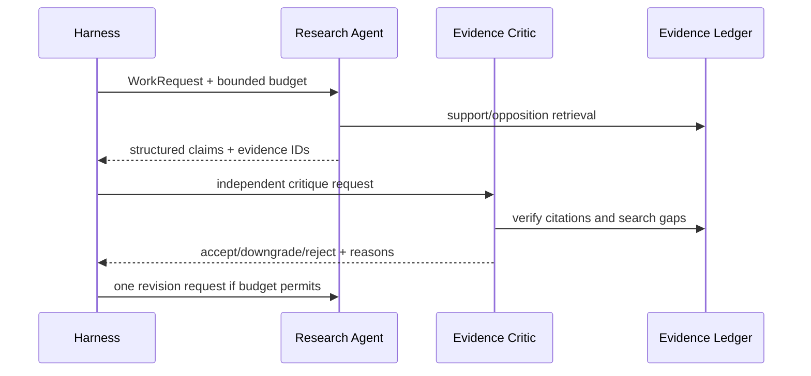

# Multi-Agent Collaboration

## Principle

Multiple agents are useful when they provide a real context, responsibility, or
permission boundary. They are not useful when one task is merely renamed into
many roles.

Month one uses two active reasoning roles:

- Research Agent creates claims from retrieved evidence.
- Evidence Critic independently verifies those claims.

Ingestion is initially a deterministic workflow. Portfolio is initially a
deterministic calculation library with an explanation step.

## Shared Truth

Agents do not coordinate through an ever-growing shared chat transcript. They
share:

- task/run IDs;
- evidence IDs;
- structured claims;
- task graph state;
- budgets and deadlines;
- audit events.

The evidence ledger is the factual shared memory. Current source observations
override model memory.

## Protocol

```text
WorkRequest
  request_id
  run_id
  parent_request_id
  role
  objective
  as_of_date
  input_evidence_ids
  allowed_tools
  sensitivity
  required_capabilities
  token_budget
  cost_budget
  deadline

WorkResult
  request_id
  status
  claims
  evidence_ids
  counter_evidence_ids
  open_questions
  tokens
  cost
  errors
```

Every result references the request ID it answers.

## Research and Critic Flow



## Budget and Autonomy

- Child work consumes the parent's budget.
- The critic receives a separate context package.
- Only independent retrieval branches run in parallel.
- A critic may request evidence, not expand its own permissions.
- At most one revision loop is allowed in the MVP.
- Personalized portfolio output parks at an approval state.

## Learning Outcomes for Interviews

Be ready to explain:

1. Why the critic needs an independent context boundary.
2. Why a shared evidence ledger is better than shared prose memory.
3. How request/response IDs make collaboration auditable.
4. How parent-child budget propagation prevents runaway cost.
5. When parallel agents improve latency and when they only add expense.
6. Why bounded autonomy is a state machine rather than a prompt.

