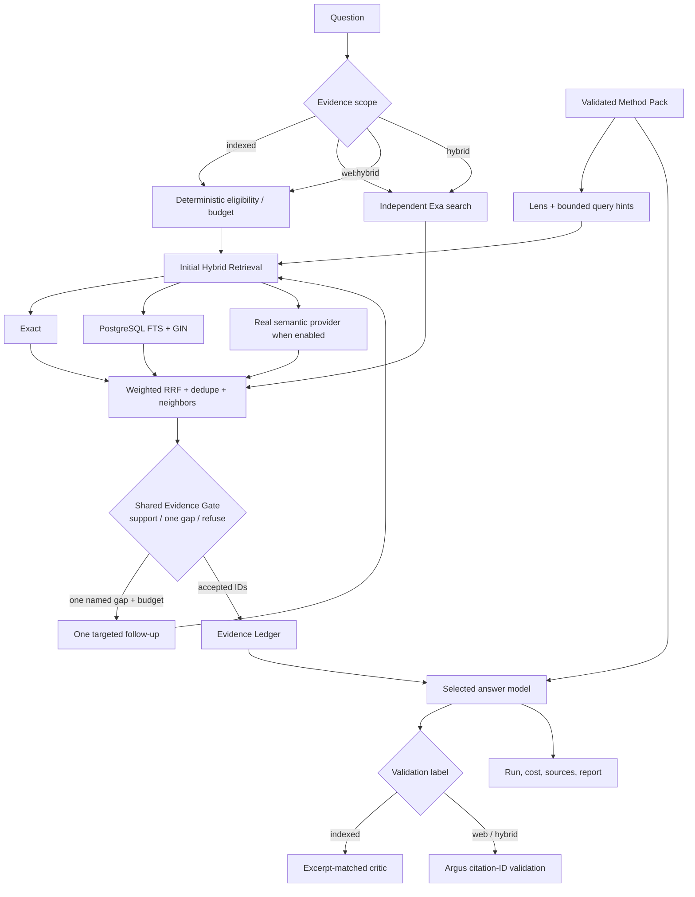

# Research Evidence Scope and Investment Method Packs

## Outcome

Argus now separates three choices that were previously conflated:

1. **Evidence scope / 证据范围** — where facts may come from.
2. **Base Investment Method Pack / 基础投资方法包** — the validated default
   analytical lens, evidence requirements, report order, and bounded allocation policy.
3. **Expert method add-on / 专家方法附加文档** — an optional compiled checklist
   from Markdown, TXT, text-based PDF, or research CSV.

A Method Pack never grants access to more data and never overrides search
budgets, evidence policy, cash-planning, concentration, or trade-calculation
controls. The existing `StylePackDefinition` class and `/styles` routes remain
as backward-compatible internal/API names while the product wording moves to
Method Pack.

The runtime relationship is `base framework AND optional expert add-on`, not a
choice between the dropdown and the uploaded file. The saved Profile supplies the
base default. The add-on can shape analysis rubrics and optional retrieval hints but
is not evidence, executable code, or authority to increase the search budget.

## Why local mode sometimes had no answer

The original local mode was deliberately a source-backed extractor. If the
answer was not supported by an uploaded chunk, it refused instead of filling
the gap from model memory. Trace 32 also exposed a genuine retrieval defect:
the 16-dimensional deterministic embedding ranked pages 5, 6, and 48 above the
direct answer on page 17. Argus now uses exact matching, PostgreSQL full-text
search, optional real semantic retrieval, weighted Reciprocal Rank Fusion,
term/alias normalization such as `risks`/`risk` and `2H'26`/`2026`, normalized
deduplication, and neighboring-chunk context. PDF ingestion reconstructs
sentences split across lines.

The refusal policy remains useful, but it is no longer the only research mode.

## Evidence scopes / 证据范围

| UI choice | API value | Data used | Eligible models | Validation level |
|---|---|---|---|---|
| Uploaded / indexed sources only | `indexed` | Local Argus documents | Local, Gemini, DeepSeek, Kimi | Exact retrieved excerpts are checked by the local critic |
| Cited public web sources only | `web` | Independent Exa URL search plus bounded highlights/text | Gemini, DeepSeek, or Kimi | Exa passages must pass the shared Evidence Gate and answer citation-ID validation |
| Uploaded sources + cited web sources | `hybrid` | Local retrieval plus independent Exa evidence | Gemini, DeepSeek, or Kimi | Both evidence classes enter the same Gate; the trace retains their source class and URL/date metadata |

`web` mode works without an uploaded document. `indexed` and `hybrid` require
at least one indexed source. Web modes require explicit model selection and
`public` sensitivity because the question is sent outside the local deployment.

Web discovery no longer depends on Gemini grounding or Kimi `$web_search`.
The Exa adapter uses bounded `instant`, `fast`, or `auto` search, direct URLs,
and extractive highlights/text. It deliberately excludes Exa Answer, Agent,
Deep Search, and hidden fallback providers because Argus owns the search loop,
Evidence Gate, answer model, and stopping policy. The user's selected Gemini,
DeepSeek, or Kimi model receives only accepted evidence and cannot raise the
one/two-search ceiling.

The Codex browsing tool used during development is not an Argus production
dependency. A locally or cloud-deployed Argus instance must use its configured
provider adapter or a future independent search service.

### What exactly triggers an internet call?

The search-scope selector is visible above Ask instead of being hidden under
Advanced:

1. `indexed`: no internet search; the selected answer model receives only
   accepted indexed passages. A cloud answer model can still be called after
   sufficient local evidence is found.
2. `web`: the next Ask calls Exa for direct-URL evidence, applies the Gate, then
   calls the selected answer model only if evidence is accepted. No upload is required.
3. `hybrid`: Argus combines indexed retrieval with Exa evidence, applies the
   same Gate, then calls the selected answer model. At least one upload is required.

The Research UI intentionally has no default answer model. The user must select
one for the page session, and changing to an incompatible evidence scope clears
the selection instead of automatically choosing Gemini or another provider. The
former generic `Advanced` drawer was removed; its useful per-run control is now
named directly as `Historical evidence cutoff (optional)` beside Ask.

The provider lock is capability-specific: choosing Kimi means Kimi is the only
answer model, while the UI separately discloses Exa as the search provider.
Failure never switches Exa to Brave or the chosen answer model to another model.

Python can make HTTP requests, download a known URL, or call Brave/Tavily/
Serper/Bing/Google CSE-style search APIs through a future adapter. It cannot
discover arbitrary public pages by itself because Python is a programming
runtime, not a continuously crawled web index. An independent search adapter
requires network access, credentials, pricing controls, result normalization,
licensing review, and citation timestamps. Argus now implements that boundary
with Exa and reports search calls/cost separately from answer tokens/cost.

## Implemented adaptive search flow



In the diagram, Hybrid Retrieval and Agent Search are different layers:

- **Hybrid Retrieval** decides how one query searches. Exact, full-text, and
  eligible semantic rankings are fused with RRF.
- **Evidence Gate** decides whether ranked candidates directly support the
  question, identify one searchable material gap, or require refusal.
- **Agent Search** executes at most one query for that Gate-named gap. It starts
  only when Standard/Deep eligibility and budget allow it.
- **The answer model** receives accepted evidence; it does not choose hidden
  providers or raise search limits.

The complexity policy is deterministic and inspectable. Causal questions add
`causal_chain`; comparisons add `comparison`; current questions add
`current_context`; risk/recommendation questions add risk and counter-evidence
requirements. Scores `<=1` use Fast, scores `2-5` use Standard, and scores `>5`
use Deep. The labels are now budget/permission levels: Fast runs exactly one
query; Standard and Deep allow at most one additional targeted query. Method
Pack slots remain research-lens/query hints and cannot create calls or raise the
budget. All modes use the same Gate and hard stop. The UI/run trace shows the
score, Gate decision, material gap, accepted evidence IDs, actual queries,
channel counts, follow-up decision, and stop reason.

One real PostgreSQL acceptance run for the uploaded gold PDF ranked the direct
page-17 downside-risk passage first, returned one accepted evidence item, passed
the local critic, and cost `$0`. Exact rank currently receives weight `3.0`
versus `1.0` for full-text and semantic rank; this is a tested relevance choice,
not a universal constant, and must be retuned against a labeled retrieval set.

### Provider and semantic-search boundary

The semantic channel runs only with a genuine non-local embedding provider.
The deterministic hash embedding is kept for storage/integration tests and is
not treated as semantic relevance. Therefore a local, DeepSeek, or Kimi indexed
run currently uses exact + full-text retrieval unless a separate permitted
embedding provider is configured. Argus will not silently spend Gemini tokens
when another provider was selected. A provider-independent local multilingual
embedding model and its Recall@k/MRR evaluation remain follow-up work.

Independent web search is implemented with one initial Exa call and at most one
Evidence-Gate-named follow-up. It does not use an LLM search planner or unbounded
multi-agent browsing. This keeps the feature auditable and cost bounded while
avoiding an inflated “multi-agent web research” claim.

Each web run records Exa request IDs, query count, search type, latency, estimated
search cost, direct URLs, bounded excerpts, Evidence Gate decision, stop reason,
selected answer model, answer tokens/cost, Style Pack, and evidence scope.
Provider dashboards remain the billing source of truth.

The selected provider must return one structured answer with `Direct answer`,
`Mechanism and drivers`, `Supporting evidence`, `Risks and uncertainties`,
`Counter-evidence and gaps`, `Falsification conditions`, `Investment
implications`, and `What to verify next`. The frontend safely renders that
Markdown-shaped contract without accepting provider HTML. The report builder
then maps the saved sections into HTML without another model call.

Cost ownership is explicit:

- `Source Ask` owns provider tokens, native-search fees, and the estimated API
  cost shown for the run.
- deterministic HTML report generation owns `0` provider tokens and `$0`
  additional model cost;
- a future model-expanded report would require a separate user action, trace,
  and cost estimate rather than silently reusing the selected provider.

Provider errors also remain locked to the selected provider. Where the API
response permits, Argus distinguishes balance exhaustion, daily quota,
short-window rate limits, overload, authentication failure, and an otherwise
ambiguous HTTP 429. None of these paths silently calls a different model.
If the provider returned usage before a grounding failure, the failed Run and
model call persist those tokens and estimated cost. HTTP failure is a product
outcome, not proof that no billable provider work occurred.

## Upload state and scanned-PDF boundary

Research has two separate compact `Choose & upload` controls. Selection starts
upload immediately, but only the right-side indexed-source list proves that an
evidence document is searchable. Method Packs go to the validated methodology
registry and never enter the evidence index. Web-only search ignores indexed
files; hybrid search uses both assurance classes.

Current PDF ingestion uses embedded text extraction rather than OCR. A
scanned/image-only PDF is rejected with an OCR-required message and its failed
managed upload directory is removed. This is preferable to showing a filename
that cannot produce searchable chunks. OCR ingestion remains a separate roadmap
feature because it adds native dependencies, language/layout evaluation, CPU
cost, and another text-quality failure boundary.

## Method Pack is not executable code

The product wording “skill” describes an investment methodology, not an
arbitrary Codex `SKILL.md`, Python module, shell script, or prompt file. Argus
accepts declarative JSON, or Markdown containing exactly one fenced
`argus-method-pack` JSON object, with Pydantic `extra="forbid"` validation.
Uploads are capped at 64 KB. Free-form skill Markdown, unknown fields,
duplicate enum values, non-HTTPS references, unsupported braces/newlines in
query templates, and out-of-range allocation adjustments are rejected.

Allowed controlled fields include:

- research lenses such as `valuation`, `quality`, `macro`, `income`,
  `downside_risk`, and `counter_evidence`;
- portfolio priorities such as broad diversification, low cost, a bounded
  factor tilt, inflation resilience, or capital preservation;
- product preferences such as broad-market ETF, factor ETF, dividend ETF,
  bond ETF, or limited individual-stock satellite;
- report section order;
- bounded allocation adjustments;
- HTTPS methodology references;
- up to eight `required_evidence_slots`, each with a safe ID, description,
  controlled search terms, one `{question}` query template, minimum item/source
  counts, optional freshness window, and required/optional flag.

The persisted field name remains `required_evidence_slots` for Method Pack schema
compatibility, but runtime semantics are narrower: slots are research-rubric and
query hints, not proof tests or execution authority. They do not raise complexity
scores and cannot create one query per missing slot. For example, an industry
bottleneck Method Pack may suggest `industry_bottleneck` and `pricing_power`; only
if the shared Evidence Gate rejects the first retrieval with one related material
gap may the first hint shape the single permitted follow-up. Argus then reapplies
the Gate and stops.

### Separate upload boundaries in the UI

Research displays two different cards because the files have different trust
and storage semantics:

| Input | Accepted examples | Destination | Used as a citation? |
|---|---|---|---|
| Evidence source | PDF, Markdown article, TXT notes, research CSV | Document/evidence/chunk index | Yes |
| Base Investment Method Pack | Built-ins or validated JSON/fenced declarative Markdown managed in Profile | Method Pack registry | No |
| Expert method add-on | Markdown, TXT, text-based PDF, research CSV | Bounded compiled checklist registry | No |

Uploading an expert methodology through the evidence card would only make its
words searchable; it would not activate that method. Uploading a normal report
through the expert-method card compiles headings, bullets, and complete research
steps into at most twelve checklist items. Code blocks and prompt-control,
credential, or shell-like lines are omitted. The raw document is not added to the
evidence index or executed. Known finance terms may create up to four optional
retrieval hints, but the add-on cannot create more search rounds. Users who need
allocation tilts, report-order changes, or authoritative long-term defaults still
use the stricter declarative Method Pack schema in Profile.

## Answer and report quality gates

Retrieval chunks are storage units, not sentence boundaries. The local
extractor therefore scores complete sentences in a bounded neighboring-chunk
window. If the top chunk ends in a conjunction such as `and`, Argus tries to
recover its continuation from that window. If the continuation is unavailable,
the extractor refuses instead of adding punctuation to a fragment.

An Ask response and a saved report have different minimum bars:

```text
Ask: relevant complete extract + accepted source
Report: Ask bar + critic passed + substantive analysis depth
        (or valid structured CSV evidence for deterministic charts)
```

The report endpoint enforces the rule again even if a client bypasses the UI.
This prevents a short fragment from being expanded into repeated thesis, risk,
and implication sections. One bounded answer-source excerpt is stored with the
run so a later report can reconstruct a sentence that crossed a chunk boundary
without copying every retrieval window into run storage. Detailed routing,
search, token, and cost metadata remains available in the collapsed audit panel
and Runs; the default Research result emphasizes the answer and citations.

Hard allocation limits are currently:

- total equity adjustment: `-10` to `+10` percentage points;
- international share of equity: `15%` to `40%`;
- gold adjustment: `-2.5` to `+2.5` percentage points;
- Alternatives opt-in: `0%` to `5%`.

These are software safety bounds, not claims that every value inside the range
is personally suitable.

## Built-in methods/styles

| Style | Main lens | Deterministic allocation effect |
|---|---|---|
| Strategic index / diversified | diversification, cost, discipline, counter-evidence | no style-only equity change |
| Value-aware | valuation, fundamentals, quality, value-trap risk | broader international share within equity |
| Quality growth | durable growth, profitability, earnings stability, leverage, valuation | up to +5 equity points before global safety clamps |
| Income with quality screens | sustainable income, total return, rate sensitivity, yield-trap checks | -5 equity points before global safety clamps |
| Macro / risk-balanced | growth, inflation, real rates, liquidity, regime risk | -5 equity points and +2.5 gold points before clamps |

The base allocation still starts from risk tolerance and is then adjusted for
future investment horizon, income stability, liquidity, life stage, and cash
flow. The Style Pack is one bounded input, not the sole allocation engine.

Methodology references include
[Investor.gov asset allocation and diversification](https://www.investor.gov/introduction-investing/getting-started/asset-allocation),
[Vanguard's four principles](https://ownyourfuture.vanguard.com/content/en/learn/financial-planning/vanguards-4-principles-for-investing-success.html),
[MSCI factor definitions](https://www.msci.com/indexes/factor-indexes/msci-factor-indexes),
[MSCI quality methodology](https://www.msci.com/indexes/group/quality-indexes), and
[World Gold Council 2026 strategic-asset research](https://www.gold.org/goldhub/research/relevance-of-gold-as-a-strategic-asset).
They explain principles and factor definitions; they do not prescribe Argus's
exact percentages or guarantee returns.

## Where the selected style is applied

### Research and reports

The controlled Method Pack data is sent as preference data. It changes which
questions receive emphasis and the HTML report section order. It cannot change
which evidence is admissible. Every run and generated report stores the Style
Pack ID and name so results can be reproduced and compared.

### Profile allocation guidance

Profile guidance applies the bounded allocation policy after personal risk-
capacity inputs. The output remains an editable educational starting point. A
custom pack cannot add Cash to the 100% investment mix or bypass allocation-sum
validation.

### Portfolio and market analysis

The saved Profile style is included in the cited market-analysis prompt. It can
change emphasis—valuation, quality, income sustainability, macro regime, or
counter-evidence—but cannot change deterministic weights, dollars, or shares.
Portfolio uses the same provider separation as Research. Its breadth target is
stricter than a normal Ask: Exa performs two bounded facets (current drivers, then
sector leadership and independent counter-evidence). The second call passes the first
call's domains through Exa `excludeDomains`. Two accepted domains are preferred; if
only one survives the Gate, synthesis continues with an explicit limited-source warning
instead of failing every configured model. Only accepted
direct-URL excerpts reach the manually selected Gemini, DeepSeek, or Kimi
adapter. The answer model cannot invoke built-in search, Argus validates its
`[source:Wn]` IDs, and the API reports Exa cost separately from model-token cost.
One invalid citation draft may be rewritten once by the same selected model; Argus
discloses the answer-call count and rejects a second invalid draft rather than switching
models or manufacturing citations.
Candidate selection remains a curated registry, not a complete real-time
fund database. A separate research-only library covers the eleven GICS sector SPDRs,
all eighteen ETFs in State Street's current industry lineup, and SOXX as a second semiconductor comparison.
These narrow funds are excluded from
deterministic core gap filling and DCA. The market prompt may return at most three as a
cited watchlist only when it includes counter-evidence, invalidation, and overlap risk. The
expansion path remains documented in
`docs/ETF_MARKET_DATA_ARCHITECTURE.md`.

## API contracts

### Research

`POST /chat/query` adds:

```json
{
  "evidence_scope": "indexed | web | hybrid",
  "style_pack_id": "value_aware"
}
```

The response adds `search`, `web_sources`, `grounding_method`, `style_pack_id`,
and `style_pack_name`. `search` exposes mode, score/reasons, evidence slots,
executed queries, channel counts, limits, and stop reason. Indexed `sources` and
provider-grounded `web_sources` are never merged into one assurance class.

### Method Packs (backward-compatible `/styles` API)

- `GET /styles` — list built-in and custom packs.
- `POST /styles/upload` — validate and persist one JSON or fenced Method Pack
  Markdown file.
- `DELETE /styles/{id}` — delete a custom pack; built-ins cannot be deleted.

If an active Profile references a deleted custom pack, it falls back to
`strategic_index`.

### Expert method documents

- `GET /styles/method-documents` — list safe compiled expert add-ons.
- `POST /styles/method-documents/upload` — accept Markdown, TXT, Word DOC/DOCX,
  text PDF, or research CSV up to 5 MB and compile a bounded checklist.
- `DELETE /styles/method-documents/{id}` — delete the add-on and clear its saved
  Profile reference.

The Profile stores `preferred_style` AND a bounded list of up to five
`preferred_method_document_ids`. The first legacy ID remains populated for backward
compatibility. The base style may apply bounded deterministic allocation tilts. Expert
documents form a method panel: each is a non-executable research rubric that can add
optional retrieval hints and alter report or market-explanation emphasis. Argus must
state material agreement and conflict instead of voting. The panel is never indexed as
evidence and cannot raise tool budgets or change portfolio numbers.

## Example upload

Use [value-aware-example.json](../examples/style-packs/value-aware-example.json)
for a pure JSON example or
[supply-chain-method-pack.md](../examples/style-packs/supply-chain-method-pack.md)
for the safe Markdown container. Change the ID and name before uploading a
variation. Both formats are intentionally data-only.

## Evidence Ledger and storage behavior

Migration `20260716_0012` adds the PostgreSQL full-text GIN index plus normalized
`evidence_ledger_queries` and `evidence_ledger_links` tables. A ledger query
stores its round, target slot, search mode, channel counts, and result count. A
link references canonical `chunks`/`evidence_items`, stores ranks/signals and an
`accepted` flag, and does not copy the PDF/TXT body. Stored tool output is also
compacted; report generation rehydrates canonical evidence text when needed.

This consumes database disk, not permanently resident application memory. A run
with a few bounded queries creates a small number of rows, and deletion of an
`agent_run` cascades to its ledger. The first implementation does not yet ship a
user-facing TTL/retention job, so automated trace retention remains a hardening
task. API list limits and compact records prevent routine dashboards from
loading every source passage.

## Known limitations and next stages

1. Web sources have direct URLs but Argus does not yet fetch, hash, archive, and
   excerpt-match each page. The UI therefore labels them `provider_grounded`
   instead of claiming the local critic passed.
2. Kimi and Gemini search quality, access, geographic coverage, and pricing are
   provider-dependent.
3. Run traces snapshot the selected Method Pack definition, but custom packs are
   still updated by ID; a first-class immutable version/content-hash registry
   and cross-version comparison UI are later hardening steps.
4. Product preferences do not create a complete ETF or stock universe. A
   licensed, time-versioned market/fund data layer is still required for
   exhaustive candidate ranking.
5. Multi-method weighted fusion, pre-run search-cost estimates, independent web
   crawling, and per-style evaluation dashboards remain follow-up work.
6. The router uses transparent keyword features and slot checks. It does not yet
   perform entity-aware query decomposition, an LLM-planned research graph, or
   multi-round paid web Agent Search.
7. The current exact/RRF weights passed a real regression case but still need a
   larger labeled Recall@k, MRR, citation-precision, latency, and cost benchmark.

## Interview framing

> I separated evidence scope from investment methodology. Local indexed mode
> uses exact and PostgreSQL full-text retrieval, plus semantic retrieval only
> when a genuine permitted embedding provider exists. RRF fuses rankings and a
> deterministic router runs bounded evidence-gap queries. Web and
> hybrid modes require an explicitly selected provider with cited search, and
> the UI labels those sources at a lower assurance level until Argus independently
> fetches and matches them. Investment methods are declarative, schema-validated
> JSON or fenced Markdown packs—not executable prompts or code. They may add
> required evidence slots, but cannot raise Argus query budgets or override cash
> planning, concentration controls, or deterministic trade math. The normalized
> Evidence Ledger records queries and references canonical evidence without
> copying document bodies into each run.
