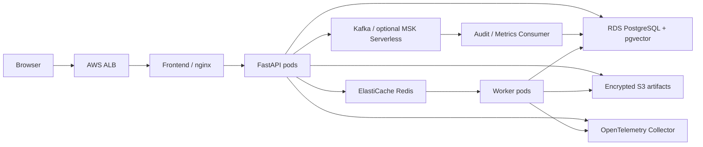

# Argus V2 Cloud Architecture

## Scope and assumptions

V2 targets a small AWS environment that can be reproduced, observed, and
destroyed. It preserves the V1 privacy boundary: restricted data is never
admitted to cloud models, and moving the API to AWS does not make a document
eligible for Gemini.

Initial sizing assumes fewer than 20 concurrent users, bursty research jobs,
and a non-production environment that can be shut down outside demos. The
Terraform defaults favor understandable infrastructure over the lowest possible
bill. EKS, NAT Gateway, RDS, ElastiCache, and especially optional MSK Serverless
can incur material cost even with no traffic.

## Component and data flow

1. nginx serves the React bundle and reverse-proxies `/api/` to FastAPI.
2. PostgreSQL remains the system of record for evidence, reports, and traces.
3. Raw browser uploads are copied to encrypted S3 before their pod-local copy
   disappears. Parsed evidence remains in PostgreSQL.
4. Redis provides cache and job-status contracts. The worker consumes bounded,
   versioned jobs from the Redis queue.
5. Versioned Kafka envelopes use stable event IDs and aggregate keys. The first
   complete path is deliberately narrow: `agent.run.completed.v1` is consumed by
   an Audit/Metrics Consumer, deduplicated, retried with a fixed bound, and sent
   to a DLQ after contract or processing failure. Runs exposes only the sanitized
   projection and heartbeat. Local Kafka is optional; paid MSK remains an explicit
   deployment choice because it has a poor cost/benefit ratio at current traffic.
6. OTLP traces cover FastAPI and SQLAlchemy. The included collector exposes a
   Prometheus-compatible metrics endpoint; a managed Grafana/Prometheus backend
   can scrape it without changing application code.

## Reliability and security

- `/health/live` checks process liveness; `/health/ready` checks PostgreSQL and
  Redis before a pod receives traffic.
- API and worker resource requests/limits prevent unbounded noisy-neighbor use.
- Worker HPA and `CronJob.concurrencyPolicy: Forbid` bound parallel work.
- S3 blocks public access and enables versioning and encryption.
- RDS and Redis are private; only EKS node security groups can connect.
- Workloads use an IRSA role instead of static AWS access keys.
- Secrets Manager holds generated connection strings. Kubernetes receives a
  runtime Secret during deployment; secrets are never committed.
- Production enables Multi-AZ RDS, Redis failover, deletion protection, and
  longer backups. Dev intentionally reduces redundancy and cost.

## Trade-offs and revisit points

- Redis is the job queue first because the workload is small. Move durable,
  replayable cross-service workflows to Kafka only when multiple consumers need
  independent offsets.
- The current worker supports ingestion and health-check jobs. Introduce a
  database-backed outbox before Kafka becomes business-critical; direct publish
  alone cannot guarantee atomic DB-and-event commits.
- The local broker retains logs for seven days and the database projection keeps
  at most 5,000 records for 30 days by default. These are operational bounds, not
  deletion rules for PostgreSQL Runs or the independent API Usage Ledger.
- Runs is intentionally a read-only lightweight operations surface. Replay,
  offset reset, topic deletion, and arbitrary payload browsing stay outside the
  product UI to avoid turning a portfolio demo into an unsafe Kafka admin console.
- EKS demonstrates Kubernetes operations but is expensive for a portfolio demo.
  ECS/Fargate or App Runner is the better cost choice if Kubernetes itself is
  not a learning objective.
- The included collector is a transport layer, not a full hosted Grafana stack.
  Choose AMP/AMG, Grafana Cloud, or another backend based on retention and cost.
- Replace the single migration init container with a dedicated migration Job
  before increasing API replicas or running frequent deploys.
